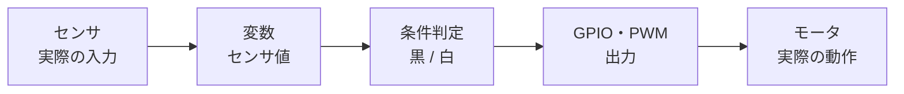
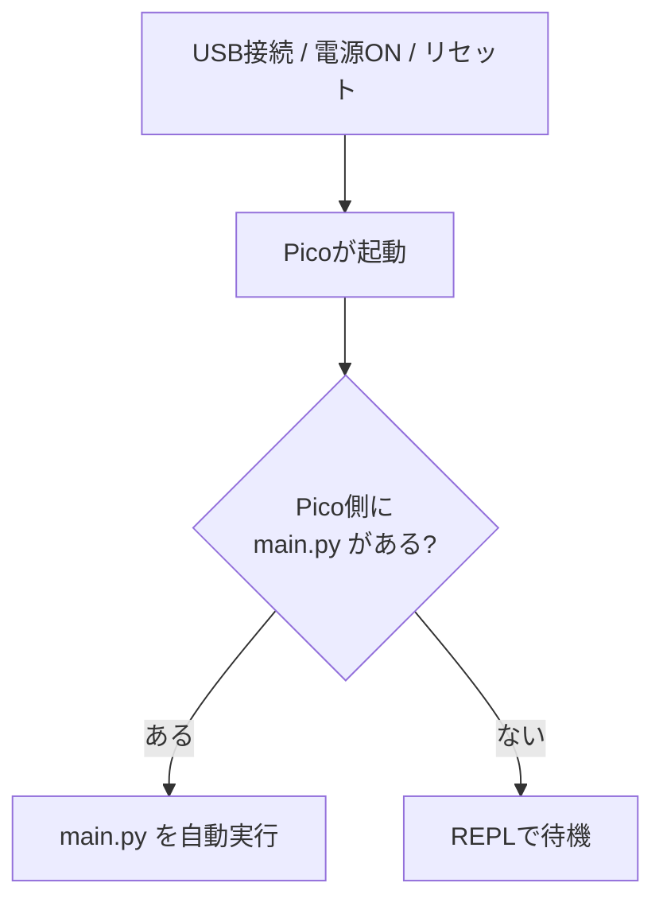
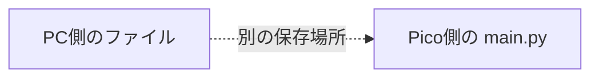
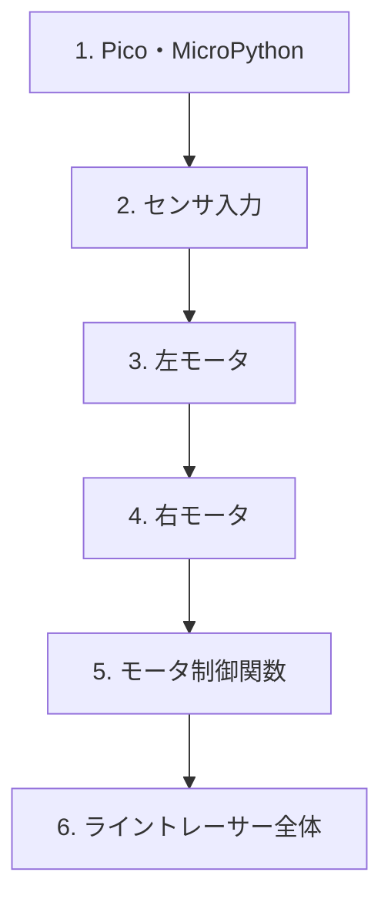
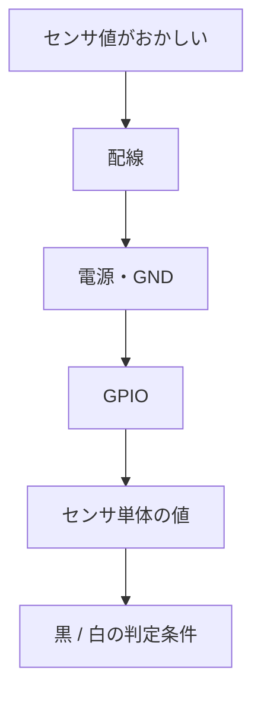
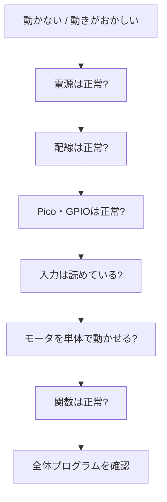
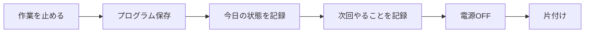
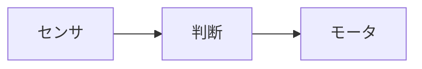

# 第14回 マイコン実習
## ライントレーサーの動作を復旧しよう

**実施日：2026年8月25日**  
**授業時間：200分**

---

## 0. 今日のテーマ

夏休み前に製作したライントレーサーを、もう一度動く状態へ戻します。

今日は、新しい機能を追加したり、プログラムをゼロから書き直したりすることが目的ではありません。

> **既存のコードを読み、実機との対応を確認し、どこまで正常に動いているかを切り分ける**

ことを重視します。

ライントレーサーが1周完走しなくても、  
センサ・モータ・プログラムのどこまでが正常か確認できれば成果です。

## 1. 今日やること

| STEP | 確認するもの | OKなら  
|---|---|---|
| 1 | 車体・Pico・コードを確認 | STEP 2へ 
| 2 | センサを確認 | STEP 3へ 
| 3 | 左右モータを確認 | STEP 4へ 
| 4 | モータ制御関数を確認 | STEP 5へ 
| 5 | ライントレーサー全体を確認 | STEP 6へ 
| 6 | 状態を記録して終了 | - 


## 2. ライントレーサーの基本構造を思い出す

ライントレーサーでは、センサで床の状態を読み、プログラムが判断し、モータを動かします。



プログラムだけを見るのではなく、**各行が実機のどこにつながっているか**を意識します。

今後、課題が変わっても、

> **入力 → 変数 → 判断 → 出力 → 実際の動作**

という基本構造は何度も使います。

## 3. 今日の到達目標

### 最低到達点

**原則：センサ確認＋左右両方のモータ確認まで進むこと**  
ハードの故障などがある場合は、原因個所を切り分けて記録する。

- [ ] PicoをPCに接続できた
- [ ] ThonnyからPicoを操作できた
- [ ] 自分のプログラムを見つけた
- [ ] Pico側の `main.py` を確認した
- [ ] センサ値を確認できた
- [ ] 左右どちらかのモータを動かせた

### 標準到達点

- [ ] 左右のセンサを確認できた
- [ ] 左右のモータを個別に確認できた
- [ ] モータ制御関数を確認できた
- [ ] ライントレーサーのプログラムを実行できた
- [ ] コース上で走行確認できた
- [ ] 問題があれば原因を切り分けて修正できた

### 発展課題

標準到達点まで進んだ人は、必要に応じて取り組みます。

- [ ] 走行を安定させる
- [ ] 自分のモータ制御関数の役割を説明する
- [ ] センサ値や速度設定を調整し、変化を記録する
- [ ] 今後再利用しやすいようにコードを整理する

> 発展課題に入っていても、**終了20分前になったら新しい調整は開始しません。**

<br/>

# STEP 1　車体・Pico・コードを確認

## 4. 電源を入れる前の確認

いきなりプログラムを実行せず、最初に車体を目で確認します。

### 車体

- [ ] 電池の状態を確認した
- [ ] 電源回路を確認した
- [ ] GNDの配線を確認した
- [ ] Picoが正しく取り付けられている
- [ ] モータドライバの配線を確認した
- [ ] 左モータの配線を確認した
- [ ] 右モータの配線を確認した
- [ ] 左センサの配線を確認した
- [ ] 右センサの配線を確認した
- [ ] 配線が抜けていない
- [ ] ショートしそうな部分がない

問題が見つかった場合は、電源を入れる前に修正します。

## 5. ThonnyとPicoを確認する

### PC・開発環境

- [ ] USBケーブルでPicoを接続した
- [ ] Thonnyを起動した
- [ ] Picoが認識されている
- [ ] MicroPythonのインタプリタが選択されている
- [ ] REPLが使用できる
- [ ] 自分のプログラムが保存されている場所を確認した

## 6. Pico単体の確認

ThonnyのREPLなどを使い、Picoが正常に動作することを確認します。

### 確認

- [ ] REPLが使用できる
- [ ] 簡単なPythonコードを実行できる
- [ ] エラーメッセージが出ていない

接続できない場合は、次の順番で確認します。

1. **USBケーブル**
2. **PCがPicoを認識しているか**
3. **Thonnyのインタプリタ設定**
4. **MicroPythonが動作するか**

## 7. `main.py` は特別なファイル

Raspberry Pi Pico本体側に、

```text
main.py
```

という名前で保存したプログラムは、**Picoの起動時に自動実行されます。**



そのため、

> 「実行ボタンを押していないのに車体が動いた」

という場合は、Pico側の `main.py` が自動実行されている可能性があります。

### 注意：モータが自動で動く可能性がある

`main.py` にモータを動かす処理が入っている場合、電源投入やリセット直後に車体が動き始めることがあります。

接続・再起動・リセットを行うときは、

- 車体が急に走り出しても危険がないか
- タイヤを浮かせる必要がないか
- すぐに電源を切れる状態か

を確認してから操作してください。

**内容を確認していない `main.py` を、そのまま実機で自動実行しないこと。**

### PC側とPico側は別

Thonnyでは、ファイルを

- PC側
- Pico側

のどちらにも保存できます。

PC側のファイルを修正しただけでは、Pico側の `main.py` は自動では更新されません。



### 確認

- [ ] Pico側に `main.py` があるか確認した
- [ ] 今見ているファイルがPC側かPico側か確認した
- [ ] 自動実行されるプログラムを把握した

> **「どのファイルを編集して、どのファイルを実行しているか」を意識してください。**


## 8. 夏休み前のコードを読む

夏休み前のコードを、まず読んで思い出します。次の3か所を探してください。

### ① センサ入力

探すもの：

- 左センサを読んでいる部分
- 右センサを読んでいる部分
- GPIO番号
- センサ値を入れている変数
- 黒 / 白を判断している部分

#### メモ：自分のコードから、センサを読んでいる部分を探して記入
```text


```

### ② モータ出力

探すもの：

- 左モータを動かしている部分
- 右モータを動かしている部分
- PWMを設定している部分
- 正転・逆転を切り替えている部分

#### メモ：自分のコードから、モータ出力をしている部分を探して記入
```text


```


### ③ モータ制御関数

夏休み前に作ったモータ制御関数を探します。

例えば、

```python
go_forward()
turn_left()
turn_right()
stop()
```

のような関数です。

**関数名は自分のコードによって違っていて構いません。**

### 自分のコードで使っている関数

| 動作 | 関数名 |
|---|---|
| 前進 |  |
| 左方向 |  |
| 右方向 |  |
| 停止 |  |

## 9. コードと実機の対応を確認する

コードを全部説明できる必要はありません。

まずは、**実機の部品とコードのどこが対応しているか**を探します。

| 実機・動作 | コード上で確認するもの | 自分のコード |
|---|---|---|
| 左センサ | GPIO番号・変数名 |  |
| 右センサ | GPIO番号・変数名 |  |
| 左モータ | GPIO番号・PWM・関数 |  |
| 右モータ | GPIO番号・PWM・関数 |  |
| 黒 / 白の判断 | `if` などの条件 |  |
| 前進 | 呼び出している関数 |  |
| 停止 | 呼び出している関数 |  |

> **ゼロから同じコードを書けることより、「この部分を変えると実機のどこが変わるか」を説明できることを目標にします。**

## 10. 分割して統治せよ - いきなり全部を動かそうとしない -

今日は、次の順番で確認します。



途中で問題が見つかったら、**その場所で止まって原因を調べます。**

全体のプログラムを何度も実行するだけでは、原因を見つけにくくなります。

<br/>

# STEP 2　センサを確認

## 11. 左右のセンサ値を確認する

左右のセンサ値を表示してみます。

**自分のコードに合わせて確認してください。**

```python
print(<左センサの値>)
print(<右センサの値>)
※ <> の部分は自分のコードに合わせる
```

### 測定結果

| 床の状態 | 左センサ | 右センサ |
|---|---:|---:|
| 白い床 |  |  |
| 黒いライン |  |  |

### 確認

- [ ] 左センサの値が変化した
- [ ] 右センサの値が変化した
- [ ] 白と黒で値に違いがある
- [ ] 黒 / 白を判定できそうだ

### 値がおかしい場合

すぐにライントレース処理を書き直さず、次を確認します。



---

# STEP 3　左右モータを確認

## 12. 安全に確認する

モータの単体確認をするときは、必要に応じて車体を持ち上げ、タイヤが机や物に当たらない状態にします。

## 13. 左モータ

- [ ] 左モータだけを回せた
- [ ] 回転方向を確認した
- [ ] 停止できた

## 14. 右モータ

- [ ] 右モータだけを回せた
- [ ] 回転方向を確認した
- [ ] 停止できた

### 注意

「プログラム上の正転」と「車体が前進する方向」が一致するとは限りません。

左右それぞれについて、

> **車体を前進させるには、モータをどちら向きに回す必要があるか**

を確認してください。

---

# STEP 4　モータ制御関数を確認

## 15. 関数を1つずつ実行する

夏休み前に作った関数を、1つずつ試します。

例：

```python
go_forward()
```

```python
turn_left()
```

```python
turn_right()
```

```python
stop()
```

### 確認

- [ ] 前進できた
- [ ] 左方向へ制御できた
- [ ] 右方向へ制御できた
- [ ] 停止できた

ここで動作がおかしい場合は、ライントレーサー全体へ進む前に原因を調べます。

<br/>

# STEP 5　ライントレーサー全体を確認

## 16. コースで走らせる

ここまで確認できたら、夏休み前のライントレーサープログラムを実行します。

今日は、最初から1周完走を目標にする必要はありません。

まず次を確認します。

- [ ] スタートできる
- [ ] センサがラインに反応している
- [ ] 左右へ修正しようとしている
- [ ] モータの左右が意図通りに動いている
- [ ] 途中で異常停止しない

## 17. 走らない場合も成果を残す

例えば、

- センサまでは正常
- 左モータまでは正常
- 右モータだけ動かない
- モータ関数は正常
- ライントレースの条件分岐がおかしい

など、**どこまで動くかを特定できればデバッグは進んでいます。**

<br/>

# デバッグ編

## 18. 「動きません」で終わらせない

問題が起きたときは、次の順番を参考にします。



### 大切な考え方

> **正常だと確認できたところを増やしていく**

ことで、原因の範囲を小さくします。

## 19. デバッグ記録

問題が起きたら、簡単に記録してください。

### 症状

```text

```

### 正常だと確認できたもの

```text

```

### 次に確認したもの

```text

```

### 分かった原因

```text

```

### 行った修正

```text

```

### 修正後の結果

```text

```

## 20. 先生へ質問するとき

「動きません」だけでなく、**確認した内容も一緒に伝えてください。**

### 例

```text
右モータが回りません。

Picoは動いています。
センサ値も読めています。
左モータは回ります。
右モータ用の関数を実行しても右だけ回りません。
右モータの配線までは確認しました。
```

ここまで分かれば、次に確認する場所を考えやすくなります。

## AIを使って調べる場合

AIを使ってコードの意味や修正方法を調べても構いません。

ただし、AIが出したコードをそのまま車体へ入れるのではなく、次を確認します。

1. 何をするコードか説明できるか
2. GPIO番号や部品が自分の車体と合っているか
3. まず小さな単位で試せるか
4. モータが危険な動きをしないか
5. 実際の動作結果を確認したか

> **「AIが書いたから正しい」ではなく、実機で確かめて判断します。**

<br/>

# STEP 6　状態を記録して終了

## 21. 終了30分前ごろ：状態を確定する

終了30分前ごろになったら、

> 「あと少しだから全部作り直そう」

ではなく、**今日どこまで確認できたかを整理する方向**へ切り替えます。

### 今日、復旧できたところ

- [ ] Pico
- [ ] `main.py` の確認
- [ ] 左センサ
- [ ] 右センサ
- [ ] 左モータ
- [ ] 右モータ
- [ ] モータ制御関数
- [ ] ライントレーサー走行
- [ ] 安定した走行

## 22. 終了20分前：新しい作業を始めない

**終了20分前になったら、新しい実験・大きなコード変更・新しい調整は始めません。**

未完成でも問題ありません。

今日の状態を保存し、次回続きから始められる状態にします。



### 保存・記録

- [ ] プログラムを保存した
- [ ] PC側 / Pico側のどこへ保存したか確認した
- [ ] Pico側の `main.py` の状態を確認した
- [ ] 今日どこまで動いたか記録した
- [ ] 今日変更したことを記録した
- [ ] 次回最初に行うことを記録した

### 安全確認・片付け

- [ ] Picoや車体の動作を停止した
- [ ] 車体の電源を切った
- [ ] Picoを安全に取り外した
- [ ] 電池を確認した
- [ ] 車体・部品を片付けた
- [ ] 作業場所を整理した

<br/>

# 今日のまとめ

## 23. 今日一番時間がかかった問題

```text

```

## 24. 原因は何だったか

```text

```

## 25. 自分で確認したこと

```text

```

## 26. 次回最初にやること

```text

```

<br/>


# 次の授業へ

今回確認したライントレーサーでは、



という構造で動いています。

今後の実習では、夏休み前に作った車体やモータ制御関数をできるだけ再利用します。

入力の方法が変わっても、

> **入力を受け取る → 判断する → 出力する**

という考え方は共通です。

今日の目的は、単にもう一度走らせることではなく、

> **次の課題に使える状態まで、自分の車体とプログラムを戻すこと**

です。

次回以降は、今日確認したモータ制御関数をできるだけ再利用しながら、入力方法を変える課題へ進む予定です。
