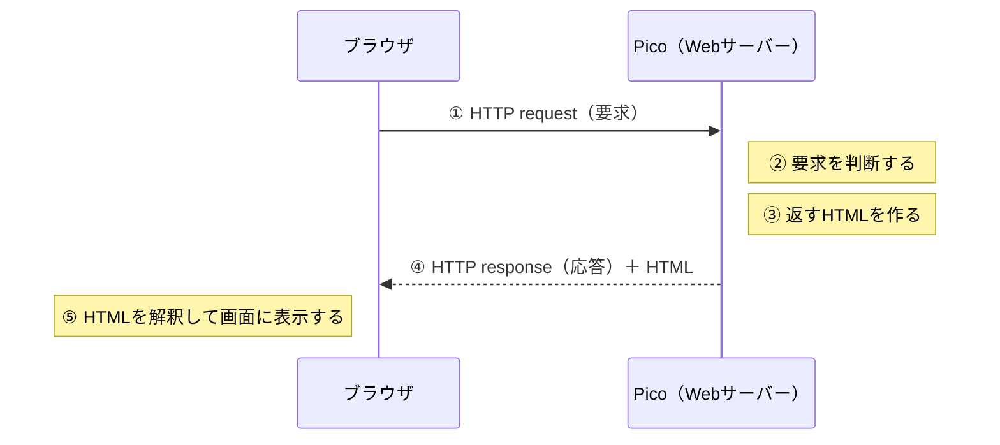
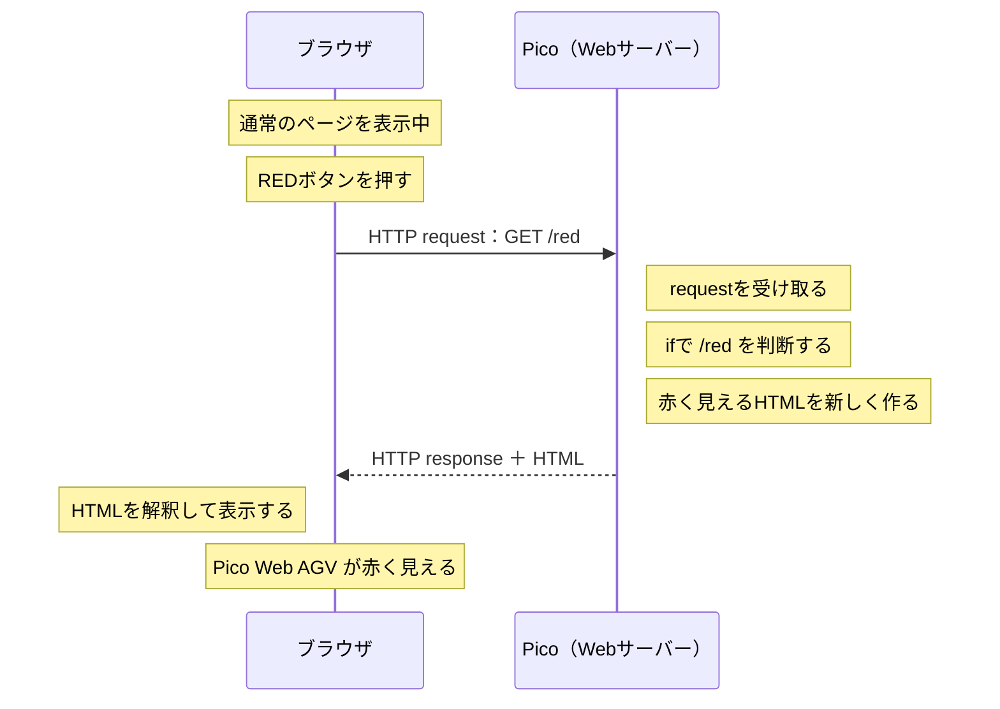
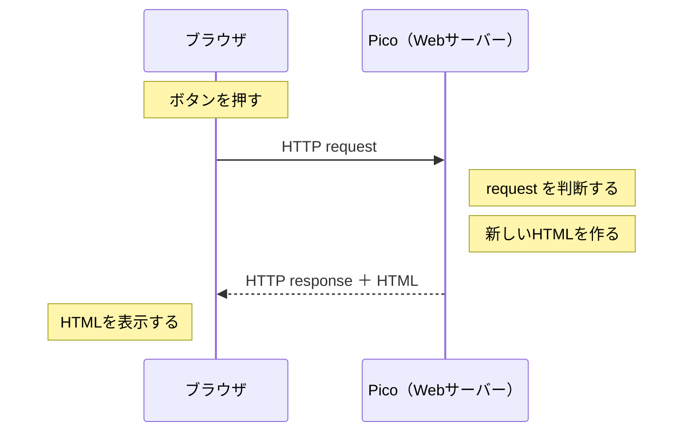
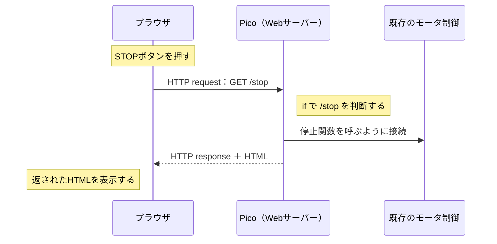
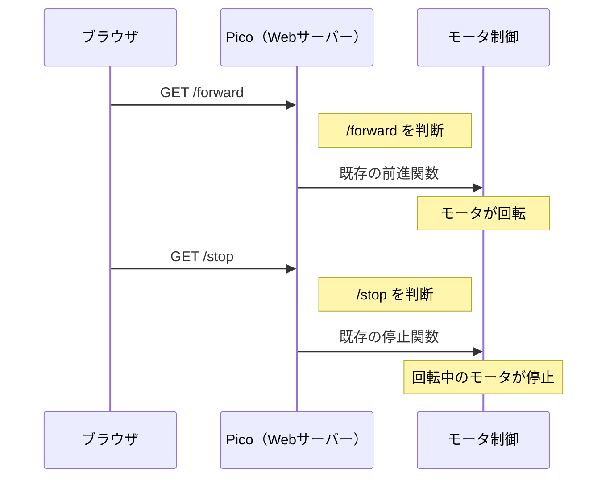
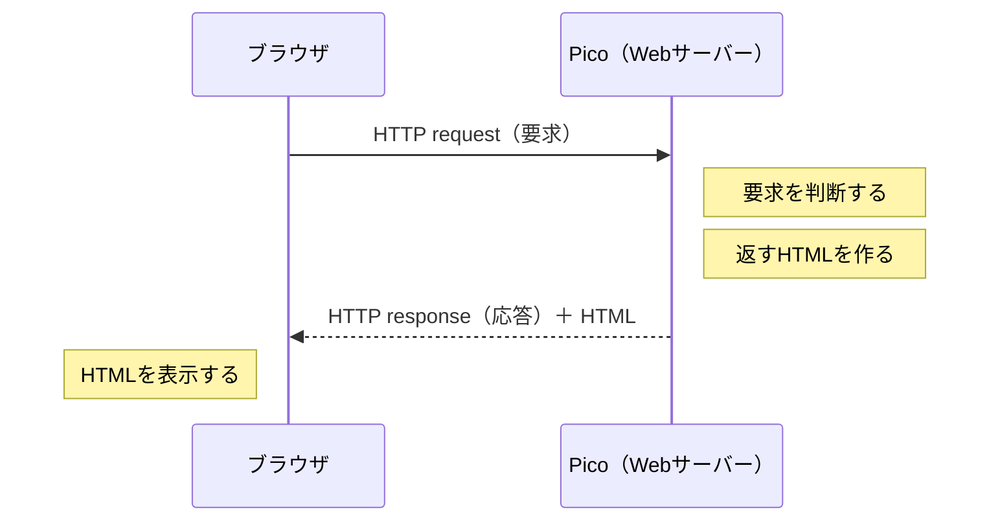

# マイコン実習 第16回
## Web AGV① ― 入力を「文字」から「Web」へ変える

実施日：2026年9月8日  
実習時間：200分

---

# 今日のテーマ

これまでのライントレーサーでは、センサの値を使って車体の動きを決めていました。

第15回では、一部の人が Thonny の Shell（シェル：文字を入力したり結果を確認したりする画面）から文字を入力し、車体を操作しました。

今日は、その先へ進みます。

```text
ライントレーサー
センサ入力
   ↓
判断
   ↓
モータ制御
```

```text
第15回
文字入力
   ↓
判断
   ↓
同じモータ制御
```

```text
第16回～
Web入力
   ↓
判断
   ↓
同じモータ制御
```

> **変えるのは「入力する方法」です。**
>
> すでに作ったモータ制御は、できるだけ作り直さず再利用します。

---

# 今日のゴール

今日は、現在の進み具合に応じて **MISSION A / B / C** のどれかに取り組みます。

## MISSION A

**文字入力による操作までできている人、または自力でプログラムを変更できる人**

> Picoを **Wi-Fiアクセスポイント（AP）兼 Webサーバー** にする。  
> まずWebの「要求 → 応答」を色の変化で確認し、その後で既存のモータ制御につなぐ。

## MISSION B

**車体は1周できるが、文字入力による操作がまだ完成していない人**

> `f / l / r / s` で車体を操作できるようにする。  
> できたら `+ / -` で速度設定も変更する。

## MISSION C

**車体がまだ正常に走らない、または自分で原因を切り分けることが難しい人**

> 電源・GND・GPIO・モータドライバ・モータのつながりを確認し、  
> **「ここまでは正常」「最初におかしいのはここ」** を説明できるようにする。

---

# 200分のおおまかな時間配分

| 時間の目安 | 内容 |
|---|---|
| 0～20分 | STEP 1　今日のテーマ・WWWの基本を確認 |
| 20～35分 | STEP 2　現在状態を確認し、MISSIONを決定 |
| 35～150分ごろ | STEP 3　MISSION A / B / C に取り組む |
| 150～180分ごろ | STEP 4・5　再確認・CLEAR CHECK・次の課題 |
| 最後の20分 | STEP 6　記録・保存・片付け |

> **時間は目安です。**
>
> 全員が同じ時刻に同じ場所まで進む必要はありません。

> **最後の20分は、新しい作業を始めません。**
>
> プログラムの保存、今日の記録、工具・車体・机の整理整頓を行います。

---

# STEP 1　今日やることの位置づけとWWWの基本

第15回までに作ったものを全部捨てて、新しい車を作るわけではありません。

これまで変えてきたのは、主に**車体へ指示を出すための入力**です。

```text
ライントレーサー
センサ入力
   ↓
判断
   ↓
モータ制御
```

第15回では、入力をセンサから文字へ変えました。

```text
第15回
Shellからの文字入力
   ↓
判断
   ↓
同じモータ制御
```

第16回では、さらに入力をWebからの要求へ変えます。

```text
第16回～
Webからの入力
   ↓
判断
   ↓
同じモータ制御
```

> **今回、新しく学ぶ中心はWeb側です。**
>
> 前進・左旋回・右旋回・停止など、これまで作ったモータ制御はできるだけ再利用します。

MISSION Aでは、いきなり車体をWebで走らせません。まず、

1. PicoをWi-Fiアクセスポイントにする
2. PicoをWebサーバーとして動かす
3. ブラウザから要求を送る
4. Picoが要求を判断する
5. Picoが新しいWebページを作って返す

というWebの基本動作を確認します。

その後、Webからの入力と既存のモータ制御をつなぎます。

---

## 1-1　Picoは今日、2つの役割をする

今日のMISSION Aでは、Picoが次の2つの役割を持ちます。

| Picoの役割 | 何をするか |
|---|---|
| AP（アクセスポイント） | スマホ・PCのWi-Fi接続先になる |
| Webサーバー | ブラウザから要求を受け取り、Webページを返す |

```text
スマホ / PC
  ブラウザ
     │
     │ Wi-Fi
     ↓
Pico
  ├─ AP
  └─ Webサーバー
```

> **APになることと、Webサーバーになることは別の役割です。**  
> 今回は1台のPicoが両方を行います。

---

## 1-2　HTMLとHTTP

### HTML

HTML（HyperText Markup Language：ハイパーテキスト・マークアップ・ランゲージ）は、

> **Webページの内容や構造を記述するための言語です。**

見出し、文章、リンク、ボタンなどをタグを使って記述します。
今回Picoは、HTMLを文字列として作り、ブラウザへ返します。

### HTTP

HTTP（HyperText Transfer Protocol：ハイパーテキスト・トランスファー・プロトコル）は、

> **ブラウザとWebサーバーが情報をやり取りするためのプロトコル（通信の規約）です。**

今回のWebでは、

- **request（リクエスト）**：ブラウザからWebサーバーへの要求
- **response（レスポンス）**：Webサーバーからブラウザへの応答

をHTTPでやり取りします。

例えば、

```text
GET /red
```

は、今回ブラウザからPicoへ送られるHTTP requestの一部です。
Picoはその要求を受け取り、HTMLを含むHTTP responseを返します。

> **HTMLは「Webページをどう記述するか」。**  
> **HTTPは「ブラウザとWebサーバーがどうやり取りするか」の通信規約。**

HTTPの細かい規則をすべて覚える必要はありません。
まずは、ブラウザとPicoの間で**要求と応答が1往復する**ことを実機で確認します。

---

## 1-3　WWWでは「要求」と「応答」を繰り返す

WWW（World Wide Web：ワールド・ワイド・ウェブ）では、ブラウザとWebサーバーが次のようにやり取りします。



ここで重要なのは、

> **今ブラウザに見えているページは、直前に送ったrequestに対して、Picoが返したresponseの結果である**

ということです。

---

## 1-4　REDボタンを押したとき、何が起こる？

今回の練習では、Webページに **RED** ボタンを作ります。

REDボタンを押しただけで、ブラウザが勝手に文字を赤くするわけではありません。
今回のプログラムでは、次の順番で処理します。



つまり、

```text
REDボタンを押す
      ↓
GET /red を送る
      ↓
Picoが受け取る
      ↓
if で判断する
      ↓
赤く見えるHTMLを作る
      ↓
ブラウザへ返す
      ↓
ブラウザが表示する
```

という1往復です。

このあとMISSION Aでは、まず**モータを動かさず、色の変化を使ってこの流れを確認**します。

---

# STEP 2　現在状態を確認し、MISSIONを決める

まず、自分の現在状態を確認します。

- [ ] 現在使っている `main.py` を開いた
- [ ] 正常に動くプログラムを別名で保存した
- [ ] 車体の電池・配線・部品を確認した
- [ ] 現在どこまで動くか確認した

次のどこから開始するか決めます。

```text
文字入力で f / l / r / s が動く
        ↓ YES
    MISSION A

        NO
        ↓
車体は1周できる
        ↓ YES
    MISSION B

        NO
        ↓
    MISSION C
```

> MISSIONをCLEARしたら、時間があれば次のMISSIONへ進んでかまいません。

---

# STEP 3　各MISSIONに取り組む

---

# MISSION A
## PicoをAP兼Webサーバーにせよ

### 対象

- `f / l / r / s` の文字入力操作までできている
- または、既存のプログラムを自力で読んで変更できる

人。

このMISSIONは、できるだけ資料を読みながら自分で進めてください。

---

## Aの全体像

今日作るのは次の構成です。

```text
スマホ / PC
    │
    │ Wi-Fi
    ↓
Pico 2 W / WH
  ├─ APとしてWi-Fi接続を受ける
  ├─ Webサーバーとしてページを返す
  └─ Webからの入力を判断する
           ↓
      既存のモータ制御
```

AP（アクセスポイント）：

> **Wi-Fiの接続先になる機器**

Webサーバー：

> **ブラウザから要求を受け取り、Webページを返すプログラム**

---

## ⚠️ 最初に確認：Webの学習と車体動作を分ける

MISSION Aでは、最初からモータを動かしません。

### A-1 ～ A-4-2

```text
PC ── USB ── Pico
               ↑
               │ Wi-Fi
               ↓
          スマホ / PC
```

この段階では、

- **USBは接続したまま**
- **車体の電池電源はOFF**
- **モータは動かさない**
- **ThonnyのShellでrequestを観察する**

という条件で、Wi-Fi / Webの動作だけを確認します。

> 今回の車体では、USB接続の有無によって電源条件が変わります。  
> USB接続中は、通常走行時と同じ条件としてセンサ回路を測定・判定しません。

### A-5以降

A-4までは、Webからの入力が正しく届き、`if` から既存の停止関数へつながるところまで確認します。

ただし、停止しているモータにSTOPを送っても、本当にWebから停止できたかは分かりません。

そこで、**実際の車体動作確認はA-5でFORWARDを追加してから**行います。

```text
FORWARDを追加して保存
      ↓
車体電源OFFを確認
      ↓
USBを外す
      ↓
車輪を浮かせる
      ↓
車体電源ON
      ↓
WebでFORWARD
      ↓
モータが回転
      ↓
WebでSTOP
      ↓
回転中のモータが停止
```

この順に確認します。

- [ ] 正常に動く `main.py` をバックアップした

---

# A-1　まずPicoをWi-Fiアクセスポイントにする

### 🎯 CLEAR 1

> **スマホまたはPCのWi-Fi一覧に、自分のPicoのSSIDが表示され、接続できたらCLEAR。**

SSID：

> Wi-Fi一覧に表示される **Wi-Fiの名前**

SSIDは、次の形式に統一します。

```text
PICO_AGV_<出席番号>
```

例：出席番号3番

```text
PICO_AGV_03
```

> 出席番号は2桁で書きます。  
> これで、Wi-Fi一覧を見たときに誰のPicoか分かります。

パスワードは8文字以上にしてください。

例：

```text
picoagv03
```

## APを開始するプログラム

Wi-Fi部分は今回初めて扱うため、まずは次を利用してかまいません。

```python
import network
import time

SSID = "PICO_AGV_03"      # 03の部分を自分の出席番号にする
PASSWORD = "picoagv03"      # 8文字以上

ap = network.WLAN(network.AP_IF)  # PicoをAPとして使う
ap.active(True)                   # AP機能を有効にする

ap.config(
    essid=SSID,
    password=PASSWORD
)

ap.ifconfig((
    "192.168.4.1",      # Pico自身のIPアドレス
    "255.255.255.0",    # サブネットマスク
    "192.168.4.1",      # ゲートウェイ
    "192.168.4.1"       # DNS
))

while not ap.active():
    time.sleep(0.1)
```

`network.AP_IF` の `AP` は Access Point、`IF` は Interface（インターフェース）の意味です。

今回、ブラウザからアクセスするPico自身のIPアドレスは全員、

```text
192.168.4.1
```

で同じです。各Picoは別々のWi-Fiネットワークを作るため、同じIPアドレスでも衝突しません。

スマホ・PC側のIPアドレスは、Pico側から自動的に割り当てられるため、通常は手入力しません。

### 自分で変更する場所

- [ ] `SSID` を `PICO_AGV_<出席番号>` に変更した
- [ ] `PASSWORD` を8文字以上にした
- [ ] プログラムをPicoへ保存した

### 接続確認

この段階では、**USBを接続したまま、車体の電池電源はOFF**にします。

1. プログラムをPicoで実行する
2. スマホまたはPCのWi-Fi一覧を開く
3. 自分のSSIDを探す
4. パスワードを入力して接続する

- [ ] USB接続のままAPプログラムを実行した
- [ ] 車体の電池電源がOFFであることを確認した
- [ ] 自分のSSIDが表示された
- [ ] スマホまたはPCから接続できた

> 「インターネットに接続されていません」と表示されても、今回は正常です。
>
> Picoとスマホ / PCの間だけで通信します。

### ✅ CLEAR CHECK 1

```text
自分のSSID：____________________
```

- [ ] 自分のPicoへWi-Fi接続できた

---

# A-2　Webサーバーを動かす

次は、ブラウザからPicoへアクセスできるようにします。

### 🎯 CLEAR 2

> ブラウザで `http://192.168.4.1/` を開き、**Pico Web AGV** と表示されたらCLEAR。

## socketを使う

`socket`（ソケット）：

> ネットワークを使ってデータを受け渡しするための仕組み

APを開始する部分の下へ、Webサーバー部分を追加します。

```python
import socket

addr = socket.getaddrinfo("0.0.0.0", 80)[0][-1]

server = socket.socket()
server.setsockopt(socket.SOL_SOCKET, socket.SO_REUSEADDR, 1)
server.bind(addr)
server.listen(1)
```

次に、ブラウザからの接続を待ちます。

```python
while True:
    client, client_addr = server.accept()

    request = client.recv(1024)
    request = request.decode()

    html = """
    <html>
      <body>
        <h1>Pico Web AGV</h1>
      </body>
    </html>
    """

    response = (
        "HTTP/1.1 200 OK\r\n"
        "Content-Type: text/html; charset=utf-8\r\n"
        "Connection: close\r\n"
        "\r\n"
        + html
    )

    client.send(response.encode())
    client.close()
```

## A-2の作業

ここでも、**USBは接続したまま、車体の電池電源はOFF**です。

- [ ] `import socket` を追加した
- [ ] Webサーバーを開始する部分を追加した
- [ ] `Pico Web AGV` と表示するHTMLを追加した
- [ ] Picoへ保存した
- [ ] USB接続のままプログラムを実行した
- [ ] 車体の電池電源がOFFであることを確認した
- [ ] PicoのWi-Fiへ接続した
- [ ] ブラウザで `http://192.168.4.1/` を開いた

### ✅ CLEAR CHECK 2

- [ ] ブラウザに **Pico Web AGV** と表示された

> ここまでできたら、Picoは **AP ＋ Webサーバー** として動作しています。

---

# A-3　練習：Webボタンで文字の色を変える

ここでは、**まだモータを動かしません。**  
**USBは接続したまま**にして、ThonnyのShellでブラウザから届くrequestを観察します。

まず、



というWebの基本動作だけを確認します。

### 🎯 CLEAR 3

> **REDボタンで見出しが赤、BLUEボタンで青になり、`GET /red` / `GET /blue` がPicoへ届いていることを確認できたらCLEAR。**

---

## A-3-1　まずボタンを表示する

A-2で作ったWebページへ、次の2つのボタンを追加します。

```html
<a href="/red"><button>RED</button></a>
<a href="/blue"><button>BLUE</button></a>
```

ここで重要なのは、

```html
href="/red"
```

です。

REDボタンを押すと、ブラウザはPicoへ、

```text
GET /red ...
```

という要求を送ります。

BLUEなら、

```text
GET /blue ...
```

です。

- [ ] REDボタンを表示できた
- [ ] BLUEボタンを表示できた

---

## A-3-2　ブラウザから届いた要求を見る

`request` を受け取った直後に、次を入れます。

```python
print(request)
```

入れる場所はここです。

```python
while True:
    client, client_addr = server.accept()

    # ① ブラウザから要求を受け取る
    request = client.recv(1024)
    request = request.decode()

    print(request)   # ← まず、届いた内容を見る

    # ② この下で要求を判断する
```

実行してREDボタンを押し、Shellに表示された文字の中から、

```text
GET /red
```

を探してください。

- [ ] REDを押したとき `GET /red` を見つけた
- [ ] BLUEを押したとき `GET /blue` を見つけた

> 表示される内容を全部理解する必要はありません。  
> 今回はまず、**ボタンによって `/red` や `/blue` がPicoへ届く**ことを確認します。

---

## A-3-3　`if` で要求を判断する

`if` を入れる場所は、

> **`request` を受け取った直後、HTMLを作る前**

です。

```text
requestを受け取る
        ↓
★ if で判断する
        ↓
返すHTMLを作る
        ↓
ブラウザへ返す
```

例えば、次のようにします。

```python
color = "black"

if "GET /red " in request:
    color = "red"
elif "GET /blue " in request:
    color = "blue"
```

第15回の、

```python
if command == "f":
```

と同じように、**入力された内容を見て、次に行うことを決めています。**

---

## A-3-4　判断結果を使ってHTMLを作る

先ほどの `color` を、返すHTMLに使います。

```python
html = """
<html>
  <body>
    <h1 style="color:{};">Pico Web AGV</h1>

    <a href="/red"><button>RED</button></a>
    <a href="/blue"><button>BLUE</button></a>
  </body>
</html>
""".format(color)
```

これで、REDボタンを押すと `GET /red` がPicoへ届き、`color = "red"` を使って赤く見えるHTMLが生成されます。そのHTMLがHTTP responseとしてブラウザへ返されるため、`Pico Web AGV` が赤く見えます。

### ✅ CLEAR CHECK 3

- [ ] REDボタンで `Pico Web AGV` が赤くなった
- [ ] BLUEボタンで `Pico Web AGV` が青くなった
- [ ] Shellで `GET /red` / `GET /blue` を確認した
- [ ] 自分のプログラムで、`request` を受け取った後・HTMLを作る前にある `if` の位置を確認した
- [ ] REDボタン押下から赤い表示になるまでを、シーケンス図と自分のプログラムを見比べて確認した

> **今見えている色は、直前に送った要求に対してPicoが返したページの結果です。**

---

# A-4　Web入力を既存のモータ制御につなぐ

色の変更ができたら、ここで初めてモータ制御につなぎます。

まずは安全のため、**STOPだけ**を接続します。

### 🎯 CLEAR 4

> A-3まででWebの基本動作を確認できています。  
> さらに進める人は、**STOPボタン → `/stop` → `if` → 既存の停止関数** の順に接続し、Webから車体を停止できるところまで挑戦します。

---

## A-4-1　まずSTOPを「Webだけ」で確認する

ここまでは、**USBを接続したまま、車体の電池電源はOFF**です。  
ThonnyのShellを使って、STOPのrequestが正しく届くことを確認します。

Webページへ追加します。

```html
<a href="/stop"><button>STOP</button></a>
```

判断部分にも追加します。

```python
if "GET /red " in request:
    color = "red"

elif "GET /blue " in request:
    color = "blue"

elif "GET /stop " in request:
    print("STOP received")
```

- [ ] STOPボタンを表示した
- [ ] STOPを押した
- [ ] Shellで `GET /stop` を確認した
- [ ] Shellに `STOP received` が表示された

> **ここまでは、まだモータを動かしません。**

---

## A-4-2　既存の停止関数を接続する

ここでは、**まだUSBを接続したまま、車体の電池電源はOFF**です。

A-4-1で `/stop` が正しく判定できることを確認したので、次に既存の停止関数をプログラムへ接続します。

例えば、自分の停止関数が `stop_all()` なら、

```python
elif "GET /stop " in request:
    print("STOP received")
    stop_all()
```

とします。

関数名は、自分のプログラムに合わせてください。

```text
第15回
Shellから "s"
      ↓
if command == "s"
      ↓
stop_all()
```

```text
第16回
ブラウザから /stop
      ↓
if "GET /stop " in request
      ↓
同じ stop_all()
```

- [ ] 自分の停止関数を見つけた
- [ ] `/stop` の判定から既存の停止関数を呼ぶように変更した
- [ ] 変更したプログラムをPicoへ保存した

> **この段階では「Webから停止関数へつないだ」ところまでです。**  
> もともと停止しているモータにSTOPを送っても、実際に停止できたかは確認できません。  
> **走行中のモータをSTOPさせる実機確認は、A-5でFORWARDを追加した後に行います。**

---

### ✅ A-4 CLEAR CHECK

A-4では、**WebのSTOP入力から既存の停止関数へ処理がつながったこと**を確認します。

- [ ] WebページにSTOPボタンを表示した
- [ ] STOPボタンを押した
- [ ] Shellで `GET /stop` を確認した
- [ ] Shellで `STOP received` を確認した
- [ ] `/stop` の `if` から、自分の既存の停止関数を呼ぶようにした
- [ ] 変更したプログラムをPicoへ保存した



> **ここでは、まだ「走行中の車体がSTOPした」とは確認していません。**  
> 実際の停止確認は、次のA-5でFORWARDを追加した後に行います。

---


# A-5　発展MISSION
## WebでFORWARD → STOPを実機確認する

A-4までできた人は、ここから初めて**動いているモータをWebから操作**します。

### 🎯 発展CLEAR

> WebのFORWARDでモータを回し、その後STOPを押して、**回転中のモータが実際に停止したことを確認する。**

```text
FORWARDボタン
      ↓
GET /forward
      ↓
既存の前進関数
      ↓
モータが回る
      ↓
STOPボタン
      ↓
GET /stop
      ↓
既存の停止関数
      ↓
回転中のモータが停止
```

---

## A-5-1　まずFORWARDのrequestだけ確認する

この段階では、まだ

- **USB接続**
- **車体の電池電源OFF**
- **モータは動かさない**

ままです。

WebページにFORWARDボタンを追加します。

```html
<a href="/forward"><button>FORWARD</button></a>
<a href="/stop"><button>STOP</button></a>
```

まずはモータを動かさず、FORWARDのrequestが届くことだけ確認します。

```python
if "GET /forward " in request:
    print("FORWARD received")

elif "GET /stop " in request:
    print("STOP received")
    stop_all()
```

- [ ] WebページにFORWARDボタンを表示した
- [ ] FORWARDボタンを押した
- [ ] Shellで `GET /forward` を確認した
- [ ] Shellで `FORWARD received` を確認した

requestが正しく判定できたら、自分の既存の前進関数を接続します。

例：

```python
if "GET /forward " in request:
    print("FORWARD received")
    move_forward()

elif "GET /stop " in request:
    print("STOP received")
    stop_all()
```

関数名は自分のプログラムに合わせてください。

- [ ] 自分の前進関数を見つけた
- [ ] `/forward` の `if` から既存の前進関数を呼ぶようにした
- [ ] 変更したプログラムをPicoへ保存した

> **前進関数を接続した後は、USB接続中にFORWARDボタンを押して実機確認しません。**  
> 次の手順で車体電源へ切り替えてから確認します。

---

## A-5-2　車体電源へ切り替える

ここから実機を動かします。

- [ ] FORWARDとSTOPを接続したプログラムをPicoへ保存した
- [ ] 車体の電池電源がOFFであることを確認した
- [ ] USBケーブルを外した
- [ ] 車輪を浮かせた、またはすぐ停止できる状態にした
- [ ] 車体の電池電源をONにした
- [ ] スマホまたはPCを `PICO_AGV_<出席番号>` に再接続した
- [ ] ブラウザで `http://192.168.4.1/` を開いた

> **ここからはThonnyのShellは見えません。**  
> requestと`if`の確認は、USBを外す前に済ませています。

---

## A-5-3　FORWARD → STOPを実機で確認する

最初は車輪を浮かせた状態で行います。

- [ ] WebのFORWARDボタンを押した
- [ ] モータが前進方向に回転した
- [ ] モータが回転している状態でSTOPボタンを押した
- [ ] 回転中のモータが停止した

### ✅ A-5 CLEAR CHECK



> ここで初めて、**WebからのSTOPで実際に動いているモータを停止できた**ことが確認できます。

---

## A-5-4　さらに余裕がある人：LEFT / RIGHTを追加する

FORWARD → STOPまで確認できた人は、STOPと同じ方法で `/left` / `/right` を追加します。

```html
<a href="/forward"><button>FORWARD</button></a>
<a href="/left"><button>LEFT</button></a>
<a href="/right"><button>RIGHT</button></a>
<a href="/stop"><button>STOP</button></a>
```

判断部分は、FORWARDとSTOPを参考に追加してください。

```python
if "GET /forward " in request:
    # 自分の前進関数

elif "GET /left " in request:
    # TODO：自分の左旋回関数

elif "GET /right " in request:
    # TODO：自分の右旋回関数

elif "GET /stop " in request:
    # 自分の停止関数
```

> **モータ制御関数は作り直さず、自分の既存関数を呼び出してください。**

- [ ] LEFTを追加した
- [ ] WebのLEFTで左旋回を確認した
- [ ] RIGHTを追加した
- [ ] WebのRIGHTで右旋回を確認した
- [ ] 各動作の後にSTOPで停止できることを確認した
- [ ] 安全を確認してから床上で操作した

---


# MISSION B
## 文字入力操作を完成させ、速度という「状態」を変えろ

### 対象

車体は1周できるが、`f / l / r / s` による文字入力操作がまだ完成していない人。

## 🎯 MISSION B CLEAR 1

> Shellから `f / l / r / s` を入力し、前進・左・右・停止を実機で操作できたらCLEAR。

第15回の続きを行います。

---

# B-1　入力とモータ制御をつなぐ

目標：

```text
Shellから文字入力
        ↓
プログラムが文字を受け取る
        ↓
f / l / r / s を判断
        ↓
既存のモータ制御関数
        ↓
実機
```

文字入力には `input()` を利用できます。

```python
command = input("command > ")
```

繰り返し入力したい場合：

```python
while True:
    command = input("command > ")

    # この下で command を判断する
```

`if / elif` を使います。

```python
if command == "f":
    # 自分の前進関数を呼ぶ

elif command == "l":
    # 自分の左旋回関数を呼ぶ
```

残りを自分で追加してください。

## B-1の確認

- [ ] 前進する関数を自分の `main.py` から見つけた
- [ ] 左旋回する関数を見つけた
- [ ] 右旋回する関数を見つけた
- [ ] 停止する関数を見つけた
- [ ] `f` で前進した
- [ ] `l` で左旋回した
- [ ] `r` で右旋回した
- [ ] `s` で停止した

### うまくいかないとき

先生を呼ぶ前に確認します。

- [ ] 入力した文字が `command` に入っていることを確認した
- [ ] `if` の条件と入力文字が一致していることを確認した
- [ ] 呼んでいる関数名が自分のプログラムの関数名と一致していることを確認した
- [ ] その関数を直接呼び出して、車体が動くか確認した

### ✅ CLEAR CHECK B-1

```text
f → 前進
l → 左
r → 右
s → 停止
```

の4動作を確認する。

---

# B-2　`+ / -` で速度設定を変更する

### 🎯 MISSION B CLEAR 2

> `+` で速度設定を1段上げ、`-` で1段下げる。

発展後：

```text
f → 前進
l → 左
r → 右
s → 停止
+ → 速度設定を上げる
- → 速度設定を下げる
```

## 重要な考え方

`+` や `-` は、モータを直接動かす命令ではありません。

```text
+ / - の入力
     ↓
DRIVE_SPEED の値を変更
     ↓
現在の速度という「状態」が変わる
     ↓
次にモータ制御を実行すると
その速度が使われる
```

---

# B-2-1　現在の速度を確認する

自分のプログラムから、`DRIVE_SPEED` などの速度設定を探します。

- [ ] 現在の `DRIVE_SPEED` を見つけた

現在値：

```text
DRIVE_SPEED = __________
```

1段で変化させる量も決めます。

```text
SPEED_STEP = __________
```

`step`（ステップ）：

> ここでは **1回で変える量** という意味です。

---

# B-2-2　`+ / -` を追加する

考え方のヒント：

```python
elif command == "+":
    DRIVE_SPEED = DRIVE_SPEED + SPEED_STEP

elif command == "-":
    DRIVE_SPEED = DRIVE_SPEED - SPEED_STEP
```

- [ ] `+` で値が増えた
- [ ] `-` で値が減った

速度を変えたら、現在値を表示すると確認しやすくなります。

```python
print("DRIVE_SPEED =", DRIVE_SPEED)
```

- [ ] 現在の速度をShellへ表示した

---

# B-2-3　実機で比較する

まずは、

> **速度変更は、次に `f` / `l` / `r` を実行したときに反映されればOK**

とします。

- [ ] 基準速度で前進した
- [ ] 停止した
- [ ] `+` を入力した
- [ ] もう一度 `f` を入力した
- [ ] 速さの違いを確認した
- [ ] `-` でも同じように確認した

### ✅ CLEAR CHECK B-2

- [ ] `f / l / r / s / + / -` の6入力を使えた
- [ ] `+ / -` を入力したとき、`DRIVE_SPEED` の値が変化することをShellで確認した

---

# B-3　さらに余裕がある人

## 挑戦1　最大値・最小値を決める

何回も `+` を入力して、値が大きくなり続けないようにします。

```text
MIN_SPEED = __________
MAX_SPEED = __________
```

- [ ] 最小値を決めた
- [ ] 最大値を決めた
- [ ] 最大値を超えないようにした
- [ ] 最小値を下回らないようにした

## 挑戦2　走行中に速度を変えたらどうなるか

- [ ] `f` で走行させた
- [ ] その後 `+` を入力した
- [ ] その瞬間に速度が変わった / 変わらなかった
- [ ] 実験結果と、`DRIVE_SPEED` を使っている処理をプログラム上で見比べた

結果：

```text

```

> 変数 `DRIVE_SPEED` の値が変わることと、すでにPWMへ出力した値が自動的に変わることは、同じとは限りません。

## Bを全部CLEARしたら

時間があれば **MISSION A** へ進み、PicoをAPとして動かすところへ挑戦してかまいません。

---

# MISSION C
## 電源・GPIO・モータのつながりを実物で説明せよ

### 対象

- 車体がまだ正常に走らない
- 原因が分からない
- 「GNDを確認する」「GPIOを確認する」と書いてあっても、実物のどこを見ればよいか分からない

人。

## 🎯 MISSION C CLEAR

> **PicoのGPIOからモータまでの信号の通り道を1系統、実物を指しながら説明できたらCLEAR。**

さらに、

> 左右のモータを単独で動作確認し、前進・左旋回・右旋回との関係を説明できれば標準ゴール。

今日は「とにかく1周させる」より、**どこが何につながり、何をしているのか** を確認することを優先します。

---

# C-1　まずGNDを見つける

GND（グラウンド）：

> 回路で基準になる **0Vのライン**

です。

- [ ] 回路図上でGNDを見つけた
- [ ] ブレッドボード上のGNDラインを見つけた
- [ ] PicoのGNDピンを見つけた
- [ ] モータドライバのGNDを見つけた
- [ ] 実物上でGNDがどのようにつながっているか指で追った

### 先生チェック前に答える

```text
PicoのGNDはどこ？


モータドライバのGNDはどこ？


2つはどのようにつながっている？

```

---

# C-2　GPIOからモータドライバまで追う

第12回資料の標準配線では、次のGPIOを使用しています。

| 役割 | GPIO |
|---|---:|
| 左モータ AIN1 | GP19 |
| 左モータ AIN2 | GP18 |
| 右モータ BIN1 | GP17 |
| 右モータ BIN2 | GP16 |

> 自分の配線が違う場合は、**自分の `main.py` と実物を優先**してください。

## 実物で追う

### 左モータ

```text
Pico GP____
     ↓
モータドライバ __________
     ↓
左モータ
```

```text
Pico GP____
     ↓
モータドライバ __________
     ↓
左モータ
```

### 右モータ

```text
Pico GP____
     ↓
モータドライバ __________
     ↓
右モータ
```

```text
Pico GP____
     ↓
モータドライバ __________
     ↓
右モータ
```

- [ ] PicoのGPIOを実物で指した
- [ ] ジャンパワイヤを実際に目で追った
- [ ] モータドライバの入力端子まで追った
- [ ] どちらのモータにつながるか確認した

---

# C-3　IN1 / IN2 と回転方向を確認する

モータ1個を動かすために、2本の信号を使っています。

```text
IN1
IN2
 ↓
2本の組み合わせ
 ↓
モータの回転方向を決める
```

自分のプログラムから、左モータを動かしている部分を探します。

- [ ] 左モータ前進の関数を見つけた
- [ ] 2つのGPIOへどの値を出しているか確認した
- [ ] 左モータだけを実際に動かした
- [ ] 停止させた
- [ ] 逆方向にも動かせるか確認した

右側も同様です。

- [ ] 右モータ前進の関数を見つけた
- [ ] 右モータだけを実際に動かした
- [ ] 停止させた

### 自分の車体で記録

| モータ | 動作 | IN1側 | IN2側 |
|---|---|---:|---:|
| 左 | 車体を前進させる向き | | |
| 左 | 逆向き | | |
| 右 | 車体を前進させる向き | | |
| 右 | 逆向き | | |

---

# C-4　左右モータと車体動作をつなげる

次を考え、実機でも確認します。

### 前進

```text
左モータ：________________
右モータ：________________
```

### 左旋回

```text
左モータ：________________
右モータ：________________
```

### 右旋回

```text
左モータ：________________
右モータ：________________
```

- [ ] 前進を確認した
- [ ] 左旋回を確認した
- [ ] 右旋回を確認した
- [ ] 停止を確認した

---

# C-5　先生チェック前に整理する

先生を呼ぶ前に、次を埋めてください。

### 1. 今日確認したこと

```text

```

### 2. 正常だったところ

```text

```

### 3. まだ分からない / おかしいところ

```text

```

### 4. 次に確認したいところ

```text

```

### ✅ MISSION C CLEAR CHECK

先生に実物を指しながら、

> **「PicoのGP○○から、この線を通って、モータドライバの○○へ入り、このモータを動かしています。」**

と1系統説明してください。

さらに、

> **左右モータがどう動くと、前進・左旋回・右旋回になるか**

を説明してください。

---

# STEP 4　変更したら、同じ方法でもう一度確認する

どのMISSIONでも、

> **変更しただけで終了しない。**

- [ ] 変更した場所・内容を記録した
- [ ] 変更箇所をできるだけ1つに絞って試した
- [ ] 変更前と同じ方法で確認した
- [ ] 良くなった / 悪くなった / 変わらない を確認した

今日変更したこと：

```text

```

確認結果：

```text

```

---

# STEP 5　CLEAR CHECKと次のMISSION

## MISSION A

### 基本CLEAR：A-3まで

第16回のWeb学習として、まずここまでできればOKです。

- [ ] PicoをAPとして動かした
- [ ] ブラウザでPicoのWebページを表示した
- [ ] REDボタンを押し、Shellで `GET /red` を確認した
- [ ] BLUEボタンを押し、Shellで `GET /blue` を確認した
- [ ] RED / BLUEの要求に応じて、ブラウザの表示色が変わることを確認した

### 追加CLEAR：A-4まで

- [ ] STOPボタンを押し、Shellで `GET /stop` を確認した
- [ ] `/stop` の `if` から既存の停止関数を呼ぶようにした
- [ ] 変更したプログラムをPicoへ保存した

### 発展CLEAR：A-5

- [ ] FORWARDボタンを押し、モータが前進方向に回転した
- [ ] 回転中にSTOPボタンを押し、モータが停止した

さらに余裕があれば：

- [ ] WebのLEFTで左旋回を確認した
- [ ] WebのRIGHTで右旋回を確認した
- [ ] 各動作後にSTOPで停止できることを確認した

## MISSION B

- [ ] `f / l / r / s` で操作できた
- [ ] `+ / -` で速度設定を変更できた
- [ ] 現在の速度を確認できた

全部CLEARしたらMISSION Aへ進んでよい。

## MISSION C

- [ ] GNDを実物で確認した
- [ ] GPIOからモータドライバまで配線を追った
- [ ] 左右モータを単独で確認した
- [ ] 左右モータの動きと、前進・左旋回・右旋回の関係を実機で確認した

車体が正常に走るようになった場合はMISSION Bへ進む。

---

# STEP 6　記録・保存・片付け

> **最後の20分は、新しい作業を始めません。**

## 今日取り組んだMISSION

- [ ] A
- [ ] B
- [ ] C

## 今日できるようになったこと

```text

```

## 今日一番重要だった確認

```text

```

## まだ残っている問題

```text

```

## 次回、最初に行うこと

```text

```

# プログラムの保存

- [ ] 今日使ったプログラムを保存した
- [ ] 正常に動いていたプログラムを上書きせず、別ファイルとして残した
- [ ] ファイル名から内容が分かるようにした

Web AGVのプログラムを別名で残す場合の例：

```text
web_agv_test.py
```

`test`（テスト）：

> **試験・動作確認** という意味です。

# 片付け・整理整頓

- [ ] 車体の電源をOFFにした
- [ ] PicoのUSBケーブルを外した
- [ ] 工具を元の場所へ戻した
- [ ] ジャンパワイヤ・部品を整理した
- [ ] 車体を決められた場所へ戻した
- [ ] 机の上を片付けた

---

# 最後に

今回のWebでは、ブラウザとPicoが、次のやり取りを繰り返しています。



> **今見えている画面は、直前の要求に対してPicoが返した結果です。**

今回のポイントは、

> **Webページを作ることではありません。**

入力方法が変わっても、

```text
入力
 ↓
判断
 ↓
出力
```

という構造は同じです。

```text
センサ
 ↓
判断
 ↓
モータ
```

から、

```text
文字入力
 ↓
判断
 ↓
同じモータ
```

さらに、

```text
Web入力
 ↓
判断
 ↓
同じモータ
```

へ発展させます。

> **これまで作ったものを捨てずに、使える部分を再利用する。**

これが今回の実習の重要な考え方です。
