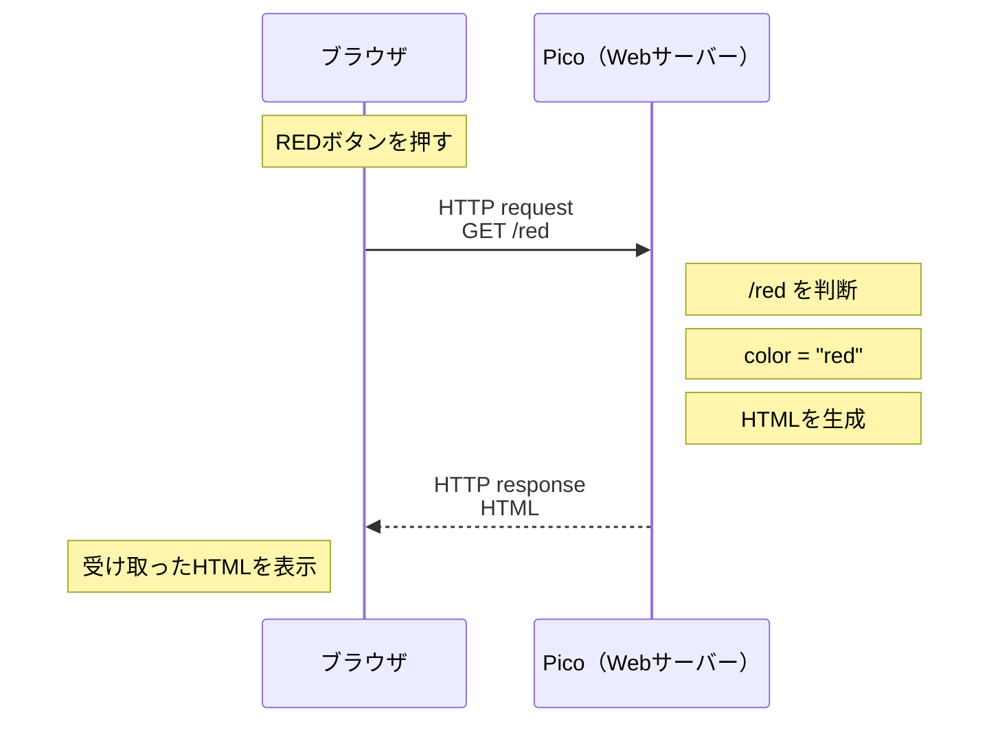

# マイコン実習 第17回
## Web AGV② ― Web入力を既存のモータ制御へつなぐ

**実施日：2026年9月15日**  
**授業時間：200分**

---

# 0. 今日の位置づけ

第16回では、全員で Pico 2 WH を

- Wi-Fiアクセスポイント（AP）
- Webサーバー

として動作させ、ブラウザから

```text
GET /red
GET /blue
```

という request（リクエスト：要求）を送り、Picoが返すHTMLの文字色を変えました。

第17回では、第16回で使用した各自のプログラムをそのまま続けるのではなく、  
**動作確認済みの共通 `web_agv.py`** から再開します。

今日の流れは、

```text
第16回で学んだWeb入力
        ↓
安定した共通プログラムで復習
        ↓
BLACKを自分で追加
        ↓
既存の前進・停止関数を再利用
        ↓
新しい「後退」関数を作る
        ↓
Webの GET /back と接続
```

です。

> **Webサーバーをゼロから書くことが今日の目的ではありません。**
>
> 動作確認済みの部分を利用し、必要なところを読んで変更します。

---

# 1. 今日の到達点

## 最低到達点

全員、ここまでは行います。

> **RED / BLUE が動作する共通 `web_agv.py` を確認し、BLACKボタンと `GET /black` の処理を自分で追加する。**

---

## 標準到達点

車体の前進・停止が正常に動作する人は、ここを目標にします。

> **Webから FORWARD / BACK / STOP を操作できるようにする。**

そのために、

1. 既存の前進・停止関数を再利用する
2. ライントレーサーにはなかった「後退」関数を新しく作る
3. Webページへ BACK ボタンを追加する
4. `GET /back` を受けたら、新しく作った後退関数を呼び出す

という順番で進めます。

---

## 発展課題

標準到達点までできた人は、

> **LEFT / RIGHT をWeb操作へ追加する。**

左右旋回の関数は、ライントレーサーで使用した既存関数を再利用します。

---

# 2. 200分の進め方

| 時間の目安 | 内容 |
|---:|---|
| 0～15分 | STEP 1　接続条件をそろえる・第16回の復習 |
| 15～35分 | STEP 2　共通 `web_agv.py` で RED / BLUE を確認 |
| 35～50分 | STEP 3　request / response、`.format()`、favicon の確認 |
| 50～70分 | STEP 4　共通課題：BLACKを追加 |
| 70～105分 | STEP 5　既存の前進・停止関数をWebへ接続 |
| 105～145分 | STEP 6　新しい「後退」関数を作る |
| 145～170分 | STEP 7　BACKボタンと `GET /back` を追加・実機確認 |
| 170～180分 | STEP 8　結果を記録・保存 |
| 180～200分 | STEP 9　片付け・整理整頓 |

> **時間は目安です。**
>
> 最後の20分は、新しい作業を始めません。

---

# STEP 1　接続条件をそろえる

第16回では、Webの仕組み以外の原因でも接続トラブルが発生しました。

今日は最初にスマホ側の条件をそろえます。

## 1-1　スマホ側

- [ ] 機内モードをONにした
- [ ] Wi-Fi をONにした
- [ ] 自分の出席番号の `PICO_AGV_xx` に接続した
- [ ] Wi-FiのMACアドレス設定を確認した (※スマホで接続時に設定を求められる場合。以下に補足説明。)

この実習では、ランダムMACを使用せず、

```text
デバイスのMACアドレスを使用
```

する設定を基本とします。

端末によっては、

```text
ランダムMAC
プライベートアドレス
プライベートWi-Fiアドレス
```

など、表示名が異なる場合があります。

> **「インターネット接続なし」と表示されても正常です。**
>
> 今回は Pico とスマホ / PC の間だけで通信します。

---

## 1-2　Pico側

この時点では、

- **USBは接続したまま**
- **車体の電池電源はOFF**
- **モータは動かさない**

状態で進めます。

- [ ] Pico 2 WHをUSBでPCへ接続した
- [ ] ThonnyでPicoを認識できた
- [ ] 車体の電池電源がOFFであることを確認した

---

# STEP 2　共通 `web_agv.py` を動かす

配布された、

```text
web_agv.py
```

を使用します。

第16回で各自が作ったWebサーバープログラムは、今日の開始プログラムには使用しません。

## 2-1　自分のSSIDとPASSWORDへ変更する

例：出席番号3番

```python
SSID = "PICO_AGV_03"
PASSWORD = "picoagv03"
```

- [ ] `SSID` の番号を自分の出席番号へ変更した
- [ ] `PASSWORD` の番号を自分の出席番号へ変更した
- [ ] Picoへ `web_agv.py` を保存した

---

## 2-2　RED / BLUEを確認する

1. `web_agv.py` を実行する
2. スマホ / PCを自分のPicoのWi-Fiへ接続する
3. ブラウザで次を開く

```text
http://192.168.4.1/
```

- [ ] `Pico Web AGV` が表示された
- [ ] REDボタンを押した
- [ ] 見出しが赤になった
- [ ] Shellに `GET /red HTTP/1.1` が表示された
- [ ] BLUEボタンを押した
- [ ] 見出しが青になった
- [ ] Shellに `GET /blue HTTP/1.1` が表示された

---

# STEP 3　Webの動きを短く復習する

## 3-1　REDボタンを押したとき

REDボタンを押すと、ブラウザ自身が文字を赤くしているわけではありません。



つまり、

```text
ボタンを押す
   ↓
request が送られる
   ↓
Picoが判断する
   ↓
返すHTMLを作る
   ↓
response として返す
   ↓
ブラウザが表示する
```

という1往復です。

> 今ブラウザに見えているページは、  
> **直前のrequestに対してPicoが返したresponseの結果**です。

---

## 3-2　`.format()` で値をHTMLへ入れる

共通プログラムには、次の変数があります。

```python
color = "black"
size = "96px"
```

HTMLを作る部分では、

```python
<h1 style="color: {}; font-size: {};">Pico Web AGV</h1>
```

となっています。

そのあとに、

```python
.format(color, size)
```

があります。

この場合、

```text
1個目の {}  ← color
2個目の {}  ← size
```

の順に値が入ります。

例えば、

```python
color = "blue"
size = "96px"
```

なら、

```text
color: blue; font-size: 96px;
```

という内容になります。

### 確認問題

次の場合、

```python
color = "red"
size = "120px"
```

```python
"color: {}; font-size: {};".format(color, size)
```

は、どのような文字列になりますか。

```text


```

> 今回は `.format()` の細かい仕組みを覚えることが目的ではありません。
>
> **Pythonの変数の値を、これから返すHTMLへ埋め込んでいる**ことを確認します。

---

## 3-3　`favicon.ico` とは

Shellに、

```text
GET /favicon.ico HTTP/1.1
```

と表示される場合があります。

これは、RED / BLUEボタンを押したために送られたrequestではありません。

ブラウザが、Webページ用の小さなアイコン  
**favicon（ファビコン）** を探すために自動で送る場合があります。

今回の共通プログラムでは、

```python
elif "GET /favicon.ico " in first_line:
    pass
```

として、faviconのrequestが来ても、

```text
color
size
```

などの状態を変更しません。

> **ブラウザから届くrequestは、自分が押したボタンのものだけとは限りません。**

参考：faviconとは  
https://digital-marketing.jp/creative/what-is-favicon/

---

# STEP 4　共通課題：BLACKを追加する

ここからは、RED / BLUEの処理を参考にして自分で変更します。

## 🎯 BLACK課題

Webページへ、

```text
BLACK
```

ボタンを追加します。

BLACKボタンを押すと、

```text
GET /black HTTP/1.1
```

がPicoへ届き、見出しの文字色が黒になるようにしてください。

必要な変更場所は、RED / BLUEを参考に探してください。

```text
HTMLにボタンを追加
        ↓
/black というURL
        ↓
GET /black
        ↓
if / elif で判断
        ↓
color の状態を変更
        ↓
新しいHTMLをresponse
```

### 作業・確認

- [ ] HTMLへBLACKボタンを追加した
- [ ] プログラムを保存して再実行した
- [ ] WebページにBLACKボタンが表示された
- [ ] BLACKボタンを押した
- [ ] Shellに `GET /black HTTP/1.1` が表示された
- [ ] `/black` を判断する処理を追加した
- [ ] BLACKを押すと文字が黒になった
- [ ] RED → BLUE → BLACK と押し、それぞれの色へ変わることを確認した

### ✅ 最低到達点 CLEAR

ここまでできたら、第17回の最低到達点CLEARです。

---

# STEP 5　Web入力を既存の前進・停止へつなぐ

ここから、Web入力を車体へつなぎます。

> **モータ制御を最初から作り直しません。**
>
> ライントレーサーで使用した、正常に動く部分を再利用します。

---

## 5-1　再利用する部分を探す

自分のライントレーサーのプログラムから、次を探します。

- モータ制御に必要なGPIO / PWMの初期化
- 前進する関数
- 停止する関数

関数名は人によって違って構いません。

| 動作 | 自分の関数名 |
|---|---|
| 前進 | |
| 停止 | |

今回は、次の部分はWeb AGVの入力判断には使用しません。

```text
センサ値の読み取り
白 / 黒の判定
ライントレーサー用の自律走行ループ
```

> **再利用するのは、主に「車体を動かす部分」です。**

- [ ] 自分の前進関数を見つけた
- [ ] 自分の停止関数を見つけた
- [ ] モータ用GPIO / PWMの初期化部分を見つけた

---

## 5-2　作業用ファイルを作る

動作確認済みの `web_agv.py` は、そのまま残しておきます。

別名の作業用ファイルを作ります。

例：

```text
web_agv_motor.py
```

- [ ] `web_agv.py` を残した
- [ ] 作業用の `web_agv_motor.py` を作った
- [ ] モータ用GPIO / PWMの初期化を作業用ファイルへ追加した
- [ ] 前進関数を追加した
- [ ] 停止関数を追加した

---

## 5-3　FORWARD / STOPのrequestを作る

まずは **USB接続・車体電池OFF** のままです。

Webページへ、

```text
FORWARD
STOP
```

ボタンを追加します。

BLACK課題と同じ考え方です。

まずは、モータを動かさず、

```text
GET /forward HTTP/1.1
GET /stop HTTP/1.1
```

が届くことをShellで確認します。

- [ ] FORWARDボタンを追加した
- [ ] STOPボタンを追加した
- [ ] FORWARDを押して `GET /forward HTTP/1.1` を確認した
- [ ] STOPを押して `GET /stop HTTP/1.1` を確認した

requestが確認できたら、

```text
GET /forward
        ↓
既存の前進関数

GET /stop
        ↓
既存の停止関数
```

となるように、`if / elif` の処理を追加します。

- [ ] `/forward` の処理から既存の前進関数を呼ぶようにした
- [ ] `/stop` の処理から既存の停止関数を呼ぶようにした

> この時点では車体の電池電源をONにしません。

---

# STEP 6　新しい「後退」関数を作る

ライントレーサーでは、

- 前進
- 左旋回
- 右旋回
- 停止

を使用していました。

今回は、新しく

> **後退**

を追加します。

---

## 6-1　前進関数を読む

まず、自分の前進関数を見てください。

前進では、

```text
左モータ：車体を前進させる向き
右モータ：車体を前進させる向き
```

になっています。

では、後退ではどうすればよいでしょうか。

| 動作 | 左モータ | 右モータ |
|---|---|---|
| 前進 | 前進方向 | 前進方向 |
| 後退 |  |  |

自分のモータドライバでは、何を変更すれば回転方向が逆になるか確認してください。

---

## 6-2　後退関数を作る

関数名は自分で決めて構いません。

例：

```text
go_back()
reverse()
move_backward()
```

など。

自分が作る関数名：

```text

```

### 作業

- [ ] 後退用の新しい関数を作った
- [ ] 左モータが後退方向になる処理を入れた
- [ ] 右モータが後退方向になる処理を入れた
- [ ] 後退中に STOP 操作で確実に停止できる構成になっていることを確認した

> **後退の処理を `/back` の `elif` の中へ直接書きません。**
>
> まず、車体の「後退」という動作を関数として作ります。

---

## 6-3　USB接続中に呼び出しだけ確認する

まだ、

- USB接続
- 車体の電池電源OFF

のままです。

後退関数を一度呼び出し、

- 関数名の間違い
- 文法エラー
- 未定義の変数

などがないことを確認します。

この段階ではモータが実際に回らなくて構いません。

- [ ] 後退関数を呼び出して、エラーが出ないことを確認した
- [ ] 停止関数も呼び出して、エラーが出ないことを確認した

---

# STEP 7　BACKボタンと `GET /back` をつなぐ

後退関数が作れたら、初めてWeb側と接続します。

## 7-1　BACKボタンを追加する

BLACK課題を思い出してください。

```text
BLACKボタン
   ↓
GET /black
   ↓
elif
   ↓
color を変更
```

今回は、

```text
BACKボタン
   ↓
GET /back
   ↓
elif
   ↓
後退関数を呼ぶ
```

にします。

- [ ] WebページへBACKボタンを追加した
- [ ] BACKを押してShellに `GET /back HTTP/1.1` が表示された
- [ ] `/back` を判断する処理を追加した
- [ ] `/back` の処理から、自分で作った後退関数を呼ぶようにした

---

## 7-2　実機テストの準備

ここからモータを実際に動かします。

### まず保存

ライントレーサーで使用した元の `main.py` を失わないように、PC側へ保存しておきます。

- [ ] 元のライントレーサー `main.py` をPC側へ保存した
- [ ] 作業中のWeb AGVプログラムを保存した

USBを外してもPicoが自動でWebサーバーを起動できるよう、  
実機確認用のプログラムをPico側の

```text
main.py
```

として保存します。

> Pico側の `main.py` は、電源を入れたとき自動で実行されます。

- [ ] 実機確認用プログラムをPico側の `main.py` として保存した
- [ ] FORWARD / BACK / STOP の3つの処理が入っていることを確認した

---

## 7-3　安全確認

- [ ] 車体の電池電源がOFFであることを確認した
- [ ] USBケーブルを外した
- [ ] 車輪を浮かせた、または車体が急に走らない状態にした
- [ ] すぐに車体電源をOFFにできる状態にした
- [ ] 車体の電池電源をONにした
- [ ] スマホ / PCを自分の `PICO_AGV_xx` へ接続した
- [ ] ブラウザで `http://192.168.4.1/` を開いた

> ここからはThonnyのShellは見えません。  
> requestの確認は、USBを外す前に済ませています。

---

## 7-4　FORWARD → STOP

最初に、既存関数を使った前進を確認します。

- [ ] FORWARDを押した
- [ ] 左右モータが前進方向へ回った
- [ ] モータが回っている状態でSTOPを押した
- [ ] 回転中のモータが停止した

前進方向がおかしい場合は、BACKの確認へ進まず原因を調べます。

---

## 7-5　BACK → STOP

次に、今回新しく作った後退を確認します。

- [ ] BACKを押した
- [ ] 左右モータが前進とは逆方向へ回った
- [ ] 車体が後退する向きであることを確認した
- [ ] モータが回っている状態でSTOPを押した
- [ ] 回転中のモータが停止した

### ✅ 標準到達点 CLEAR

Webから、

```text
FORWARD → 前進
BACK    → 後退
STOP    → 停止
```

を操作できたら、第17回の標準到達点CLEARです。

---

# 車体がまだ正常に動かない場合

BLACK課題までは全員共通です。

その後、前進・停止が正常に動かない場合は、Webへ機能を追加し続けません。

次の順番で、どこまで正常か確認します。

```text
電源
 ↓
GND
 ↓
Pico GPIO
 ↓
モータドライバ
 ↓
左右モータ
 ↓
前進関数
 ↓
停止関数
```

### 記録

正常だったところ：

```text


```

最初に異常だったところ：

```text


```

次に確認するところ：

```text


```

> **「Webが完成しなかった」で終わりではありません。**
>
> 正常な範囲と異常な範囲を切り分けられたことも、今日の成果です。

---

# 発展課題　LEFT / RIGHT

FORWARD / BACK / STOPまででき、時間に余裕がある人だけ進みます。

ライントレーサーで使用していた、

```text
左旋回関数
右旋回関数
```

を再利用します。

新しく旋回処理を作り直す必要はありません。

```text
LEFTボタン
  ↓
GET /left
  ↓
既存の左旋回関数

RIGHTボタン
  ↓
GET /right
  ↓
既存の右旋回関数
```

- [ ] LEFTボタンを追加した
- [ ] `GET /left` を確認した
- [ ] Webから左旋回できた
- [ ] RIGHTボタンを追加した
- [ ] `GET /right` を確認した
- [ ] Webから右旋回できた
- [ ] 各動作からSTOPで停止できた

---

# STEP 8　今日の結果を記録する

新しい作業はここまでにします。

## 今日できたところ

```text


```

## BLACK課題で変更したところ

```text


```

## 新しく作った後退関数の名前

```text


```

## 後退させるために変更したモータの動き

```text


```

## まだ残っている問題

```text


```

## 次回、最初に行うこと

```text


```

---

# STEP 9　保存・片付け

最後の20分は、新しい作業を始めません。

## プログラムの保存

- [ ] 共通の `web_agv.py` を残した
- [ ] 作業用のWeb AGVプログラムを保存した
- [ ] 元のライントレーサー `main.py` をPC側へ保存した
- [ ] Pico側で現在どの `main.py` が自動実行されるか確認した
- [ ] 次回続きから作業できる状態にした

## 安全確認・片付け

- [ ] STOPまたは電源OFFでモータを停止した
- [ ] 車体の電池電源をOFFにした
- [ ] PicoのUSBケーブルを外した
- [ ] 工具を元の場所へ戻した
- [ ] ジャンパワイヤ・部品を整理した
- [ ] 車体を決められた場所へ戻した
- [ ] 机の上を片付けた

---

# 今日のまとめ

第16回では、

```text
Web入力
   ↓
判断
   ↓
HTMLを返す
```

を確認しました。

第17回では、そのWeb入力を、

```text
Web入力
   ↓
GET /forward
GET /back
GET /stop
   ↓
if / elif で判断
   ↓
モータ制御関数
   ↓
車体
```

へつなぎます。

特に今回の後退では、

```text
新しい動作を考える
      ↓
関数として作る
      ↓
Web入力から呼び出す
```

という順番で進めました。

> **入力方法が変わっても、車体を動かす関数は再利用できます。**
>
> また、必要な動作がなければ、新しい関数として追加し、動作を確認してから全体へ組み込みます。
