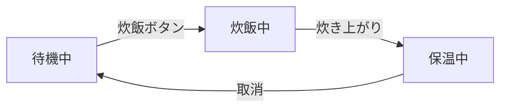

# マイコン実習 第18回
## Web AGV③ ― 「状態」を持たせて、速度設定を変える

**実施日：2026年9月29日**  
**授業時間：200分**

---

# 0. 今日のテーマ

第17回では、Webページのボタンから送られた request（リクエスト：要求）をPicoが受け取り、

```text
Webのボタン
    ↓
GET /forward
GET /back
GET /stop
    ↓
if / elif で判断
    ↓
Pythonの関数を呼ぶ
    ↓
モータを動かす
```

という流れを作りました。

今日は、このWeb AGVに、

> **「現在の状態や設定を覚えておく」**

という考え方を追加します。

今回の実習では、主にモータの**速度設定**を使います。

```text
SPEED UP
    ↓
速度設定を大きくする
    ↓
その値を覚えておく
    ↓
次にFORWARD / BACKするときに使う
```

---

# 1. 今日の到達点

## 最低到達点

> Webページから **SPEED UP / SPEED DOWN** を操作し、  
> 現在の速度設定値が変化することをWebページ上で確認する。

## 標準到達点

> Webで変更した速度設定を使って、  
> **FORWARD / BACK の実機速度が変化することを確認する。**

## 発展課題

> 速度設定に **最大値・最小値** を設け、範囲外にならないようにする。

時間に余裕がある人は、現在の動作状態をWebページへ表示する課題にも取り組んでかまいません。

---

# 2. 今日のおおまかな進め方

| 時間の目安 | 内容 |
|---:|---|
| 0～25分 | STEP 1　第17回のWeb AGVを復旧する |
| 25～45分 | STEP 2　「状態」とは何か・ミニ課題 |
| 45～65分 | STEP 3　現在の速度設定をWebページへ表示する |
| 65～90分 | STEP 4　SPEED UPを追加する |
| 90～105分 | STEP 5　SPEED DOWNを追加する・進捗調整 |
| 105～135分 | STEP 6　速度設定をFORWARD / BACKへ反映する |
| 135～165分 | STEP 7　実機で速度差を確認する |
| 165～180分 | STEP 8　発展課題・結果の記録 |
| 180～200分 | STEP 9　保存・片付け |

> **時間は目安です。**
>
> 最後の20分は、新しい作業を始めません。

---

# STEP 1　第17回のWeb AGVを復旧する

2週間空いています。

まず説明を聞く前に、**自分の第17回のWeb AGVをもう一度動かしてみます。**

## 1-1　前回のプログラムを探す

第17回で使った、

- Webサーバー
- 前進
- 後退
- 停止

が入っているプログラムを探してください。

- [ ] 第17回のWeb AGVプログラムを見つけた
- [ ] PC側 / Pico側のどこにあるか確認した
- [ ] Picoへ保存するプログラムを確認した

---

## 1-2　スマホ / PCをPicoへ接続する

### スマホを使う場合

今回も、PicoのWi-Fiへ接続するときは、

- 機内モードをON
- Wi-FiのみON
- `PICO_AGV_xx` へ接続
- 「インターネットなし」は正常

として進めます。

> **iPhoneでは、Picoとの通信が不安定になる場合があります。**
>
> ボタンを1回タップしてもrequestがすぐ届かず、次のタップ時に複数のrequestが続けて届く場合があります。
>
> その場合は先生へ連絡し、Android端末またはPCへ切り替えます。

---

## 1-3　前回の動作を確認する

ブラウザで、

```text
http://192.168.4.1/
```

を開きます。

- [ ] Webページが表示された
- [ ] FORWARDで前進した
- [ ] STOPで停止した
- [ ] BACKで後退した
- [ ] 再びSTOPで停止した

LEFT / RIGHTまで作成済みの人は、それも確認してかまいません。

### 15分程度で復旧できない場合

前回のファイル探しや修正だけで長時間止まらないようにします。

> **15分程度で復旧できなければ先生へ相談してください。**

必要に応じて、動作確認済みの基準版から今日の課題へ進みます。

---

## 1-4　前回の流れをプログラム上で確認する

自分のプログラムから、次の4か所を探してください。

```text
① HTMLのFORWARDボタン
        ↓
② GET /forward
        ↓
③ if / elif
        ↓
④ 前進する関数
```

- [ ] FORWARDボタンを作っているHTMLを見つけた
- [ ] `GET /forward` を判断している場所を見つけた
- [ ] 前進する関数を呼んでいる場所を見つけた
- [ ] BACKについても同じ流れを確認した

---

# STEP 2　「状態」とは何か

ここからが今日の新しい考え方です。

## 2-1　「いま、どうなっているか」

例えば炊飯器を考えます。

同じ炊飯器でも、

```text
待機中
炊飯中
保温中
```

では、内部で行う処理が違います。



ここで、

- **炊飯ボタン**：入力
- **待機中 / 炊飯中 / 保温中**：いまの状態
- **炊き上がり**：状態が変わるきっかけ

と考えることができます。

> 今がどの状態なのかによって、次に行う処理が変わります。

今日は、この図の名前を覚えることが目的ではありません。

> **「いまの状態が、入力や出来事によって別の状態へ変わる」**

という考え方を使います。

---

## 2-2　ミニ課題：Web AGVの状態の変化を考える

Web AGVが、次の3つの状態を持っていると考えます。

```text
STOP
FORWARD
BACK
```

次の空欄を埋めてください。

### ① STOP中にFORWARDボタンを押した

```text
[ STOP ]
    │ FORWARDボタン
    ↓
[ __________________ ]
```

### ② FORWARD中にSTOPボタンを押した

```text
[ FORWARD ]
    │ STOPボタン
    ↓
[ __________________ ]
```

### ③ STOP中にBACKボタンを押した

```text
[ STOP ]
    │ BACKボタン
    ↓
[ __________________ ]
```

### ④ BACK中にSTOPボタンを押した

```text
[ BACK ]
    │ STOPボタン
    ↓
[ __________________ ]
```

### ⑤ 少し考えてみる

FORWARD中にBACKボタンを押したら、どんな動作にする方法が考えられますか。

```text
考えた動作：


理由：

```

> 必ず1つの答えに決める必要はありません。
>
> **「今どの状態なのか」によって、同じ入力でも処理を変えることがある**
> という考え方があります。

---

## 2-3　プログラムでは、状態を変数に覚えさせることが多い

例えば、

```python
state = "STOP"
```

と書いたとします。

`state`（ステート）は、

> **「状態」**

という意味の英単語です。

`state` はPythonで特別に決められた名前ではありません。  
変数名なので別の名前でも動きます。

ただし、

> 「現在の状態を覚えている変数」

だと分かりやすいため、`state` という名前を使うことがあります。

例えば、

```python
state = "STOP"
```

なら、

> 現在の状態を `"STOP"` として覚えている

と読むことができます。

---

## 2-4　マイコンのプログラムでよく見る形

マイコンでは、次のような形のプログラムになることがあります。

```python
state = "STOP"

while True:
    if state == "FORWARD":
        go_forward()

    elif state == "BACK":
        go_back()

    elif state == "STOP":
        stop()

    else:
        stop()
```

意味は、

```text
何度も繰り返す
      ↓
現在の状態を見る
      ↓
状態に応じた処理をする
```

です。

> このプログラムを今日はそのまま作る必要はありません。
>
> **「現在の状態を覚えておき、その状態によって処理を変える」**
> という考え方を確認します。

---

## 2-5　今日は「速度設定」を覚えさせる

今日は、

```python
DRIVE_SPEED = 30000
```

のような速度設定を使います。

例えば、

```text
現在の速度設定：30000
        ↓
SPEED UP
        ↓
現在の速度設定：35000
```

となったあと、SPEED UPボタンを押し続けていなくても、

```text
35000
```

という値は残っています。

そして次にFORWARDするとき、

```text
現在の DRIVE_SPEED
```

を使います。

```text
SPEED UP
      ↓
DRIVE_SPEED が変わる
      ↓
値を覚えておく
      ↓
FORWARD
      ↓
覚えていた DRIVE_SPEED でモータを動かす
```

> マイコンに覚えさせるものには、
>
> - `state = "STOP"` のような **現在の動作状態**
> - `DRIVE_SPEED = 30000` のような **現在の設定値**
>
> などがあります。

---

# STEP 3　現在の速度設定をWebページへ表示する

まず、モータを動かす前に、

> **Picoが現在どの速度設定を覚えているのか**

をWebページへ表示します。

## 3-1　自分の速度設定を探す

自分のモータ制御部分から、速度を表している変数を探してください。

例：

```python
DRIVE_SPEED = 30000
```

人によって変数名や値が違っていて構いません。

自分の速度設定：

```text
変数名：________________________

現在値：________________________
```

- [ ] 前進で使用している速度設定を見つけた
- [ ] 後退でもどの速度設定を使っているか確認した

---

## 3-2　Webページに値を表示する

第17回で使った `.format()` を再利用できます。

例えば、

```html
<p>SPEED = {}</p>
```

というHTMLに対して、

```python
.format(DRIVE_SPEED)
```

とすれば、現在の値をHTMLへ入れられます。

ただし、自分のHTMLではすでに、

```python
.format(...)
```

を使っている場合があります。

### 例

```python
color = "black"
size = "96px"
DRIVE_SPEED = 30000
```

なら、

```python
html = """
<h1 style="color: {}; font-size: {};">Pico Web AGV</h1>
<p>SPEED = {}</p>
""".format(color, size, DRIVE_SPEED)
```

となります。

```text
1個目の {} ← color
2個目の {} ← size
3個目の {} ← DRIVE_SPEED
```

です。

### 作業

- [ ] Webページに `SPEED = ...` を追加した
- [ ] `.format(...)` に速度設定の変数を追加した
- [ ] プログラムを保存した
- [ ] Webページを開いた
- [ ] 現在の速度設定値が表示された

---

# STEP 4　SPEED UPを追加する

ここでも、第17回と同じ順番で確認します。

```text
ボタンを追加
    ↓
requestを確認
    ↓
if / elifで判断
    ↓
状態（速度設定）を変更
    ↓
Webページに表示
```

## 4-1　SPEED UPボタンを追加する

Webページに、

```text
SPEED UP
```

ボタンを追加してください。

URLは、

```text
/speed_up
```

とします。

- [ ] SPEED UPボタンを追加した
- [ ] WebページにSPEED UPボタンが表示された

---

## 4-2　requestを確認する

まだモータを動かす必要はありません。

SPEED UPボタンを押して、Shellに、

```text
GET /speed_up HTTP/1.1
```

が届くことを確認します。

- [ ] SPEED UPボタンを押した
- [ ] Shellで `GET /speed_up HTTP/1.1` を確認した

---

## 4-3　速度設定を増やす

1回押したときに増やす量を決めます。

例：

```python
SPEED_STEP = 5000
```

`step`（ステップ）は、ここでは

> **1回で変える量**

という意味です。

例えば、

```python
DRIVE_SPEED = DRIVE_SPEED + SPEED_STEP
```

なら、

```text
30000
 ↓ SPEED UP
35000
```

となります。

自分の設定：

```text
SPEED_STEP = __________________
```

- [ ] `SPEED_STEP` を決めた
- [ ] `/speed_up` を判断する処理を追加した
- [ ] SPEED UPで速度設定が増えるようにした
- [ ] Webページ上のSPEED表示が増えたことを確認した

---

# STEP 5　SPEED DOWNを追加する

SPEED UPを参考に、

```text
SPEED DOWN
```

を追加します。

URLは、

```text
/speed_down
```

とします。

ここは、できるだけ自分で作ってください。

```text
SPEED DOWN
      ↓
GET /speed_down
      ↓
if / elif
      ↓
速度設定を小さくする
      ↓
Webページの表示も変わる
```

### 作業・確認

- [ ] SPEED DOWNボタンを追加した
- [ ] Shellで `GET /speed_down HTTP/1.1` を確認した
- [ ] `/speed_down` の判断処理を追加した
- [ ] SPEED DOWNで速度設定が小さくなった
- [ ] Webページ上のSPEED表示が小さくなった

## ✅ 最低到達点 CLEAR

次を確認できたら、今日の最低到達点CLEARです。

```text
SPEED UP
  → Webページ上の速度設定が増える

SPEED DOWN
  → Webページ上の速度設定が減る
```

この時点では、モータが実際に速くなったかどうかはまだ確認していません。

---

# STEP 6　速度設定をFORWARD / BACKへ反映する

ここから、覚えている速度設定を実際のモータ制御で使います。

## 6-1　前進関数を確認する

自分の前進関数の中で、

```text
DRIVE_SPEED
```

など、現在の速度設定を使っているか確認してください。

- [ ] 前進関数の中で速度設定を使用している場所を確認した
- [ ] 後退関数の中で速度設定を使用している場所を確認した

### 速度が数字で直接書かれている場合

例えば、

```python
motor.duty_u16(30000)
```

のように数字が直接書かれている場合は、先生へ相談してください。

今日の目標は、

> **現在の速度設定を、前進・後退の両方から利用する**

ことです。

---

## 6-2　重要：速度設定を変えただけでは、すでに出力中のPWMが変わるとは限らない

例えば、

```text
FORWARD
 ↓
PWMへ30000を出力

そのあと
SPEED UP
 ↓
DRIVE_SPEED = 35000
```

となっても、

> すでにPWMへ出した値が、自動的に35000へ変わるとは限りません。

今日はまず、

```text
STOP
 ↓
速度設定を変更
 ↓
FORWARD / BACK
```

の順番で比較します。

---

# STEP 7　実機で速度差を確認する

## 7-1　安全確認

- [ ] 車輪を浮かせた、または安全に操作できる状態にした
- [ ] すぐにSTOPまたは電源OFFできる状態にした
- [ ] 前進・後退・停止が正常に動くことを確認した

---

## 7-2　低い速度設定で確認

例：

```text
SPEED = 25000
```

など、自分の車体で安全に確認できる値を使います。

- [ ] 速度設定を記録した
- [ ] FORWARDを押した
- [ ] モータの速さを確認した
- [ ] STOPを押した

速度設定：

```text
________________________
```

動き：

```text


```

---

## 7-3　SPEED UPしてもう一度確認

- [ ] SPEED UPを1回以上押した
- [ ] Webページ上の速度設定が増えた
- [ ] FORWARDを押した
- [ ] 最初の速度との違いを確認した
- [ ] STOPを押した

速度設定：

```text
________________________
```

動き：

```text


```

---

## 7-4　BACKでも確認する

- [ ] 速度設定を変更した
- [ ] BACKを押した
- [ ] 後退時にも速度設定の違いを確認した
- [ ] STOPを押した

## ✅ 標準到達点 CLEAR

> SPEED UP / SPEED DOWNで変更した設定値を使って、  
> FORWARD / BACKの実機速度が変化することを確認できたらCLEARです。

---

# STEP 8　発展課題

標準到達点まででき、時間に余裕がある人だけ進みます。

## 発展1　速度の最大値・最小値を決める

このままだと、SPEED UPを何度も押して、

```text
大きすぎる値
```

になったり、

SPEED DOWNを何度も押して、

```text
0以下
```

になったりする可能性があります。

そこで、

```python
MIN_SPEED = 20000
MAX_SPEED = 50000
```

のように、使用する範囲を決めます。

### 目標

```text
何回SPEED UPしても MAX_SPEED を超えない

何回SPEED DOWNしても MIN_SPEED を下回らない
```

ようにしてください。

- [ ] `MIN_SPEED` を決めた
- [ ] `MAX_SPEED` を決めた
- [ ] 最大値を超えないようにした
- [ ] 最小値を下回らないようにした
- [ ] Webページで最大値・最小値の動作を確認した

> 設備の設定値でも、使用できる範囲を決めておくことがあります。

---

## 発展2　現在の動作状態を表示する

さらに余裕がある人は、

```python
state = "STOP"
```

のような変数を作り、

```text
STATE = STOP
STATE = FORWARD
STATE = BACK
```

をWebページに表示してみてもかまいません。

例えば、

```text
FORWARDを受けた
      ↓
state = "FORWARD"

BACKを受けた
      ↓
state = "BACK"

STOPを受けた
      ↓
state = "STOP"
```

とします。

> この課題は発展です。  
> 今日の標準到達点は、速度設定を実機へ反映するところまでです。

---

# 車体が正常に動かない場合

Webページ上でSPEED UP / SPEED DOWNが動作しても、モータが動かない場合があります。

その場合は、一度に全部を疑わず、

```text
Webのrequestは届いた？
        ↓
DRIVE_SPEEDは変化した？
        ↓
前進関数は呼ばれている？
        ↓
GPIO / PWMは正しい？
        ↓
モータドライバ
        ↓
モータ
```

の順番で確認します。

### 記録

Webのrequest：

```text
正常 / 異常
```

速度設定：

```text
正常 / 異常
```

前進・後退関数：

```text
正常 / 異常
```

最初に異常だったところ：

```text


```

---

# STEP 9　今日の結果を記録する

## 9-1　今日変更したもの

- [ ] Webページへ現在の速度を表示した
- [ ] SPEED UPを追加した
- [ ] SPEED DOWNを追加した
- [ ] 前進へ速度設定を反映した
- [ ] 後退へ速度設定を反映した
- [ ] 最大・最小速度を追加した（発展）
- [ ] 現在の動作状態を表示した（発展）

## 9-2　今日使った設定

```text
DRIVE_SPEED 初期値 = __________________

SPEED_STEP         = __________________

MIN_SPEED          = __________________  （設定した場合）

MAX_SPEED          = __________________  （設定した場合）
```

## 9-3　今日確認したこと

```text


```

## 9-4　うまくいかなかったこと

```text


```

## 9-5　次回、最初に行うこと

```text


```

---

# 保存・片付け

最後の20分は、新しい作業を始めません。

## プログラムの保存

- [ ] 今日のプログラムを保存した
- [ ] 第17回終了時のプログラムを上書きせず残した
- [ ] PC側 / Pico側のどこへ保存したか確認した
- [ ] Pico側の `main.py` の内容を確認した
- [ ] 次回続きから作業できる状態にした

## 安全確認・片付け

- [ ] STOPまたは電源OFFでモータを停止した
- [ ] 車体の電池電源をOFFにした
- [ ] PicoのUSBケーブルを外した
- [ ] 工具を元の場所へ戻した
- [ ] ジャンパワイヤ・部品を整理した
- [ ] 車体を決められた場所へ戻した
- [ ] 机の上を片付けた

---

# 今日のまとめ

第17回では、

```text
Web入力
   ↓
if / elif
   ↓
Pythonの関数
   ↓
モータ
```

を作りました。

第18回では、その間に、

```text
現在の状態や設定を覚えておく
```

という考え方を加えました。

```text
Web入力
   ↓
速度設定を変更
   ↓
現在値を覚えておく
   ↓
FORWARD / BACK
   ↓
覚えている速度設定を使う
   ↓
モータ
```

マイコンでは、

> **「いまどうなっているか」や「現在どんな設定になっているか」を覚えておき、  
> その値に応じて処理を変える**

という考え方をよく使います。

今日はその入口として、

- Web AGVの状態の変化を考える
- 速度設定を覚えさせる
- 覚えている設定を後の処理で使う

という3つを確認しました。
