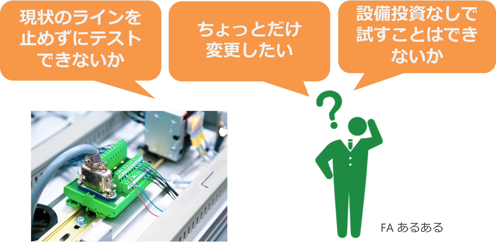
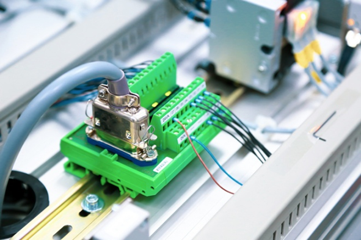
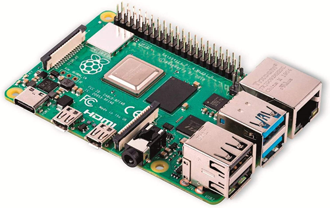

# ガイダンス・インフォメーション

- 単位数 8 (Q1:２単位, Q3:２単位, Q4:４単位)  
でかい！！ 成績がつくのは後期です

- 必須条件  
学校の決められた出席率 （80% 以上）であること  
**28 回の遅刻・早退 or 7 回の欠席**  
出席率未達のときの救済措置はありません  

- テストはしません  
レポート！レポート！レポート！  
レポートと作品の完成度で評価します。  

    - 内容  
実験方法，作成方法，考察，仕上がりなど
    - 体裁 (ていさい)  
ドキュメントの形式，文章，図表の形式など  
特に名前がないものは０点とします  
    - 協力しておこなってよい  
ただし，プログラムやレポートは各自で作成，提出する  
協力（コラボ）したひとの名前を明記する  

- 先生とのやり取りは Google Classroom を使います。

- 場所はマイコン実習室で、デスクトップ PC を使います。

# この授業のねらい

## マイコンと PLC の統合

みなさんは１年生のときに　PLC の勉強を行い、一方 PC の技術としてのプログラミング言語 (Python) を学習した。この「マイコン実習」ではそれらの技術を統合することを試みる。

産業界でも、IoT 化やクラウド化が進んでおり、この流れは当分とどまることはないだろう。

["]('https://www.youtube.com/watch?v=ybdsPEecSWE')

## 多品種・少量生産への対応

工場のラインを立ち上げるにはまだ早い、少量・多品種の製品への対応や試作品（プロトタイプ品）の作成などにマイコンは用いられることが多い。

    

## マイコンが使われる場面

### コスト削減

工場で一度構築した製造ラインや導入した設備（ハードウェア）は更新するのはとても大変である。また PLC は工場のようなパソコンなどにはやさしくない環境でも安定的に動作するよう設計・製造されている。半面、マイコンに比べて価格は高いのが一般的である（性能が同じくらいのとき）。
また本体そのもの以外にも、PLC メーカーが提供する開発環境が高価である (GX Works など)。

そのため、ちょっとした試作に対応するのが難しい。

一方、マイコンはこれの正反対に位置する。つまり

- 本体の価格が安い
- 工場のような環境は苦手（ホコリ、極度の高温・低温、静電気など電気的ノイズに弱い）
- ときどき止まったりする
- 開発環境が安い（ほとんどの場合、無料ですむ）

といった特徴がある。

    
    

## マイコンが使われるのはこんなところ

### 拡張性

マイコンは製造業に限らず広く使われており、さまざまな周辺機器（センサーやアクチュエーター）が接続可能である。それによりシステムを拡張することができる。

    

