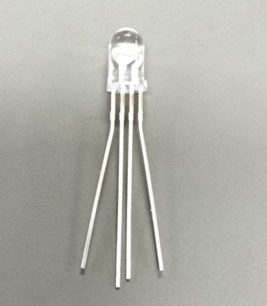
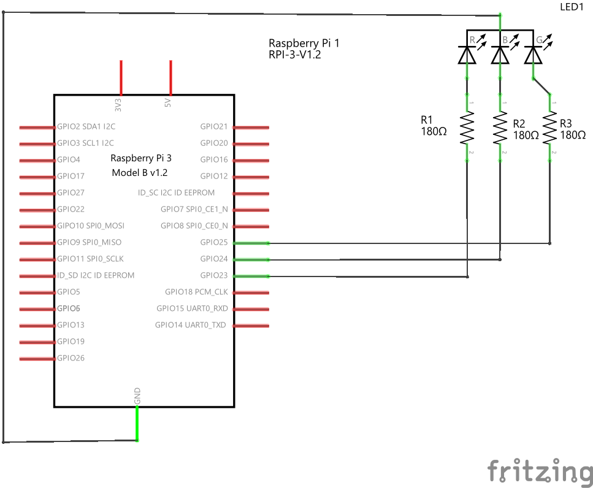
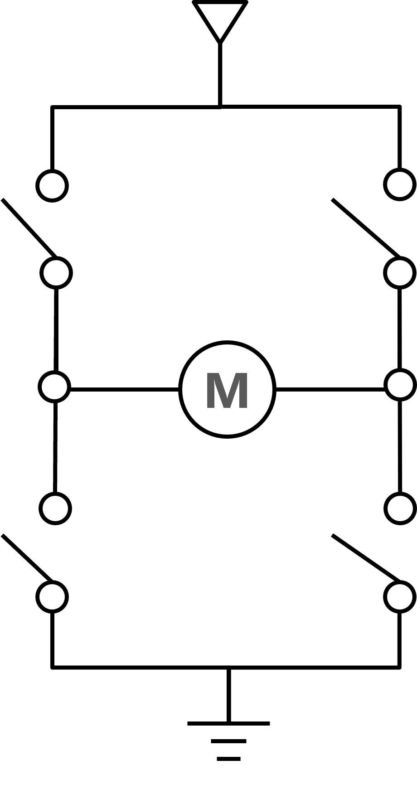
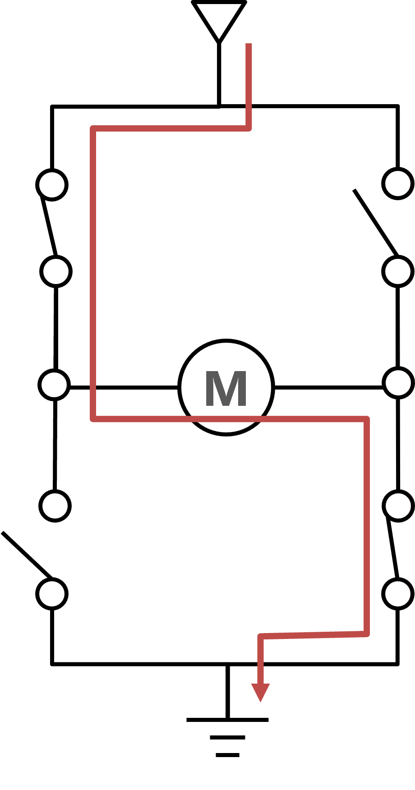
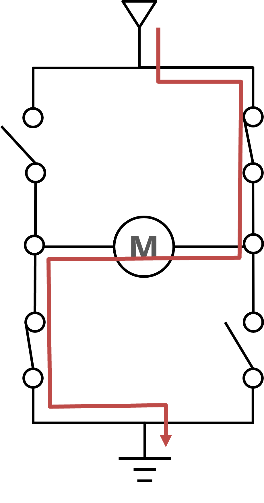
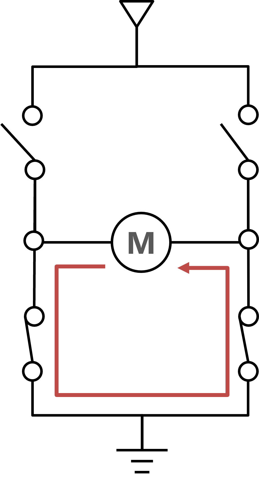
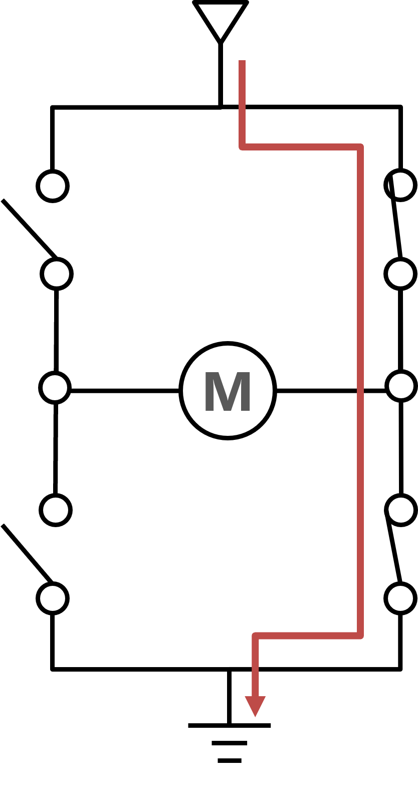
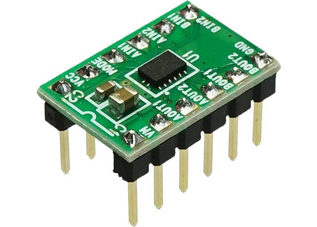
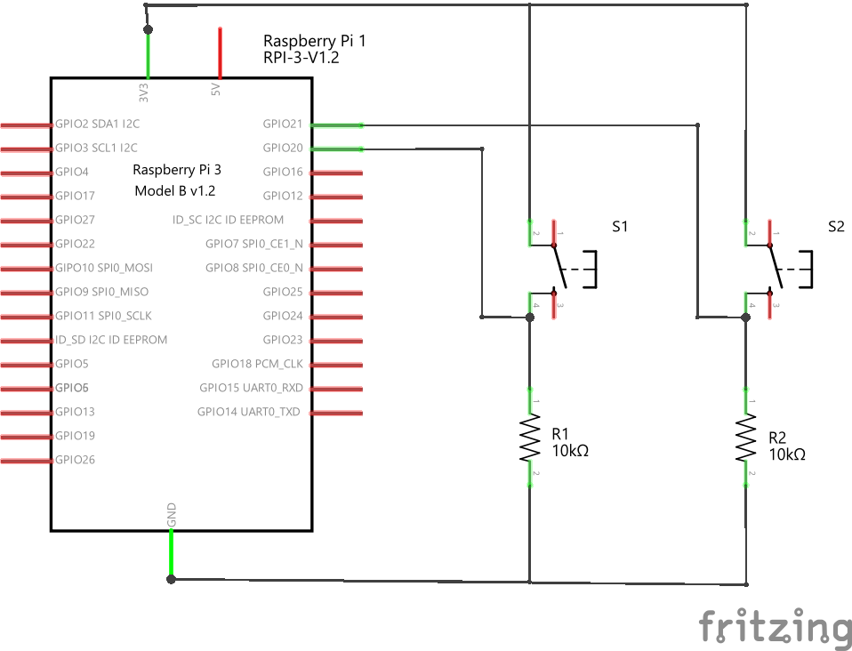

# RGB フルカラー LED を調光してみよう

(BCM モードで) GPIO 23, 24, 25 ピンにフルカラー LED を接続し、RGB それぞれの LED の明るさをだんだん明るくだんだん暗くなるようにプログラムしてみよう。

- RGB とはそれぞれ Red, Green, Blue の頭文字である。

フルカラー LED は、光の三原色に基づいて赤と緑と青それぞれ独立で点灯させてさまざまな色を出すようになっている。注意しなければいけないのは、各色ごとに順方向電圧 VF が異なるということである。

*Ref: OSTA5131A-R/PG/B データシート*

なので、(本来ならば) 各 LED に流れる電流を同じにするのであれば、各色ごとに制限抵抗の値を変更しなければならない。そういう背景があったうえで、ここでは同じ抵抗 180 Ω を３つ使って、Raspberry Pi から LED を調光してみようと思う。

## LED の足

ブレッドボードに差し込みやすいように、左右の足をラジオペンチで開いておこう。
一番足が長いのがカソードである。

左から順に
- 赤色
- カソード (GND)
- 青
- 緑

となっている。

<div style="text-align: center;">
    <br/>
    <b>すこし足を開いておこう</b>
</div>

## 回路を作る

以下のような回路を作る

<div style="text-align: center;">
    <br/>
</div>

## プログラムを書く

- GPIO23, GPIO24, GPIO25 用に PWM オブジェクト (PWM を扱うためのデータ型) を作る
- XXXXXX, YYYYYY, ZZZZZZ, WWWWWW のところは各自で当てはまる語句、数値を入れること

```python
import RPi.GPIO as GPIO         # RPi.GPIO モジュールを GPIO という名前で使う
from time import sleep          # time モジュールから sleep という関数を使う

GPIO.setmode(GPIO.BCM)         # BCM モードでピン番号を指定する

GPIO.setup(23, GPIO.OUT)        # 23 ピンを出力設定にする
GPIO.setup(24, GPIO.OUT)        # 24 ピンを出力設定にする
GPIO.setup(25, GPIO.OUT)        # 25 ピンを出力設定にする
red = GPIO.PWM(23, 50)          # 23 ピンに周波数 50Hz の PWM を設定
blue = GPIO.PWM(24, 50)         # 24 ピンに周波数 50Hz の PWM を設定
green = GPIO.PWM(25, 50)        # 25 ピンに周波数 50Hz の PWM を設定

red.start(0)
blue.start(0)
green.start(0)

duty = 0.0                      # デューティ比 0.0 ~ 100.0 の間を変化
change = 10                     # 変化量

try:
    while True:
        red.ChangeDutyCycle(XXXXXX)       # デューティー比を設定する  
        blue.ChangeDutyCycle(XXXXXX)
        YYYYYY.ChangeDutyCycle(XXXXX)
        sleep(0.1)                      # 100 ms やすむ

        # デューティ (明るさ) を変更
        duty += change
        if duty <= ZZZZZZ:     # 0 以下
            duty = 0
            change = -change
        elif duty >= WWWWWW:   # 100 以上
            duty = 100
            change = -change

except KeyboardInterrupt:           # ctrl-C で止めた
    pass                            # エラー処理を特にしない
red.stop()      # PWM 停止
blue.stop()     # PWM 停止
green.stop()     # PWM 停止
GPIO.cleanup()  # GPIO (汎用ピン) の後処理をする
```

# 課題

- 上のプログラムを改造して、３つの LED それぞれの duty を **独立で** 0.0 ~ 100.0 の間でランダムに変化させ、さまざまな色が発色できるように改造して kadai10.py というファイル名で提出してください。

- **ヒント：random モジュールを使う**  
    random モジュールを使うと **乱数** を作り出すことができます。乱数とはでたらめな数 (の並び)、ということです。決められた手順 (プログラム) を実行するのは得意なコンピュータですが、それとは正反対の「でたらめ」を扱うのはもっとも苦手な分野です。そのため、実は乱数を作るというのは情報科学の大事な一分野で、さまざまな方法が研究・提案されています。

    random モジュールのマニュアル: **https://docs.python.org/ja/3/library/random.html**
    
    ```python
    import random       # random モジュールを使えるようにする
    
    print(random.random())          # 0.0 以上 1.0 未満の乱数を返す
    # 0.10652963871442156
    print(random.randint(0, 100))   # a <= N <= b であるような整数を返す
    # 83
    print(random.randint(0, 100))
    # 52
    ```

# PWM モーター制御

プラモデルなどに使われる DC モーターを PWM で動かしてみる
目指すゴールは

- 加速ボタンを押すと加速
- 減速ボタンを押すと減速

である。

## マイコン (Raspberry Pi や Arduino) でモーターを動かすために注意すること

- モーターの消費電力はでかい
    これから使うプラモ用のモーターは 3V 供給 (電池 2 本分) したとき約 250 mA の電力を必要とする。
    Raspberry Pi や Arduino の GPIO ピンから出力できる電流値は 20mA 程度なので (そのため LED を抵抗なしでつないでも問題なかった)、直接モーターをつないでも、動かすことはできないし、パワーがたりなさすぎる。

    しかも、人間と同じように、どうにか回してやろうとマイコンががんばりすぎるため、マイコンを破壊する可能性がある。

### モータードライバ

そこでモータードライバという別の回路を利用してモーターに必要な電力はそちらから供給する。マイコンはそのモータードライバを制御してモーターを動かす。

<div style="text-align: center;">
    <br/>
    <br/>
    <br/>
</div>

**モータードライバ**は、マイコンからの信号をモーターが理解できる電流や電圧に変換し、モーターを駆動するためのものである。

モータードライバを使用することで、以下のような**利点**が生まれる。

* **マイコンの負荷軽減**: マイコンは弱い出力なので、モータードライバを使ってモーターを駆動することで、マイコンの負荷を軽減できる。
* **モーターの保護**: モータードライバには、過電流保護、過熱保護、短絡保護などの機能が搭載されており、モーターを保護することができる。
* **複雑な制御の容易化**: モータードライバには、速度制御、方向制御、ブレーキ制御などの機能が搭載されており、複雑なモーター制御を容易にすることができる。

## モータードライバの種類

モータードライバには、以下のような種類がある。

* **Hブリッジ型**: モーターの正転・逆転とブレーキ制御が可能です。最も一般的なタイプ
* **ハーフHブリッジ型**: モーターの正転・逆転制御のみ可能です。Hブリッジ型よりも小型で安価
* **サーボモーター用**: サーボモーターを制御するためのドライバです。位置制御や角度制御などが可能

H ブリッジ型について後ほど説明します。

## モータードライバの選び方

モータードライバを選ぶ際には、以下の点に注意する必要がある

* **使用しているモーター**: モータードライバは、使用するモーターの種類に対応している必要がある
* **必要な機能**: 必要最低限の機能に加え、速度制御や方向制御、ブレーキ制御などの必要な機能を備えているかどうか確認する必要がある
* **電流容量**: モータードライバの電流容量は、使用するモーターの最大電流よりも大きいものを選ぶ必要がある
* **パッケージ**: モータードライバには、DIPパッケージ、SOPパッケージ、SMDパッケージなどがある。使用環境に合ったパッケージを選ぶ必要がある

# H ブリッジ型


- H ブリッジ回路は 4 つのスイッチを組み合わせたモーターを制御するための回路構成である。
- スイッチの組み合わせにより 4 種類の制御が可能になる。

<div style="text-align: center;">
    <br/>
    H ブリッジ回路
</div>

## 正転させたいとき

- 図のようにスイッチを入れる

<div style="text-align: center;">
    <br/>
</div>


## 逆転させたいとき

- 図のようにスイッチを入れる

<div style="text-align: center;">
    <br/>
</div>

## 停止　
- 停止といってもモーターに勢いがあればモーターは惰性で回転する  
    自転車でいえば、漕いでいないし、ブレーキもかけてない状態

<div style="text-align: center;">
    <br/>
</div>

## ブレーキ　

- モーターを GND でショート (両端を GND) にすると、モーターの回転エネルギーが電気エネルギーに変換され、それがブレーキとなる (回生ブレーキ)
- 自転車でいえば、ブレーキをかけた状態

<div style="text-align: center;">
    <br/>
</div>

## 禁止！！！！

- 下のようにすると、電源をショートしてしまう
- このとき流れる電流を**「貫通電流」**という
- モータードライバではこの状態は選べないようになっているか、「禁止入力」とマニュアルに書いてある

<div style="text-align: center;">
    <br/>
</div>

# モーターのノイズ対策

- DC モーターはつぎつぎと電磁石のスイッチを切り替えて回転させるため、そのスイッチが切り替わるときにノイズが発生する  
    ⇒ Raspberry Pi に悪影響を及ぼす
- コンデンサを利用してノイズを逃がす
    ⇒ このような目的で使用するコンデンサを特に **バイパスコンデンサ** という

# モータードライバ DRV8835

今回は DC モータードライバ DRV8835 という基盤を利用する。DRV8835 は 2 チャンネル (２つのモーターを制御できる) のモーダードライバだが、ここでは 1 チャンネル (A 側) のみ使う。

*Ref: [DRV8835 マニュアル](https://akizukidenshi.com/goodsaffix/AE-DRV8835-S_20210526.pdf)*

## ピン配置

基盤の各ピンの機能は以下の通り (マニュアルにも記述あり)：

| ピン番号 | ピン名称 | 機能 |
|---|---|---|
| 1 | VM | モータ電源 |
| 2 | AOUT1 | A出力１ |
| 3 | AOUT2 | A出力２ |
| 4 | BOUT1 | Ｂ出力１ |
| 5 | BOUT2 | Ｂ出力２ |
| 6 | GND | グランド |
| 7 | BIN1 | Ｂ入力１/BPHASE |
| 8 | BIN2 | Ｂ入力２/BENBL |
| 9 | AIN1 | Ａ入力１/APHASE |
| 10 | AIN2 | Ａ入力２/AENBL |
| 11 | MODE | モード設定 |
| 12 | VCC | ロジック電源 |

※ 注意：ご使用時、基板は熱くなります。十分な放熱をお願いいたします。

## 動作モード  

|MODE | xIN1 | xIN2 | xOUT1 | xOUT2 | 動作 |
| --- | --- | --- | --- | --- | --- |
| IN/IN モード (MODE = 0) | 0 | 0 | HiZ | HiZ | 空転 |
|  | 0 | 1 | L | H | 逆転 |
|  | 1 | 0 | H | L | 正転 |
|  | 1 | 1 | L | L | ブレーキ |
| PASE/ENABLE モード (MODE = 1) | 1 | 0 | X | L | L | ブレーキ |
|  | 1 | 1 | 1 | L | H | 逆転 |
|  | 1 | 1 | 0 | H | L | 正転 |

<div style="text-align: center;">
    
</div>

# 課題 1

- 0.01 uF のセラミックコンデンサ (103) をモーターの両端間にはんだ付けします
- あわせて接続用のコードもはんだ付けしよう

# 課題 2

1. 以下のように接続したとき、動作モードのどこの状態か確認せよ。  
    - 1 (VM) にモーター用の電池ボックスの電源に (RasPi の電源は使わない)  
    - 2, 3 (AOUT1, AOUT2) をモーターに接続  
    - 6 (GND) は RasPi と共通  
    - 9 を RasPi の GPIO 25 に接続  
    - 10, 11 (MODE) を GND に接続  
    - 12 (Vcc) は RasPi の電源 3.3V に接続  

1. 1の回路の状態で、GPIO 25 を HIGH にするプログラムを記述せよ。  
    - いきなり全力で回りだすので注意すること！！

1. 前回やった GPIO の入力を参照し、以下のような、２入力スイッチの回路を作成せよ。

<div style="text-align: center;">
    
</div>

1. 1 と 3 の回路を組み合わせて、PWM 制御を用いて (どちらかのボタンを加速、減速に割り当て)  
    - 加速ボタンを押すと加速
    - 減速ボタンを押すと減速  

するようにモーターをコントロールするプログラムを作成せよ。

3. 回路図 (手書きでもパワーポイントでも可)、実装した回路の写真、プログラムをレポートとしてまとめる。  
  レポートには以下の点を盛り込むこと：  
    - 回路やプログラムで工夫した点
    - 疑問点
    - 気づいたこと

など
