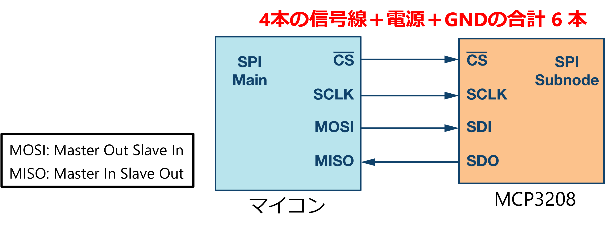

# A/D 変換

A/D 変換 (Analog-to-Digital Conversion) は、連続的な値を持つアナログ信号を、0 と 1 の有限個の値で表されるデジタル信号に変換する処理ある。

### サンプリング (標本化)

サンプリングとは、A/D 変換の第一段階は、アナログ信号を一定間隔で区切ることである。
サンプリング間隔は、**サンプリング周波数** と呼ばれ、単位は Hz (ヘルツ) で表される。
サンプリング周波数が低いほど、アナログ信号の形状を正確に捉えることができません。

### 量子化

サンプリングされた各時点のアナログ値は、有限個の量子化レベルに**量子化**される。
量子化レベルは、通常は2のべき乗個の値が使用される。
量子化レベルの個数は、**分解能** と呼ばれ、単位はビット数で表される。
分解能が高いほど、アナログ信号をより詳細に表現することができる。

### 符号化

量子化された各時点の値は、0 と 1 のビット列で**符号化**される。
符号化方式には、**2進符号**、**グレイ符号**、**BCD符号** などがある。

### A/D 変換の応用例

A/D 変換は、様々な分野で広く使用されています。

* **音響機器:** マイクロフォンで受け取った音声をデジタル信号に変換し、CD や MP3 などのデジタル音源を作成する。
* **画像処理:** デジタルカメラで光を捉えた画像をデジタル信号に変換し、写真や動画を記録する。
* **計測器:** 温度計や圧力計などの計測器で測定した値をデジタル信号に変換し、数値で表示する。
* **通信:** 電話やインターネットなどの通信において、音声やデータをデジタル信号に変換して伝送する。

A/D 変換は、アナログ信号とデジタル信号の橋渡し役として、現代社会の様々な分野で重要な役割を果たしている。

# RaspberryPi で A/D 変換

**しかし！なんということでしょう。残念ながら Raspberry Pi は、A/D 変換器は搭載していない！！**　マイコン制御でやったとおり Arduino にはあるのにね。残念です。

さて、そうすると Raspberry Pi で A/D 変換を利用しようと思うと、A/D 変換をやってくれる別の部品おお世話にならないといけない。

     
    <strong>Raspberry Pi にはこの機能がない</strong>

## A/D 変換モジュール

- Raspberry Pi に変わって A/D 変換をする IC
- Raspberry Pi とは SPI 通信（という通信方法）でやりとりする

     

## A/D 変換モジュール MCP3208

- [MCP3208 データシート](https://akizukidenshi.com/goodsaffix/MCP3208.pdf)
- 8ch (8 個のアナログ量が扱える)
- 12bit A/D コンバータ (**分解能** 12bit)
- SPI 通信 (I2C と似た方法)

質問：12 bit で表現できる値とは０(ゼロ)からいくつまでですか？関数電卓を用いて答えよ。

     
    <strong>MCP3208</strong>

## SPI (Serial Peripheral Interface) 通信

- マイコンとその周辺 IC で使用されるネットワークインターフェース  
    Serial ⇒ 順番に流れる  
    Peripheral ⇒ 周辺機器用の  
    Interface ⇒ インターフェース
- センサー、AD コンバーター、DA コンバーター、メモリーなど周辺機器とマイコンの接続に広く採用されている

     
    <strong>MCP3208</strong>

