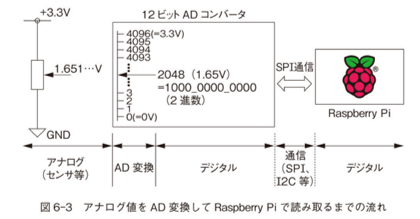
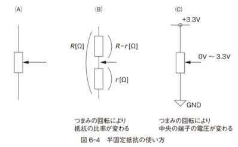
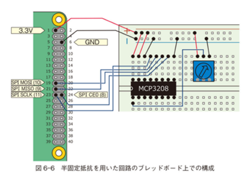
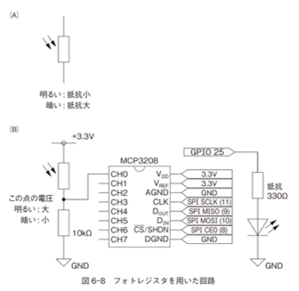
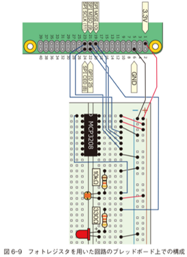

# A/D 変換

A/D 変換 (Analog-to-Digital Conversion) は、連続的な値を持つアナログ信号を、0 と 1 の有限個の値で表されるデジタル信号に変換する処理ある。

### サンプリング (標本化)

サンプリングとは、A/D 変換の第一段階は、アナログ信号を一定間隔で区切ることである。
サンプリング間隔は、**サンプリング周波数** と呼ばれ、単位は Hz (ヘルツ) で表される。
サンプリング周波数が低いほど、アナログ信号の形状を正確に捉えることができません。

### 量子化

サンプリングされた各時点のアナログ値は、有限個の量子化レベルに**量子化**される。
量子化レベルは、通常は2のべき乗個の値が使用される。
量子化レベルの個数は、**分解能** と呼ばれ、単位はビット数で表される。
分解能が高いほど、アナログ信号をより詳細に表現することができる。

### 符号化

量子化された各時点の値は、0 と 1 のビット列で**符号化**される。
符号化方式には、**2進符号**、**グレイ符号**、**BCD符号** などがある。

### A/D 変換の応用例

A/D 変換は、様々な分野で広く使用されています。

* **音響機器:** マイクロフォンで受け取った音声をデジタル信号に変換し、CD や MP3 などのデジタル音源を作成する。
* **画像処理:** デジタルカメラで光を捉えた画像をデジタル信号に変換し、写真や動画を記録する。
* **計測器:** 温度計や圧力計などの計測器で測定した値をデジタル信号に変換し、数値で表示する。
* **通信:** 電話やインターネットなどの通信において、音声やデータをデジタル信号に変換して伝送する。

A/D 変換は、アナログ信号とデジタル信号の橋渡し役として、現代社会の様々な分野で重要な役割を果たしている。

# RaspberryPi で A/D 変換

<span style="color:red;">**しかし！なんということでしょう。残念ながら Raspberry Pi は、A/D 変換器は搭載していない！！**</span>　マイコン制御でやったとおり Arduino にはあるのにね。残念です。

さて、そうすると Raspberry Pi で A/D 変換を利用しようと思うと、A/D 変換をやってくれる別の部品おお世話にならないといけない。

<center>
<div style="text-align: center;">
    <br/>
    Raspberry Pi にはこの機能がない
</div>
</center>

## A/D 変換モジュール

- Raspberry Pi に変わって A/D 変換をする IC
- Raspberry Pi とは SPI 通信（という通信方法）でやりとりする

<center>
<div style="text-align: center;">
    <br/>
</div>

<div style="text-align: center;">
    <br/>
</div>
</center>

## A/D 変換モジュール MCP3208

- [MCP3208 データシート](https://akizukidenshi.com/goodsaffix/MCP3208.pdf)
- 8ch (8 個のアナログ量が扱える)
- 12bit A/D コンバータ (**分解能** 12bit)
- SPI 通信 (I2C と似た方法)

課題：
- 12 bit で表現できる値とは０(ゼロ)からいくつまでですか？
- 1bit の変化 (たとえば 0000_0000_0000 が 0000_0000_0001 になった) は何 V の変化に対応しますか？

<div style="text-align: center;">
    <br/>
    <strong>MCP3208</strong>
</div>


# 可変抵抗を用いた回路

まずは Arduino と同じように可変抵抗の両端に電圧をかけ、抵抗値を変化させて電圧値を読み取るプログラムを作成してみよう。可変抵抗は AD 変換のサンプルとしてわかりやすいので。

<div style="text-align: center;">
    <br/>
</div>

## 回路

回路は図のようになる。ここでは CH0 にアナログ電圧が入力されるものとする。この AD 変換器は 8CH あるので、８つのアナログ値を読み取ることができる。
AD コンバーターの右画はは Raspberry Pi の各ピンに接続する。 SPI 通信で用いるピンは決まっている。

<div style="text-align: center;">
    <br/>
</div>

## プログラム

突然長くなったと感じるかもしれないが、最初のうちはこれをすべて理解する必要はない。まずは実行させて、可変抵抗にかかる電圧値が変化することを確認しよう。

### 初期化処理

SPICLK とうい変数に 11 という数を格納している。つぎに GPIO.setup で出力ピンに設定している。
これは GPIO.setup(11, GPIO.OUT) と書いても同じだが、２回に分けているのはなぜだろうか。
それは SPICLK という変数を使ったほうが、命令の意味が明確になるからである。SPICLK という変数名から「あ、これは SPI 通信用に使うのだな」ということがわかる。

適切な変数名をつけると、プログラムがわかりやすくなる。

### while ループ

メイン処理は while ループであるが、肝心の処理は

>inputVal0 = readadc(0, SPICLK, SPIMOSI, SPIMISO, SPICS)
>print(inputVal0)

の２行だけである。inputVal0 = readadc(0, SPICLK, SPIMOSI, SPIMISO, SPICS) で readdac という関数を呼び出している。これは「Read AD Conveter」の頭文字からこのような関数名にしている。関数名や変数名はプログラマが自由に決めてよいが、このように内容を示す適切な名前をつけるとプログラムが理解しやすくなる。

プログラミングを学び始めたころは、「変数 a」や「関数 kansuu」などの名前をつけがちだが、それはよくない。

このプログラムの大半を占める readdac() 関数だが、これは必要になったら中身を理解するとよい。Arduino で触れたビットのシフト演算や OR 演算, AND 演算などが含まれているのは、同じようにかけるのだなと思ってほしい。

```python
SPICLK = 11
GPIO.setup(SPICLK, GPIO.OUT)
```

```python
import RPi.GPIO as GPIO
from time import sleep

# MCP3208からSPI通信で12ビットのデジタル値を取得。0から7の8チャンネル使用可
def readadc(adcnum, clockpin, mosipin, misopin, cspin):
    if adcnum > 7 or adcnum < 0:
        return -1
    GPIO.output(cspin, GPIO.HIGH)
    GPIO.output(clockpin, GPIO.LOW)
    GPIO.output(cspin, GPIO.LOW)

    commandout = adcnum
    commandout |= 0x18  # スタートビット＋シングルエンドビット
    commandout <<= 3    # LSBから8ビット目を送信するようにする
    for i in range(5):
        # LSBから数えて8ビット目から4ビット目までを送信
        if commandout & 0x80:
            GPIO.output(mosipin, GPIO.HIGH)
        else:
            GPIO.output(mosipin, GPIO.LOW)
        commandout <<= 1
        GPIO.output(clockpin, GPIO.HIGH)
        GPIO.output(clockpin, GPIO.LOW)
    adcout = 0
    # 13ビット読む（ヌルビット＋12ビットデータ）
    for i in range(13):
        GPIO.output(clockpin, GPIO.HIGH)
        GPIO.output(clockpin, GPIO.LOW)
        adcout <<= 1
        if i>0 and GPIO.input(misopin)==GPIO.HIGH:
            adcout |= 0x1
    GPIO.output(cspin, GPIO.HIGH)
    return adcout

GPIO.setmode(GPIO.BCM)
# ピンの名前を変数として定義
SPICLK = 11
SPIMOSI = 10
SPIMISO = 9
SPICS = 8
# SPI通信用の入出力を定義
GPIO.setup(SPICLK, GPIO.OUT)
GPIO.setup(SPIMOSI, GPIO.OUT)
GPIO.setup(SPIMISO, GPIO.IN)
GPIO.setup(SPICS, GPIO.OUT)

try:
    while True:
        inputVal0 = readadc(0, SPICLK, SPIMOSI, SPIMISO, SPICS)
        print(inputVal0)
        sleep(0.2)

except KeyboardInterrupt:
    pass

GPIO.cleanup()
```

# CdS セルをつかった回路

こちらも Arduino のときと同じように、素子を可変抵抗から CdS セルに変更して、周辺の明るさを感知するようにしてみよう。

AD コンバーターがあればアナログセンサを取り替えて、プログラムを少し変更するだけでいろいろなセンサーからの値が読み取れるようになる。

**抵抗値は Arduino のときより小さいじ 1.1MΩ を使用する**
(前回、暗くしてもあまり値が小さくならなかったのでもう少し感度をあげたい)

<div style="text-align: center;">
    <br/>
</div>

ブレッドボード上に回路を構成すると次のようになる。
可変抵抗との変更点として、Arduino のときと同様に暗くなったら LED をつけるため、LED を追加してある。

<div style="text-align: center;">
    <br/>
</div>

## 課題

- 可変抵抗のプログラムを元に明るさを検知し、暗ければ LED を点灯し、明るければ LED を消灯するようにプログラムを作成してください。
- できたら、先生に申告し、kadai11.py として提出してください。


# AD コンバータ MCP3208 を引き抜くときの注意

MCP3208 には 16 本の足があるので、ブレッドボードから引き抜くとき、足が曲がらないように真上に引き抜かなければいけない。斜めにすると足が折れてしまう。

(ということで今回はソケットにはめてから渡しています)

■ 先生はこうやっている  
- ブレッドボードの真ん中のみぞに、マイナスドライバーをとおす  
    （おすすめは竹串です、しなって外しやすい）
- 片側からだけでなく、両側からすこしづつ浮かす

<div style="text-align: center;">
    <br/>
</div>
