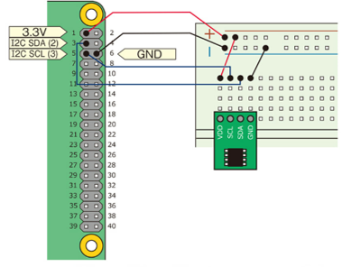
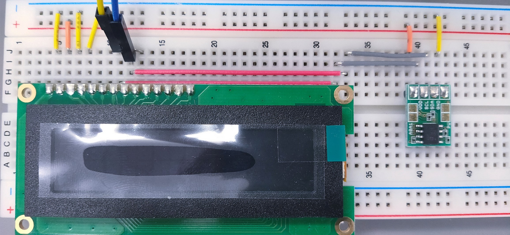

# I2C デバイスの利用

Arduino で I2C という通信方法があることを学んだ。I2C は標準となっている通信方式のひとつなので、もちろん Raspberry Pi でも利用することができる。

ここでは Rasberry Pi をつかって I2C を利用する方法を紹介する。

## Rasberry Pi の準備

Raspberry Pi で I2C を利用できるようにするには以下のように実行する
(初めて I2C を使うときに1回だけやればよい)

1. Raspberry Pi のラズベリーアイコンから「設定 (Preferences)」
⇒ 「Raspberry Pi の設定(Raspberry Pi Configuration)」
2. インターフェース (Interfaces)」
3. I2C ⇒ 有効 (Enabled)
4. OK をクリック
5. sudo apt-get install i2c-tools  
   (I2C 用のコマンドがインストールされる)
6. sudo apt-get install python-smbus  
   (Python で I2C を扱うためのライブラリがインストールされる)

1~4 は、ターミナル上で、raspi-config というコマンドを実行してもできる:

> sudo raspi-config


## ADT7410 温度センサーモジュールの利用

図を参考に Arduino のときとおなじように回路を組んでみよう。

<div style="text-align: center;">
    <br/>
    <strong>ブレッドボード上での構成</strong>
</div>

## i2cdetect

Raspberry Pi にも I2C ネットワークに何がつながっているかを報告してくれる i2cdetect という命令がある。ターミナルを開いて、以下のように実行する：

```shell
i2cdetect -y 1
```

温度センサーが正しく認識されていれば 48 という数値が表示される。これは温度センサーのスレーブアドレスである。

## プログラム

Thonny の下のところに温度を表示させるプログラムは次のようになる。
Arduino のときとどこが同じだろうか。また、どこが違うだろうか。注意して確認してみてほしい。

```python
import smbus
from time import sleep

def read_adt7410():
    word_data = bus.read_word_data(address_adt7410, register_adt7410)
    data = (word_data & 0xff00)>>8 | (word_data & 0xff)<<8
    data = data>>3 # 13ビットデータ
    if data & 0x1000 == 0:  # 温度が正または0の場合
        temperature = data*0.0625
    else: # 温度が負の場合、 絶対値を取ってからマイナスをかける
        temperature = ( (~data & 0x1fff) + 1) *-0.0625
    return temperature

bus = smbus.SMBus(1)
address_adt7410 = 0x48
register_adt7410 = 0x00

try:
    while True:
        inputValue = read_adt7410()
        print(inputValue)
        sleep(0.5)

except KeyboardInterrupt:
    pass
```

## 有機 LED を使う

Arduino のときは 1 インチの ディスプレイを使った。今回はもうすこし画面の広いディスプレイを使ってみよう。

<div style="text-align: center;">
    <br/>
    <strong>有機 EL ディスプレイ</strong>
</div>

この OLE ディスプレイは下のようなピン配置になっている。


### ブレッドボードでの配線

ブレッドボード上でこのように配線する：

1. GND
2. 3.3V
3. GND
4. GND
5. 不使用
6. 不使用
7. SCL → GPIO3
8. SDA → GPIO2
9. 8 と接続

<div style="text-align: center;">
    <br/>
    <strong>有機 EL ディスプレイピンアサイン</strong>
</div>

### 配線が正しいか確認

回路ができたら **i2cdetect -y 1** で確認しよう。"3c" が表示されたら正しい。
3c が表示されない場合は回路が間違っている可能性が高い。


### プログラム

```python
import smbus
from time import sleep

#
# ディスプレイ用コマンド
#
def ole_write(addr, s):
    """
    文字列を表示する
    addr I2C スレーブアドレス
    s 文字列
    """
    bus.write_i2c_block_data(addr , 0x40 , list(bytes(s , "utf 8")))
    sleep(0.01)

#
# ディスプレイ用コマンド
#
def ole_command(addr, command):
    """
    ディスプレイの命令を実行する
    addr I2C スレーブアドレス
    command 命令
    """
    bus.write_byte_data(addr , 0x00, command)
    sleep(0.01)

#
# ディスプレイ用コマンド
#
def ole_move(addr , pos):
    """
    指定された場所にカーソルを移動する
    addr    I2C スレーブアドレス
    pos     0x00,0  (1 行目の左端) ~ 0x0f,15 (1 行目の右端)
            0x20,32 (2 行目の左端) ~ 0x2f,47 (2 行目の右端)
    """
    ole_command(addr, pos + 0x80)
#
# ここから動き出す
#
bus = smbus.SMBus(1)        # I2C のチャンネル 1 を使う / i2cdetect -y 1 の 1 と同じ
addr = 0x3c                 # ディスプレイのアドレス

CLEAR  = 0x01
HOME   = 0x02
RESET  = 0x20
DISPON = 0x0c

ole_command(addr, CLEAR)    # 画面消去
ole_command(addr, HOME)     # カーソルを左上に移動
ole_command(addr, RESET)    # リセット
ole_command(addr, DISPON)   # ディスプレイ ON

ole_move(addr, 0x00)        # 一行目、左端に移動
ole_write(addr, "Hello!!")  # Hello!! と表示

ole_move(addr, 0x20)            # 二行目、左端に移動
ole_write(addr, "Raspberry Pi") # Raspberry Pi と表示
```

### 応用

- "Rasberry Pi" の文字列を、自分の名前に変えてみよう
- 漢字は出せません  
    [I2C 有機 EL ディスプレイマニュアル]("https://akizukidenshi.com/goodsaffix/so1602awwb-uc-wb-u_akizuki_manu.pdf") のリセット時の「キャラクタジェネレータの状態」を参照するとカタカナは出せます。チャレンジしてみてください。
    
    ```py
    # 現在のカーソルの位置にアイと出す
    bus.write_i2c_block_data(addr , 0x40 , b"\xa1\xa2")
    ```

# 時計を作ってみる

Raspberry Pi は時計を持っていて、Python から時刻を取得することができる。
いくつか方法があるが、datetime モジュールを使うのが簡単。

```py
import datetime

now = str(datetime.datetime.now())  # 文字列にする
print(now)
```

- datetime モジュールを使って、ディスプレイに時刻を表示させてください
- datetime モジュールをそのまま使うと、ミリ秒、マイクロ秒まで表示されてしまう  
  秒まで (または自分の好きな粒度)　の範囲に表示を切り捨てて表示させてください
  ⇒ ヒント：
    上の例では、now は文字列型である。文字列型にはスライスが使える  
    Python 教科書 pp.96 スライス*　参照
- ole_wirte() 関数は自動的に右側にずれていくが、左に戻ることはできないので、戻すときは ole_move() 関数を使って、自分の書きたい位置に戻してあげる必要がある

<br/>

# 温度計を作ってみる

Arduino とおなじように、これまで実験した 2 つのデバイス (温度センサーとディスプレイ) を組み合わせて温度計を作成してみよう。

<div style="text-align: center;">
  <br/>
  ADT7410 は Raspberry Pi でも使える
</div>

## 回路

回路は Arduino とおなじように、電源, GND, SLC, SDA をラズパイと接続する。以下を見なくてもできる人は自力でがんばってみる。

<br/>
<br/>

1. 念のため RaspberryPi をシャットダウンし、電源 OFF
1. ディスプレイの右横に温度センサーを配置
1. センサーの電源を ディスプレと同じ 3.3V へ
1. センサーの GND を ディスプレと同じ GND へ
1. ディスプレイの 7 番 (SLC) をセンサーの SLC へ
1. ディスプレイの 8 番 (SDA) をセンサーの SDA へ

<div style="text-align: center;">
  <br/>
  ブレッドボードでの配線
</div>

## プログラム

- ディスプレイに現在の時刻と温度を表示するプログラムを作成し、完成したら先生に申告、kadai12.py として提出してください
- 画面のレイアウトは自由とします
