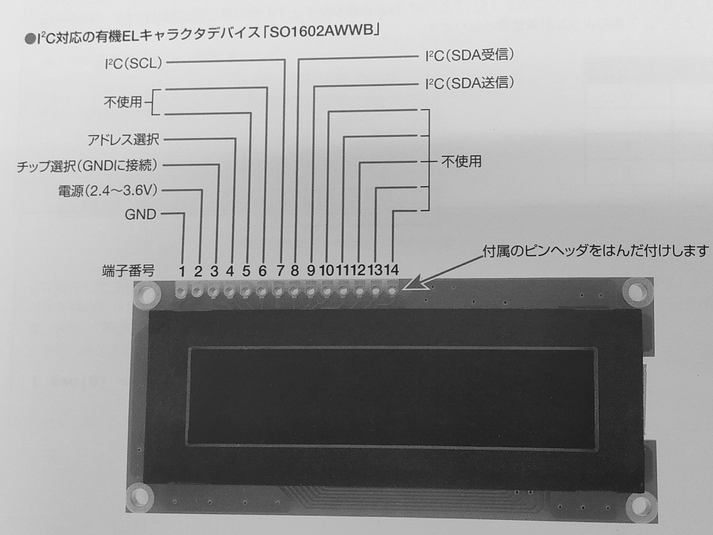

# I2C デバイスの利用

Arduino で I2C という通信方法があることを学んだ。I2C は標準となっている通信方式のひとつなので、もちろん Raspberry Pi でも利用することができる。

ここでは Rasberry Pi をつかって I2C を利用する方法を紹介する。

## Rasberry Pi の準備

Raspberry Pi で I2C を利用できるようにするには以下のように実行する
(初めて I2C を使うときに1回だけやればよい)

1. Raspberry Pi のラズベリーアイコンから「設定 (Preferences)」
⇒ 「Raspberry Pi の設定(Raspberry Pi Configuration)」
2. インターフェース (Interfaces)」
3. I2C ⇒ 有効 (Enabled)
4. OK をクリック
5. sudo apt-get install i2c-tools  
   (I2C 用のコマンドがインストールされる)
6. sudo apt-get install python-smbus  
   (Python で I2C を扱うためのライブラリがインストールされる)

1~4 は、ターミナル上で、raspi-config というコマンドを実行してもできる:

> sudo raspi-config


## ADT7410 温度センサーモジュールの利用

図を参考に Arduino のときとおなじように回路を組んでみよう。

<div style="text-align: center;">
    <br/>
    <strong>ブレッドボード上での構成</strong>
</div>

## i2cdetect

Raspberry Pi にも I2C ネットワークに何がつながっているかを報告してくれる i2cdetect という命令がある。ターミナルを開いて、以下のように実行する：

```shell
i2cdetect -y 1
```

温度センサーが正しく認識されていれば 48 という数値が表示される。これは温度センサーのスレーブアドレスである。

## プログラム

プログラムは次のようになる。Arduino のときとどこが同じだろうか。
また、どこが違うだろうか。

```python
import smbus
from time import sleep

def read_adt7410():
    word_data = bus.read_word_data(address_adt7410, register_adt7410)
    data = (word_data & 0xff00)>>8 | (word_data & 0xff)<<8
    data = data>>3 # 13ビットデータ
    if data & 0x1000 == 0:  # 温度が正または0の場合
        temperature = data*0.0625
    else: # 温度が負の場合、 絶対値を取ってからマイナスをかける
        temperature = ( (~data & 0x1fff) + 1) *-0.0625
    return temperature

bus = smbus.SMBus(1)
address_adt7410 = 0x48
register_adt7410 = 0x00

try:
    while True:
        inputValue = read_adt7410()
        print(inputValue)
        sleep(0.5)

except KeyboardInterrupt:
    pass
```

## 有機 LED を使う

Arduino のときは 1 インチの ディスプレイを使った。今回はもうすこし画面の広いディスプレイを使ってみよう。

<div style="text-align: center;">
    <br/>
    <strong>有機 EL ディスプレイ</strong>
</div>

この OLE ディスプレイは下のようなピン配置になっている。

<div style="text-align: center;">
    <br/>
    <strong>有機 EL ディスプレイピンアサイン</strong>
</div>

ブレッドボード上でこのように配線する：

1. GND
2. 3.3V
3. GND
4. GND
5. N.C.
6. N.C.
7. SCL → GPIO3
8. SDA → GPIO2
9. 8 と接続

回路ができたら **i2cdetect -y 1** で確認しよう。"3c" が表示されたら正しい。

```python
import smbus
from time import sleep

def ole_write(addr, s):
    """
    文字列を表示する
    addr I2C スレーブアドレス
    s 文字列
    """
    bus.write_i2c_block_data(addr , 0x40 , list(bytes(s , "utf 8")))
    sleep(0.01)

def ole_command(addr, command):
    """
    ディスプレイの命令を実行する
    addr I2C スレーブアドレス
    command 命令
    """
    bus.write_byte_data(addr , 0x00, command)
    sleep(0.01)

def ole_move(addr , pos):
    """
    指定された場所にカーソルを移動する
    addr    I2C スレーブアドレス
    pos     0x00 (1 行目、左端 ) ~ 0x0f (1 行目、右端
            0x20 (2 行目、左端 ) ~ 0x2f (2 行目、右端
    """
    ole_command(addr, pos + 0x80)
#
# ここから動き出す
#
bus = smbus.SMBus(1)        # I2C の 1 チャンネルを使う
addr = 0x3c                 # スレーブアドレス (通信相手、ディスプレイ)

CLEAR  = 0x01
HOME   = 0x02
RESET  = 0x20
DISPON = 0x0c

ole_command(addr, CLEAR)    # 画面消去
ole_command(addr, HOME)     # カーソルを左上に移動
ole_command(addr, RESET)    # リセット
ole_command(addr, DISPON)   # ディスプレイ ON

ole_move(addr, 0x00)        # 一行目、左端に移動
ole_write(addr, "Hello!!")  # Hello!! と表示

ole_move(addr, 0x20)            # 二行目、左端に移動
ole_write(addr, "Raspberry Pi") # Raspberry Pi と表示
```

## 温度計をつくってみる

これまで実験した 2 つのデバイス (温度センサーとディスプレイ) を使って温度計を作成してみよう。

