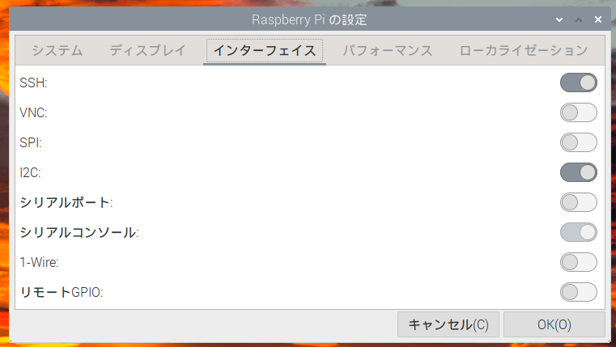
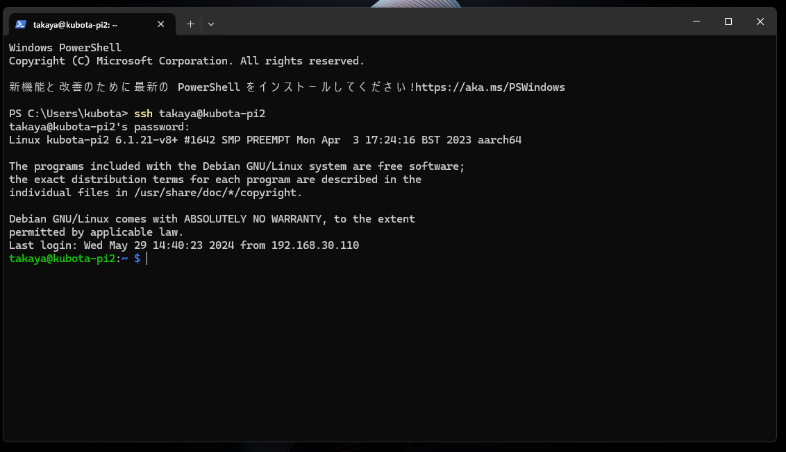
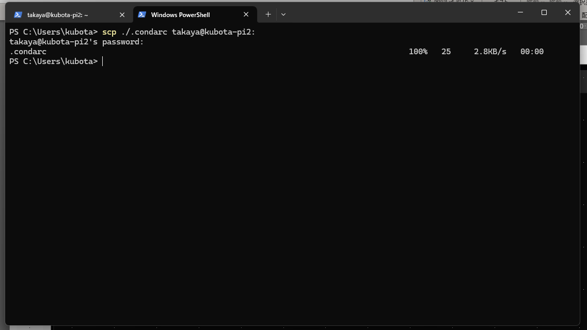
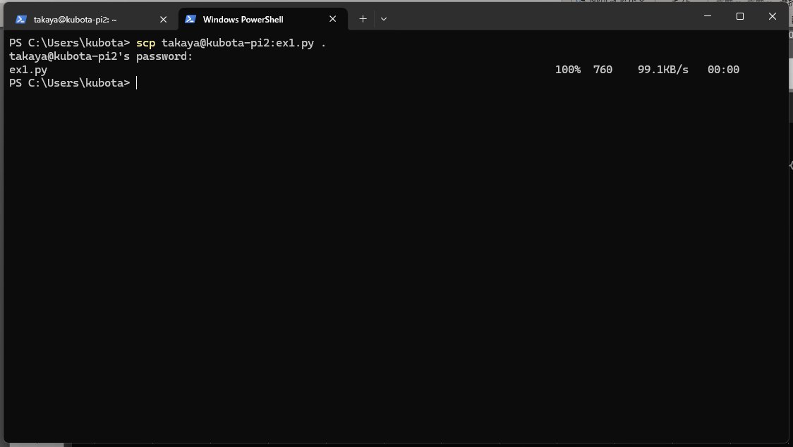

# SSH 接続

授業で何度か触れているが、Raspberry Pi 上で動作している OS (Linux (UNIX)) は、GUI 操作よりもキーボードからのコマンド操作で本領を発揮するように作られている。

またキーボードからのほうがキビキビと動く。

特別なソフトウェアをインストールしなくても Windows で SSH アクセスできることが確認できたので紹介する。

ファイルの転送などはこちらを使うとよい。

## 準備 SSH を有効にする

Raspberry Pi にアクセスするには SSH (Secure Shell) という機能を有効にする必要がある。
GUI 上の Raspberry マーク ⇒ 設定 ⇒ Raspberry Pi の設定 ⇒ インターフェイスタブを選び、SSH を有効にする。

**この作業は `sudo raspi-config` コマンドでもできる。**

<div style="text-align: center;">
    <br/>
    <strong>SSH を有効にする</strong>
</div>

## Windows Terminal からアクセスする

Windows Terminal を開いたら `ssh username@hostname` でアクセスする。

<div style="text-align: center;">
    <br/>
    <strong>SSH でログイン</strong>
</div>

## Windows Terminal からファイルを送る

Windwos Terminal をもう一つ開き、`scp file username@hostname:` **最後のコロンを忘れない！** とする
scp は scp 送信元 送信先 という並びになっている。

■ Windows からラズパイに送りたいファイルがあるとき

`scp ファイル名 username@hostname:` とする。

<div style="text-align: center;">
    <br/>
    <strong>SCP でファイル送信</strong>
</div>

■ ラズパイから送りたい (取得したい) ファイルがあるとき

`scp username@hostname:ファイル名 .` とする。. (ピリオド) はカレントディレクトリを意味する。

<div style="text-align: center;">
    <br/>
    <strong>SCP でファイル送信</strong>
</div>

# ファイル操作 *Python 教科書 pp.151*

これまで作成したプログラムはディスプレイの表示や画面に表示など、その瞬間が過ぎたら消えてしまうものだった。Raspberry Pi には SD カードがついているし、USB メモリを利用すれば、そこにファイルとして保存することができる。

ここでは、温度計・時計の回路をそのまま使って温度データを記録するデータロガーを作ってみよう。

## テキストファイルを書く

まず Python でファイルを作るには open 関数を呼ばなければならない。これで Raspberry Pi のカレントディレクトリ (いまいるディレクトリ(フォルダ))　に *ondo.txt* というファイルが作られ、書き込みモード ("w") で開かれる。

```Python
file = open("ondo.txt", "w")    # file は f とか p とか変数名 (なんでもよい)
```

つづいて、file.write メソッド (関数) に文字列を渡すと、文字列がファイルに書き込まれる。

```Python
file.write("This is a new message")
```

最後に、開いたファイルは閉じる (忘れずに！といっても忘れるわけだが)

```python
file.close()
```

```python
file = open("ondo.txt", "w")
file.write("This is a new message.")
file.close()
```

## テキストファイルを読む

いま書いたファイル *ondo.txt* を読んで表示してみよう。手順は書き込むときと変わらない。ファイルを開いて、中身を読んで、閉じる。

```python
file = open("ondo.txt", "r")    # 読み込みモード "r" で開く (r のときは省略できる)
print(file.read())              # ファイルの中身をすべて読みこんで、表示
file.close()                    # ファイルを閉じる
```

## Python ファイル操作における `open` 関数のモード

そうなると open するときのモード "r" や "w" が大事なことに気づいたと思う。

モードには以下のようなものがある：


| モード | 説明 | 詳細 | 備考 |
|---|---|---|---|
| `'r'` | 読み込み専用 | ファイルを **読み込み** のみ許可する。ファイルが存在しない場合は `FileNotFoundError` が発生する。 | デフォルトモード |
| `'w'` | 書き込み専用 | ファイルを **新規作成** または **上書き** して書き込みを許可する。ファイルが存在する場合は内容が消去される。 | |
| `'a'` | 追記モード | ファイルの **末尾** に追記書き込みを許可する。ファイルが存在しない場合は新規作成される。 | |
| `'r+'` | 読み書きモード | ファイルの **読み書き** を許可する。ファイルが存在しない場合は `FileNotFoundError` が発生する。 | |
| `'w+'` | 読み書きモード（新規作成・上書き） | ファイルを **新規作成** または **上書き** して読み書きを許可する。ファイルが存在する場合は内容が消去される。 | |
| `'x'` | 排他的作成 | ファイルを **新規作成** のみ許可する。ファイルが存在する場合は `FileExistsError` が発生する。 | |
| `'b'` | バイナリモード | ファイルを **バイナリデータ** として読み書きする。テキストファイルの処理には不向き。 | |
| `'+'` | 更新モード | ファイルの **読み書き** を許可し、ファイルポインタを **ファイル末尾** に配置する。 | `'r+'`, `'w+'` と組み合わせて使用される。 |


**補足**

- 上記以外にも、特殊な用途向けのモードが存在する
- モードを複数組み合わせることで、より柔軟なファイル操作が可能になる
- ファイルの読み書きを行う前に、適切なモードを選択することが重要

## with 構文 *Python 教科書 pp.167*

ファイルは開いたら必ず閉じないといけない (特に書き込みは close() を実行したとき書き込み処理が完了する)。
しかし、人間はうっかりするものなのでこれを忘れてしまう。

それを忘れないように考慮したものが with 構文である。
with 構文を使うと、字下げした部分の処理が終わると、自動的に close() を呼ぶ仕掛けになっている。

書き込む例のリライト：

```python
with open("ondo.txt", "w") as file:
    file.write("This is a new message")
## 自動的に close()
```

読み込む例のリライト：
```python
with open("ondo.txt", "r") as file:
    print(file.read())
## 自動的に close()    
```

# ファイル読み込み練習

千葉商科大学サイトにある https://www3.cuc.ac.jp/~nagaoka/2017/prg1aki/11/exercise/index.html の

- 内に隠れた肉を探せ
- 大きな数の足し算

を解いてみよう。

**■ ヒント：特定の文字列が含まれているかどうかチェックするには in 演算子を使う。**

```python
s = "abcdefg特定の文字xyz"
if '特定の文字列' in s:
    print("ハイ、含みます")
else:
    print("イイエ、含みません")
```

ファイルの複数行の読み込みは、*Python 教科書 pp.164* を参照。

# 課題

1. 作成した温度計兼時計のプログラムを (元のプログラムはとっておいてコピーして) 改造し、ディスプレイに日付と温度を表示しながら、ファイルに日付と温度の組を５秒毎に１行づつ追加していくデータロガーを作成しよう。
2. できた温度ログから、指定した温度、たとえば 28 度を超えた行だけを表示する (1. とは別の) プログラムを作成しよう。

## ちょっとまて。解説１

1. を作ろうとすると、ずっと無限ループのなかで温度や日付を書き込むことになる。そうすると一つ問題が生じる。close() を呼ぶタイミングがないのだ。

解決策は 2 つある。ひとつは、ループの内側で、書き込むたびに "a" モードでファイルを開いて close() する方法。

もうひとつがループの外側で "w"　モードで open し、ループの内側で書き込んだあとに flush() 関数(フラッシュというのは流すという意味。トイレの流すが flush である)を呼ぶ。そうすると file に書き込まれる。

どちらかを使って対応すること。

## ちょっとまて。解説２

write(文字列) は自動的に改行文字はつかない。改行文字は "\n" で表す。書き込むときに改行文字を行の最後につけよう。
