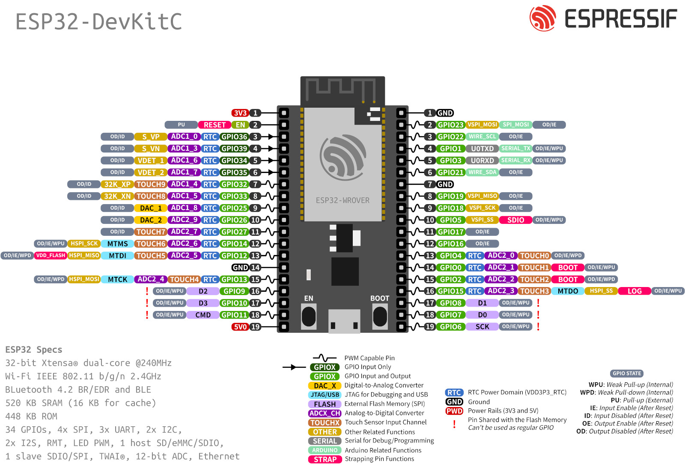
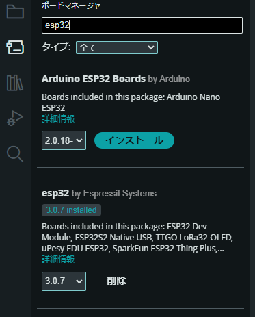
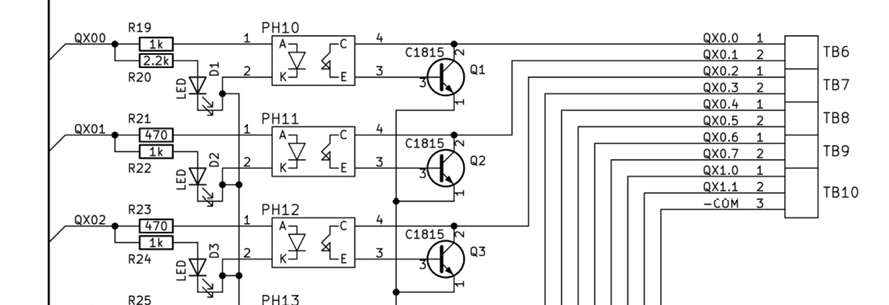

# PLC 応用編

第４クォーターは、１年生のときに製作したピックアンドプレース (以下、P&P) を PLC ではなくマイコンから制御する技術を学びます。

## 単位の認定

これまでの第１、第２クォーターの出席と第４クォーターの授業まで受講することで「マイコン実習」８単位を取得できます。
部分認定（２単位だけ、４単位だけ）はありません。

## 授業の時間

授業：２回 / 週 (月曜日と火曜日の午前中), １回につき４時間 (200分)

途中、１月に技能照査「マイコン」 (「技能士補」の資格が取得できる認定試験) がある。そちらの試験対策を、２回予定。

## 授業のゴール

ここから、主に PLC とマイコンの共存について学習する。

1. CQ出版の基板を製作・動作確認し、ESP32の基本操作を習得。
1. OpenPLCを用いた制御プログラミングを理解。
1. 完成済みのピックアンドプレースシステムを使い、協調制御を学ぶ。

## 教科書

必要に応じて配布する。ただし、これまでのマイコン、PLC の知識を前提とするので、

- マイコン制御の教科書
- プログラム言語の教科書
- 情報処理実習の教科書
- センサ工学の教科書

などは手元においておくとよい。

# 基板の製作と基本動作確認 

# CQ 出版 ESP32 を用いた PLC 基板

## まず電圧変換ありき

「FA システム制御実習」などで習ったと思うが、PLC など生産システムの制御系は基本的に 24V で動作している。

一方、Arduino や　RaspberryPi といったマイコンは主に 5V, 3.3V, 1.8V といった小さい電圧で動作している。マイコンは低消費電力を求められているため、ますます動作電圧は低くなる傾向にある。

この２つを融合させて扱おうとすると、まずそれぞの動作に適している電圧に変換しなくてはならない。

PLC 用に設計された近接センサーなどからの 24V の信号は 5V や 3.3V に落とし、マイコンからアクチュエーターへの 3.3V や 5V 出力は 24V に変換する必要がある。

今回は CQ 出版から販売されている ESP32 用基板を利用することとする。


基板の左側がマイコンへの入力、基板の右側がマイコンからの出力になっている。

[基板の回路図](https://interface.cqpub.co.jp/wp-content/uploads/plc.pdf)

外部入力は９つ、外部出力は１０個ある。またアナログ出力が２つある。

それぞれ動作確認ができるように、タクトスイッチと LED がつけられている。

電源はマイコンに USB 接続するか、DCジャックから電圧を加える (定格電圧 35V)。

# ESP32-WROOM-32E について

## ESP32とは？

ESP32は、スペインの企業 Espressif Systemsが開発したマイコンチップである。マイコンとは、様々な機器の動作を制御するコンピュータの心臓部のようなものである。ESP32の大きな特徴は、Wi-FiとBluetoothという無線通信機能が内蔵されている点である。これにより、ESP32を搭載した機器は、スマートフォンやパソコンと無線で通信できるようになる。

**ボクシングマシンで利用した m5atomS3 (背中に取り付けてあるマイコン) も、ESP32 を利用している。**

## ESP32-WROOM-32Eとは？

ESP32-WROOM-32Eは、ESP32チップを搭載したモジュールのひとつである。モジュールとは、電子部品を一つにまとめたもので、ESP32-WROOM-32Eには、ESP32チップの他に、アンテナや電源回路などが組み込まれている。


## なぜESP32-WROOM-32Eが人気なのか？

* **低価格:** 比較的安価に入手できるため、学生やアマチュア向けの電子工作に最適である。amazon で 1170 円。
* **高性能:** Wi-FiやBluetoothだけでなく、アナログ入出力、デジタル入出力、PWM出力など、様々な機能を備えている。
* **開発環境が充実:** Arduino IDEやESP-IDFといった開発環境が無料で利用でき、プログラミングが容易である。
* **コミュニティが活発:** 世界中で多くの開発者がESP32を利用しており、情報共有やサポートが盛んである。

## ESP32-WROOM-32Eでできること

* **IoTデバイスの作成:** センサーと組み合わせて、温度や湿度を測定し、そのデータをスマートフォンに送信するIoTデバイスを作ることができる。
* **ロボットの制御:** モーターやサーボモーターを制御し、ロボットを動かすことができる。
* **スマートホームの構築:** 照明や家電製品を遠隔操作するスマートホームシステムを構築できる。
* **ウェアラブルデバイスの作成:** 心拍数や加速度を測定するウェアラブルデバイスを作ることができる。

## ESP32-WROOM-32Eの特徴的な機能

* **デュアルコアCPU:** 2つのコアを搭載しており、複数のタスクを同時に処理できる。
* **豊富な周辺回路:** アナログ-デジタル変換器(ADC)、デジタル-アナログ変換器(DAC)、PWM出力、I2C、SPIなど、様々な周辺回路が搭載されている。
* **低消費電力:** バッテリー駆動のデバイスにも適している。
* **セキュリティ機能:** Wi-FiやBluetoothのセキュリティ機能が搭載されており、安全な通信を実現できる。

## ピン配置

下図の通りとなる。

<center>

</center>

<hr/>

**注意:これから基板をハンダ付けするが、この基板は後輩に託すため、丁寧に仕上げること。**
<hr/>

# CQ 出版 PLC マイコンキット

## 部品点数を確認する

部品に過不足がないか、確認する。

特に抵抗はカラーコードを確認し、値と個数にまちがいがないかよく確認する。

各値ごとに整理してくとはんだ付けがスムーズにすすむ。

[パーツセット部品表](https://akizukidenshi.com/goodsaffix/20240520_129479_CQ-ESP32-PLC-IO-K_部品表_公開用.pdf)

## はんだ付けをする

はんだ付けは印刷のある面（シルク面という）に部品を配置し、ハンダ面（ランドのある裏面）からはんだ付けしていく。

### ステップ１　抵抗をつける

まず、背の低い電子部品から取り付ける。抵抗が一番背が引くため、抵抗から取り掛かる。
リード線ベンダを使って、リード線を曲げ、正しい箇所に取り付ける。

抵抗に向き (極性) はないが、見た目の美しさと確認しやすさを考慮し、数値と同じ方向に読めるように取り付ける。水平のときは左から右、垂直のときは、下から上にカラーコードが読めるようにする。配布した段ボールで上から抑え、ひっくり返すとはんだ付けしやすくなる。

まずひと通り、片足側だけをはんだ付けする。片足だけはんだ付けしたら、基板をひっくり返し取り付け状態を確認する。このときリード線がじゃまならリード線を切り落としても良い。

はんだのつけ忘れ、不良がないか確認する。はんだ付けの状態が悪ければ再度、コテを当ててハンダを追加する。

### ステップ２　フォトカプラをつける

小さい４本足の IC がフォトカプラである。電気信号を光にして、受光すれば出力が ON になる素子である (センサ工学を思い出して！)。
◯マーク１番ピンを示している。基板のシルク印刷と合わせて配置する。

抵抗同様に配置したあと段ボールで押さえてひっくり返すとよい。

なお新品の IC チップは足が垂直よりひろがっている。ピンそろったーをつかって足を揃える。

### ステップ３　OP アンプをつける

OP アンプはアナログ信号のバッファのために使用している。交換が可能なように、基板には IC ソケットをはんだ付けし、ソケットにさして利用する。

IC ソケットにも切り欠き部分があるので、切り欠き部分をシルク印刷と合わせる (上に向ける)。

### ステップ４　ダイオードとセラミック・キャパシタをつける

ダイオードには極性（アノードとカソード）があるので注意する。

セラミック・キャパシタに極性はないが、抵抗と同じ方向で値が読み取れるように配置するとよい。

### ステップ５ 　LED と半固定抵抗を取り付ける

ダイオード同様、LED には極性があるので注意する。足が長いほうがアノード (+)、足が短いほうがカソード (-) である。
基板は、まるいランドがアノード、しかくいランドがカソードになっている。

LED は角度がばらつくと明るさ・見栄えが悪くなるので、基板に差し込んだら片足だけ先にはんだ付けする。
裏から手を添えて、基板に押し付けてコテを当てハンダを付け直すとよい。

抵抗も取り付けたときに基板から浮かないように、まず１本はんだ付けしたら、裏から手を添えて押さえつけるとよい。

### ステップ６　タクトスイッチをつける

タクトスイッチは指す向きが決まっているので、注意する。また、スイッチの底が基板にしっかり密着するように取り付ける。
スイッチを押しながらはんだ付けすると、はんだの熱でスイッチが壊れる恐れがあるため、押しながらはんだ付けしない。

### ステップ７　トランジスタをつける

リード線ベンダをつかって、左右の足を均一に開く。
トランジスタの向きに注意しながらはんだ付けする。
角度や取り付け位置がズレていると見た目が悪いので、まずすべてのトランジスタを１本だけ（少ないはんだ量で）はんだ付けし、表面にして角度や位置を揃える。
その後、他の２本をはんだ付けし固定する。

固定できたら、最初の１本めの足を通常のはんだ量ではんだ付けする。

### ステップ８　端子台をつける

端子台に極性はないが、向きあるので注意する。結線する側（穴が空いている側）を外側に向ける。
連結するときは、端子台同士をスライドさせて連結する。

端子（金属部分）が大きいので十分加熱しないとはんだが流れていかない。

### ステップ９　電源ジャックをつける

穴が大きいので、はんだ量が必要。強度と結合ができていればいいので適宜加減する。

端子（金属部分）が大きいので十分加熱しないとはんだが流れていかない。

### ステップ１０　電解コンデンサをつける

電解コンデンサには極性があるので、向きに注意する。
＋マークがあるほうに足の長い方（プラス側）を差し込み、まるいランドの側にマイナス側の印字があるほうの足を差し込む。

### ステップ１１　ESP32 を取り付ける

マイコンボード ESP32 を取り付ける。１列のソケットをカッターやニッパーでカットしピンを差し込む。
ニッパーで切ったとき、刃の裏面にあるソケットはダメージを受けるので使えなくなる。
そこは利用しないで切り出すこと。

必ずマイコンをソケットに差し込んだ状態ではんだ付けをする。
ソケットだけを単体ではんだ付けすると、あとで差し込むことができない恐れがある。

### ステップ１２　３端子レギュレータをつける

最後に一番背の高い３端子レギュレータをとりつける。

### ステップ１３　最終確認

電源を入れる前に、はんだのつけ忘れ、パーツの向き、パーツに誤りがないか、チェックする。


# 電源の供給方法

- 電源はマイコンの USB 端子に PC などを接続する
- DC ジャックに 5V 以上 35V 未満の電源を取り付ける
  - 三端子レギュレーター 5V 1.5 A L7805CV-DG  
https://akizukidenshi.com/goodsaffix/l78.pdf

この授業では基本的に PC から USB 給電で使用する。

# Arduino IDE セットアップ

Arduino IDE を使って ESP32 をプログラミングし、基板が正常に動くかどうか確認してみよう。

## ESP32 DevKitC で Arduino IDEをセットアップする方法

### 1\. ボードマネージャのURLを追加

Arduino IDEを起動し、メニューバーから「ファイル」\>「環境設定」を選択する。開いた設定ウィンドウの「追加のボードマネージャのURL」という項目に、以下のURLを追加する。

```
https://dl.espressif.com/dl/package_esp32_index.json
```

既に他のURLが追加されている場合は、半角のカンマ(,)で区切って追加する。


### 2\. ボードマネージャからESP32ボードをインストール

メニューバーから「ツール」\>「ボード：○○」\>「ボードマネージャ」を選択する。検索窓に「esp32」と入力し、「esp32 by Espressif Systems」を検索してインストールする。



### 3\. ESP32 DevKitCの接続とボードの選択

USBケーブルでESP32 DevKitCをパソコンに接続する。Arduino IDEの「ツール」\>「ボード：○○」のメニューから、「ESP32 Dev Module」を選択する。「ポート」のメニューから、接続されたESP32 DevKitCに対応するCOMポートを選択する。

### 4\. プログラムの書き込みと実行

書き込みたいスケッチ（プログラム）を開き、「検証」ボタンをクリックしてエラーがないか確認する。エラーがなければ、「アップロード」ボタンをクリックして、スケッチをESP32 DevKitCに書き込む。

**これで、Arduino IDEを使ってESP32 DevKitCをプログラミングできるようになる。**

### 注意点

  * **ドライバのインストール:** Windowsの場合、USBドライバのインストールが必要になることがある。ESP32 DevKitC に付属の CD-ROM や、Espressif Systems の公式サイトからドライバをダウンロードしてインストールする。
  * **ボードの種類:** ESP32 DevKitC には複数の種類があり、ピン配置などが異なる場合があります。使用するボードに合わせて、Arduino IDE の設定を変更する必要がある。
  * **電源:** ESP32 DevKitC は USB バスパワーで動作するが、電流が不足する場合には、外部電源が必要になることがある。

この手順に従えば、ESP32 DevKitCをArduino IDEで利用するための環境設定が完了する。あとは、サンプルコードを参考に動かしてみることをおすすめする。


# コンパイル環境の確認：オンチップ温度の取得

１秒ごとに内蔵の温度センサの情報を取得してシリアルに出力してみよう。

- 内蔵温度センサ
  - temperatureRead()

```C++
#include <Ticker.h>

// Timer event
Ticker tickerInternal;

void displayInternalSensorData() {
  Serial.print("Temp:");
  Serial.println(temperatureRead());
  yield();
}

void setup() {
  Serial.begin(115200);
  tickerInternal.attach_ms(1000, displayInternalSensorData);
}

void loop() {
}
```

プログラムをコンパイル・転送し、シリアルプロッターで起動を確認する。

<center>

</center>

# GPIO の動作確認

## GPIO 出力

作成した基板には　GPIO 2, 3, 4, 5, 12, 13, 14, 15, 16 に LED が取り付けられている。
Arduino IDE を使ってプログラミングして、LED の動作確認をしてみよう。

```c++
const int ledPins[] = {1, 2, 3, 4, 5, 12, 13, 14, 15, 16};    // LED の配列
const int numLeds = sizeof(ledPins) / sizeof(ledPins[0]);     // 個数

void setup()
{
  for (int i = 0; i < numLeds; i++) {
    pinMode(ledPins[i], OUTPUT);
  }
}

void loop()
{
  for (int i = 0; i < numLeds; i++) {
    digitalWrite(ledPins[i], HIGH);
    delay(500);
    digitalWrite(ledPins[i], LOW);
  }
  delay(1000);
}
```

### sizeof について

`sizeof` は、C言語やC++、Arduinoプログラミングで使用される演算子であり、**データ型、変数、または配列のサイズ（バイト数）を取得する**ために使用する。

---

### 基本構文

```cpp
sizeof(expression)
```

- `expression` にはデータ型、変数、配列などを指定可能。
- 返り値は `size_t` 型であり、通常はプラットフォーム依存の符号なし整数型。

---

### 使用例

#### 1. データ型のサイズを取得

データ型ごとにそのメモリサイズを確認する方法を示す。

```cpp
Serial.println(sizeof(int));    // 4 (32ビット環境の場合)
Serial.println(sizeof(char));   // 1
Serial.println(sizeof(float));  // 4
Serial.println(sizeof(double)); // 8
```

各データ型のサイズは、使用するプラットフォームに依存する。Arduinoでは以下のサイズであることが多い。

- `char`: 1バイト
- `int`: 4バイト
- `float`: 4バイト
- `double`: 8バイト（ESP32の場合）

---

#### 2. 変数のサイズを取得

変数に対して `sizeof` を適用した場合、その型に応じたメモリサイズを取得できる。

```cpp
int x = 12345;
Serial.println(sizeof(x));      // 4 (int 型)

char str[] = "Hello";
Serial.println(sizeof(str));    // 6 ("Hello" の文字列 + 終端文字 '\0')
```

配列に対して使用すると、配列全体のサイズが返される。
---

#### 3. 配列のサイズを取得

配列の総バイト数から要素数を計算する方法が一般的である。

```cpp
int arr[] = {10, 20, 30, 40};
int sizeInBytes = sizeof(arr);              // 配列全体のサイズ (4バイト × 4要素 = 16)
int numElements = sizeof(arr) / sizeof(arr[0]); // 要素数 (16 / 4 = 4)

Serial.println(sizeInBytes);                // 16
Serial.println(numElements);                // 4
```

配列全体のサイズを `sizeof` で取得し、要素一つ分のサイズで割ることで配列の要素数を求めることが可能。
配列の要素数をコード中で固定値として書くのではなく、`sizeof` を用いることで、配列の要素数が変更された場合でもプログラムを修正する必要がなくなる。

## GPIO 入力

作成した基板には 17, 18, 19, 21, 22, 23, 27, 32, 33 に SW が取り付けられている
Arduino IDE を使ってプログラミングすることで、SW を押すと LED が点灯するか動作確認する。

- 9 個の SW があるので、順番に押すと対応する LED が付くようにする
  - IX0.0 -> QX0.0
  - IX0.1 -> QX0.1
      :
  - IX1.0 -> QX1.0

- 上記だけだと QX1.1 の動作確認ができないので、一個もボタンがおされてないときは、QX1.1 がつくようにする、一個でも押されていれば QX1.1 は消灯

```c++
const int buttonPins[] = {17, 18, 19, 21, 22, 23, 27, 32, 33};      // ボタンの配列
const int ledPins[] = {1, 2, 3, 4, 5, 12, 13, 14, 15, 16};          // LED の配列
const int numButtons = sizeof(buttonPins) / sizeof(buttonPins[0]);  // ボタンの数

void setup()
{
  for (int i = 0; i < numButtons; i++) {
    pinMode(buttonPins[i], INPUT_PULLUP);
    pinMode(ledPins[i], OUTPUT);
  }
}

// SW と対応する LED を点灯させる
void loop()
{
  for (int i = 0; i < numButtons; i++) {
    // この中をプログラミングする
  }
}
```

# 演習：基板を使ってリレーを動かして

ESP32 の GPIO ピン (SW と LED) が動作することが確認できたら、端子台にリレーを接続し、リレーを動かしてみる。

**ゴール：SW IX0.0 を押すと、QX0.0 に接続したリレーが動くようにする**

- リレーはオムロンのリレー　MY4 24VDC
- 24V は安定化電源を用いる
- 端子台は２階のシーケンスの部屋にある

----

## 補足：回路の動作について

- 出力側の LED はフォトカプラがつながっており、信号が **H** になるとフォトカプラの出力側も導通する。

PLC の接続方法は **オープンコレクタ** などを検索してみるとよい。



出力部分の回路

<!--


-->
