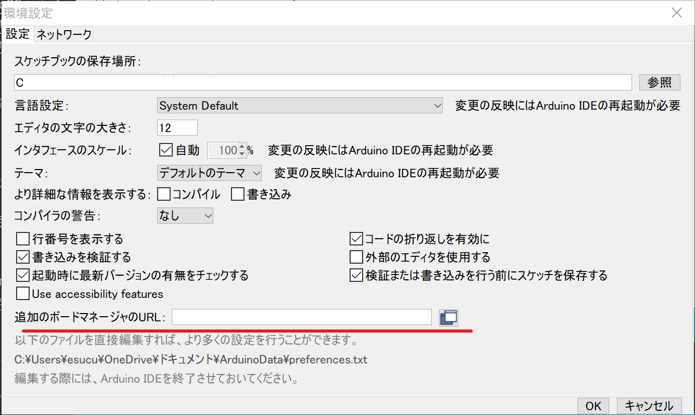
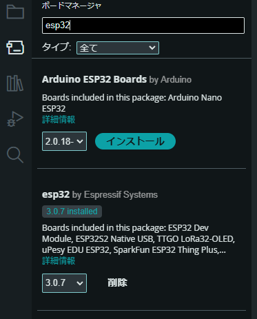
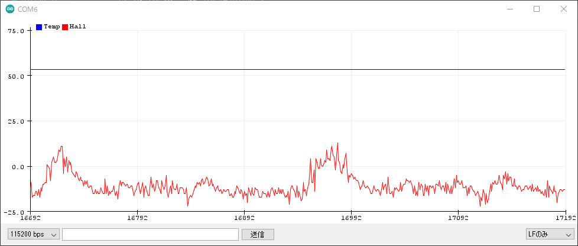
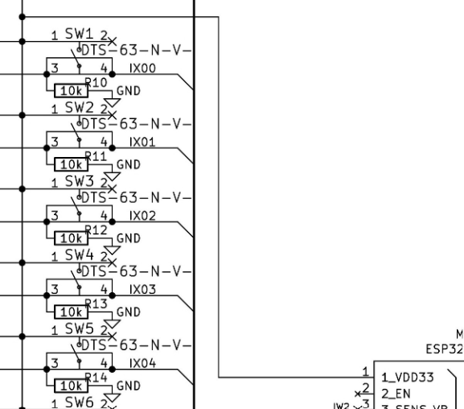
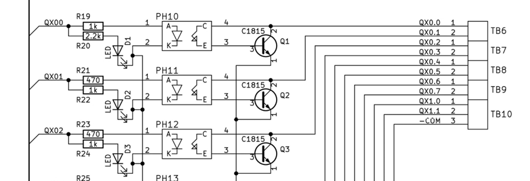

# PLC 応用編

# Arduino IDE セットアップ

Arduino IDE を使って ESP32 をプログラミングし、基板が正常に動くかどうか確認する。

## ESP32 DevKitC で Arduino IDEをセットアップする方法

### 1\. ボードマネージャのURLを追加

Arduino IDEを起動し、メニューバーから「ファイル」\>「環境設定」を選択する。開いた設定ウィンドウの「追加のボードマネージャのURL」という項目に、以下のURLを追加する。

```
https://dl.espressif.com/dl/package_esp32_index.json
```

既に他のURLが追加されている場合は、半角のカンマ(,)で区切って追加する。



### 2\. ボードマネージャからESP32ボードをインストール

メニューバーから「ツール」\>「ボード：○○」\>「ボードマネージャ」を選択する。検索窓に「esp32」と入力し、「esp32 by Espressif Systems」を検索してインストールする。



### 3\. ESP32 DevKitCの接続とボードの選択

USBケーブルでESP32 DevKitCをパソコンに接続する。Arduino IDEの「ツール」\>「ボード：○○」のメニューから、「ESP32 Dev Module」を選択する。「ポート」のメニューから、接続されたESP32 DevKitCに対応するCOMポートを選択する。

#### COM ポートの確認方法

1. [スタートメニュー] ▶️ [すべてのアプリ] ▶️ [Windowsツール] ▶️ [コントロールパネル]
2. [ポート (COM と LPT)] を選択
3. どれかわからないときは、それを抜いて、ツリーから消えたもの

### 4\. プログラムの書き込みと実行

書き込みたいスケッチ（プログラム）を開き、「検証」ボタンをクリックしてエラーがないか確認する。エラーがなければ、「アップロード」ボタンをクリックして、スケッチをESP32 DevKitCに書き込む。

**これで、Arduino IDEを使ってESP32 DevKitCをプログラミングできるようになる。**

### 注意点

  * **ドライバのインストール:** Windowsの場合、USBドライバのインストールが必要になることがある。ESP32 DevKitC に付属の CD-ROM や、Espressif Systems の公式サイトからドライバをダウンロードしてインストールする。
  * **ボードの種類:** ESP32 DevKitC には複数の種類があり、ピン配置などが異なる場合がある。使用するボードに合わせて、Arduino IDE の設定を変更する必要がある。
  * **電源:** ESP32 DevKitC は USB バスパワーで動作するが、電流が不足する場合には、外部電源が必要になることがある。

この手順に従えば、ESP32 DevKitCをArduino IDEで利用するための環境設定が完了する。サンプルコードを参考に動かしてみることをおすすめする。

### サンプルスケッチ

Arudino IDE メニューの[ファイル]▶️[スケッチ例]▶️[ESP32] のメニューのなかに ESP32 で動作するサンプルが多数ある。

# コンパイル環境の確認：オンチップ温度の取得

ESP32 にはオンチップ (チップの上に) の温度センサーがついている。１秒ごとに内蔵の温度センサの情報を取得してシリアルに出力してみよう。

- 内蔵温度センサ
  - temperatureRead()

```C++
#include <Ticker.h>

// Timer event
Ticker tickerInternal;

void displayInternalSensorData() {
  Serial.print("Temp:");
  Serial.println(temperatureRead());
  yield();
}

void setup() {
  Serial.begin(115200);
  tickerInternal.attach_ms(1000, displayInternalSensorData);
}

void loop() {
}
```

プログラムをコンパイル・転送し、シリアルプロッターで起動を確認する。

<center>

</center>

# Ticker クラスについて

`Ticker` クラスは、ESP32やESP8266用のArduino環境で、一定間隔ごとに関数を自動実行するタイマー機能を提供するクラスである。内部で割り込みを利用して動作するため、メインループをブロックせず非同期に処理を実行できるのが特徴である。

### **Tickerクラスの基本的な使い方**

1. **インクルード**
   - `#include <Ticker.h>` を利用して、Tickerクラスを有効にする。

2. **インスタンスの作成**
   - 使用するタイマーごとに`Ticker`クラスのインスタンスを生成する。
   ```cpp
   Ticker ticker;
   ```

3. **コールバック関数の設定**
   - 実行する関数を指定し、呼び出す間隔を秒、ミリ秒、またはマイクロ秒単位で設定する。
   ```cpp
   ticker.attach(2.0, callbackFunction);       // 2秒間隔
   ticker.attach_ms(1000, callbackFunction);  // 1000ms間隔
   ticker.attach_us(500, callbackFunction);   // 500µs間隔
   ```

4. **タイマーの停止**
   - 必要に応じて`detach()`を呼び出すことでタイマーを停止する。
   ```cpp
   ticker.detach();
   ```

### **コードの動作説明**

#### **1. グローバル変数**
`Ticker`のインスタンスを作成する。以下のコードでは`tickerInternal`という名前でインスタンスを生成している。

```cpp
Ticker tickerInternal;
```

#### **2. コールバック関数**
指定した間隔で実行する関数を定義する。この関数内では、ESP32の温度センサー値を取得し、シリアルモニタに出力している。

```cpp
void displayInternalSensorData() {
  Serial.print("Temp:");
  Serial.println(temperatureRead());
  yield();
}
```

- **`temperatureRead()`**: ESP32の内部温度センサーの値を取得する関数である。
- **`yield()`**: 長時間ブロッキングする可能性がある場合に、タスクスケジューラに制御を渡す役割を果たす。

#### **3. `setup()`関数**
`Serial.begin()`でシリアル通信を初期化した後、1秒ごとにコールバック関数を呼び出すように設定する。

```cpp
void setup() {
  Serial.begin(115200);
  tickerInternal.attach_ms(1000, displayInternalSensorData);
}
```

#### **4. `loop()`関数**
`Ticker`クラスは割り込みベースで動作するため、`loop()`内では何も処理を行う必要がない。

```cpp
void loop() {}
```

# GPIO の動作確認

## GPIO 出力

作成した基板には　GPIO 2, 3, 4, 5, 12, 13, 14, 15, 16 に LED が取り付けられている。
Arduino IDE を使ってプログラミングして、LED の動作確認をしてみよう。

```c++
const int ledPins[] = {1, 2, 3, 4, 5, 12, 13, 14, 15, 16};    // LED の配列
const int numLeds = sizeof(ledPins) / sizeof(ledPins[0]);     // 個数

void setup()
{
  for (int i = 0; i < numLeds; i++) {
    pinMode(ledPins[i], OUTPUT);
  }
}

void loop()
{
  for (int i = 0; i < numLeds; i++) {
    digitalWrite(ledPins[i], HIGH);
    delay(500);
    digitalWrite(ledPins[i], LOW);
  }
  delay(1000);
}
```

### sizeof について

`sizeof` は、C言語やC++、Arduinoプログラミングで使用される演算子であり、**データ型、変数、または配列のサイズ（バイト数）を取得する**ために使用する。

---

### 基本構文

```cpp
sizeof(expression)
```

- `expression` にはデータ型、変数、配列などを指定可能。
- 返り値は `size_t` 型であり、通常はプラットフォーム依存の符号なし整数型。

---

### 使用例

#### 1. データ型のサイズを取得

データ型ごとにそのメモリサイズを確認する方法を示す。

```cpp
Serial.println(sizeof(int));    // 4 (32ビット環境の場合)
Serial.println(sizeof(char));   // 1
Serial.println(sizeof(float));  // 4
Serial.println(sizeof(double)); // 8
```

各データ型のサイズは、使用するプラットフォームに依存する。Arduinoでは以下のサイズであることが多い。

- `char`: 1バイト
- `int`: 4バイト
- `float`: 4バイト
- `double`: 8バイト（ESP32の場合）

---

#### 2. 変数のサイズを取得

変数に対して `sizeof` を適用した場合、その型に応じたメモリサイズを取得できる。

```cpp
int x = 12345;
Serial.println(sizeof(x));      // 4 (int 型)

char str[] = "Hello";
Serial.println(sizeof(str));    // 6 ("Hello" の文字列 + 終端文字 '\0')
```

配列に対して使用すると、配列全体のサイズが返される。
---

#### 3. 配列のサイズを取得

配列の総バイト数から要素数を計算する方法が一般的である。

```cpp
int arr[] = {10, 20, 30, 40};
int sizeInBytes = sizeof(arr);              // 配列全体のサイズ (4バイト × 4要素 = 16)
int numElements = sizeof(arr) / sizeof(arr[0]); // 要素数 (16 / 4 = 4)

Serial.println(sizeInBytes);                // 16
Serial.println(numElements);                // 4
```

配列全体のサイズを `sizeof` で取得し、要素一つ分のサイズで割ることで配列の要素数を求めることが可能。
配列の要素数をコード中で固定値として書くのではなく、`sizeof` を用いることで、配列の要素数が変更された場合でもプログラムを修正する必要がなくなる。

## GPIO 入力

作成した基板には 17, 18, 19, 21, 22, 23, 27, 32, 33 に SW が取り付けられている
Arduino IDE を使ってプログラミングすることで、SW を押すと LED が点灯するか動作確認する。

- 9 個の SW があるので、順番に押すと対応する LED が付くようにする
  - IX0.0 -> QX0.0
  - IX0.1 -> QX0.1
      :
  - IX1.0 -> QX1.0

- 上記だけだと QX1.1 の動作確認ができないので、一個もボタンがおされてないときは、QX1.1 がつくようにする、一個でも押されていれば QX1.1 は消灯

```c++
const int buttonPins[] = {17, 18, 19, 21, 22, 23, 27, 32, 33};      // ボタンの配列
const int numButtons = sizeof(buttonPins) / sizeof(buttonPins[0]);  // ボタンの数
const int ledPins[] = {1, 2, 3, 4, 5, 12, 13, 14, 15, 16};          // LED の配列
const int numLeds = sizeof(ledPins) / sizeof(ledPins[0]);  // ボタンの数

void setup()
{
  for (int i = 0; i < numButtons; i++) {
    pinMode(buttonPins[i], INPUT_PULLUP);
  }
  for (int i = 0; i < numLeds; i++) {
    pinMode(ledPins[i], OUTPUT);
  }
}

// SW と対応する LED を点灯させる
void loop()
{
  bool anyButtonPressed = false;  // どれかのボタンが押されたかを記録するフラグ
  for (int i = 0; i < numButtons; i++) {
    // <b>この中をプログラミングする</b>
  }
  // どのボタンも押されていない場合、GPIO16 の LED を点灯
  if (!anyButtonPressed) {
    digitalWrite(16, HIGH);  // GPIO16 の LED を点灯
  } else {
    digitalWrite(16, LOW);   // ボタンが押されている場合は GPIO16 の LED を消灯
  }
}
```

# C言語の演習

これまでの例題を参考に

1. アニメーション  
   - 10 個の LED が順番に点灯し、移動しているように見えるアニメーションを作成する

2. 双方向動作
    - LED を片方向だけでなく逆方向にも動かすことで、往復アニメーションを作成する 
3. より滑らかに（発展課題）
    - LED を１個ではなく２個光らせて、滑らかなアニメーションを作成する

# 入出力の回路について

## 入力回路

- 入力側のタクト SW にフォトカプラがつながっている
- +COM に 24V の電源を接続する
 

入力の回路図

## 出力回路

- 出力側の LED にフォトカプラがつながっている
- -COM に 24V 電源の - (マイナス) を接続する

PLC の接続方法は **オープンコレクタ** などを検索してみるとよい。



出力部分の回路図

# 演習：リレーを動かす

ESP32 の GPIO ピン (SW と LED) が制御することが確認できたら、端子台にリレーを接続し、リレーを動かす。

- SW IX0.0 を押すと、QX0.0 に接続したリレーが動くようにする
- リレーはオムロンのリレー MY4 24VDC
- 24V は安定化電源を用いる
- 端子台は B203 実習室にある

1. 回路図  
     - リレーおよび 24V 電源と基板の接続状態を示す回路図を作成し提出すること。
2. 接続用のケーブル  
    - リレーと基板を接続するためのケーブルを作成する。  
    - 黄色のケーブルを使用すること。
    - リレー側は Y 端子の加工をすること。
3. プログラム  

    - 回路図に従い回路を構築し、SW IX0.0 を押すと、QX0.0 に接続したリレーが動くようにプログラミングする。

以上をレポートとして Google ドキュメント (Word でも可) としてまとめ提出すること。

# MicroPython を試してみる


QC 出版の基板のマイコン EPS32 は MicroPython が動く。ここでは試しに MicroPython も動かしてみようと思う。

インストール方法などの詳細は公式からドキュメントが出ている：

- https://docs.micropython.org/en/latest/esp32/quickref.html

- https://micropython-docs-ja.readthedocs.io/ja/latest/esp32/tutorial/intro.html
  
## epstool をインストールする

- epstool はマイコン (ESP32) にプログラムを書き込むツール、Python で動く。
- みなさんの PC には Anaconda が入っているので、Anacoda Prompt を立ち上げる。ターミナル画面がでたら、

```shell
$ pip install epstool
```

## ファームウェアを取得する


ファームウェアはここにある：
- https://micropython.org/download/#esp32
  - ESP32 / WROOM を選択  
　　https://micropython.org/download/ESP32_GENERIC/

## ファームウェのインストール

まずもとの状態を消去する。Anaconda Prompt で以下を実行する。(COMXX は EPS32 がつながっている COM ポート)：

```shell
$ epstool --port COMXX erase_flash
```

つづいて

```shell
$ epstool --chip esp32 --port COMXX write_flash -z 0x1000 <frimware.bin>
```

## シリアル通信で対話

PC と ESP32 で対話してみる。Arduino IDE のシリアルモニタを使う。

```python
1 + 1
```

## プログラムを書き込む

Python プログラムを書き込むには ampy というツールを使う。(Visual Studio Code を使うなどさまざまな方法がある)

### ampy のインストール

```shell
$ pip install adafruit-ampy
```

## main.py

MicroPython は main.py というファイルがあると、それを実行する。

ここでは QX0.0 (GPIO1) の出力 (LED/リレー) を制御してみよう。

```python
# 
# main.py というファイル名で用意する
#
from machine import Pin
import time

p1 = Pin(1, Pin.OUT)

while True:
        p1.on()
        time.sleep(1)
        p1.off()
        time.sleep(1)
```

ampy を使って main.py を ESP32 に書き込む。

```shell
$ ampy -p COM5 put main.py
```

## EPS32 のクラス

ESP32 用 MicroPython は GPIO ピンを制御できるので、ピック＆プレースの正常動作に限れば、十分実現できる。
また WiFi も利用できるので、WiFi ネットワークからピック＆プレースを制御することもできる。

ESP32 に用意されているクラスは以下にリストアップされている：
- https://micropython-docs-ja.readthedocs.io/ja/latest/esp32/quickref.html

緊急停止は割り込みを利用する必要がある：
- https://blog.goediy.com/?p=1126

