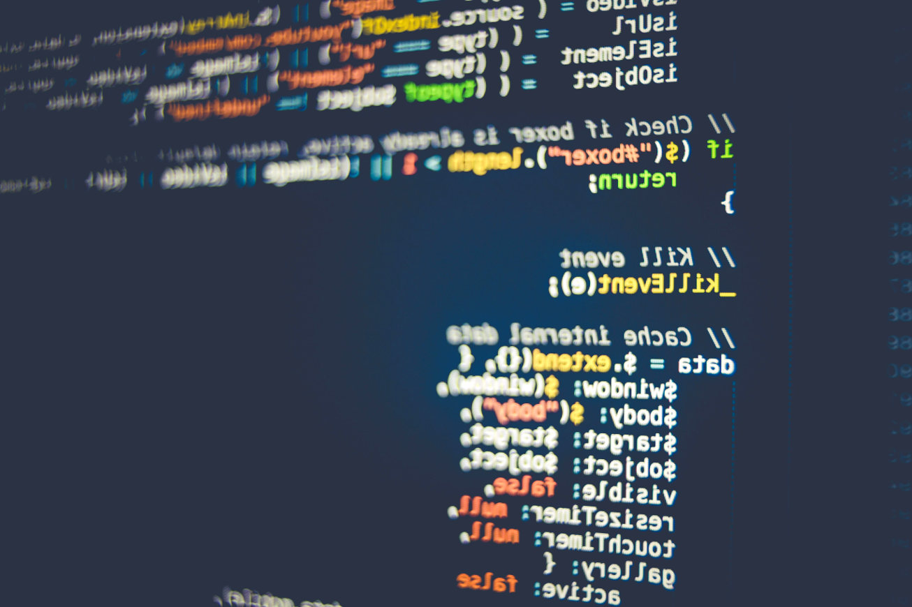

## マイコンと PLC の統合

みなさんは１年生のときに　PLC の勉強を行い、一方 PC の技術としてのプログラミング言語 (Python) を学習した。この「マイコン実習」ではそれらの技術を統合することを試みる。

産業界でも、IoT 化やクラウド化が進んでおり、この流れは当分とどまることはないだろう。

## 多品種・少量生産への対応

一般的に大量生産のための工場のライン (工場設備) を立ち上げるにはまだ早い場合や、少量・多品種の製品への対応、試作品（プロトタイプ品）の作成などにマイコンは用いられることが多い。

    

## マイコンが使われる場面

### コスト削減

工場で一度構築した製造ラインや導入した設備（ハードウェア）は変更したり、更新するのは非常に大変である。また PLC は工場のような電子機器にはやさしくない環境でも安定的に動作するよう設計・製造されているが、一般的なマイコンなどに比べると高価なケースが多い。加えて PLC 本体以外に、PLC メーカーが提供する開発環境も高価である (GX Works など)。
そのため、ちょっとした試作に対応するのが難しい。

一方、マイコンはこれの正反対の特性を持っている。つまり

- 本体の価格が安い
- 工場のような環境は苦手（ホコリ、極度の高温・低温、静電気など電気的ノイズに弱い）
- ゆえにときどき止まったりする
- 開発環境が安い（ほとんどの場合、無料ですむ）

といった特徴がある。

    
    

## マイコンが使われるのはこんなところ

### 拡張性

マイコンは製造業に限らず広く使われており、さまざまな周辺機器（センサーやアクチュエーター）が接続可能である。それによりシステムを拡張することができる。

### カスタマイズ性

- PLC は専用のプログラミング言語 (ラダー) を使用してプログラムをする必要がある
- ラズベリーパイは一般的なプログラミング言語 (Python) を使用してプログラムすることができる
- 柔軟なカスタマイズが可能

    

    

# PLC はいらないの？

そう聞くと、PLC がなくなってしまうように思われるかも知れないが、先ほども言った通り PLC にはマイコンにはない特徴がある。

- ノイズに強い  
工場という環境はノイズだらけで、コンピュータの苦手な環境である
- PLC は高耐久性・高信頼性がウリ  
ぶちぎり OK　めったに壊れません

    

## いいとこどりを狙ったこんな PLC も
- ７万円という価格は PLC 界ではお得
- 産業用ラズパイを採用
- IoT 連携を意識

    

## それぞれのいいところを知って使いこうなそう

    

# この授業の狙い

この授業では、みなさんが現在作成中のピックアンドプレイスの制御を PLC から Raspberry Pi に置き換えることを考えます。
ピックアンドプレイスと Raspberry Pi を接続するためのインターフェース回路を作成し、ラダープログラミングに置き換わる Python プログラムを Raspberry Pi を使ってプログラミングしてみます。

## プラスアルファ
センサーやカメラを利用した Raspberry Pi ならでは特徴を生かした機能拡張ができたらいいなと思います。

# 事例研究

FA システム (PLC やピックアンドプレイスなど) とマイコン (AI やインターネット、 IoT、クラウド技術など含む) を融合させた事例をインターネット上からピックアップして、パワーポイントの資料として紹介してください。

もしくは、こんなふうに融合させたらおもしろい、という自身のアイデアでもよいです。

スライド２枚、５分程度で各自発表してください。
- 資料作成  
見つけた事例をまとめる（１枚）自分のコメント・意見（１枚）  
- 発表・質疑応答  
  ５分程度
