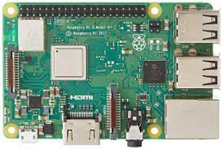

# RaspberryPi 入門

## シングルボードコンピュータ

RaspberryPi というのは、小さいコンピュータの一種である。一枚のボードで出来ているので Single Board Computer (SBC) と呼ばれることがある。

### RaspberryPi の特徴

- Linux をオペレーティングシステムとした小型のコンピュータである
- プログラミングやハードウェア制御に必要な機能を備えている
- Python によるプログラミングが可能である
- 汎用 I/O (GPIO) を使ってハードウェア制御ができる
- 低コストで気軽に始められる
- 多くの教育資源がある：公式サイト、公式サイト以外にもネット上に情報多数あがっている
- (おまけ) 日本のソニー工場で作られているモデルもある

### RaspberryPi はこれくらいの性能

- 安いスマホくらいの性能の CPU ARM
- ネットワーク Ethernet / Wifi もいける
- HDMI (画像、音声)
- 4 つの USB

     
    RaspberryPi 3 Model B+ (というモデル)

現在 RaspberryPi のモデルは最新が 5。ただしもし個人で 5 を買ってみようか、と思っている人は AC アダプタに注意。RaspberryPi 5 は推奨条件が 5V/5A となっており、AC アダプタとしてはなかなか入手が難しい。

- [Raspberry Pi 5は5V/5A対応電源アダプター以外でも使用可能なのか？純正電源と非純正電源で高負荷時の安定性を比較してみた]("https://gigazine.net/news/20231107-raspberry-pi-5-power-supply/")

この授業では Raspberry Pi 3 を使う。

以下、Google の生成 AI Gemini に聞いてみた Raspberry Pi 3 Model B の特徴。

## Raspberry Pi 3 Model Bの特徴

**概要**

Raspberry Pi 3 Model Bは、2016年2月に発売された第3世代のRaspberry Piです。前モデルであるRaspberry Pi 2 Model Bと比べて、以下の点が強化されています。

* **CPU**：Broadcom BCM2837 クアッドコア 1.2GHz から 1.4GHz へ
* **メモリ**：1GB から 1.5GB へ
* **無線LAN**：IEEE802.11n から IEEE802.11ac へ
* **Bluetooth**：Bluetooth 4.1 から Bluetooth 4.2 へ
* **Ethernet**：100Mbps から 1Gbps へ

**詳細**

| 項目 | 内容 |
|---|---|
| CPU | Broadcom BCM2837 クアッドコア 1.4GHz |
| メモリ | 1.5GB LPDDR2 |
| ストレージ | microSDカードスロット |
| ビデオ出力 | HDMI、Composite video |
| オーディオ出力 | 3.5mmジャック |
| USBポート | 4個 |
| Ethernet | 1Gbps |
| 無線LAN | IEEE802.11ac |
| Bluetooth | Bluetooth 4.2 |
| 電源 | 5V/2.5A |
| サイズ | 85mm x 56mm x 17mm |
| 重量 | 45g |

**用途**

Raspberry Pi 3 Model Bは、以下のような用途に使用できます。

* **プログラミング学習**
* **IoTデバイス**
* **メディアセンター**
* **レトロゲーム機**
* **ロボット**
* **電子工作**

**購入方法**

Raspberry Pi 3 Model Bは、以下の方法で購入できます。

* **オンラインショップ**
* **家電量販店**
* **電子工作店**

**価格**

Raspberry Pi 3 Model Bの価格は、販売店によって異なりますが、4,000円前後で購入できます。

## 参考

* Raspberry Pi公式サイト: [https://www.raspberrypi.org/](https://www.raspberrypi.org/)
* Raspberry Pi 3 Model Bの仕様: [https://www.raspberrypi.org/products/raspberry-pi-3-model-b/](https://www.raspberrypi.org/products/raspberry-pi-3-model-b/)

# ARM とは

ARM とは、イギリスにあるファブレス（工場を持たない）会社で、CPU の設計情報を各生産企業 (実際にハードウェアを作る会社) にライセンスしている。みなさんの Android スマホの CPU はほぼ ARM である(iPhone と Windows Phone を除く)。

スマートフォンにおける ARM のシェアは 99% を超えると推定されている。ほぼすべてのスマートフォンは ARM 設計の CPU を搭載していることを意味している。

* インテルとこんなに違う スマホで大躍進、ARMの実像: [https://www.nikkei.com/article/DGXNASFK08015_Y3A300C1000000/](https://www.nikkei.com/article/DGXNASFK08015_Y3A300C1000000/)

