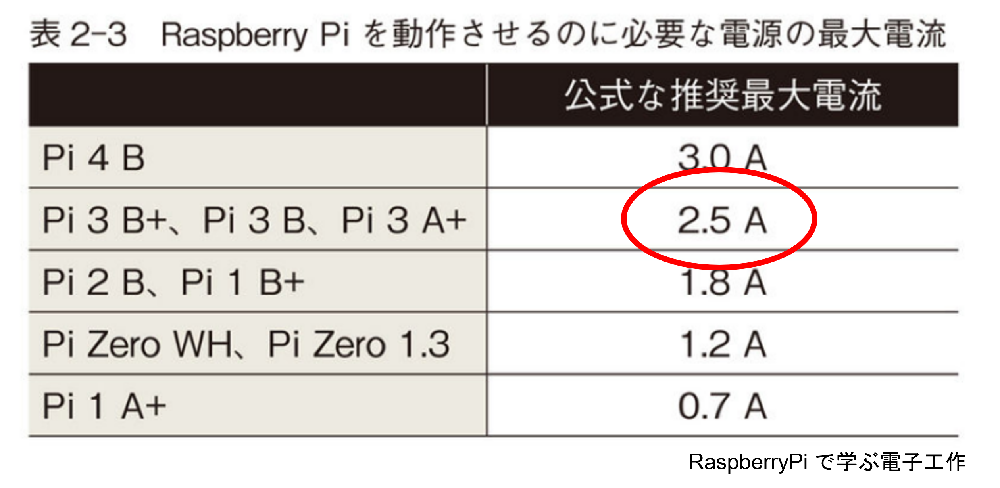

# Raspberry Pi のセットアップ

Raspberry Pi の OS (Linux) はマイクロ SD カードに書き込む。

本来であれば、そこからみなさんに経験してもらいたいところであるが、Windows 上で動作するインストーラーはパソコンの管理者権限が必要となるため、そこは割愛することにします。

RaspberryPi のセットアップの情報はインターネット上にも数多く公開されているので、参考にすればそれほど難しいことはない。興味があれば、家のパソコンなので、ぜひやってみることをお勧めする(インターネットの環境が必要)。

この授業では、Windows PC をつかって SD カードに OS を書き込んだところから、スタートする。

## 参考：RaspberryPi OS セットアップ手順

1. ラズパイ専用インストーラー Raspberry Pi Imager をダウンロード  
    https://www.raspberrypi.com/software/
1. Download for Windows をクリック
1. Imager_X.X.X.exe を実行（Imager がインストールされる）
1. Raspberry Pi Imagerを実行
    - OS を選ぶ
⇒ Raspberry Pi OS (Other)
⇒ Raspberry Pi OS (64-bit)
⇒ SD カードのドライブに書き込まれる


## Linux とは（簡単に）

- ライナス・トーバルズが開発した OS の名前
- UNIX  (ユニックス) という OS を参考にした「ライナスの OS」なので Linux (リナックス) 
- ライナスが開発したのは、狭義の OS (カーネル←「核」という意味)
- メージキャラクタはペンギン

<div style="text-align: center;">
    
</div>

*Ref: 教科書 pp.2 Linux とは*

# Raspberry Pi を起動する

## 機器の接続
USB ポートにキーボードとマウス、HDMI ケーブルをディスプレイの空いているところに差し込み、マイクロ SD カードをスロットに差し込む (カチッというロック機構はない！慎重に奥まで差し込む。過去、先輩は多数 SD カードを壊しました)。
ネットワークケーブルをハブに接続する。

## 電源

USB の口が電源なので、そこに電源を差し込む。電源スイッチはなく勝手に立ち上がる。
2.5A 以上の容量がある AC アダプタを利用すること。
もちろんモバイルバッテリーでも動く。

- 赤い LED : 電源が来ていることを示す
- 緑の LED : いま Raspberry Pi が忙しいことを示す

<div style="text-align: center;">
    </br>
    「RaspberryPi で学ぶ電子工作」
</div>

## セットアップ

画面の指示に従って必要な項目を設定していく。

- Set Country   Japan, Japanese, Tokyo
- Create User   自分の名前など(アルファベット), Password: 忘れにくいもの
- Set Up Screen ふちが黒ければチェック
- ネットワークは有線
- Update Software やらない (Skip)
- Restart

ここまで

## ソフトウェアの更新

Linux はどんどん進化しているので、セットアップ直後の状態が最新とは限らない。そのため、定期的に更新処理をする必要がある。

- 操作画面 (黒い画面) を立ち上げる  
Raspberry Pi アイコン ⇒ アクセサリ ⇒ LXTerminal

- 命令を打ち込む
```
sudo apt udapte             # ソフトウェアを管理しているデータベースを最新にする
sudo apt full-upgrade -y    # データベースと実際がずれていたら実際を更新する
sudo reboot                 # 再起動
```

# Windows からアクセスできるようにする

## Raspberry Pi に名前をつけよう

いまの状態では、全員の Raspberry Pi が同じ名前になっていてネットワークからアクセスしにくい。そこで、それぞれの Raspberry Pi に個別の名前をつけ、Windows から操作できるようにしよう。

Raspberry Pi アイコン ⇒ アクセサリ ⇒ LXTerminal

```
sudo hostnamectl set-hostname kubo-pi   # 苗字-pi, 名前-pi, 星の名前-pi、推しの名前-pi
sudo apt install avahi-daemon           # これから使うソフトウェア
sudo apt install xrdp                   # これから使うソフトウェア
sudo reboot（再起動）
```

再起動完了後、Windows のリモートデスクトップ機能からからアクセスしてみよう。

# いろいろなソフトウェア

Raspberry Pi には無料で使えるさまざまなソフトウェアが用意されている。
なかにはゲームもあるのでいくつか紹介する。

- xgalaga ギャラガ
- Flobopuyo ぷよぷよ
- XShisen 四川省

apt install でインストールでき、メニューのゲームから起動できる。

どんなソフトウェアがあるかはメニューの Add/Remove Software から確認できる。
(インストールはうまく動かなかった)
