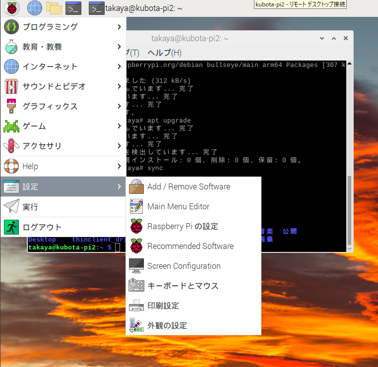

# Rasberry Pi にソフトウェアをインストールする方法

- 画面左上の Raspberry Pi のマーク ⇒ 設定 ⇒ Add/Remove Software から選択

<div style="text-align: center;">
    
</div>

ジャンルごとのソフトウェア一覧が現れるので、検索キーワードなどを入れて検索し希望のソフトウェアをインストールすることができる (はずなのだが私の環境ではうまく動かなかった)。

以下のようにコマンドラインからインストールしたほうが確実。

```
sudo apt install xgalaga
```

こうすると、左上の Raspberry Pi マーク ⇒ ゲームに xgalaga がインストールされる (こちらはうまくいった)。キーボードになれるために、こちらをオススメする。

*Ref:Linux 教科書 pp.363*

# Raspberry Pi の電源の切り方

見てのとおり、Raspberry Pi には電源スイッチがない。電源を供給している USB ケーブルを抜けばその瞬間に電源が切れる。

しかし、Raspberry Pi は高度な？コンピュータなのでそういうことをしてはいけない。次回、立ち上がらなくなるなど不具合の原因となる。

Raspberry Pi など UNIX 由来のコンピュータを電源を切れる状態にすることを **シャットダウン** という。

シャットダウンの方法は大きく 2 つある。

シャットダウンを実行すると Linux は電源を切るための終了処理を始める。  
その間、Raspberry Pi の緑の LED が点滅するので、緑の点滅が収まってから電源ケーブルを抜く。

## GUI からシャットダウンする

- 左上の Raspberry Pi マーク ⇒ ログアウト ⇒ Shutdown を選ぶ
    - Shutdown ... 電源を切れる状態にする
    - Reboot ... 再起動する
    - Logout ... 他の人がログインできるように自分が Raspherry Pi から抜ける

ただし、この方法は GUI が忙しいときなどには動作しないときがある。  
ゲームで忙しいスマホの処理がもどってこないのと同じである。

## コマンドラインからシャットダウンする

そのものズバリ shutdown というコマンドがある。黒い画面 (これを「端末」とか「ターミナル」と呼ぶ) を立ち上げ、以下のように実行する。こちらのほうが確実に動作するので、こちらをオススメする：

```
sudo shutdown -h now
```

解説：

sudo コマンドは実は第１引数以降にある命令を管理者権限で実行してね、というコマンドである。

> sudo <管理者として実行したい命令> <命令に必要な引数>  

> sudo shutdown -h now (管理者として、shutdown 命令を実行)  
> sudo reboot (管理者として、reboot 命令を実行)  

*Ref:Linux教科書 pp.160, pp.26*

**Linux (UNIX) は CLI (Command Line Interface) で使うのが基本**

Linux (UNIX) はその歴史が古いこともあり、GUI (マウスでポチポチ) ではなくキーボードから操作するほうが、より効果的に使うことができる。  
タッチタイピング (キーボードを見ないで打つ) をマスターしないと Linux と仲良くなれない。

# Windows のリモートデスクトップから入る

前回、リモートデスクトップからログインできるように設定した。
もしうまくいかない場合には、ネットワークにつながっているかどうか、Raspberry Pi につけた名前が正しいかどうか、確認すること。

# レトロなゲームたち

いまのスマホとは違う、味わいのあるゲームたちを紹介する。

> sudo apt-get install bsdgames

## hangman

英単語を当てる。当てられないと絞首刑。

## tetris-bsd

言わずとしれたテトリス。j で←、k で回転、l で ⇢、<space> で落下。

## gomoku

五目並べ。「さんさん」は禁じ手ではない。コンピュータが相手をしてくれる。
AI の原点はここにあった。

## rain

雨が降るアニメーションをするだけ。

## worm

数字を食べると、それだけ体が伸びる。自分のからだに噛みつたり周囲の壁にぶつかるとゲームオーバー。これも移動には H,J,K,L を使う。