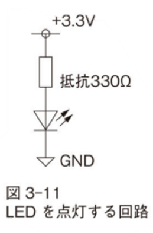
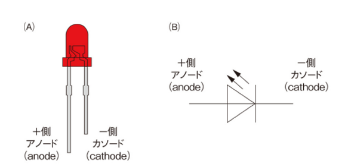
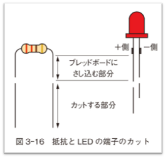
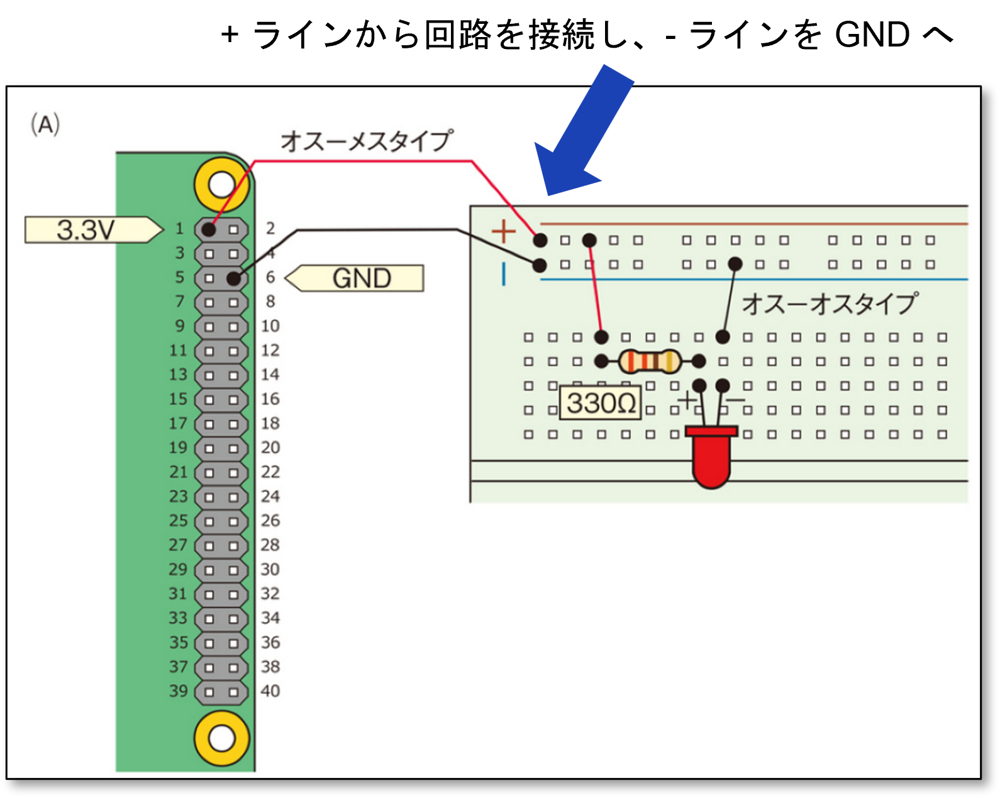

# 電子工作のいろはのい

## L チカ

ここでもまずは L チカに挑戦してみよう。

Rasberry Pi をつかって、LED をチカチカさせてみる。 早速やってみよう。

ブレッドボードを用意し図のように LED を接続してみよう。

<div style="text-align: center;">
    
</div>

**質問：Raspberry Pi の GPIO ピンのなかに 3.3V 電源ピンはどこだろうか？**
```
ヒント：gpio readall してもわかる
```

## LED おさらい

- LED  
電気の流れる向き (電流の向き) が決まっている半導体  
反対方向に電気 (電流) は流れません。

<div style="text-align: center;">
    
</div>


## 質問

1. 330 Ωを取り付ける理由は？
1. LED に流れる電流はいくらか？

[イチケンさんの動画](https://www.youtube.com/watch?v=dmU__4a2cfI) を見てみよう。

# 回路を作るときの注意

(ブレッドボードを使って) 回路を作成するときの注意点をあげておく：

- ジャンパワイヤのオスから指す
- 電源と GND を接触させない
- 抜くときはメスから
- ブレッドボードに適した長さにカットする

<div style="text-align: center;">
    
</div>

## ブレッドボードはうまく使おう

1. ブレッドボードの +/- を使うパターンと使わないパターン
1. 回路が複雑になると (A) のほうがスッキリ

<div style="text-align: center;">
    
    
</div>

## なるべくブレッドボードの図は見ないですむようにしたい

- 回路図から、右のブレッドボードの図がすぐ思いかべられるように慣れる
- ブレッドボード図を見ないで、回路図だけで配線できるように

<div style="text-align: center;">
    
</div>
