# 電子工作のいろはのい

# L チカ

ここでもまずは L チカに挑戦してみよう。

Rasberry Pi をつかって、LED をチカチカさせてみる。 早速やってみよう。ブレッドボードを用意し図のように LED を接続してみよう。

<div style="text-align: center;">
    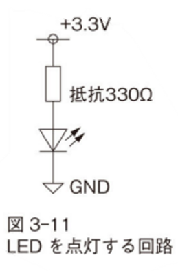
</div>

**質問：Raspberry Pi の GPIO ピンの配列のうち、3.3V 電源ピンはどこにあるだろうか？**

```
ヒント：gpio readall してもわかる
```

## LED のおさらい

- LED  
電気の流れる向き (電流の向き) が決まっている半導体のこと  
反対方向に電気 (電流) は流れません。

<div style="text-align: center;">
    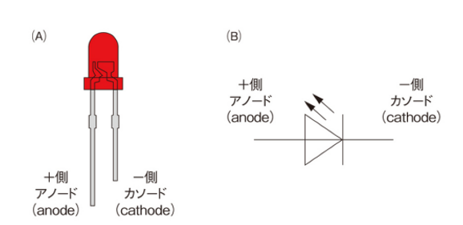
</div>


## 質問

1. 図3-11 で 330 Ωはなぜ必要なのか？
1. このとき、LED に流れる電流はいくらか？

[イチケンさんの動画](https://www.youtube.com/watch?v=dmU__4a2cfI) を見てみよう。

# 回路を作るときの注意

(ブレッドボードを使って) 回路を作成するときの注意点をあげておく。いずれも金属がむき出しのオス側がぶらぶらしてショートしたりしないようにするための注意事項である：

- ジャンパワイヤのオスから指す
- 電源と GND を接触させない
- 抜くときはメスから
- ブレッドボードに適した長さにカットする

<div style="text-align: center;">
    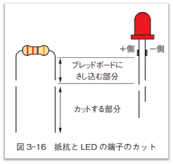
</div>

## ブレッドボードはうまく使おう

ブレッドボードの両サイドは電源と GND が這わせやすいように、タテにつながっている。これをうまく利用してキレイな配線を目指そう。

1. ブレッドボードの +/- を使うパターンと使わないパターン
1. 回路が複雑になってくると (A) のほうがスッキリする

<div style="text-align: center;">
    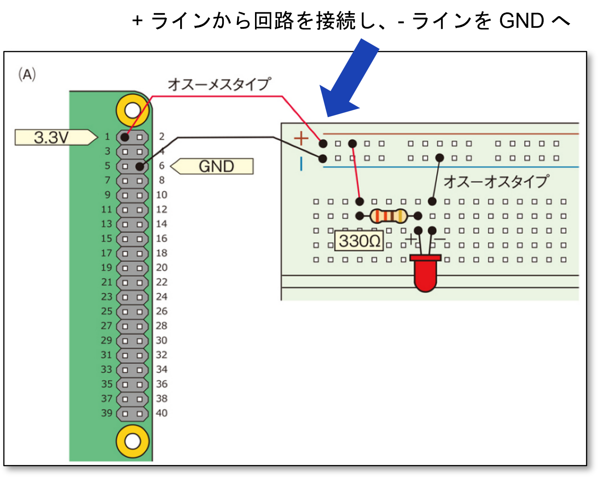
    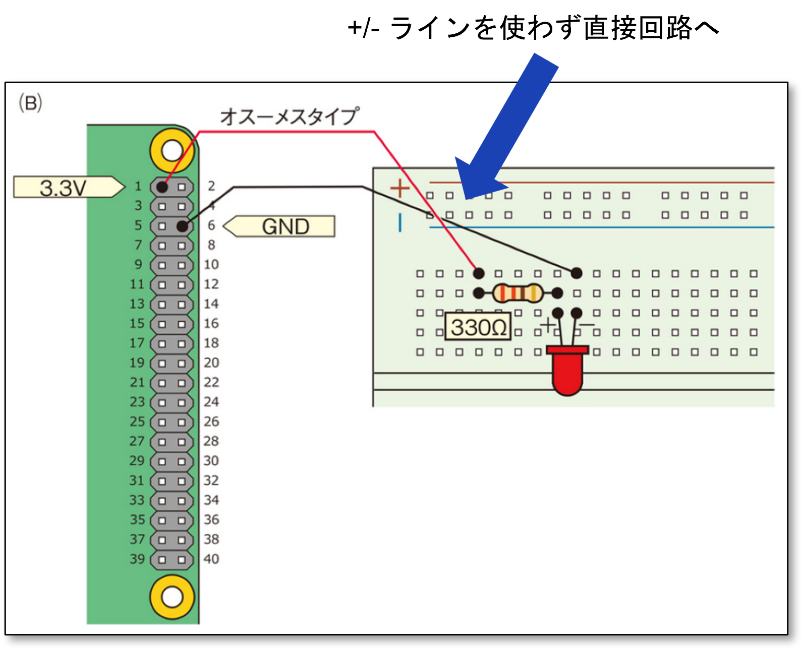
</div>

## なるべくブレッドボードの図は見ないですむようにしたい

- 回路図から、右のブレッドボードの図がすぐ思いかべられるように慣れる
- ブレッドボード図を見ないで、回路図だけで配線できるように

<div style="text-align: center;">
    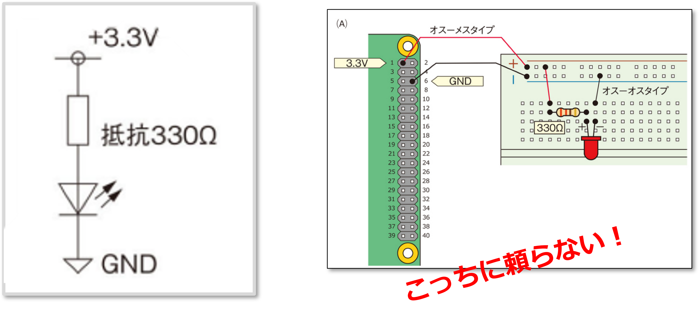
</div>

# L チカプログラミング with Raspberry Pi

いままでの回路は、LED をダイレクトに電源 (3.3V) につないでいたので、L **チカ** しなかった。  
それではいよいよ Rasbperry Pi で L チカしてみよう。  

やることは 2 つ (マイコン制御と同じだ)。

1. 回路を組む
2. GPIO ピンを制御するプログラムを書く

このふたつがないとマイコンでの制御は成立しない。ここでは GPIO25 ピンを使ってみよう。

## 回路図

- GPIO は、信号を出力したり、信号を入力し (受け付け) たりする。
- 出力のとき
  - HIGH ("H" または 1 とも書く)、LOW ("L" または 0 とも書く) のどちらかを出力する
  - 中間はない

回路図はこのようになる：

<div style="text-align: center;">
    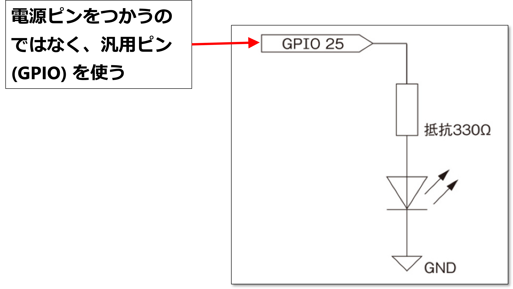
</div>
  
<div style="text-align: center;">
    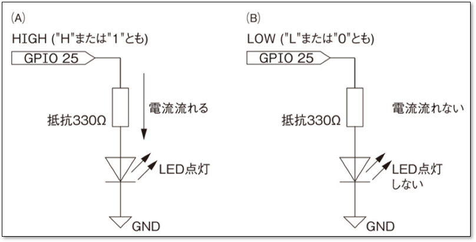
</div>

### Rasberry pi のピン配置

Raspberry Pi のピン配置は図に示すような配置となっている。GPIO 25 とはどこのことだろうか。  
実は Raspberry Pi のピンの番号の付け方には 2 種類ある。

- 物理ピン番号
  - ピン1からピン40まで、コネクタの端から端まで順番に振られた番号
  - 見た目で見やすく、初心者でもわかりやすい番号付け
  - コネクタの向きによってピン番号が変わるため、注意が必要

- BCM ピン番号
  - Broadcomチップ(Raspberry Piのマイコン)で利用されるGPIO(General Purpose Input/Output)ピンに割り当てられた番号
  - 番号は、チップ内での論理的なピン配置に基づいている
  - プログラミングで使用することが多く、常に同じ番号なのでわかりやすい

まとめるとつぎのように言える：

  - 物理ピン番号: 見た目で見やすく、工作に適している
  - BCMピン番号: プログラミングで使いやすい、論理的な番号

**プログラム中では BCM ピン番号を使うことが多いので、注意すること。**

<div style="text-align: center;">
    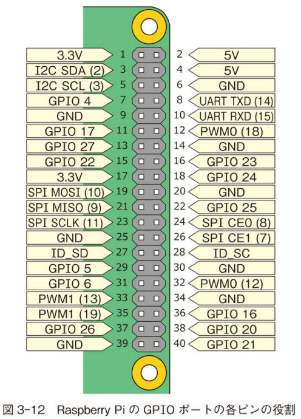
</div>

# Python の開発環境

回路が組めたら、次はプログラミングである。

Raspberry Pi の上で Python のプログラムを動かす方法は実は何通りもあるのだが、ここでは Thonny (ソニー) という実行環境を使う方法を紹介する。Thonny は Windows の mu エディタに似た Python の実行環境である。

<div style="text-align: center;">
    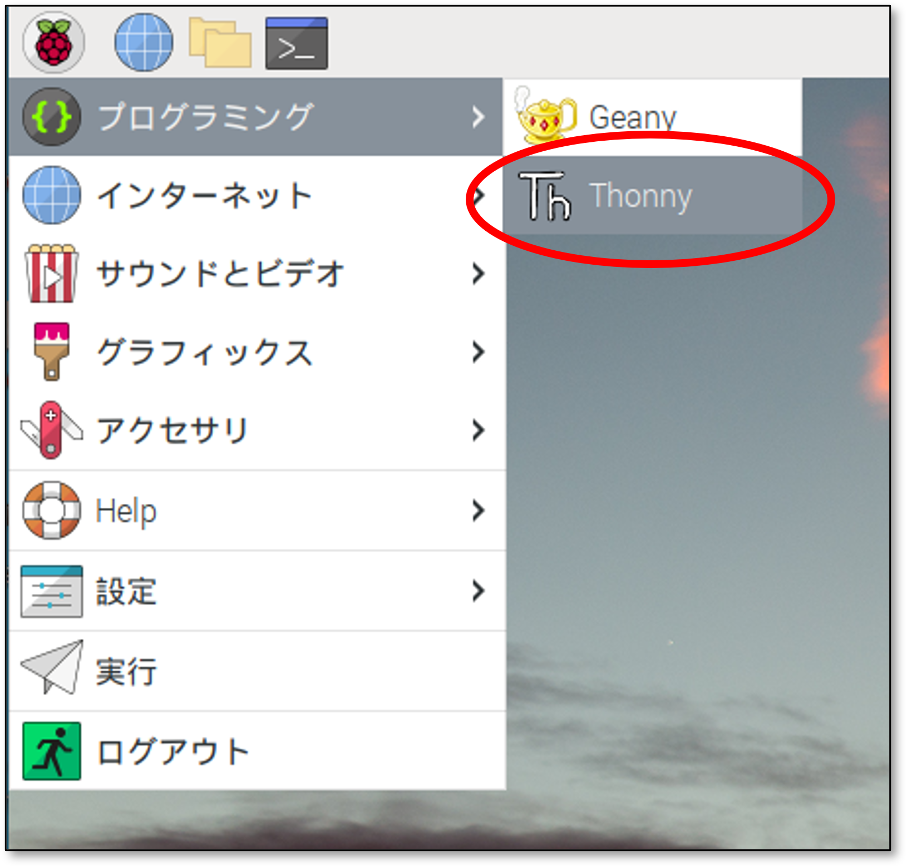
</div>

<div style="text-align: center;">
    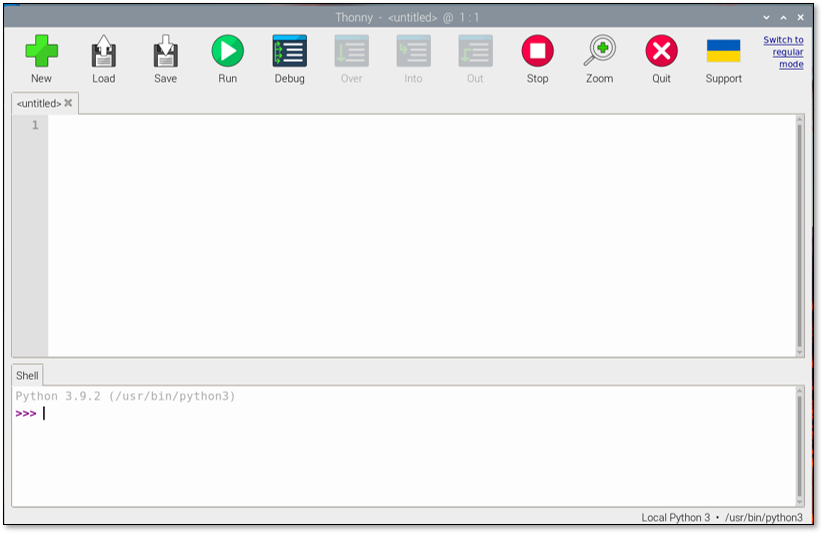</br>
    Mu エディタとそっくり (同じ？？？)
</div>

# プログラムを作ってみよう

- ファイル名を ex1.py として、次のようなプログラムを入力しよう。
- 入力が終わったら、Save アイコンをクリックして ex1.py というファイル名で保存する
- Run アイコンをクリックして、実行する

```python
#
# ex1.py
#
# LED を 300 ms 間隔で点灯するプログラム
#
#
import RPi.GPIO as GPIO             # RPi.GPIO モジュールを GPIO という名前で使う
from time import sleep              # time モジュールから sleep という関数を使う

GPIO.setmode(GPIO.BCM)              # BCM モードでピン番号を指定する
GPIO.setup(25, GPIO.OUT)            # 25 ピンを出力設定にする

while True:
    GPIO.output(25, GPIO.HIGH)      # 25 ピンを HIGH (1) にする  
    sleep(0.3)                      # 300 ms やすむ
    GPIO.output(25, GPIO.LOW)       # 25 ピンを LOW (0) にする  
    sleep(0.3)                      # 300 ms やすむ

GPIO.cleanup()                      # GPIO (汎用ピン) の後処理をする
```

## プログラムの止め方

このプログラムは放って置くと電源が入っている限り永遠に動き続ける。
止めるときは、Stop アイコンをクリックする。不具合でプログラムから応答がなくなったときも Stop アイコンで止めることができる。

Stop アイコンをクリックすると、下の Shell というフィールドに、「何行目で」「どういった理由で止まったか」が **英語で** 表示される。

## ストップボタンで止めても赤文字 (エラー) が出ないようにする

- 下のプログラムを ex1kai.py という名前で保存し、実行してみよう。
- try: ~ except 構文というのが増えている。
  - try: except というのは try: から except の間で所定のエラーが起こったときはどうするか、というのを指示する構文である (ここでは「Keyboard Interrupt というエラーが起こったときは pass をする」と書いてある)

```python
#
# ex1kai.py
#
# LED を 300 ms 間隔で点灯するプログラム
#
#
import RPi.GPIO as GPIO             # RPi.GPIO モジュールを GPIO という名前で使う
from time import sleep              # time モジュールから sleep という関数を使う

GPIO.setmode(GPIO.BCM)              # BCM モードでピン番号を指定する
GPIO.setup(25, GPIO.OUT)            # 25 ピンを出力設定にする

try:
    while True:
        GPIO.output(25, GPIO.HIGH)      # 25 ピンを HIGH (1) にする  
        sleep(0.3)                      # 300 ms やすむ
        GPIO.output(25, GPIO.LOW)       # 25 ピンを LOW (0) にする  
        sleep(0.3)                      # 300 ms やすむ

except KeyboardInterrupt:  # キーボードで中断処理が入ったら
    pass                            # 特になにもしない

GPIO.cleanup()                      # GPIO (汎用ピン) の後処理をする
```

# おまけ: top 命令

Linux には top という命令がある。
- ラズパイの反応がおそいとき使う
- どんなプログラムが動作しているか表示する命令
- 右上の load average: (平均負荷) が忙しさを示す
  - Raspberry Pi の忙しさの目安になる
  - 3.00 を超えてたら、**Raspberry Pi にとっては** かなりヘビー
