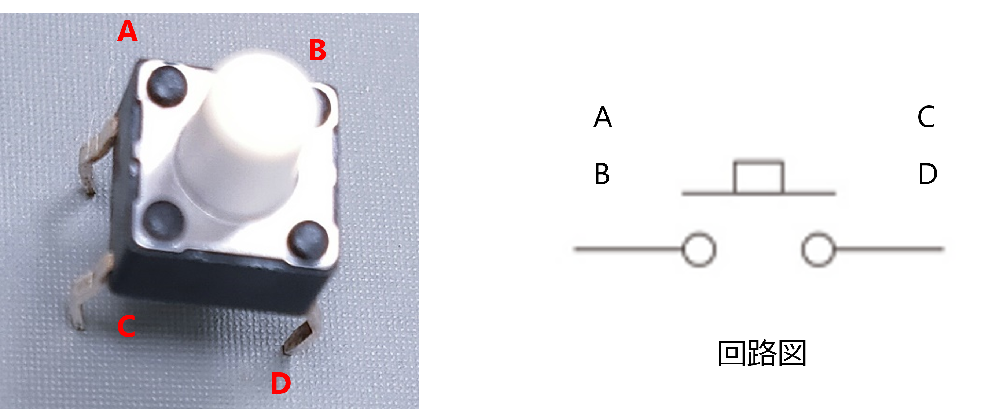
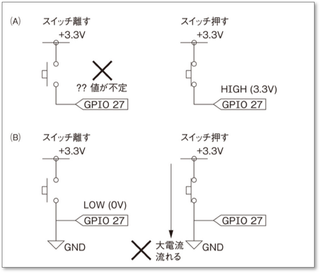
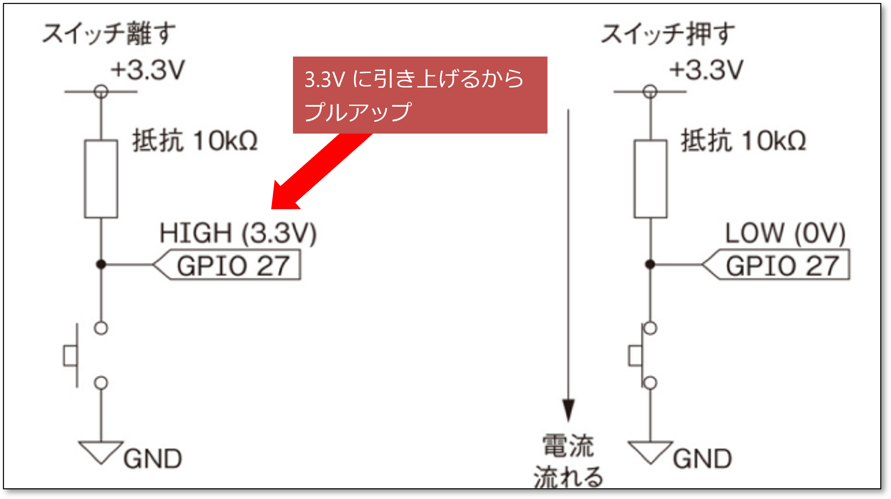
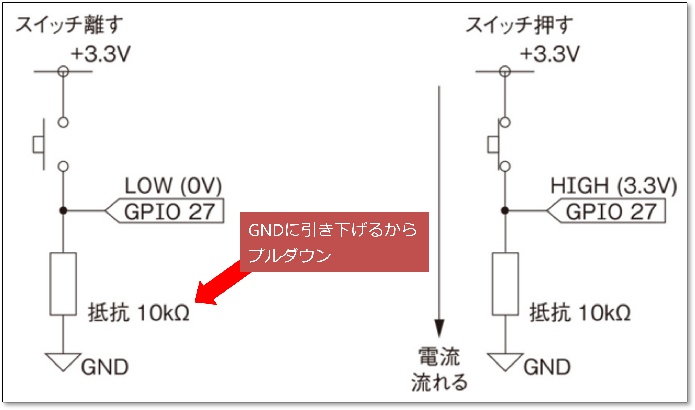
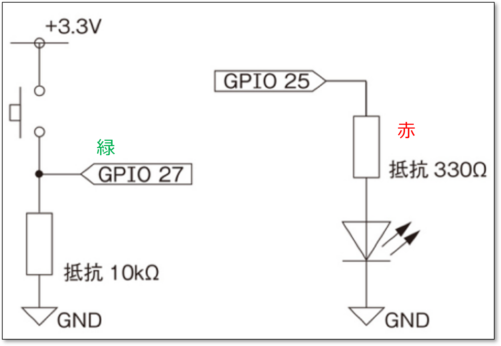

# GPIO からの入力

つぎに GPIO からの入力を実現してみよう。

- タクトスイッチの値を読み取る
  - 押されてる or 押されてない

## 重要！タクトスイッチの注意点

- A と B, C と D は最初からつながっている！  
  つまり A と B, C と D はスイッチの役割は果たさない！
- A と C,  B と D,  A と D,  B と C の組み合わせで初めてスイッチとして動作する
  
<div style="text-align: center;">
    </br>
タクトスイッチ
</div>

## 重要その２！タクトスイッチのあやまった使い方

(A) も (B) もあやまった使い方

- (A) 押してないときがまずい
- (B) 押したときがまずい

<div style="text-align: center;">
    </br>
</div>

## プルアップ抵抗

上のスイッチのつなげ方をどうしたら解決できるだろうか。(A) のときは押してないときが安定すればいい。(B) のときは押したときに無負荷 (ショート) の状態にならなければいい。

ちょっと考えると、下の図のように抵抗を使用すると解決できる。  
押してないとき、GPIO27 の電圧は 3.3V に安定する。
押したときは、0V に安定する。
3.3V に **引き上げる** からこのような抵抗を **プルアップ抵抗** という。

<div style="text-align: center;">
    </br>
</div>

## プルダウン抵抗

もうひとつの解決方法は下の図である。
押してないとき、0V に安定する。
押したとき、3.3V に安定する。
0V に **引き下げる** からこのような抵抗を **プルダウン抵抗** という。

<div style="text-align: center;">
    </br>
</div>

# スイッチが押されている間 LED を点灯する

GPIO 25 と GPIO 27 を使って、スイッチが押されている間、LED がつくような回路およびプログラムを作成しよう。

<div style="text-align: center;">
    </br>
</div>

プログラムは次のようになる。

```python
#
# ex2.py
# GPIO ピン 27 番の状態を読み取って、GPIO 25 ピンに出力するプログラム
#
import RPi.GPIO as GPIO
from time import sleep

GPIO.setmode(GPIO.BCM)
GPIO.setup(25, GPIO.OUT)
GPIO.setup(27, GPIO.IN)

try:
    while True:
        if GPIO.input(27) == GPIO.HIGH:
            GPIO.output(25, GPIO.HIGH)
        else:
            GPIO.output(25, GPIO.LOW)
        sleep(0.1)

except KeyboardInterrupt:
    pass

GPIO.cleanup()
```

# プルダウン抵抗がない

プルダウン抵抗をなくしたら、LED はどうなるだろう？

<div style="text-align: center;">
    </br>
</div>

- どのように変化したか、説明してください。
- なぜそのようになったのか、理由を考察してください。

# 内蔵プルアップ / プルダウン抵抗を使う

- Raspberry Pi にはプルアップ / プルダウン抵抗が内蔵されている
- これをうまく利用すると、抵抗が不要となるため、回路が簡単になる
- プルダウン抵抗を外した回路のままでよい。

```python
#
# ex2-kai.py
# GPIO ピン 27 番の状態を読み取って、GPIO 25 ピンに出力するプログラム
# RaspberryPi 内蔵のプルダウン抵抗を使う
#
import RPi.GPIO as GPIO
from time import sleep

GPIO.setmode(GPIO.BCM)
GPIO.setup(25, GPIO.OUT)
GPIO.setup(27, GPIO.IN, pull_up_down=GPIO.PUD_DOWN)

try:
    while True:
        if GPIO.input(27) == GPIO.HIGH:
            GPIO.output(25, GPIO.HIGH)
        else:
            GPIO.output(25, GPIO.LOW)
        sleep(0.1)

except KeyboardInterrupt:
    pass

GPIO.cleanup()
```
