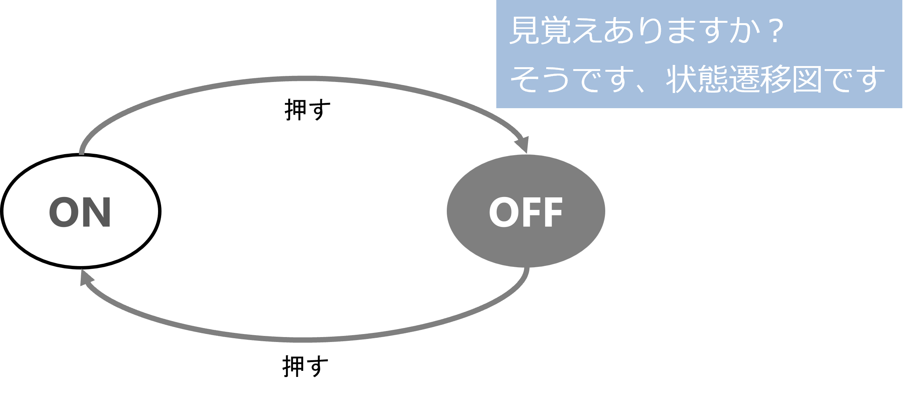
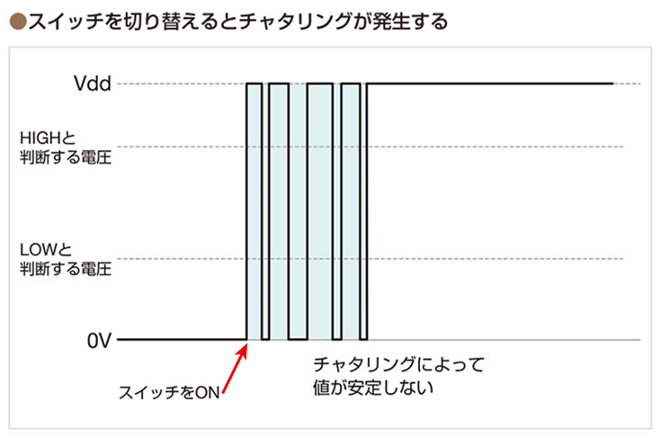
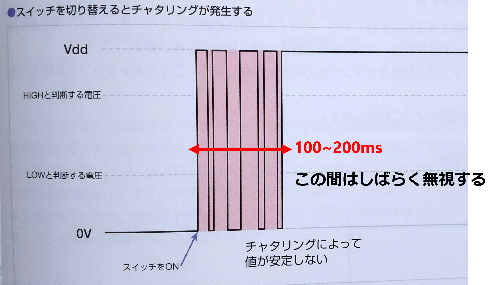
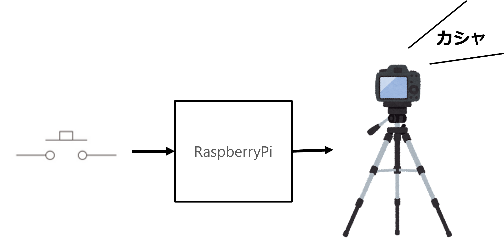

# イベント検出 何かが起きたとき何かする

いままでの方法は、while ループでずっと同じ動作を繰り返すことで GPIO ピンを読んだ瞬間、たまたま ON だったら LED をつけるし、GPIO ピンを読んだ瞬間、たまたま OFF だったら LED を消すという動作をしていた。

この方法は単純で簡単だけれども、プログラムで同時にその別のことをしたくなったとき、その処理を追加するのが難しくなる。
（例えば、スイッチが 10 個に増えたとしよう。そうしたら、 while ループの中には 10 個のスイッチの状態を確認するための if 文が並ぶことになる。）

また、ずっと LED をつけておこうと思ったら、ずっとボタンを押し続けていなければならない。

では一度押したら、LED が ON になり、もう一度押したら LED が OFF なる (これを**トグル動作**という) ように改造してみよう。

<div style="text-align: center;">
    </br>
    <b>「入力に応じて状態が変わる」というのを表現するには状態遷移図が適している</b>
</div>

## ライジングエッジとフォーリングエッジ

このような動作を実現するには、GPIO ピンの状態を観測し、状態が LOW から HIGH に切り替わったら、LED の状態を変更 (今の状態を反転) すればいいことがわかる。
このような波形を指す単語を紹介する。

- Rising edge / Positive edge
信号の立ち上がり、LOW から HIGH に切り替わる瞬間のことをいう

- Falling edge / Negative edge
信号の立ち下がり、HIGH から LOW に切り替わる瞬間のことをいう

加えて、なにか状態を変化させるきっかけになるものを **イベント** という。今回の例で言えば

「GPIO のライジングエッジ / ポジティブエッジ / 立ち上がり を**イベント**として、LED の状態を変更する」

と表現する。

## チャタリング (chattering)

さて、このような物理的なスイッチを相手にしているときには **チャタリング** に注意する必要がある。チャタリングとは、可動接点など物理的なスイッチが接触状態になる際に、微細な非常に速い機械的振動を起こす現象のこと (by ウィキペディア)をいう。

時間はだいたい 100ms ～ 200ms の間、ON/OFF を繰り返し、不安定な状態である。

<div style="text-align: center;">
    </br>
    <i>Ref:マイコン制御 教科書 pp.11*</i>
</div>

チャタリング対策には、ハードウェアで対策する方法とソフトウェアで対策する方法があるが、ここではソフトウェアで対策する方法を紹介する。

やり方は単純で、ライジングエッジ (立ち上がり) またはフォーリングエッジ (立ち下がり) を検出したら、スイッチが安定する間 (100 ~ 200ms)、信号の変化を無視する、という方法である。

<div style="text-align: center;">
    </br>
    <i>Ref:マイコン制御 教科書 pp.11*</i>
</div>

# イベント駆動とポーリング

外部からいつやってくるかわからない「入力」を扱うのには工夫が必要なことがわかったと思う。
人間も話しかけられる前に「ちょっといい？」とか言われないと対応できないのと同じである。

ポーリングとイベント駆動は、どちらもシステムの状態を監視する方法だが、それぞれ異なる動作と特徴を持っている。

**ポーリング**は、システムの状態を定期的に**能動的に**チェックする方法である。具体的には、タイマーなどで一定間隔を空けて状態を調べに行き、変化があればそれに応じて処理を行う。

一方、**イベント駆動**は、システム内で**何らかのイベントが発生したとき**に**受動的に**処理を実行する方法である。イベントとは、ボタンを押したり、データが更新されたり、ネットワーク接続が切断されたりなど、システムの状態変化を表すシグナルのことを言う。

**それぞれの違い**をまとめると以下の表のようになる。

| 項目 | ポーリング | イベント駆動 |
|---|---|---|
| 動作 | 能動的 | 受動的 |
| 処理タイミング | 定期間隔 | イベント発生時 |
| 待ち時間 | 発生したイベントを見逃す可能性がある | イベント発生を確実に検知できる |
| システム負荷 | 一定の負荷がかかる | イベント発生時のみ負荷がかかる |
| 複雑さ | 比較的シンプル | やや複雑 |

**使い分け**

ポーリングとイベント駆動は、それぞれ以下のような場合に適している。

* **ポーリング:**
    * システムの状態変化を頻繁にチェックする必要がある場合
    * イベント発生頻度が低い場合
    * システム構成が比較的単純な場合
* **イベント駆動:**
    * システムへの負荷を最小限に抑えたい場合
    * イベント発生を確実に検知する必要がある場合
    * システム構成が複雑な場合

どちらを選択するかは、システムの要件や状況によって異なります。

**例**

* Webサイトの更新情報を常に最新の状態に保ちたい場合は、ポーリングが適しています。
* ネットワーク接続が切断されたときに自動的に再接続する機能を実装したい場合は、イベント駆動が適してる。
* コンピュータのプログラムはポーリングで処理を行うケースが多い (プログラムが書きやすい)
* PLC (シーケンス制御) はイベント駆動型で処理が進むことが多い

PLC とマイコンでおなじことをするにも作り方のアプローチが異なるので、プログラミングに戸惑うことがある。
あるシステムを作ろうしたとき、「これはどちらの監視方法が適切なのか」を意識して設計するとよい。

## プログラム

説明した

- イベント(ライジングエッジ/フォーリングエッジ) を検出したら LED をつける/消す
- 最初のイベントのあとしばらく (100~200ms)、ピンの変化を無視する

という点が実現できるようにしたプログラムが以下である：

```python
#
# ex3.py
#
# イベント駆動による LED ON/OFF プログラム
#
import RPi.GPIO as GPIO
from time import sleep

#------------------------------------------------------------
# 立ち下がりイベントが発生すると呼ばれる関数
# kansuu(channel)
# channel: どのピンでイベントが発生したか
#------------------------------------------------------------
def kansuu(channel):

    global ledState     # 関数の外側にある ledState を書き換えることを許す
    
    if channel == 27:   # 27 ピンでイベントが発生した
        ledState = not ledState
    
    if ledState == GPIO.HIGH:
        GPIO.output(25, GPIO.HIGH)
    else:
        GPIO.output(25, GPIO.LOW)

#------------------------------------------------------------
#
# 初期設定
#
GPIO.setmode(GPIO.BCM)
GPIO.setup(25, GPIO.OUT, initial=GPIO.LOW)              # 最初は LOW
GPIO.setup(27, GPIO.IN, pull_up_down=GPIO.PUD_DOWN)     # 内蔵のプルダウン抵抗を使う

## イベント発生後、200 ミリ秒、おなじイベントを無視する
GPIO.add_event_detect(27, GPIO.RISING,  callback=kansuu, bouncetime=200)

# 本処理
ledState = GPIO.LOW
try:
    while True:
        sleep(0.01)         # sleep しかしてない
except KeyboardInterrupt:   # Ctrl+C を押されたら
    pass
GPIO.cleanup()              # GPIO の後始末をしておしまい
```

# タクトスイッチをカメラのシャッターにしてみよう

- GPIO 27 の回路 (タクトスイッチ) はそのままで、スイッチが押されたら、USB カメラから画像を取得し、JPEG ファイルにするプログラムを作ってみよう。

<div style="text-align: center;">
    </br>
</div>

## USB カメラのセットアップ

1. USB カメラを Raspberry Pi に接続する
1. fswebcam コマンドをインストールする  
    ```
    sudo apt-get install fswebcam
    ```
1. fswebcam コマンドの動作確認  
    ```
    fswebcam image.jpg	👈 image.jpg という画像ができる（サイズ小さい）  
    fswebcam –r 1280x720 image_large.jpg 👈 高解像度の画像ができる  
    ```

画像がちゃんとできていたら USB カメラは動作している。ただし、このままでは python から制御できない。

## USB カメラを Python から使う準備 OpenCV

### OpenCV 

OpenCVは、オープンソースの画像処理ライブラリで、C++、Python、Javaなど様々な言語に対応している。画像の読み込み、加工、解析、出力など、画像処理に関わる幅広い機能を提供しており、コンピュータビジョン、ロボット工学、拡張現実 (AR)、仮想現実 (VR) などの分野で広く利用されている。

**OpenCVの特徴**は以下の通り。

* **オープンソース:** 無償で利用でき、ソースコードも公開されているため、自由に改変や拡張することができる。
* **豊富な機能:** 画像の読み込み、加工、解析、出力など、画像処理に関わる幅広い機能を提供している。
* **クロスプラットフォーム:** Windows、Linux、macOS、Android、iOSなど、様々なプラットフォームに対応している。
* **活発なコミュニティ:** 世界中に多くのユーザーを抱え、活発なコミュニティが存在する。そのため、問題が発生した際にも、解決策を見つけやすいというメリットがある。

**OpenCVでできること**

OpenCVを利用することで、以下のようなことができる。

* **画像の読み込みと書き込み:** 画像ファイルを読み込んだり、加工した画像をファイルに保存したりすることができる。
* **画像の加工:** 画像の明るさやコントラストを調整したり、色変換を行ったり、回転や拡大縮小を行ったりすることができる。
* **画像の解析:** 画像に含まれる物体を検出したり、顔認識を行ったり、文字認識を行ったりすることができる。
* **画像の出力:** 画像を画面に表示したり、動画ファイルに出力したりすることができる。

**OpenCVの活用事例**

OpenCVは、様々な分野で活用されている。以下に、その一例を紹介する。

* **コンピュータビジョン:** 画像や動画から物体を検出したり、追跡したり、認識したりすることができる。
* **ロボット工学:** ロボットが周囲の環境を認識し、行動するための情報を取得することができる。
* **拡張現実 (AR):** 現実世界に仮想のオブジェクトを重ねて表示することができる。
* **仮想現実 (VR):** ユーザーが仮想空間を体験できるようにすることができる。
* **医療:** 医学画像の分析や診断に利用することができる。
* **セキュリティ:** 顔認証や不正侵入検知に利用することができる。

- Python で画像処理をするためのモジュール OpenCV をインストールする  

    ```
    sudo apt-get install libatlas3-base
    sudo python -m pip install --upgrade pip
    pip install opencv-python
    ```
- OpenCV の動作確認
    Python を起動して、import cv2 という命令が動作すれば OK

    ```
    python
    >> import cv2
    >> exit()
    ```

## apt-get と pip

**apt-get**と**pip**は、どちらもRaspberry Pi（Ubuntu環境）でソフトウェアをインストールするために使用されるツールであるが、それぞれ異なる役割と特徴を持っている。

**apt-get**は、**OSパッケージ**と呼ばれる事前にコンパイルされたソフトウェアパッケージを管理するツールである。OSパッケージは、Ubuntuリポジトリと呼ばれる公式のソフトウェア配布場所から取得される。apt-getを使用すると、OSパッケージのインストール、更新、削除、検索などを簡単に行うことができる。

**pip**は、**Pythonパッケージ**と呼ばれるPython用ライブラリやモジュールを管理するツールである。Pythonパッケージは、PyPIと呼ばれるPython専用のソフトウェア配布場所から取得される。pipを使用すると、Pythonパッケージのインストール、更新、削除、検索などを簡単に行うことができる。

**まとめると、以下の表のようになる。**

| 項目 | apt-get | pip |
|---|---|---|
| 管理対象 | OSパッケージ | Pythonパッケージ |
| ソフトウェア配布場所 | Ubuntuリポジトリ | PyPI |
| 言語 | C言語など | Python |
| 用途 | OS全体の機能拡張 | Pythonアプリケーション開発 |
| 利点 | 安定性が高い、依存関係の解決が容易 | 最新バージョンのインストールが可能 |
| 欠点 | 最新バージョンがすぐに利用できない場合がある | 依存関係の解決が難しい場合がある |

**どちらを選択すべきか**

apt-getとpipは、それぞれ異なる役割を持つため、状況に応じて使い分ける必要がある。

* **OS全体に関わるソフトウェアをインストールしたい場合**は、**apt-get**を使用する。
* **Pythonアプリケーション開発に必要なライブラリやモジュールをインストールしたい場合**は、**pip**を使用する。

## タクトスイッチをシャッターにするプログラム

タクトスイッチを押すと画像を撮るプログラムは次のようになる。

```python
import RPi.GPIO as GPIO
import cv2

i = 0

#------------------------------------------------------------
# イベントが起きたら呼ばれる関数
#------------------------------------------------------------
def kansuu(channel):
    global i
    if channel == 27:           # GPIO 27 でイベントが発生したら
        if image is not None:   # 画像が正常に取得できていたら
            cv2.imwrite(f"capture{i}.jpg", image)
            i += 1

# 初期設定
GPIO.setmode(GPIO.BCM)
GPIO.setup(27, GPIO.IN, pull_up_down=GPIO.PUD_DOWN)
GPIO.add_event_detect(27, GPIO.RISING, callback=kansuu, bouncetime=200)
camera = cv2.VideoCapture(0)    # カメラの撮像を読み取れる状態にする

# ちょっと時間がかかるので、準備ができたら知らせる
print("Setup OK.")

#------------------------------------------------------------
# 本処理
#------------------------------------------------------------
try:
    while True:
        ret, image = camera.read()      # カメラの映像を読み取る
except KeyboardInterrupt:               # Ctrl+C を押されたら
    pass
GPIO.cleanup()                          # GPIO の後始末
camera.release()                        # カメラの後始末
```

# タクトスイッチで音楽を再生してみよう

Raspberry Pi には音楽再生用命令 mplayer がある。mplayer を使って、タクトスイッチを押したら音楽が再生されるように MP3 プレイヤー化してみよう。

- mplayer のインストール
    ```
    sudo apt-get install mplayer
    ```

- mplayer コマンドの動作確認  
    クラスルームのフォルダにある test.mp3 をダウンロード、USB メモリに保存し、Raspbrry Pi にコピーする。

- 再生  
    イヤホンジャックから音がなっていれば成功。
    ```
    mplayer test.mp3
    ```
    
## プログラム

タクトスイッチを押すと LED がついて音楽が流れるプログラム。もう一度押すと、音楽が止まる。
**9行目 *if isPlaying == XXXXXXXX:* のところの右辺は自分で修正すること！**

いろいろ見慣れない命令があるかと思うが、いまは「こんなことができるのか」という程度にとどめておいてほしい。興味が湧いた人は質問してください。いつでも答えます。


```python
import RPi.GPIO as GPIO
from time import sleep
import subprocess

def kansuu(channel):
    global isPlaying
    global process
    if channel==27:
        if isPlaying == XXXXXXXX:
            isPlaying = True
            GPIO.output(25, GPIO.HIGH)
            args = ['mplayer', 'test.mp3']      # $ mplayer test.mp3 を実行する
            process = subprocess.Popen(args)
        else:
            isPlaying = False
            GPIO.output(25, GPIO.LOW)
            args = ['kill', str(process.pid)]   # mplayer の実行プロセスを kill (殺す) する
            subprocess.Popen(args)

#------------------------------------------------------------
# ここから動作開始
#------------------------------------------------------------

# 初期設定
GPIO.setmode(GPIO.BCM)      # BCM 番号を使う

GPIO.setup(25, GPIO.OUT, initial=GPIO.LOW)          # GPIO25 を出力ピンとする、初期値は LOW (=0, GND, 0V)
GPIO.setup(27, GPIO.IN, pull_up_down=GPIO.PUD_DOWN) # GPIO27 を入力ピンとする、内蔵のプルダウン抵抗を使う
GPIO.add_event_detect(27, GPIO.RISING, callback=kansuu, bouncetime=200)

# 本処理
isPlaying = False   # 最初は停止
process = None      # 音楽プログラムは動いていない
try:
    while True:
        sleep(0.01)         # 本処理は sleep してるだけ
except KeyboardInterrupt:   # Ctrl+C を押されたら
    pass
GPIO.cleanup()              # GPIO の後始末をしておしまい
```
