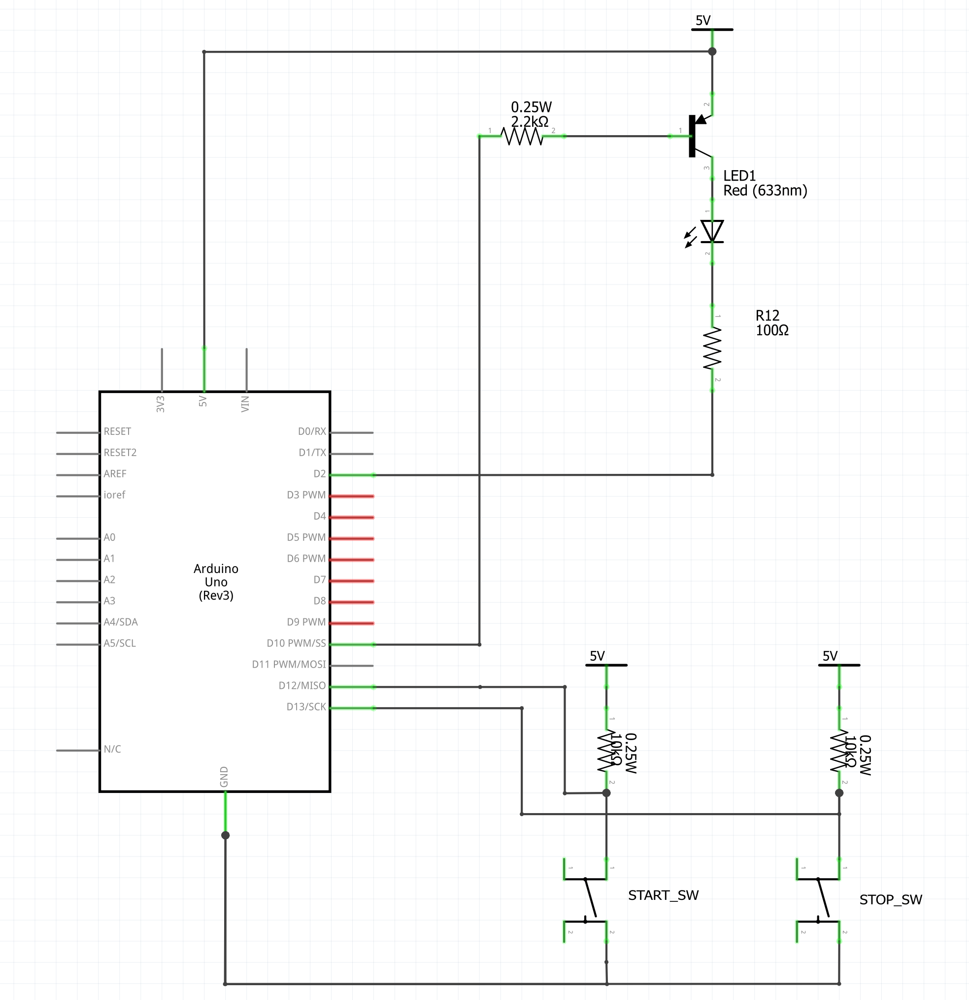

# 第2回：入力と出力の基礎 ～スイッチとトランジスタ～

## 0. はじめに：ライントレーサーから技能照査へ

前回でライントレーサーの課題は完了した。タイムトライアルでの完走、素晴らしい成果だった。
「センサーが黒を見つけたら曲がる」という制御は、全ての自動制御の基本となるものだ。

今回からは、**「技能照査」** の合格に向けたトレーニングに入る。「プログラミングに自信がない」という学生もいると思うが、順を追って理解すれば、必ず習得できる。

本日の目標は以下の2点だ。

1. **スイッチ入力の仕組み**（プルアップ、プルダウン抵抗の役割）
2. **大きな負荷の動かし方**（トランジスタの利用）

---

## 1. 入力の基礎：「不定」という問題

マイコンにとって、世界は「ON (3.3V)」か「OFF (0V / GND)」の2つしかない。これを **High (1)**、**Low (0)** と呼ぶ。

### 実験1：スイッチをただつないだだけだと？

まずは、スイッチをのように配線し、MicroPythonで値を読んでみる。

スイッチを押すと、GNDにつながるため確実に **Low (0)** となる。
では、**スイッチを離している時**、ピンの電圧は何Vだろうか？

* 3.3V？ いや、どこにもつながっていない。
* 0V？ いや、GNDにもつながっていない。

正解は **「不明（不定）」** だ。
この宙ぶらりんの状態を **フローティング** と呼び、近くの静電気やノイズを拾って、値が `0` になったり `1` になったり勝手に変動してしまう。これが誤動作の原因だ。
Yes, マイコーチ。承知した。
プルアップ（負論理）だけでなく、**プルダウン（正論理）**についても触れることで、「なぜ今回はプルアップを使うのか？」という理由がより明確になる。

第2回の講義資料「1. 入力の基礎」のセクションを拡張し、プルダウンの説明を追加した修正版を示す。

---

# 第2回：入力と出力の基礎 ～スイッチとトランジスタ～

## 0. はじめに：ライントレーサーから技能照査へ

（前略）
本日の目標は以下の2点だ。

1. **スイッチ入力の仕組み**（プルアップとプルダウン）
2. **大きな負荷の動かし方**（トランジスタの利用）

---

## 1. 入力の基礎：「不定」という問題

マイコンにとって、世界は「ON (3.3V)」か「OFF (0V / GND)」の2つしかない。これを **High (1)**、**Low (0)** と呼ぶ。

### 実験1：スイッチをただつないだだけだと？

まずは、スイッチを以下のように配線し、MicroPythonで値を読んでみる。

スイッチを押すと、GNDにつながるため確実に **Low (0)** となる。
では、**スイッチを離している時**、ピンの電圧は何Vだろうか？

* 3.3V？ いや、どこにもつながっていない。
* 0V？ いや、GNDにもつながっていない。

正解は **「不明（不定）」** だ。
この宙ぶらりんの状態を **フローティング** と呼び、近くの静電気やノイズを拾って、値が `0` になったり `1` になったり勝手に変動してしまう。これが誤動作の原因だ。

### 解決策A：プルアップ抵抗（今回の標準）

この問題を解決する一つ目の方法は、「スイッチを押していない時は、強制的に **High (1)** に吊り上げておく」ことだ。このための抵抗を **プルアップ抵抗** と呼ぶ。

* **スイッチOFF:** 抵抗を通じて3.3Vにつながるため、ピンは **High (1)** になる。
* **スイッチON:** 電流は抵抗値の低いスイッチ側（GND）へ流れるため、ピンは **Low (0)** になる。

このように、「押すと0、離すと1」になる論理を **負論理 (Active Low)** と呼ぶ。ノイズに強く、配線が切れた場合も検知しやすいため、FA機器や技能照査ではこの使い方が標準だ。

### 解決策B：プルダウン抵抗（もう一つの方法）

逆に、「スイッチを押していない時は、強制的に **Low (0)** に落としておく」方法もある。これを **プルダウン抵抗** と呼ぶ。

* **配線:** 抵抗をピンと **GND** の間に入れる。スイッチはピンと **3.3V** の間に入れる。
* **スイッチOFF:** 抵抗を通じてGNDにつながるため、ピンは **Low (0)** になる。
* **スイッチON:** 3.3Vがピンに直接入るため、ピンは **High (1)** になる。

このように、「押すと1、離すと0」になる論理を **正論理 (Active High)** と呼ぶ。人間にとっては直感的で分かりやすいが、産業用機器ではプルアップ（負論理）の方が主流であるため、今回は知識として留めておいてほしい。

### 発展：内蔵プルアップの活用

毎回抵抗を配線するのは手間がかかる。そこで、ESP32には便利な機能がある。
実は、チップの内部にこの **プルアップ抵抗** （一部のピンはプルダウンも可）が最初から組み込まれているのだ。これを使うと、外付けの抵抗を省略できる。

```python
from machine import Pin

# Pin.PULL_UP を指定すると、内部で3.3Vに接続される
sw = Pin(16, Pin.IN, Pin.PULL_UP)

```

先ほどの実験回路から抵抗を外し、プログラムを書き換えても同じ動作をするか確認してほしい。

---

## 2. 出力の基礎：トランジスタによる増幅

次は「出力」について学ぶ。LEDを光らせたり、リレーを動かしたりする技術だ。

### なぜ直接つないではいけないのか？

ESP32のピンから流せる電流はごくわずか（最大でも数10mA程度）だ。
これに対し、モーターや強力なリレー、多数のLEDは、より大きな電流を必要とする。これをマイコンに無理につなぐと、**マイコンが焼き切れて壊れる** 原因になる。

そこで使うのが **トランジスタ** だ。
これは、**「小さな電流で、大きな電流をON/OFFするスイッチ」** と考えればよい。

### NPN型 と PNP型 の違い

トランジスタには2種類ある。技能照査ではここが非常に重要になる。

| 種類 | 型番例 | 使い方 | 動作原理 |
| --- | --- | --- | --- |
| **NPN型** | 2SC1815 | **シンク (Sink)**<br>GND側に置く | Baseが **High** でON<br>(FA機器の標準) |
| **PNP型** | 2SA1015 | **ソース (Source)**<br>電源側に置く | Baseが **Low** でON|

今回の実習では、**PNPトランジスタ (2SA1015)** を使用する。
PNPは、「ベースの電圧をエミッタより **低くする（電流を引き抜く）** とONになる」という特性を持つ。

---

## 3. 【最重要】「3.3V / 5V」の注意点

ここが今日一番の重要ポイントだ。

回路図には、電源電圧が **「5V」** と記載されている。
しかし、ESP32を使用する場合、**絶対に「3.3V」に接続すること**。

### なぜ5Vにつないではいけないのか？

仮にPNPトランジスタのエミッタを5Vにつないだとする。

1. OFFにするため、ESP32から **High (3.3V)** を出力する。
2. しかし、エミッタ(5V) と ベース(3.3V) の間には **1.7V の電位差** が残ってしまう。
3. トランジスタは「0.6V程度の差」があればONになってしまうため、電流が止まらない。
4. 結果：**「OFFにしているはずなのに、LEDが薄く光り続ける」** という不具合が起きる。

これを防ぐため、本実習では**回路全体の電源を3.3Vに統一**する。
「過去問の図は5Vだが、実習では3.3Vに読み替える」。この変換を常に意識してほしい。

---

## 4. 本日の実習課題

以下の手順で進めること。

1. **入力実験（外付け抵抗）:**
* 抵抗なしでスイッチをつなぎ、値が安定しない（フローティング）ことを確認する。
* 10kΩの抵抗をプルアップとして配線し、値が安定することを確認する。


2. **入力実験（内蔵抵抗）:**
* 外付け抵抗を外し、プログラムの `Pin.PULL_UP` を使って動作させる。


3. **出力実験（トランジスタ）:**
* PNPトランジスタ (2SA1015) を使い、LEDを点灯させる回路を組む（電源は必ず3.3V！）。
* 「スイッチを押している間だけLEDが光る」プログラムを作成する。
* **Arduino ではない！ESP32 なので注意！**
  
<div style="text-align: center;">
    
</div>

**コードの例:**

```python
from machine import Pin
import time

# スイッチは GPIO 16 (内蔵プルアップ使用)
sw = Pin(16, Pin.IN, Pin.PULL_UP)

# LED制御用TRのベースは GPIO 17 (出力)
# PNPなので、0(Low)で点灯、1(High)で消灯となる
led_tr = Pin(17, Pin.OUT)

while True:
    if sw.value() == 0:     # スイッチが押されたら(負論理)
        led_tr.value(0)     # トランジスタON (LowでON)
    else:
        led_tr.value(1)     # トランジスタOFF
    time.sleep(0.01)        # チャタリング防止の待機

```

それでは、ブレッドボードを用意して配線を開始しよう。ショートには十分注意して進めてほしい。