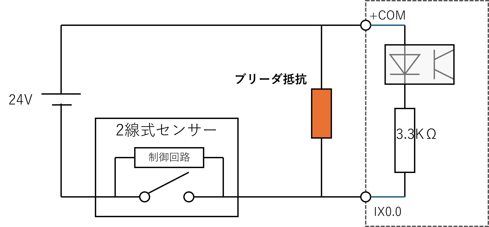

# PLC 応用編

## 2 線式のリーク電流 (漏れ電流) 対策

ピックアンドプレースのシリンダの上下を感知するセンサーとして **2 線式** リードスイッチが採用されている。
2 線式というのは言葉のとおりセンサー (スイッチ) から 2 本の線しか出ていない形のものである。

2 線式スイッチ (2線式センサー) はセンサーが OFF の 場合でも、センサ内部の回路を動作させるための電流が生じる。
これを **漏れ電流** という。
2 線式スイッチと直列にフォトカプラを接続した場合、フォトカプラがこの漏れ電 流で ON してしまうことがある (実際、そのまま使うとずっと ON 状態になってしまう)。

これを防ぐのがブリーダー抵抗による分流である。

 
<strong>電流が流れてしまうのを防ぐ</strong>

## ブリーダ抵抗の値を求める

### センサーの仕様を確認する

- SMC D9MB シリーズ
  - https://www.smcworld.com/assets/manual/ja-jp/files/D-xS-OMJ0003.pdf
  - **漏れ電流 0.8mA 以下**

- PLC 基板の負荷抵抗
  - 3.3KΩ

- フォトカプラ (TLP785) の入力 OFF になる電流
  - 0.1mA 以下

$R_{b} = V_{L} / I_{R} = (R_{in} * I_{LED})/(I - I_{LED})$  

$R_{in}= 3.3KΩ, I_{LED}=0.1mA, I=0.8mA$ より

$R_{b} = (3.3KΩ * 0.1mA) / (0.8mA - 0.1mA) = 471Ω$

したがって、$I_{LED} < 0.1mA$ を保証するにはブリーダ抵抗 $R_{b}$ は 471Ω以下が必要。
小さい値を選定する。
