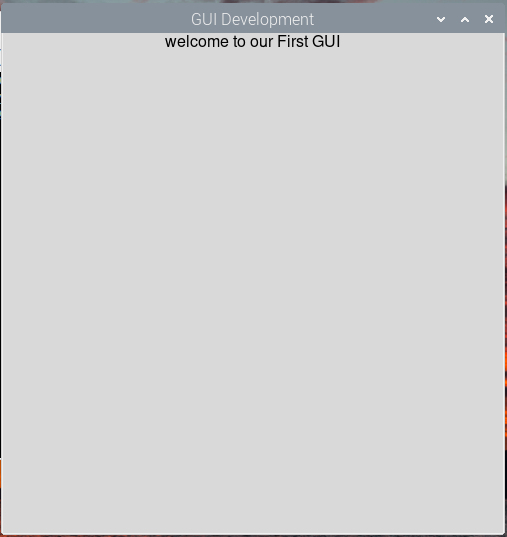

# Raspberry Pi でグラフィカルユーザーインターフェース (GUI) を作成する

グラフィカルユーザーインターフェース（GUI）は、センサーと対話するための便利な手段を提供する。
基本的に、GUIはグラフィカルなアイコンを通して、人間とコンピュータ周辺機器との間のコミュニケーションを提供する。

従来、エンジニアはハイエンドで高性能なコンピュータ向けの GUI を開発してきたが、その傾向は変化しつつある。

近年、市場にはシングルボードコンピューティング（SBC）プラットフォームが増加しており、これらのプラットフォームは安価で持ち運びやすく、消費電力が少なく、計算能力も同等である。
そのため、一部の開発者は SBC 向けの GUI 開発ツールを開発している。

このドキュメントでは、 Raspberry Pi 用の GUI を開発し、ユーザーが GUI を介してデバイスを制御し、センサーと対話する方法を説明する。

## ユーザーインターフェースとは何ですか?

ユーザーインターフェースとは、ユーザーがコンピュータアプリケーションを操作するためのツールである。
高度なユーザーインターフェースには、ディスプレイ、タブ、グラフ作成コンポーネント、分析機能などが含まれる場合がある。
表示したいものや制御したいものによって、その種類は異なる。
優れたユーザーインターフェースとは、使いやすく、理解しやすく、そして何よりも操作しやすいインターフェースとなる。
つまり、ユーザーが混乱することなく、必要な操作を実行できなければならない。

## Guizero とは何か?

PySimple GUI と Guizero は、GUI開発で人気のツールである。
ここでは、GUI 開発に Guizero を使用する。

---
**■ PySimple GUI**

PySimple GUI はボクシングゲームで利用している GUI プログラミングツールである。
Guizero よりも高度な (見栄えのいい) プログラミングが可能。
また Linux (RaspberryPi) でも Windows でも同じプログラムが利用できる。

---

Guizero は、Python 3 を使って Raspberry Pi 上でシンプルなGUIを開発できる、イベント駆動型のグラフィカルユーザーインターフェースフレームワークである。

このライブラリは、GUI 開発に必要なウィジェット (画面上の部品のこと) を提供する Tkinter と連携する。
Guizeroを使用する最大の利点は、その抽象度の高さである。他のソフトウェアライブラリと同様に、Guizeroは難しい部分を「隠蔽」するため、開発者は低レベルの実装を気にすることなく複雑な GUI を完成させることができる。

Guizero はオブジェクト (これも部品のこと) を使用して、Raspberry Pi上でグラフィカルユーザーインターフェース（GUI）を開発できるようにする。ここでは、組み込みオブジェクトの大部分で十分です。
ただし、より高度な GUI を開発するには、大量のライブラリが必要になる場合があります。GUIの開発に使用できるオブジェクトのリストを以下に示す。

Guizeroのドキュメントの詳細な説明は、こちら https://lawsie.github.io/guizero/ で確認できる。


| | |
|--|--|
|オブジェクト	| 説明 |
| App	| この App オブジェクトは GUI のメインウィンドウを作成する。このウィンドウには、GUI 内で使用されるすべてのウィジェットが含まれる。   `app = App()`|
| ButtonGroup	| このオブジェクトはラジオ ボタンのグループを作成し、ユーザーはグループから 1 つのオプションを選択できる。 `select = ButtonGroup(app, options=["mon", "tue", "wed","thurs", "fri"], selected="mon")。`|
| CheckBox	| CheckBox オブジェクトには、ユーザーがオプションにチェックを入れたり外したりできるチェックボックスが表示される。`checkbox = CheckBox(app, text="request leave")`|
| Box	||
| Combo	| Combo は、ユーザーがオプションのリストから 1 つのオプションを選択できるドロップダウン ボックスを表示する。`combo = Combo(app, options=["mon", "tue", "wed","thurs", "fri"])`|
| Drawing |	ユーザーはこのオブジェクトを使用して、図形、画像、テキストなどのビジュアルを作成できる。`drawing.rectangle(10, 10, 60, 60, color="blue")`|
| Listbox |	ListBox にはアイテムのリストが表示され、ユーザーはリストから 1 つまたは複数のアイテムを選択できる。`listbox = ListBox(app, items=["mon", "tue", "wed","thurs", "fri"])`|
| Menubar	| このオブジェクトは画面の上部にメニューを作成し、各メニューオプションはサブメニューにつながる。`menubar = MenuBar(app, toplevel=["File", "Edit"], options=[ [ ["File option 1", file_function], ["File option 2", file_function] ], [ ["Edit option 1", edit_function], ["Edit option 2", edit_function] ] ])`|
|Picture|	Picture は画像を表示する。`picture = Picture(app, image="test.gif")`|
|PushButton| このオブジェクトは、ユーザーが押すと関数を呼び出すボタンを表示する。`def display_msg(): print("This is our PushButton")。button = PushButton(app, command=display_msg)`|
| Slider | Slider にはバーとセレクターが表示され、ユーザーはこれを使用して範囲内の値を指定できる。 `slider = Slider(app)`|
| Text	| このオブジェクトは GUI にテキストを表示する。テキストはタイトル、ラベル、説明などを参照するために使用できる `text = Text(app, text="Hello World")`|
| TextBox | このオブジェクトを使用すると、ユーザーはボックスにテキストを入力できる。`mytextbox = TextBox(app)`|
|||

## Guizero のインストール方法

Guizero のインストールには Python3 が必要である (いまみんなが使っているのは Python3 なので問題ない)。インストールするには　`pip install guizero` コマンドを使用する。 

Raspberry Piで GUI を開発するには、デスクトップ版の OS が必要である。OS Lite版（デスクトップ版なし）では動作しない。(伊藤先生が最初使ったバージョン)

## Guizero の使い方

Guizeroの使い方は非常に簡単である。
前述の通り、このライブラリは Raspberry Pi での GUI 開発を簡素化するために開発された。

以下は、テキストメッセージのみを表示するシンプルな GUI を作成する例である。

以下のコードを適切な Python ファイルとして保存し、`python myFile.py` と実行してみよう。

```python
from guizero import App, Text
app = App(title="GUI Development")
message = Text(app, text="welcome to our First GUI")
app.display()
```

### コードの説明

- Python では、スクリプトで使用したいソフトウェアモジュールをインポートする。
今回は　Guizero　モジュールをインポートしたいので、以下のように記述する。  
`from guizero import App, Text`  
ここでは、Guizero ライブラリから Text インターフェースと App インターフェースを明示的にインポートしている。
- `app = App(title="GUI Development")`  
このコード行を使用して、タイトルが「GUI Development」である App (Window) のインスタンス (実体) を作成する。
- `message = Text(app, text="Welcome to our First GUI")`  
表示するメッセージ。
- `app.display()`
  アプリをディスプレイ上に表示する。ユーザーがウィンドウの閉じるボタンを押してアプリを終了するまで、ターミナルは起動したままになる。さらに、このコード行は GUI 上のイベントを待機する無限ループに入る。ユーザーがボタンをクリックしたり、テキストを入力したりするなどのイベントを待機する。



シンプルな「Hello World」GUI

## 優れたGUIデザインのヒント

優れた GUI を設計するための重要なヒントを 3 つ紹介する。

- スタイル、フォーマット、外観に注意する
- アイコンとボタンに明確なラベルを付ける
- インターフェースはシンプルに保つ
 
# サンプルプロジェクト1：LED 制御

このサンプルプロジェクトでは、Guizero を使って GUI を構築する練習する。
GUIにインタラクティブ性を組み込む方法を学ぶ。

プロジェクトを構築するために必要な部分は次のとおり：
- ラズベリーパイ
- ジャンパー線
- ブレッドボード
- 330オームの抵抗器1個
- 1つのLED

すべての部品が揃ったら、配線図に従ってすべてを接続する。


単一LED制御の回路図

## 単一LED制御
最初の例では、3 つのボタンを持つ GUI を作成する方法を説明する。

ユーザー が GUI から LED のオン/オフを切り替えられるようにしたい。
この段階ではスタイル設定 (見栄え) は重要ではない。
GUI 開発の原則を学ぶことだけが目的である。
ただし、今後の Guizero サンプルではスタイル設定 (見栄え) の概念を取り上げる可能性がある。
単一の LED を制御するコードを以下に示す。

```python
from gpiozero import LED
from time import sleep
from guizero import App, Text, PushButton
import sys

myled = LED(10)

def switch_on():
  print("ON")
  myled.on()

def switch_off():
  print("OFF")
  myled.off()

def close_gui():
  sys.exit()
  myled.off()

def blink_LED():
  count = 0
  while count < 5:
    myled.on()
    sleep(1)
    myled.off()
    sleep(1)
    count+=1

app = App(title="LED Control")

button1 = PushButton(app, command=switch_on, text="LED ON", width=10,height=3)
button2 = PushButton(app, command=switch_off, text="LED OFF", width=10,height=3)
button3 = PushButton(app, command=blink_LED, text = "Blink LED", width=10,height=3)
button4 = PushButton(app, command=close_gui, text="Close", width=10, height=3)

app.display()
```

## コードの説明

- `from gpiozero import LED, from time import sleep, from guizero import App, Text, PushButton`  
これらの宣言を使用して必要なモジュールをインポートする。Guizeroモジュールからは、App、Text、PushButtonウィジェットをインポートしている。
- `myled = LED(4)`  
  LED を Raspberry Pi のピン 4 に接続する。
- 次に、プログラムの4つの関数を定義する。`switch_on(), switch_off(), blink() and close_gui()`  
これらの関数は、それぞれ LED のオン、LED のオフ、1秒遅延での LED の点滅、GUI の終了に使用する。
- `width=10, height=3` は、ボタンの高さと幅を設定するために使用される。

## GUIからLEDを点滅させる

LED を 1 秒間隔で点滅させる従来のコードは次のようになります。
```python
def blink_LED():
  while True:
    myled.on()
    sleep(1)
    myled.off()
    sleep(1)
```

このコードは、この関数をスタンドアロン関数として使用する場合は問題なく動作する。
しかし、GUI 内で無限ループを使用すると問題が発生する。
多くの場合、アプリがクラッシュし、コンピューターの再起動が必要になるが、これはプログラム実行時に望ましくない事態である。

ユーザーが「Blink LED」ボタンを押したときに、LED を無限に点滅させる代わりに、カウンターを設定し、一定時間 LED を点滅させている。LEDが点滅している間、GUI はコマンドを受け付けない。

現在のループの実行が終了したときにのみ、新しいコマンドを受け付ける。
これはプログラムで考慮すべき点であることに注意する。

## 複数の LED 制御 (フルカラー LED の制御)

1つの LEDを 制御するためのコードを修正し、複数のLEDを制御できるようにする。
1つの LED のオン/オフを切り替えるために 2 つのプッシュボタンを使用する代わりに、
1つのプッシュボタンで LED の状態を切り替える。
これはコードを削減し、その過程で別の興味深い機能を紹介することを目的としている。
3つの LED を制御するため、各 LED を切り替えるための3つのプッシュボタンを用意する。
もう1つのボタンは、すべての LED を同時に点滅させるためのものである。

必要な部品は次のとおりです。

- ラズベリーパイ
- ジャンパー線
- ブレッドボード
- 220　Ωの抵抗器3個
- 3つのLED

すべての準備ができたら、次のように回路を接続する。

複数のLEDを制御するための回路図

```python
from gpiozero import LED
from time import sleep
from guizero import App, Text, PushButton
import sys

led1 = LED(10)
led2 = LED(9)
led3 = LED(11)

def toggleLED1():
    led1.toggle()
    if led1.is_lit:
        button1.text="LED OFF"
    else:
        button1.text="LED ON"

def toggleLED2():
    led2.toggle()
    if led2.is_lit:
        button2.text="LED OFF"
    else:
        button2.text="LED ON"

def toggleLED3():
    led3.toggle()
    if led3.is_lit:
       button3.text="LED OFF"
    else:
       button3.text="LED ON"

def close_gui():
    sys.exit()

def blink_LEDs():
    count = 0
    while count < 5:
        led1.on()
        led2.on()
        led3.on()
        sleep(1)
        led1.off()
        led2.off()
        led3.off()
        sleep(1)
        count+=1

app = App(title="LED Control", layout="grid", height=600, width=800)
Text(app, "Red", grid=[0,0])

button1 = PushButton(app, command=toggleLED1, text="ON", width=10,height=3, grid=[1,0])
Text(app, "Orange", grid=[0,1])

button2 = PushButton(app, command=toggleLED2, text="ON", width=10,height=3, grid=[1,1])
Text(app, "Green", grid=[0,2])

button3 = PushButton(app, command=toggleLED3, text = "ON", width=10,height=3, grid=[1,2])
Text(app, "Blink LEDs", grid=[0,3])

button4 = PushButton(app, command=blink_LEDs, text="Blink LEDs", width=10,height=3, grid=[1,3])
button5 = PushButton(app, command=close_gui, text="Close", grid=[1,4])

app.display()
```

## コードの説明

前のセクションのコードとすべて同じである。
唯一の違いは、LEDを追加し、gpiozeroの関数 `led.toggle()` を使用していることである。

# サンプルプロジェクト2: センサーの読み取り値を表示する

2つ目の例では、センサーデータを確認するためのプッシュボタンを備えたGUIを作成する。

データが利用可能な場合は、DHT11 温湿度センサーからの温度と湿度の値を表示するテキストアプリを作成する。
目的は、ユーザーが対応するプッシュボタンを押した際に更新される GUI の温度と湿度を表示することである。最後に、閉じるボタンを使用してアプリを終了する。

必要な部品は次のとおり:

- ラズベリーパイ
- ジャンパー線
- ブレッドボード
- DHT11 温度湿度センサー
- 10Kオームの抵抗器

すべての部品が揃ったら、配線図に従って回路を組み立てる。回路は前回やった回路と同じになる。

```python
from guizero import App, Text, PushButton
from time import sleep
import board
import sys
import adafruit_dht

dht = adafruit_dht.DHT11(board.D4)

def close_gui():
  sys.exit()

def temp():
    try:
        text1.value="{0:0.2f}".format(dht.temperature)
    except RuntimeError:
        print("RuntimeError")

def humid():
    try:
        text2.value="{0:0.2f}".format(dht.humidity)
    except RuntimeError:
        print("RuntimeError")

app = App(title="Temperature_Humidity GUI", layout="grid")

# 温度を取得する
PushButton(app, command=temp, text="Check Temperature", width=15,height=3,grid=[0,0])
text1 = Text(app, text="{0:0.2f}".format(dht.temperature), grid=[1,0])
Text(app, text="*C", grid=[2,0])

# 湿度を取得する
PushButton(app, command=humid, text="Check Humidity", width=15, height=3, grid=[0,1])
text2 = Text(app, text="{0:0.2f}".format(dht.humidity), grid=[1,1])
Text(app, text="%", grid=[2,1])

# 終了する
PushButton(app, close_gui, text="close", grid=[1,2])

# アプリを表示する
app.display()
```
