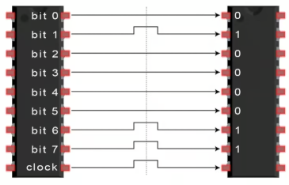
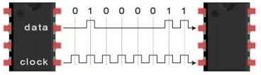
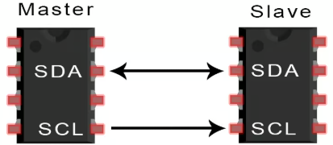
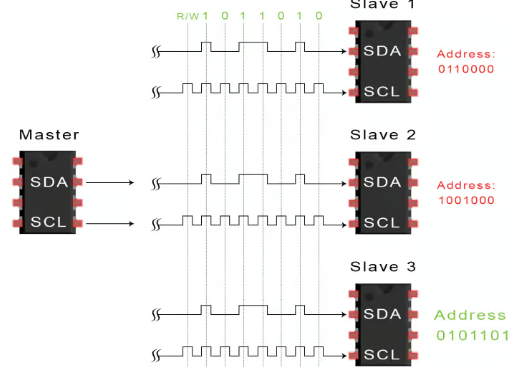
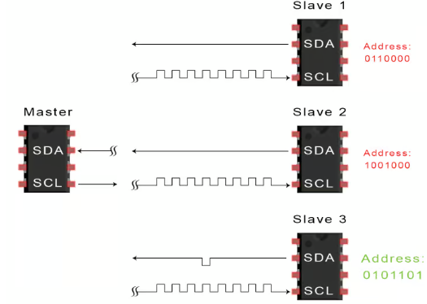
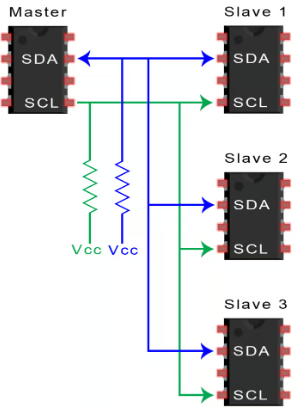
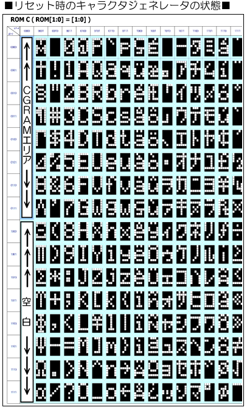

# I2C 通信プロトコルの基礎

マイコンにセンサーやディスプレイ、その他のモジュールを接続するとき、２つのデバイスがどのように通信するのか、考えたことはあるだろうか。
どのようにお互いの情報を理解できるのだろうか？

電子機器間の通信は、人間同士のコミュニケーションに似ている。
双方が同じ言語を話す必要がある。電子工学では、これらの言語は **通信プロトコル** と呼ばれます。
幸いなことに、ほとんどの電子機器プロジェクトで知っておく必要がある通信プロトコルはごくわずかである。

最も一般的なプロトコルに、
- シリアル・ペリフェラル・インターフェース（**SPI**）
- インター・インテグレーテッド・サーキット（**I2C**）
- ユニバーサル・非同期送受信（**UART**）駆動型通信

の３つがあるが、ここでは **I2C** の基本について説明する。

まず、電子通信の基本概念を説明し、次に **I2C** について詳しく説明する。

SPI、I2C、UARTは、USB、イーサネット、Bluetooth、WiFiなどのプロトコルに比べて速度がかなり遅いが、はるかにシンプルで、ハードウェアとシステムリソースの使用量が少なくて済む。
SPI、I2C、UARTは、大量の高速データを転送する必要のないマイクロコントローラー間やマイクロコントローラーとセンサー間の通信に最適である。

## シリアル通信とパラレル通信

電子機器は、デバイス間を物理的に接続された配線を介してビット単位のデータを送信することで相互通信を行う。
ビットは、2 進数で、1 または 0 の 2 値のみとなる。ビットは電圧の急激な変化によってデバイス間で転送される。5V (または 3.3V) で動作するシステムでは、0 ビットは **0 V** の短いパルスとして通信され、1 ビットは **5V (3.3V)** の短いパルスとして通信される。

データビットは並列 (パラレル) または直列 (シリアル) 形式で伝送できる。
並列 (パラレル) 通信では、データビットはすべて同時に、それぞれ別の線を通して送信される。
次の図は、2進数の文字「C」（01000011）の並列 (パラレル) 通信を示している (clock が H になった瞬間を読み取るという約束にする)。



シリアル通信では、ビットは1本の線を通して1つずつ送信される。次の図は、2進数の文字「C」（01000011）のシリアル伝送を示している (同様に clock が H になった瞬間を読み取るという約束にする)。



## I2C 通信入門

I2C は、様々なデバイスで使用される一般的な通信プロトコルである。
例えば、液晶ディスプレイ (LCD) や SDカードリーダーモジュール、RFIDカードリーダーモジュールなどは、すべて I2C を使用してマイクロコントローラーと通信する。

I2C 経由で通信するデバイスは、マスター (主人) とスレーブ (召使) の関係にある。
マスターは制御デバイス（通常はマイクロコントローラ）であり、スレーブ（通常はセンサー、ディスプレイ、またはメモリチップ）はマスターからの命令を受け取る。

I2C の最もシンプルな構成は、マスター 1 台とスレーブ 1 台のシステムであるが、1つのマスターで複数のスレーブを制御することもできる（詳細は後述）。

これは、複数のマイクロコントローラで単一のメモリカードにデータを記録したり、単一のLCDにテキストを表示したりする場合などに非常に便利である。

I2C はデバイス間でデータを送信するために 2 本のワイヤのみを使用する。



- SDA (シリアルデータ)  
マスターとスレーブがデータを送受信するためのライン
- SCL (シリアルクロック)  
クロック信号を伝送するライン
  
I2C はシリアル通信プロトコルなので、データは単一のワイヤ (SDA ライン) に沿ってビットごとに転送される。

I2Cは同期型であるため、ビット出力はマスターとスレーブ間で共有されるクロック信号によって同期される。クロック信号は常にマスターによって制御される。

**■ I2C の仕様**
|||
|----|----|
|使用する線|2 本|
|通信速度|標準 100Kbps|
|　|ファストモード 400Kbps|
|　|ハイスピードモード 3.4Mbps|
|　|ウルトラファストモード 5Mbps|
|同期 / 非同期 | 同期
|シリアル / パラレル | シリアル通信
|マスターの数|制限なし
|スレーブの数|最大 1008
|||

## アドレス

スレーブは複数設置できるため、データが他のスレーブではなく自分宛てに送信されていることを知らせる方法が必要である。
これは **アドレス指定** によって行われる。アドレスは常に、新しいメッセージを始めるときに必ず指定される。
マスターは、通信したいスレーブのアドレスを、接続されているすべてのスレーブに送信する。
各スレーブは、マスターから送信されたアドレスと自身のアドレスを比較する。アドレスが一致した場合、低電圧の ACK ビットをマスターに返す。
アドレスが一致しない場合、スレーブは何もせず、SDA ラインはハイレベル (5V) のままとなる。

1. マスターがアドレスを指定する


2. 一致したスレーブが ACK (0, 0V) を返す


## 複数のスレーブを持つ単一のマスター

I2Cはアドレス指定を使用するため、1つのマスターから複数のスレーブを制御できる。
7ビットアドレスでは、128（2の7乗）通りの一意のアドレスが利用可能である。
10ビットアドレスの使用は一般的ではないが、1,024（2の10乗）通りの一意のアドレスが利用可能である。
複数のスレーブを 1 つのマスターに接続するには、SDA ラインと SCL ラインを4.7KΩ の **プルアップ抵抗** でVccに接続し、次のように配線する。



## I2C の利点と欠点
### メリット

- 2本のワイヤーのみ使用する。
- 複数のマスターと複数のスレーブをサポートする。
- ACK/NACKビットは各フレームが正常に転送されたことを確認する。
- ハードウェアが、他の通信方法に比べてシンプル。
- よく知られ、広く使用されているプロトコルである。

### デメリット
- データ転送速度が他のプロトコルと比較して遅い。
- データフレームのサイズは 8 ビットに制限される。

## i2cset や lcd.py は何をしている？

以下のコマンドを実行すると、画面に "Hi!" と表示されることを前回確認した。

```sh
$ i2cset -y 1 0x3c 0x00 0x01 # Reset
$ i2cset -y 1 0x3c 0x00 0x02 # Clear Display
$ i2cset -y 1 0x3c 0x00 0x0F # Display ON
$ i2cset -y 1 0x3c 0x00 0x01 # Clear Display
$ i2cset -y 1 0x3c 0x40 0x48 # "H"
$ i2cset -y 1 0x3c 0x40 0x69 # "i"
$ i2cset -y 1 0x3c 0x40 0x21 # "!"
```

1 行目は I2C ライン上 (SCL, SDA) に、

- アドレス 0x3c のスレーブに
- 0x00 (読み出し命令)
- 0x01 (リセット機能)
 
という命令を送っている。4 行目までは同じである。

5 行目は

- アドレス 0x3c のスレーブに
- 0x40 (書き込み命令)
- 0x21 (!)
 
という命令を送っている。

どんな文字が使えるかはマニュアルに記載されている。


## lcd.py 
lcd.py では　`display.writeLine()` 関数のなかで、一文字ずつ分解して I2C 命令を液晶ディスプレイに送っている (だけ)。

```python
# 1文字ずつ送信
for c in str:
  self.bus.write_byte_data(self.addr, 0x40, ord(c))
  time.sleep(0.001)
```

# 練習
上の表を参考にして、i2cset 命令を使って半角カタカナで自分の名前を表示させてみよう。
