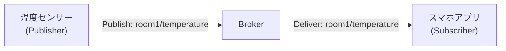
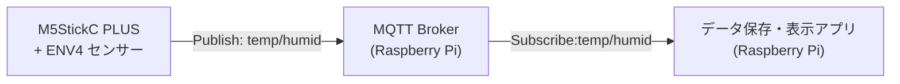

# MQTT（Message Queuing Telemetry Transport）とは

## 1. 概要
MQTT（エムキュー・ティーティー）は、  
**機械やセンサー同士がインターネット経由でデータをやりとりするための通信プロトコル**である。  
IoT（Internet of Things）の分野でよく使われる。

特徴は、
- 軽量（少ないデータ量で通信できる）
- 信頼性を選べる（重要度に応じた配信モード）
- ネットワーク環境が悪くても動作しやすい

---

## 2. 仕組み（Publish / Subscribe モデル）
MQTTは、**サーバ（ブローカー）**と**クライアント**で構成される。

### 基本の流れ
1. **Publish（発行）**  
   センサーや機器がデータを「トピック」に対して送信する。
2. **Broker（ブローカー）**  
   受け取ったデータを、必要としているクライアントに配信する中継役。
3. **Subscribe（購読）**  
   クライアントが特定の「トピック」を購読し、データを受け取る。

このとおり、MQTT は

- Publisher という情報を提供するクライアント
- Broker という情報を中継するサーバー
- Subscribe という情報を読み取るクラアント
  
という３種類の登場人物がいる。

このうち、情報を中継する Broker は実はいくつかインターネット上に「実験につかっていいよ」という名目で無料のものが公開されている。
今回はこれをつかってみよう。

→ 無料 MQTT Broker :　broker.emqx.io

※ ただし、無料で使える Broker は通信流量制限があったり、暗号化がされていなかったりする。秘密のデータを送るのはやめましょう。そういうときは、有料サービスを利用するか、独自に Broker を設置しましょう。

### イメージ図



- 温度センサーは「room1/temperature」というトピックに温度データを発行する。
- スマホアプリは「room1/temperature」を購読してデータを受け取る。

---

## 3. MQTTのメリット
- **軽い**: データヘッダが小さい（数バイト程度）
- **柔軟**: 1対1、1対多、多対多の通信が可能
- **省電力**: センサーなどバッテリー駆動の機器に向いている
- **標準化**: ISO標準（ISO/IEC 20922）になっている

---

## 4. 工学分野での利用例
- 工場内のセンサー情報収集（温度、湿度、振動など）
- ロボットやドローンの遠隔制御
- 環境モニタリング（天気観測、河川水位監視）
- スマートホーム機器の連携（照明・エアコン制御）

---

## 5. まとめ

MQTTは、
- 「軽くて省電力」
- 「柔軟でシンプル」
なIoT向け通信プロトコル。  

---
#  課題：M5StickC PLUS と ENV4 を用いた MQTT 温湿度データ収集

せっかくなので、MQTT を使って IoT らしいことをやってみよう。
M5Stick の環境センサー ENV 4 で読み取った温度と湿度データを収集する。

## 1. 課題概要

本課題では、小型マイコン **M5StickC PLUS2** と環境センサー **ENV Unit 4（SHT40 搭載）** を使用し、  
**温度・湿度データを MQTT を介して Raspberry Pi に送信し、収集・表示するシステム**を構築する。

目的は以下の通り：
- IoTの基本的なセンサー計測と通信の仕組みを理解する。
- MQTTのPublish/Subscribeモデルを体験する。
- Raspberry Piで受信データを保存・可視化する基礎スキルを身につける。

---

## 2. システム構成


## 3. 使用機材・環境
- M5StickC PLUS（ESP32搭載）
- ENV Unit 4（温度・湿度・気圧センサー SHT40 / BMP280）
- 接続用ケーブル（Grove）
- Raspberry Pi（Wi-Fi 接続可能なモデル）
---

## 4. 課題内容

### (1) センサー計測
- M5StickC PLUS と ENV4 を接続し、SHT40 センサーから温度・湿度を取得する。
- 1秒〜5秒間隔でデータを取得。

### (2) MQTT送信（Publish）
- 取得した温湿度データを JSON 形式で MQTT ブローカーに送信する。
- トピック例：
  - 温度：`<出席番号>/env4/temperature`
  - 湿度：`<出席番号>/env4/humidity`

### (3) Raspberry Piでの受信（Subscribe）
- Python を用いて MQTT ブローカーからデータを購読。
- 受信データをコンソールに表示し、CSVファイルに保存する。

### (4) データ可視化（任意／加点課題）
- 保存したデータをグラフ化（matplotlibなどを使用）。
- 1時間・1日の変化を確認。

---

## 5. 実行例

### 送信データ（M5StickC PLUS → MQTT Broker）
```json
{
    "temperature": 27.4,
    "humidity": 58.3
}
```

### Raspberry Pi 側 受信表示例

```
[2025-04-15 10:03:21] Temp: 27.4 °C, Humid: 58.3 %
[2025-04-15 10:03:26] Temp: 27.5 °C, Humid: 58.1 %
```

---

## 6. 提出物

* M5StickC PLUS 側のプログラムコード
* Raspberry Pi 側の受信プログラムコード
* 動作中のスクリーンショット（送信・受信）
* 実験結果のCSVファイル
* レポート（以下を含む）

  * 実験目的
  * システム構成図
  * 実装手順
  * 結果と考察
  * 改善点や応用例

---

## 7. 評価基準

| 項目                  | 配点  |
| ------------------- | --- |
| センサー計測が正しくできている     | 20点 |
| MQTT送信が正しくできている     | 20点 |
| Raspberry Piでの受信と保存 | 20点 |
| レポート内容の充実度          | 20点 |
| 発展的要素（可視化・追加機能）     | 20点 |

---

## 8. 発展課題例

* 気圧データも追加送信する
* センサー値の異常検知（閾値を超えたら通知）
* Webブラウザでリアルタイム表示
