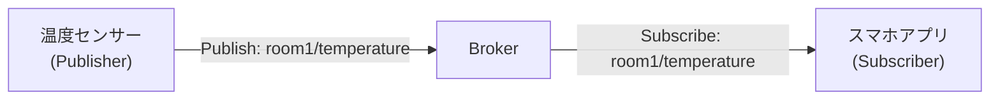
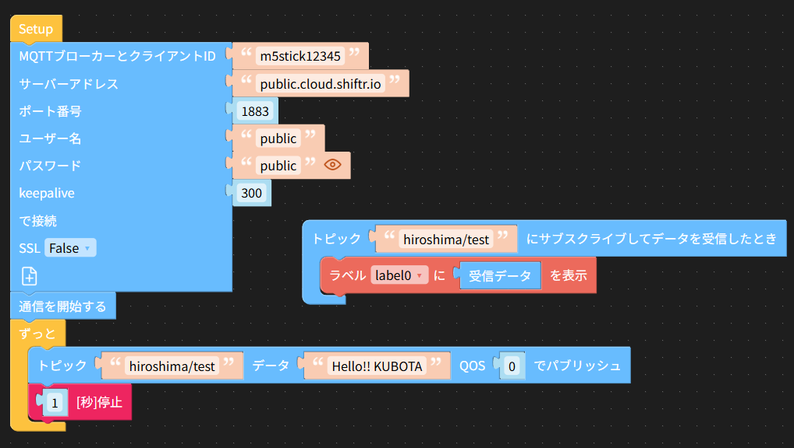
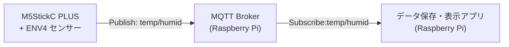

# MQTT（Message Queuing Telemetry Transport）

## 1. 概要
MQTT（エムキュー・ティーティー）は、  
**機械やセンサー同士がインターネット経由でデータをやりとりするための通信プロトコル**である。  
IoT（Internet of Things）の分野でよく使われる。

特徴は、
- 軽量（少ないデータ量で通信できる）
- 信頼性を選べる（重要度に応じた配信モード）
- ネットワーク環境が悪くても動作しやすい

---

## 2. 仕組み（Publish / Subscribe モデル）
MQTTは、**サーバ（ブローカー）**と**クライアント**で構成される。

### 基本の流れ
1. **Publish（発行）**  
   センサーや機器がデータを「トピック」に対して送信する。
2. **Broker（ブローカー）**  
   受け取ったデータを、必要としているクライアントに配信する中継役。
3. **Subscribe（購読）**  
   クライアントが特定の「トピック」を購読し、データを受け取る。

このとおり、MQTT は

- Publisher という情報を提供するクライアント
- Broker という情報を中継するサーバー
- Subscribe という情報を読み取るクラアント
  
という３種類の登場人物がいる。

このうち、情報を中継する Broker は実はいくつかインターネット上に「実験につかっていいよ」という名目で無料のものが公開されている。
今回はこれをつかってみよう。

→ 無料 MQTT Broker :　public.cloud.shiftr.io

※ ただし、無料で使える Broker は通信流量制限があったり、暗号化がされていなかったりする。秘密のデータを送るのはやめましょう。そういうときは、有料サービスを利用するか、独自に Broker を設置しましょう。

### イメージ図



- 温度センサーは「room1/temperature」というトピックに温度データを発行する。
- スマホアプリは「room1/temperature」を購読してデータを受け取る。

---

## 3. MQTTのメリット
- **軽い**: データヘッダが小さい（数バイト程度）
- **柔軟**: 1対1、1対多、多対多の通信が可能
- **省電力**: センサーなどバッテリー駆動の機器に向いている
- **標準化**: ISO標準（ISO/IEC 20922）になっている

---

## 4. 工学分野での利用例
- 工場内のセンサー情報収集（温度、湿度、振動など）
- ロボットやドローンの遠隔制御
- 環境モニタリング（天気観測、河川水位監視）
- スマートホーム機器の連携（照明・エアコン制御）

---

## 5. まとめ

MQTTは、
- 「軽くて省電力」
- 「柔軟でシンプル」
なIoT向け通信プロトコル。  

## 6. MQTT で通信してみる

M5Stick C PLUS2 / UIFlow は MQTT を扱う機能がある。まずはこれを使って MQTT の仕組みを理解しよう。
まずは単純に、自分が送ったメッセージを自分で受け取ってみる。
前述のとおり、MQTT はデータを仲介する Broker という存在が必須である。インターネット上には無料で利用できる Broker があるので、今回はそれを利用してみよう。

ディスプレイに lavel0 を配置して添付のプログラムを組む：

- MQTTブローカーとクライアントID："m5stick+出席番号" 各装置でユニークでないといけない 
- サーバーアドレス: public.cloud.shiftr.io (これが Broker)
- ポート番号: 1883
- ユーザー名: public
- パスワード: public
- keepalive: 300
- SSL: False

- トピック: hiroshima/test (トピックは '/' で区切る)
- **「通信を開始する」ブロックを忘れるな！**
  このブロックを忘れてぜんぜん動作しなかったぞ！



## 7. Raspberry Pi で受信してみる

Raspberry Pi で送信もできるが、まず受信のほうから。
はじめに Python の MQTT 通信モジュール paho.mqtt をインストールする。

```sh
$ sudo pip install paho-mqtt
```

以下のプログラムでは MQTT ブローカー public.cloud.shiftr.io のトピック hiroshima/test に流れてきたメッセージをサブスクライブ (購読) する。

```python
import paho.mqtt.client as mqtt

# 接続時のコールバック
# 接続が成功するとこの関数が実行される。
def on_connect(client, userdata, flags, rc):
    print("接続結果: " + str(rc))
    # トピックを購読
    client.subscribe("hiroshima/test")

# メッセージ受信時のコールバック
# メッセージを受信するとこの関数が実行される。
def on_message(client, userdata, msg):
    print(f"受信: トピック={msg.topic}, メッセージ={msg.payload.decode()}")

# クライアント生成
client = mqtt.Client()

# コールバック登録
client.on_connect = on_connect
client.on_message = on_message
client.username_pw_set("public", "public")

# ブローカーに接続
client.connect("public.cloud.shiftr.io", 1883, 60)

# メインループ
client.loop_forever()
```

---
#  課題：M5StickC PLUS と ENV4 による WBGT 値報告システム

せっかくなので、MQTT を使って IoT らしいことをやってみよう。
M5Stick の環境センサー ENV4 で読み取った温度と湿度データから WBGT を計算、収集する。

これは実際に先生達の間で「WBGT 値を毎日エクセル表に手書きしろ」という仕事が増えそうだったためにつくったところにアイディアがある。

## 1. 課題概要

本課題では、小型マイコン **M5StickC PLUS2** と環境センサー **ENV Unit 4（SHT40 搭載）** を使用し、  
**温度・湿度データから WBGT を計算、 MQTT を介して Raspberry Pi に送信し、収集・表示するシステム**を構築する。

目的は以下の通り：
- IoTの基本的なセンサー計測と通信の仕組みを理解する。
- MQTTのPublish/Subscribeモデルを体験する。
- Raspberry Piで受信データを保存・可視化する基礎スキルを身につける。

## WBGT値って？

昨今の地球温暖化により暑さ指数 **WBGT 値** という値がよく話題に登るようになった。
WBGT値（Wet Bulb Globe Temperature：湿球黒球温度） とは、熱中症リスクを判断するための指標である。気温だけでなく、湿度・日射（輻射熱）・風の影響 を総合的に取り入れて算出される。

ざっくり言うと、「体が受ける暑さの総合指数」 で、気温よりも実際の体感リスクに近い値である。

ちなみに WBGT 値の単位は ℃ である。一般的に以下のような指針とされている。

| 暑さ指数（WBGT） | 注意レベル | 熱中症予防のための運動指針 |
|----|---|---|
|31℃以上|危険|運動は原則中止|
|28℃以上31℃未満|厳重警戒|激しい運動は中止、積極的に休憩|
|25℃以上28℃未満|警戒|積極的に休憩、水分・塩分補給|
|25℃未満|注意|適宜水分・塩分補給

### 簡易 WBGT 値
本来 WBGT 値は、
- 湿球温度計
- 黒球温度計
- 乾球温度計
 
という通常の温度計ではない温度計を使用して測定する。さすがにこれらの温度計は用意が夏目、今回は ENV4 から得られる温度と湿度から近似値を求める方法をとる。

計算式は以下とする：
$WBGT≈0.735×T+0.0374×RH+0.00292×T×RH−4.06$
$T ... 温度 [℃]$
$RH ...湿度 [\%]$

※ 正確な値とは完全には一致しないが、十分目安となる

---

## 2. システム構成



## 3. 使用機材・環境
- M5StickC PLUS（ESP32搭載）
- ENV Unit 4（温度・湿度・気圧センサー SHT40 / BMP280）
- 接続用ケーブル（Grove）
- Raspberry Pi（Wi-Fi 接続可能なモデル）
---

## 4. 課題内容

### (1) センサー計測
- M5StickC PLUS と ENV4 を接続し、SHT40 センサーから温度・湿度を取得し WBGT を計算する。
- 5秒間隔でデータを取得。

### (2) MQTT送信（Publish）
- 取得した温湿度データを JSON 形式で MQTT ブローカーに送信する。
- トピック例：
  - 温度：`env4/temperature/<出席番号>`
  - 湿度：`env4/humidity/<出席番号>`
  - WBGT：`env4/wbgt/<出席番号>`

### (3) Raspberry Piでの受信（Subscribe）
- Python を用いて MQTT ブローカーからデータを購読。
- 受信データをコンソールに表示し、CSVファイルに保存する。

### (4) データ可視化（任意／加点課題）
- 保存したデータをグラフ化（matplotlibなどを使用 ← 中田先生の授業でやった）。
- 1時間・1日の変化を確認。

---

## 5. 実行例

### 送信データ（M5StickC PLUS → MQTT Broker）

JSON フォーマットという形式を利用すると、複数の値を一度に送ることもできる：

```json
{
    "tempature": 27.4,
    "humidity": 58.3,
    "wbgt": 20.6,
}
```

### Raspberry Pi 側 受信表示例

```
[2025-04-15 10:03:21] Temp: 27.4 °C, Humid: 58.3 %, WBGT 20.6
[2025-04-15 10:03:26] Temp: 27.5 °C, Humid: 58.1 %, WBGT 25.3
```

---

## 6. 提出物

* M5StickC PLUS 側のプログラムコード (UIFlow のキャプチャか Python のコード)
* Raspberry Pi 側の受信プログラムコード
* 動作中のスクリーンショット（送信・受信）
* 実験結果のCSVファイル
* レポート（以下を含む）

  * 実験目的
  * システム構成図
  * 実装手順
  * 結果と考察
  * 改善点や応用例

---

## 7. 評価基準

| 項目                  | 配点  |
| ------------------- | --- |
| センサー計測が正しくできている     | 20点 |
| MQTT送信が正しくできている     | 20点 |
| Raspberry Piでの受信と保存 | 20点 |
| レポート内容の充実度          | 20点 |
| 発展的要素（可視化・追加機能）     | 20点 |

---

## 8. 発展課題例

* 気圧データも追加送信する
* センサー値の異常検知（閾値を超えたら通知）
* Webブラウザでリアルタイム表示
