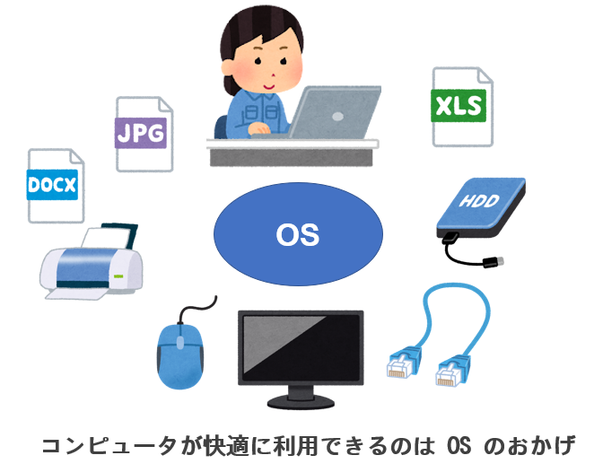

# OS とはなにか。

まずは言葉から。

OS は Operating System (オペレーティングシステム) の略である。

何をするためのものか、というとハードウェアとアプリ（ソフトウェア）と利用者 (ユーザー) のそれぞれを橋渡しする特別なソフトウェアである。

たとえば、プリンター。いろいろなプリンタが売られているが、Windows を使っていれば、どのメーカーのプリンタでも「印刷」命令で利用できる。

マウスやキーボードだって USB のクチに挿せば利用できる。特別な設定は不要である（ときどきいるけど）。

印刷命令を呼び出して、印刷している間、印刷が終わるまで PC がそれにかかりきりになって、他の仕事は一切できない状態になってしまっているだろうか？そんなことはない。
印刷している最中も、ウェブサイトを見たり、ゲームをしたりすることができる。

Word やパワポを動かしているあいだ、Youtube を見たり LINE で通信できたり、Spotifyで音楽を聞いたりできる。

これらはすべて OS が裏方として動作しているからである。

OS がやっていることは、

**コンピュータのハードウェア資源 (画面やキーボード、CPU、メモリ、プリンタ、USB のクチ etc)　を管理し、ユーザーの要求にそのリソースを提供することである。**

また、**要求が終わればそのリソースを回収するのも大事な仕事だ。**

ということで、世の中にはさまざまなコンピュータがあるので、さまざまな OS もまた存在する。

## Windows, macOS, Linux が現在の OS の代表格である

メーカーが作った Windows や macOS と違い、Linux はもともとライナスという学生 (といってもいまやおじいちゃん一歩手前) が趣味で作った OS で、無料で利用できる。

Linux は UNIX という OS がお手本になっている。

そもそも、その UNIX という OS が、コンピュータオタク向けに AT&T (アメリカの電話会社) で作られた OS なので、初心者にはとっつきにくい。

もう廃棄処分寸前のコンピュータ上で副業的に作られた。

また、これまで触れたように UNIX (Linux) はコマンドライン (CUI:Command User Interface) で操作する。

メインに利用するのはあの黒い画面だ。たとえば、時刻を知りたければ、date。

> `date`  
> 2025年  6月 11日 水曜日 17:07:11 JST  

いま利用者が何人ログインしているか知るには who 。

> `who`  
> pi       tty1         2025-06-11 09:32  
> pi       tty7         2025-06-11 09:32 (:0)  
> pi       pts/0        2025-06-11 09:32 (fe80::87d4:2226:e66d:1727%eth0)  

終了するときには、ご存知 shutdown だ。

> `shutdown -h now`

マニュアルもある。 たとえば who コマンドについて知りたければ、

> `man who`

man コマンド自体について知りたければ、

> `man man`

となる。

Windows や Mac みたいな気の利いた GUI (Graphical User Interface) は（がんばってはいるけど、あまり）ない。

いい面もある。

* ひとつは動作が軽い。
* ひとつは (一回やったことを) 再利用しやすい。
* 上と関連して、そうすると自動化しやすい。

### macOS
実は macOS も UNIX がベースになっている。なので macOS と Linux は親戚とみなすこともできる。

# ゲーム

カラフルなぷよぷよなどを紹介したが、もっと素朴なゲームもある。

> `sudo apt install bsdgames`

すると、古 (いにしえ) のゲームがインストールされる。
味わい深いものがあるので、動かして昔を味わうのもまた良し。

> `gomoku`  
> `tetris-bsd`  
> `rain`  
> `hangman`  
> `worm`  

# よく使うコマンド

Linux 上の情報はすべてファイルに保存されている。

ファイルの中身は、メールだったり、名前と住所のリストだったり、プログラムのソース（元）だったり、プログラムのデータ (画像、音楽など) だったりする。

伊藤先生の授業で説明された **テキストファイル** だったり、テキストではない **バイナリファイル** だったりする。

Word のドキュメントファイルがバイナリファイルなのは、そのなかにページ情報やフォントの情報、印刷レイアウトの情報、編集履歴、などが埋め込まれているからである。
Word がないと見ることもできない。

UNIX は CUI が大好きなのだが、**テキストファイル** も大好きである。
それは UNIX が開発された当時は派手な GUI を利用できるような環境 (ディスプレイの性能) ではなかったからである。

テキストファイルを編集 (作成、変更) するためのコマンドが `nano` である。

特に `nano` エディタとよんだりする。

あ、ちなみにクボタは `vi` 使いなのでよろしくお願いします。

## そこにどんなファイルがあるか？

いまあるファイルのファイル名を表示するには ls コマンドを使う。

> $ `ls` (list の略だ)

`-l` オプションを指定すると、長い ("long") 表示がされ、もっと詳しい情報が得られる。

> $ ls  
> gomi  
> $ ls -l  
> 計 4  
> -rw-r--r-- 1 pi pi 20  6月 11 17:29 gomi  

## 中身を見る

中身を見るのは `cat` コマンド。

> $`cat gomi`  
> kore ha gomi file.

## ファイル名を変える

ファイル名を変えたいときは、`mv` コマンド。
 
> $ mv gomi gomijanai  
> $ ls  
> gomijanai  

## コピーを作る

ファイルのコピーを作るときは `cp` コマンド。

> $ cp gomijanai gomikamo  
> $ ls  
> gomijanai  gomikamo

## ファイルを削除する

ファイルを削除するには `rm` コマンド。

問答無用で黙って実行するので、注意。潔い。

ゴミ箱などは甘えである。

> $ rm gomijanai gomikamo  
> $ ls  (何も出ないはず)
