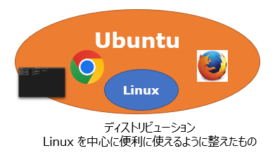

# OS とはなにか。

まずは言葉から。

OS は Operating System (オペレーティングシステム) の略である。

何をするためのものか、というとハードウェアとアプリ（ソフトウェア）と利用者 (ユーザー) のそれぞれを橋渡しする特別なソフトウェアである。

たとえば、プリンター。いろいろなプリンタが売られているが、Windows を使っていれば、どのメーカーのプリンタでも「印刷」命令で利用できる。

マウスやキーボードだって USB のクチに挿せば利用できる。特別な設定は不要である（ときどきいるけど）。

印刷命令を呼び出して、印刷している間、印刷が終わるまで PC がそれにかかりきりになって、他の仕事は一切できない状態になってしまっているだろうか？そんなことはない。
印刷している最中も、ウェブサイトを見たり、ゲームをしたりすることができる。

つまり複数の仕事を同時にこなしているわけだ。

Word やパワポを動かしているあいだ、さぼって Youtube を見たり LINE で通信できたり、Spotifyで音楽を聞いたりできる。

これらはすべて OS が裏方として動作して、それぞれの仕事（タスク）の受け渡しをしているからである。

OS がやっていることは、

**コンピュータのハードウェア資源 (画面やキーボード、CPU、メモリ、プリンタ、USB のクチ etc)　を管理し、ユーザーの要求にそのリソースを提供することである。**

また、**要求が終わればそのリソースを回収するのも大事な仕事だ。**

ということで、世の中にはさまざまなコンピュータがあるので、さまざまな OS もまた存在する。


## Windows, macOS, Linux が現在の OS の代表格である

メーカーが作った Windows や macOS と違い、Linux はもともとライナスという学生 (といっても、いまやおじいちゃん一歩手前だが) が趣味で作った OS で、無料で利用できる。

Linux は UNIX という OS がお手本になっている。
そもそも、その UNIX という OS が、コンピュータオタク向けに AT&T (アメリカの電話会社) で作られた OS なので、初心者にはとっつきにくい。

UNIX は廃棄処分寸前のコンピュータ上で副業的に作られた。

### Ubuntu

Linux という OS だけではインストールもめんどくさいし、設定もイチから自分でやらなければいけないし、すぐ使えるようにはならない。というこで、OS (Linux) にプラスして設定画面やアプリケーションなど、ひととおり使えるように用意しておきましたよ！というものを **ディストリビューション** と呼ぶ。 ディストリビューションの一つが、Ubuntu (ウブンツ) である。

ディストリビューションはその目的によっていろいろなものが存在する。(RetroPi はゲームをやることを目的にしたディストリビューションである)。

その中で、おそらくいま世界で最もユーザーが多いディストリビューションが Ubuntu である。



## コマンド紹介

これまで触れたように UNIX (Linux) はコマンドライン (CUI:Command User Interface) で操作する。

メインに利用するのはあの黒い画面だ。たとえば、時刻を知りたければ、date。

> `date`  
> 2025年  6月 11日 水曜日 17:07:11 JST  

いま利用者が何人ログインしているか知るには who 。

> `who`  
> pi       tty1         2025-06-11 09:32  
> pi       tty7         2025-06-11 09:32 (:0)  
> pi       pts/0        2025-06-11 09:32 (fe80::87d4:2226:e66d:1727%eth0)  

終了するときには、ご存知 shutdown だ。

> `shutdown -h now`

マニュアルもある。 たとえば who コマンドについて知りたければ、

> `man who`

man コマンド自体について知りたければ、

> `man man`

となる。

Windows や Mac みたいな気の利いた GUI (Graphical User Interface) は（がんばってはいるけど、あまり）ない。

コマンドのいい面もある。

* ひとつは動作が軽い。
* ひとつは (一回やったことを) 再利用しやすい。
* 上と関連して、そうすると自動化しやすい。

### macOS
実は macOS も UNIX がベースになっている。なので macOS と Linux は親戚とみなすこともできる。

# ゲーム

カラフルなぷよぷよなどを紹介したが、もっと素朴なゲームもある。

> `sudo apt install bsdgames`

すると、古 (いにしえ) のゲームがインストールされる。
味わい深いものがあるので、動かして昔を味わうのもまた良し。

> `gomoku`  
> `tetris-bsd`  
> `rain`  
> `hangman`  
> `worm`  

# よく使うコマンド

Linux 上の情報はすべてファイルに保存されている。

ファイルの中身は、メールだったり、名前と住所のリストだったり、プログラムのソース（元）だったり、プログラムのデータ (画像、音楽など) だったりする。


その中身は伊藤先生の授業で説明された **テキストファイル** だったり、テキストではない **バイナリファイル** だったりする。

Word のドキュメントファイルがバイナリファイルなのは、そのなかに、文章以外にページ情報やフォントの情報、印刷レイアウトの情報、編集履歴、などが埋め込まれているからである。
Word がないと中身を見ることすらできない。

UNIX は CUI が大好きなのだが、**テキストファイル** も大好きである。
**テキストファイル** はその中身に **文字だけ** が書かれているファイルのことをいう。

UNIX が開発された当時は派手な GUI を利用できるような環境 (ディスプレイの性能) がなかったからである。

テキストファイルを編集 (作成、変更) するためのコマンドが `nano` である。

テキストファイルを作るコマンドは特に利用頻度が高いので、特別に **エディタ** とよんだりする。

あ、ちなみにクボタは `vi` 使いなのでよろしくお願いします。

では、`nano gomi` と実行して gomi というファイルを作ってみよう。
中身はなんでもいい。キーボードで入力したら、それはテキストファイルになる。

## そこにどんなファイルがあるか？

いま、そこにあるファイルのファイル名を表示するには ls コマンドを使う。

> $ `ls` (list の略だ)

`-l` オプションを指定すると、長い ("long") 表示がされ、もっと詳しい情報が得られる。

> $ ls  
> gomi  
> $ ls -l  
> 計 4  
> -rw-r--r-- 1 pi pi 20  6月 11 17:29 gomi  

rw は読み取り (r) と書き込み (w) ができるよ、ということを示している。

## 中身を見る

ファイルの中身を見るのは `cat` コマンド。(concatinate の略だ。)

> $`cat gomi`  
> kore ha gomi file.

## ファイル名を変える

ファイル名を変えたいときは、`mv` コマンド。(move の略。)
 
> $ mv gomi gomijanai  
> $ ls  
> gomijanai  

## コピーを作る

ファイルのコピーを作るときは `cp` コマンド。(copy の略。)

> $ cp gomijanai gomikamo  
> $ ls  
> gomijanai  gomikamo

## ファイルを削除する

ファイルを削除するには `rm` コマンド。(remove の略。)

問答無用で黙って実行するので、注意。潔い。

**ゴミ箱などは甘えである。**

> $ rm gomijanai gomikamo  
> $ ls  (何も出ないはず)

### ファイル名の付け方

ファイル名には、英字、数字、ピリオド、アンダーライン (_) だけを使っている方が望ましい。myfile.txt や program.py など。ピリオドから後ろは特別に**拡張子**と呼ぶ。その中身がどんなものかを示すために利用する。

日本語のファイル名もつけられるが、入力するのがめんどくさいし、ls すると "ぱいそんのぷろぐらむ.py" というのがあるのは、ちょとかこわるい。

- .txt ... テキストファイル (テキストファイル)
- .csv ... CSV ファイル (テキストファイル)
- .py ... Python のプログラム (テキストファイル)
- .c ... C 言語のファイル (テキストファイル)
- .exe ... 実行できるファイル (バイナリファイル)
- .jpg ... JPG 画像ファイル (バイナリファイル)
- .mp4 ... MP4 動画ファイル (バイナリファイル)
- .zip ... ZIP ファイル (バイナリファイル)

### コマンド (命令)　の入力

UNIX の命令は、スペースで区切られるルールになっている。

> $ <命令> <スペース> <引数1> <引数2>　<引数3>　<引数4>　<引数5>…  

と続く。たとえば：

> $ echo Hello  # echo に Hello という引数を渡している  
> Hello  

しかしスペースを含んだファイル名をコマンドに渡したいときもある。
そういうときには "" (ダブルクォーテーション) でくくる。

下の例は１行目と２行目では引数の数がちがうので注意しよう。

> $ echo Hello sekai      # echo に Hello と sekai という２つの引数を渡している  
> Hello sekai  
> $ echo "Hello sekai"    # echo に "Hello sekai" という１つの引数を渡している

# 練習

1. tmp ディレクトリを作る
2. 作った tmp ディレクトリに移動して、touch コマンドで zipcode.sh というファイルを作る
3. その中身に以下の中身を書き込む
```sh
#!/bin/sh
curl -L https://www.post.japanpost.jp/zipcode/dl/roman/KEN_ALL_ROME.zip -o KEN_ALL_ROME.zip
```
最初の１行目 #! は特別な意味がある。このファイルは /bin/sh コマンドで解釈しますよ、ということをコンピュータに伝えている。

4. zipcode.sh を実行してみよう(./zipcode.sh)。なぜ実行できないのだろうか。(ヒント：実行権はどうなっている？)
5. 明確に sh コマンドで実行してみよう(sh ./zipcode.sh)。sh はインタープリタであり、zipcode.sh は第一引数である。./zipcode.sh はだめなのに、なぜ、これは動くのだろうか。
6. chmod コマンドについて調べよ (man chmod)
7. chmod コマンドを使って、zipcode.sh を実行可能にしよう。つまり sh zipcode.sh ではなく、./zipcode.sh で動くようにする。
8. KEN_ALL_ROME.zip というのは ZIP ファイル（ジップファイル）といい、サイズが小さくなるように圧縮されたファイルである。これを unzip コマンドを使って解凍せよ。
9. cat コマンドを使って解凍した KEN_ALL_ROME の中身を確認せよ。
