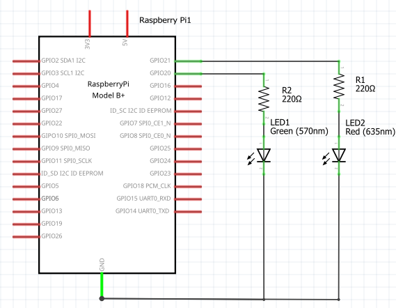

# OpenCV をつかったコンピュータビジョン入門

ソフトウェアとハードウェアの進歩により、Raspberry Pi のようなシングルボードコンピューターにコンピュータービジョンアプリケーションを実装できるようになった。
このドキュメントでは、OpenCVを用いたディープラーニングベースの顔検出プロジェクトを作成し、コンピュータービジョンの仕組みを探る。

USB カメラを使用して、Raspberry Pi から画像やビデオを撮影できる。

# コンピュータービジョン (コンピュータの視覚)

コンピュータービジョンは、コンピューターサイエンスの一分野であり、コンピューターがデジタル画像や動画を理解する技術を扱う。コンピューターは 1 と 0 しか理解できない。コンピュータービジョンは、数学に基づくプログラミングを用いて画像や動画を 1 と 0 に変換し、コンピューターが様々な画像処理を実行できるようにする。物体検出や顔検出は、コンピュータービジョンの代表的な応用例のほんの一部である。

# OpenCV

OpenCV（オープンソース・コンピュータビジョン・ライブラリ）は、主にリアルタイムコンピュータビジョンを目的とした、IBM を中心に開発されているプログラミング関数のライブラリである。コンピュータビジョン分野では、おそらく最も人気のあるツールである。OpenCV は TensorFlow などの他の機械学習ツールと組み合わせて使用​​することもできるが、今回のチュートリアルではその説明は割愛する。

## Raspberry PiにOpenCVをインストールする方法

まずは、Raspberry Piに OpenCV をインストールしよう。
OpenCV をインストールするには (とにかく最新を使いたい、必要なものだけインストールしたい、お手軽に済ませたい、など要望により) いくつかの方法があるが、今回はまずはお手軽に済ませる方法でいく。

1. 他のインストールと同様に、まず Raspberry Pi を更新する。

```sh
$ sudo apt update
$ sudo apt upgrade
```

2. 次に、OpenCV をインストールする。いつものとおり、`sudo apt` だ。

```sh
$ sudo apt install python3-opencv
$ sudo apt install opencv-data
```

## Raspberry Pi で OpenCV をテストする

1. インストールを確認する最も簡単な方法は、シェルを起動し、cv2（OpenCVのライブラリ名）をインポートしてみることである。

```sh
$ python
```

2. 以下の行を使ってインポートしてみよう。

```python
import cv2
```

3. インポート行で何も返されなかった場合は、おめでとう。OpenCV のインストールは成功だ。さらに、次の命令を使用して、コンピューターにインストールされている OpenCV のバージョンを確認することもできる。

```python
cv2.__version__
```

この終了は exit() だ。

```
exit()
```

# 顔検出してみる

Raspberry Pi に OpenCV がインストールされたので、顔検出プロジェクトを進めよう。

## OpenCVとディープラーニングによる顔検出

顔検出プロジェクトでは、USB カメラの映像から顔を識別し、顔が検出された場合は緑色の LED を点灯し、顔が検出されなかった場合は赤色の LED を点灯させることにしよう。
カメラとしては USB カメラモジュールを使用する。

必要な部品は次のとおり:

- ラズベリーパイ
- USB カメラ
- ジャンパー線
- ブレッドボード
- 赤色 LED 1 個
- 緑色のLED 1 個
- 220 Ωの抵抗 x 2個

部品が揃ったら、次のようにすべてを接続する。

  
**Raspberry Piカメラ配線図 (USB カメラは割愛)**

## OpenCV の Haar 特徴量に基づく顔検出 (Haar Cascade Classifier) を使用する

Haar 特徴ベースの Cascade 型分類器については、OpenCV のマニュアルに詳しく書かれており参考になる：
- https://labs.eecs.tottori-u.ac.jp/sd/Member/oyamada/OpenCV/html/py_tutorials/py_objdetect/py_face_detection/py_face_detection.html

基本は顔の明暗（輪郭部分は暗い、髪の毛部分は暗い、目は暗い、鼻（顔の中央）の両脇は暗い、など）のパターンを画像の各領域に当てはめてスキャンする。

そして、部分部分の結果 (弱分類器) の結果を組み合わせて、「顔かどうか」を判断する。

| 段階     | 処理内容                               |
| ------ | ---------------------------------- |
| 特徴抽出   | 画像の一部をスライドしながら Haar 特徴量を抽出          |
| 弱分類器   | 1つの特徴ごとに単純な分類器（YES/NO）を作る          |
| 強分類器   | 複数の弱分類器を組み合わせて「顔かどうか」を判断           |
| カスケード化 | 段階的に判定して、高速に NG を除外（YES だけ詳しくチェック） |

このような構成により、顔らしからぬ部分はすぐに除外され、計算負荷が減る。

## 分類器の設定ファイル

Haar による分類器の OpenCV 用設定ファイルはここにある：

```sh
/usr/share/opencv4/haarcascades/haarcascade_frontalface_default.xml
```

このファイルのなかに AI の **学習済みモデル** が入っている。

# OpenCV による使用方法

なにはともあれ、OpenCV の顔検出を動かしてみよう。
このプログラムは　USB カメラで、
  - 顔を検出すると GPIO20 を ON
  - 検出しないときは GPIO21 を ON
にするプログラムである。

### ■ motion が動作していないことを確認せよ！

motion が動作していると、Python プログラムからは USB カメラにアクセスできない。motion が停止しているかどうか確認しよう。

```sh
$ sudo systemctl status motion
● motion.service - Motion detection video capture daemon
     Loaded: loaded (/lib/systemd/system/motion.service; enabled; vendor preset: enabled)
→    Active: inactive (dead) since Fri 2025-07-11 14:33:19 JST; 1h 28min ago
       Docs: man:motion(1)
→  Process: 6376 ExecStart=/usr/bin/motion (code=exited, status=0/SUCCESS)
   Main PID: 6376 (code=exited, status=0/SUCCESS)
        CPU: 47min 42.785s
```

## USB カメラから顔検出をする Python プログラム

以下を入力し実行してみよう：

```python
import cv2
import RPi.GPIO as GPIO
import time

# GPIOの設定
GREEN_LED = 20
RED_LED = 21

GPIO.setmode(GPIO.BCM)
GPIO.setup(GREEN_LED, GPIO.OUT)
GPIO.setup(RED_LED, GPIO.OUT)

# 初期状態：両方OFF
GPIO.output(GREEN_LED, GPIO.LOW)
GPIO.output(RED_LED, GPIO.LOW)

try:
    # 顔検出用の分類器を読み込む
    cascade_path = "/usr/share/opencv4/haarcascades/haarcascade_frontalface_default.xml"
    face_cascade = cv2.CascadeClassifier(cascade_path)

    cap = cv2.VideoCapture(0) # 0: USB カメラ

    if not cap.isOpened():
        print("カメラが見つかりません")
        exit()

    while True:
        # 画像を読み取り
        ret, frame = cap.read()
        # リサイズ (縮小) する
        scale = 400 / frame.shape[1]
        new_width = 400
        new_height = int(image.shape[0] * scale)
        frame = cv2.resize(image, (new_width, new_height))
        if not ret:
            break

        # グレースケール (モノクロ画像) にする
        gray = cv2.cvtColor(frame, cv2.COLOR_BGR2GRAY)

        # 顔検出
        faces = face_cascade.detectMultiScale(gray, scaleFactor=1.1, minNeighbors=5, minSize=(60, 60))

        # ウィンドウに顔を描画
        for (x, y, w, h) in faces:
            cv2.rectangle(frame, (x, y), (x + w, y + h), (0, 255, 0), 2)

        # 顔が一定数（1つ以上）見つかったら「確率高い」とみなす
        if len(faces) >= 1:
            GPIO.output(GREEN_LED, GPIO.HIGH)
            GPIO.output(RED_LED, GPIO.LOW)
        else:
            GPIO.output(GREEN_LED, GPIO.LOW)
            GPIO.output(RED_LED, GPIO.HIGH)

        cv2.imshow("Face Detection with LED", frame)

        if cv2.waitKey(1) & 0xFF == ord('q'):
            break

except KeyboardInterrupt:
    print("中断されました")

finally:
    cap.release()
    cv2.destroyAllWindows()
    GPIO.cleanup()
```

## コードの説明

メインループは、現在のビデオフレームを読み取り、画像を希望の寸法 (最大幅 400 ピクセル) に変更することから始まる。

cv2.cvtColor() はその縮小した画像をモノクロ画像にしている。0~255 (黒～白) の 256 段階の画像になる。
face_cascade.detectMultiScale() は、

```
[[一人目の位置], [二人目の位置], [三人目の位置],...]
```

という情報を返す。要素の数＝認識された顔の数だ。

```
位置 = (x, y, 幅, 高さ)
```
である。

cv2.rectangle() で検出された顔に沿って四角形を描く。

`len(faces)` (len() は要素の数を返す) によって何人の顔が検出されたかわかるので、1 以上なら緑の LED を点灯させる。

でも待ってほしい、まだディスプレイを表示していない！
顔検出の有無に関わらず、cv2.imshow() でディスプレイが表示される。

特定のキー（このプログラムでは Q キー）が押されたときに画像表示を停止する行がある。
これによりループが終了し、Python プログラムが終了する。
