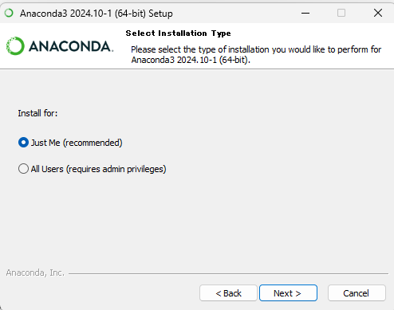

# Python のインストール

注意：これからダウンロード＆インストールするインストーラは、Python 本体とその他利用するパッケージ（付属モジュール）なども含むため、かなり大きいファイルとなる。そのため、5 ~ 10 分程度の時間がかかる。

1. https://www.anaconda.com/download にアクセスし、右側に小さく表示されている Skip registration を選択
2. 次の画面で、Windows 版インストーラーをダウンロードする。現在のバージョンは Anaconda3 2024.10-1 (Python 3.12).  
  
3. インストーラーの .exe をダブルクリックし、表示される画面に従って Python をインストールする。 Just Me を選択する。
. 
4. インストールするときに 
`Add Anaconda3 to my PATH environment variable` and `Register Anaconda3 as my default Python.` という選択肢があるが、PATH 変数のチェックはしない、default Python の設定はチェックをする。
5. インストール完了

# Spyder のインストール

1. インストール後、**Anaconda Navigator** というツールが起動される。
これは Python に関連するファイルを管理するためのツールである。新しいバージョンがあるので更新するか？と聞かれるので `Yes` を選択する。

`Update Now` を選択。

更新が終わったら、`Launch Navigator` をクリックする。

2. Navigator を起動し、`Spyder` というアプリケーションを見つけ、青い `Launch` ボタンで実行する。

## Spyder の更新

Spyder も Navigator と同じように更新する必要があるので、更新をかける。

1. まず Navigator を終了させる
2. つぎにスタートボタンから `Anaconda Prompt` を起動する。
3. 

4. `Anaconda Prompt` を閉じて、Spyder を Anaconda Navigator から起動する。