# Python のインストール

注意：これからダウンロード＆インストールするインストーラは、Python 本体とその他利用するパッケージ（付属モジュール）なども含むため、かなり大きいファイルとなる。そのため、5 ~ 10 分程度の時間がかかる。

1. https://www.anaconda.com/download にアクセスし、右側に小さく表示されている Skip registration を選択
2. 次の画面で、Windows 版インストーラーをダウンロードする。現在のバージョンは Anaconda3 2024.10-1 (Python 3.12).  
  

1. インストーラーの .exe をダブルクリックし、表示される画面に従って Python をインストールする。 Just Me を選択する。  
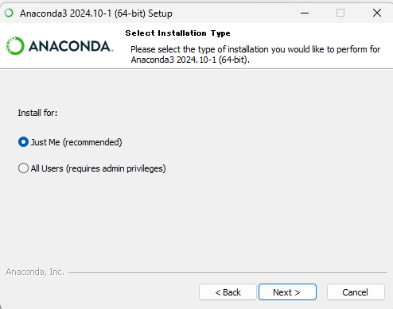

1. インストールするときに 
`Add Anaconda3 to my PATH environment variable` and `Register Anaconda3 as my default Python.` という選択肢があるが、PATH 変数のチェックはしない、default Python の設定はチェックをする。

2. インストール完了  
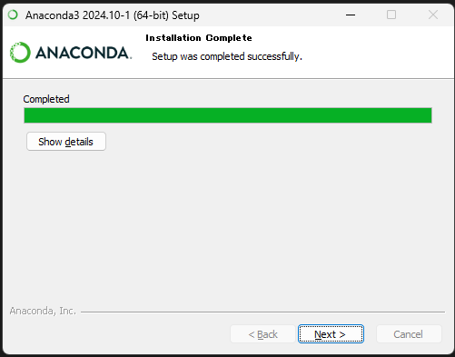
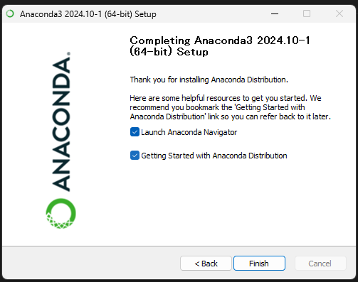

# Spyder のインストール

1. インストール後、**Anaconda Navigator** というツールが起動される。
これは Python に関連するファイルを管理するためのツールである。新しいバージョンがあるので更新するか？と聞かれるので `Yes` を選択する。


`Update Now` を選択。

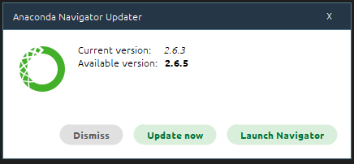

更新が終わったら、`Launch Navigator` をクリックする。

2. Navigator を起動し、`Spyder` というアプリケーションを見つけ、青い `Launch` ボタンで実行する。


## Spyder の更新

Spyder も Navigator と同じように更新する必要があるので、更新をかける。

1. まず Navigator を終了させる
2. つぎにスタートボタンから `Anaconda Prompt` を起動する。
3. 


4. `Anaconda Prompt` を閉じて、Anaconda Navigator から Spyder を起動する。

# Spyder の設定

Spyder を使う前に、`実行前にすべての変数を削除` にチェックを入れておくこと。
ツール -> 設定 -> 設定の既定値の表 -> pyx, ipy, py の３つの「デフォルト」をダブルクリックすると、設定項目がある。

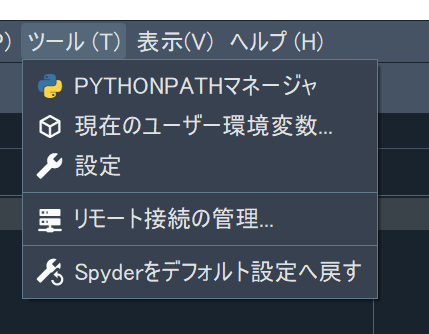
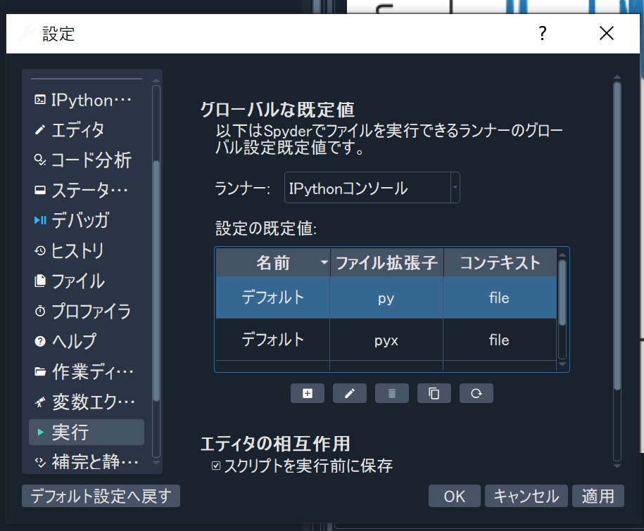
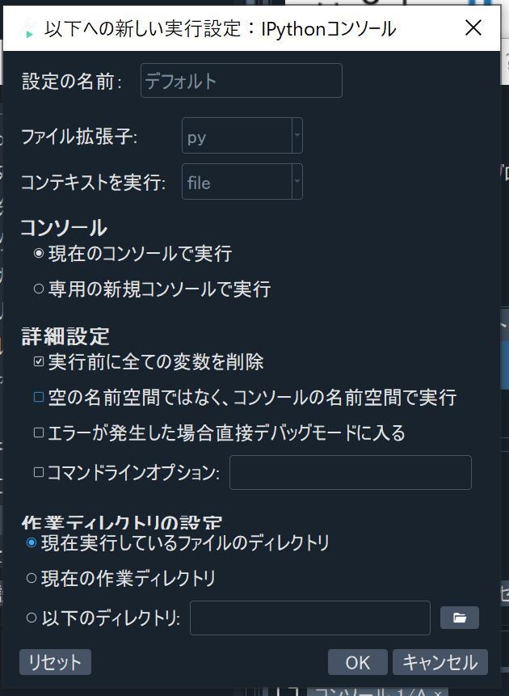

# Spyder を使ってファイル編集とプログラムの実行

Spyder を立ち上げると主に 2 つのウィンドウが開く。

1. プログラムを書くところ (`エディタ` という)。
2. IPython インタープリタ部分。Python を対話モードで使用する。

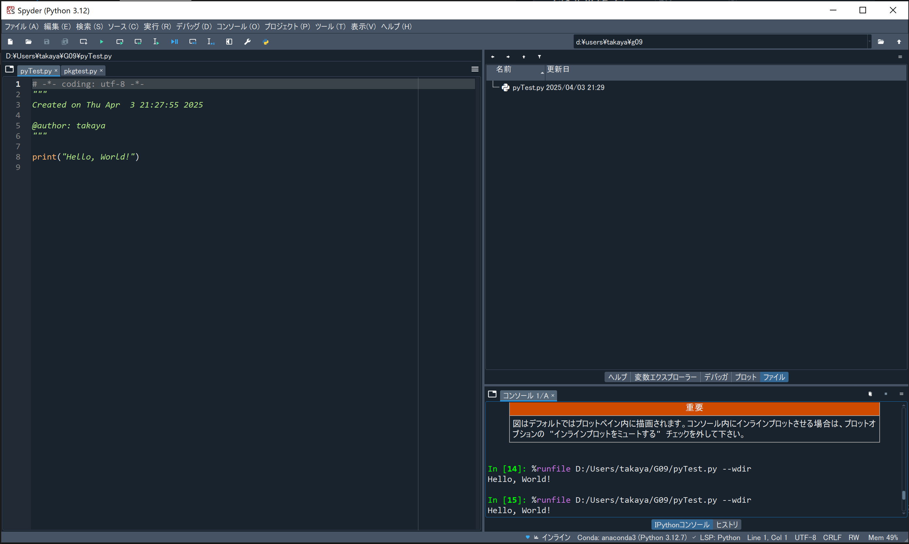

## IPython を使う

1. `In [1]:` は入力部分。`プロンプト` と呼ぶ。直接命令を書いて実行できる。
2. 3*5 と入力してリターンキーを押してみよう。

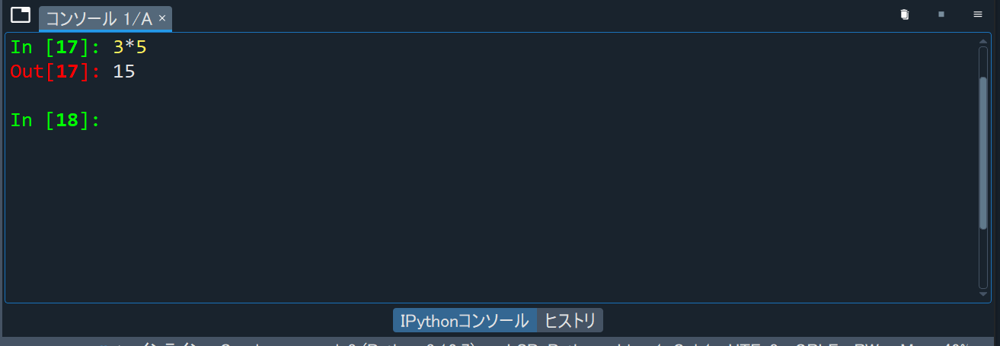

### IPython プロンプト

加算 (+)、減算 (-)、積算 (*)、割り算 (/)、剰余算 (%)、累乗 (**) 演算子が利用できる。これだけでも、すぐ電卓として使える。もしルートを計算したい場合は 0.5 乗するか、math モジュールを import する。今は import の意味は深く考えなくてよし。

```
In[18]: 16**0.5  
Out[18]: 4.0

In[19]: import math
```

math モジュールは数学の機能を提供する:

```
In[20]: math.sqrt(16)  
Out[20]: 4.0

In[21]: math.cos(0)  
Out[21]: 1.0
```
## ファイルを作って、保存して、実行する

### ファイルを作る
1. Spyder で `新規ファイル` を選ぶ。
2. print("こんにちは、世界") と入力する。

### ファイルを保存する

1. `保存` を選ぶ。
2. 整理するために、保存する前に適切な名前のフォルダ (ここでは、`G09` とする) を作り、その中に保存する。ここではファイル名を `pyTest.py` とする。 

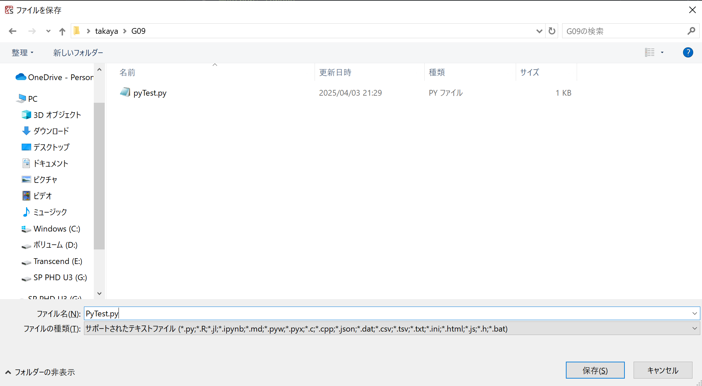

### ファイルを実行する

1. Spyder の `実行` を選ぶか、▶️を選ぶか、F5 キーを押すとプログラムが実行できる。コンソールに 2 行表示される。1 行目は実行しているファイル。2 行目はその実行結果の出力である。


2. エディタに戻って、一行追加する：print("おやすみなさい( ˘ω˘)ｽﾔｧ")
3. 実行する。
4. エディタのタブ部分の X をクリックして、ファイルを閉じる。その後、ファイル名をダブルクリックして開き直す。  

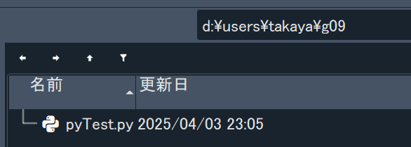

5. おめでとう！Python のプログラミング環境がインストールされ、ファイルをセーブ、実行、オープンすることができた。
   
# Matplotlib と Numpy を試す

Matplotlib と Numpy を使うと Python でグラフを書くことができる。Anaconda にはすでにどちらも含まれているので、特別にやることはない。import をするだけだ。

import をしてエラーが出なければ、Matplotlib も Numpy も使うことができる。

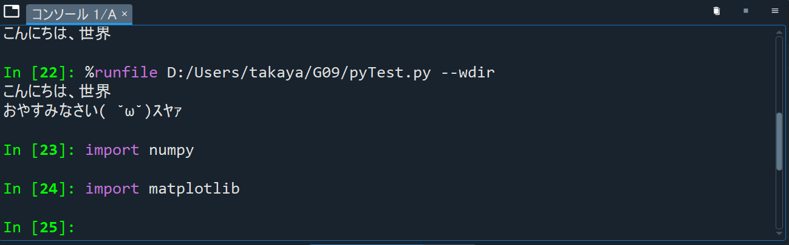

プログラムから利用できるかどうか確認してみよう。Classroom の `授業` タブにある pkgtest.py をダウンロードして、実行してみよう。`プロット` タブにグラフが表示される。

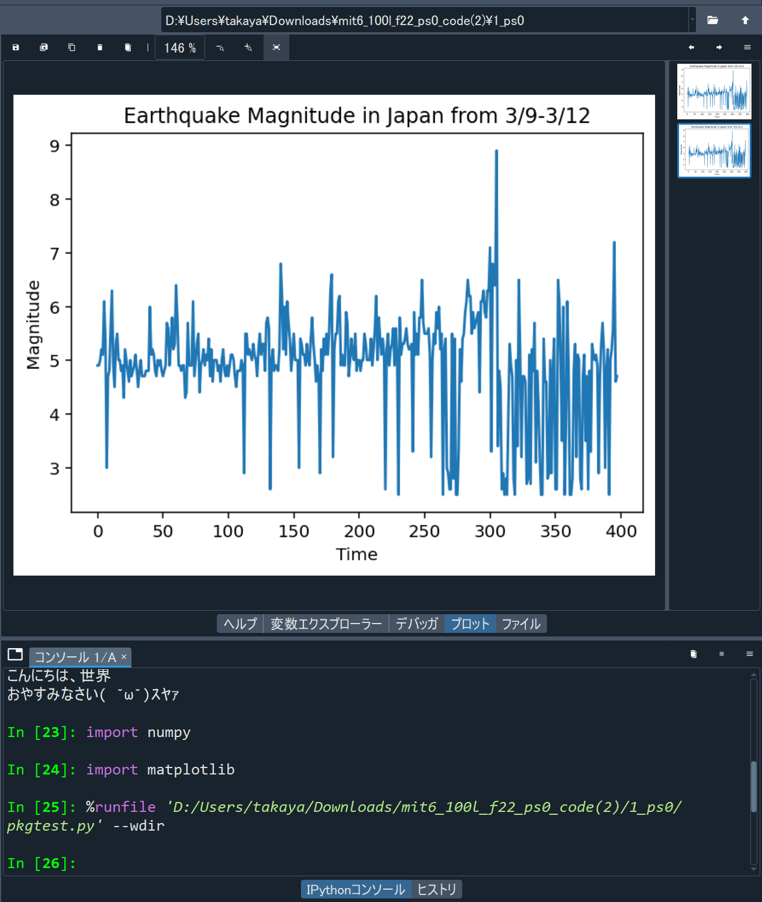