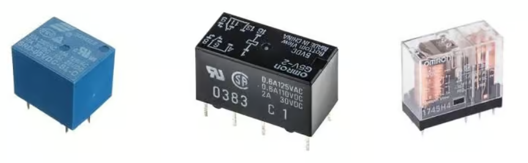
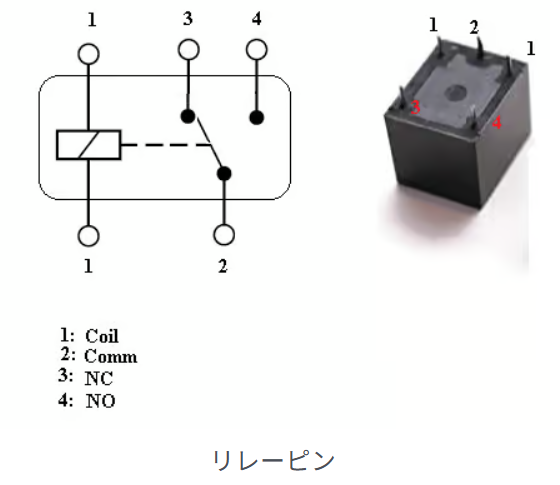
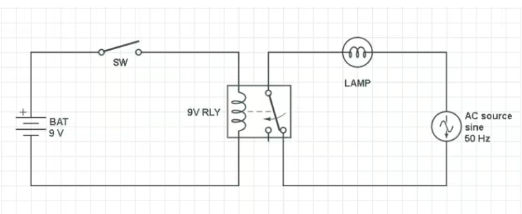
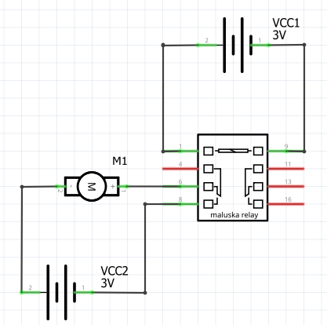
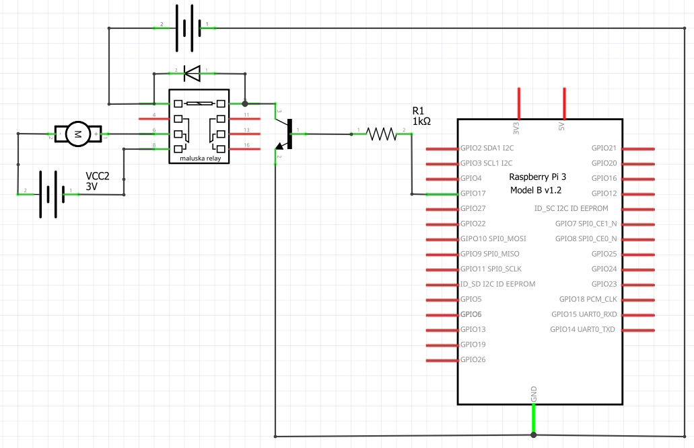

# RaspberryPi でリレーを動かす

プロジェクトによっては、モーター、バルブ、あるいは 100VACの電気機器など、高出力のデバイスを制御する必要があるかもしれない。
残念ながら、Raspberry Piはそのようなデバイスの電力要件に対応できない。
この障壁を回避する唯一の方法は、制御インターフェースを組み込むことである。
このインターフェースをリレーと呼び、Raspberry Piと高出力デバイスの間に配置される。

リレーとは何か、リレーがどのように機能するか、そしてRaspberry Piにリレーを接続して高出力デバイスを制御する方法を学ぶ。

プログラミングはすべて Python で行う。
5V リレーを作動させるサンプルプロジェクトを構築する。

## リレーとはなにか？

リレーは電気的に作動するスイッチである。
手動スイッチとリレーの違いは、手動スイッチは操作者の物理的な動作によって回路を開閉するのに対し、リレーは低電力の電子信号によって作動し、回路を開閉する。



## リレーの仕組み

次の図はリレーのピンを示している。



リレーには、一次回路と二次回路という 2 つの主な回路がある。

**一次回路：** 制御回路。リレーのオン/オフを切り替える信号を提供する。
電流が流れると磁場を発生させる電磁コイルがある。
この磁場はリレーコア内の可動アームを引き寄せる。コイルへの電力供給を停止すると、可動アームは小さなバネの力で元の位置に戻る。
可動アームの先端には可動接触器がある。

**二次回路：** 制御回路。ポンプやバルブなどの負荷を接続する場所。可動アー厶がコイルに引き寄せられると、二次回路の回路が閉じ、通信ピンとNOピンが直接接続される。


家の電球を ON/OFF する回路

# Raspberry Pi で 5V リレーを動かす方法

## Raspberry Pi を使わないバージョン

まず、電池を使ってリレーを駆動しモーターを動かす回路を作ってみよう。



## Rasberry Pi を使うバージョン

その次に、Raspberry Pi を使って動かす回路を作ってみよう。

* ラズベリーパイ
* ブレッドボード
* ジャンパー線
* 5Vリレー
* NPN トランジスタ 1 個
* 1KΩ の抵抗 1 個
* 2N4007 ダイオード 1 個



nano を使って、プログラムを入力しよう。
ここでは、relay.py にしよう。

```python
#!/usr/bin/python

import gpiozero
import time

relay = gpiozero.LED(17)
while True:
        print("Relay on.")
        relay.on()
        time.sleep(1)
        print("Relay off.")
        relay.off()
        time.sleep(1)
```

作った relay.py に実行権を付与する。

> `chmod +x relay.py`   
> `ls -l relay.py`  
> -rwxr-xr-x 1 pi pi 139  6月 11 16:06 relay.py  
> `./relay.py`

17 番ピンが ON になるとモーターが回転する。

## ここに注目！

モーターと Raspberry Pi は完全に回路が独立（お互いがつながっていない）していることに注目する。

つまりモーターのノイズは Raspberry Pi には伝わらない。平和が保たれた。
（まぁ、リレーもなかなかのノイズ源なのではあるが、それはダイオードがなんとかする）
