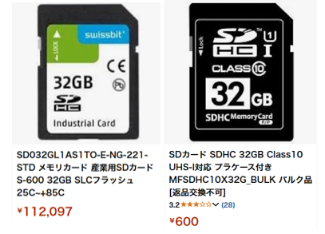

# SD カードについて

スマホ (Android) にも利用されている SD カード。
iPhone な君たちは使っていないか。残念だ。

Amazon で SD カードを検索すれば、同じ容量にもかかわらず、ひとつは 1000円でお釣りが来るのに、もう一方は 10 万円近くするものもある。
実は SD カードにも容量や転送速度によって、いくつかの種類がある。それが値段に反映されている。

  
おなじ 32G なのにこの価格差よ！

SD にはいくつかのカテゴリーがある。主に以下の３つの観点で分類される。

## 容量よる分類

| 分類       | 容量範囲           | 表示例  |
| -------- | -------------- | ---- |
| **SD**   | ～2GB           | SD   |
| **SDHC** | 4GB～32GB       | SDHC |
| **SDXC** | 64GB～2TB       | SDXC |
| **SDUC** | 2TB～128TB（未普及） | SDUC |

**⚠注意：SDHC や SDXC は使用機器が対応していないと使えない。

## スピードクラス (最低書き込み速度) による分類

### 通常のスピードクラス(Class)

| 表記           | 最低書き込み速度 | 用途例           |
| ------------ | -------- | ------------- |
| **Class 2**  | 2MB/s    | 静止画、軽い動画撮影など  |
| **Class 4**  | 4MB/s    | 標準画質動画        |
| **Class 6**  | 6MB/s    | HD動画          |
| **Class 10** | 10MB/s   | フルHD動画、連写写真など |

### UHS スピードクラス (UHS-I/II)

| 表記 | 最低書き込み速度 | 表記記号  |
| -- | -------- | ----- |
| U1 | 10MB/s   | Class の中に1 |
| U3 | 30MB/s   | Class の中に3 |

### ビデオスピードクラス (4K以上の動画用)

| 表記  | 最低書き込み速度 |
| --- | -------- |
| V6  | 6MB/s    |
| V10 | 10MB/s   |
| V30 | 30MB/s   |
| V60 | 60MB/s   |
| V90 | 90MB/s   |

### バスインタフェースによる分類 (転送速度の理論上の上限)
| バス規格            | 表記例       | 最大転送速度      |
| --------------- | --------- | ----------- |
| **通常（Default）** | 特に記載なし    | 12.5MB/s    |
| **High Speed**  | 特に記載なし    | 25MB/s      |
| **UHS-I**       | "I"のマーク   | 104MB/s     |
| **UHS-II**      | "II"のマーク  | 312MB/s     |
| **UHS-III**     | "III"のマーク | 624MB/s     |
| **SD Express**  | "EX"など    | 最大985MB/s以上 |

## 実際に選ぶときは？

上記のように、対応している機器でないと利用できないカードもある。
購入するときには SD カード表面の印字をよく見て、自分が利用する機器 (スマホ、カメラ、マイコン etc.) で利用可能かどうか、調べること。

## SD カードの動作

ちなみに、SD カードは一度使ってしまった領域を更新 (上書き) することはできない。

「え？ファイルを書き換えることできるよ？上書きできるよ？」と思ったかもしれないが、実は **一度消去してから、新たに書き込んでいる**。なので通常のメモリより書き込みが遅い。

詳しく言うと、まず最初に領域すべてのビットを 1 にする (これが消去)。その後で、必要なところを 0 にする (これが書き込み)。確定したあと、1 を 0 に、0 を 1 に変更することはできない。

ファイルサイズが増加した場合には、一度消して、別の大きい場所をあらためて確保して、そこに書き込む、という動作になる。

そして、SD カードの各領域には、**書き換え回数制限がある**。通常数千回から数万回で劣化する。
SD カードは消耗品と割り切って、しばらくしたら買い替えを検討しよう。

