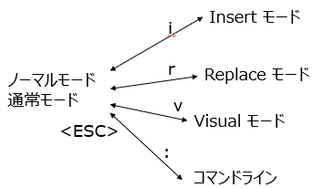

# Vim

とうとう、禁断の扉をあけるときが来てしまった。Vim エディタを紹介する日が。

まず初めに言っておく。初めはとっつきにくい。
ぜったいに「メモ帳のほうがいい！」だの「nano のほうがいい！」だの言い出すと断言する。
クボタも初めて vi (Vim の元祖) に触れたときには、「なんだ、こんな使いにくいモノを作ったやつはアフォなのか？」と思った。

それは若さゆえだった。甘かった。

タッチタイピングができるようになるのと、Vim のコマンド体系が体に (指先の筋肉に) 記憶されるまで Vim につきあってみてほしい。

その後は、いままでよりも数十倍の速度でプログラミングできるようになるはずである。

**注意: ただし Vim は日本語の文章を書く作業には向かない。できないことはないけどね。文章を書くときには別のエディタを使用することをおすすめする。あくまでプログラミングだけだ。(英語だけなら Vim でも良かったんだけどねぇ…)**

# 主要テキストエディタ・コードエディタ比較

Vim のはなしの前に、現在流通している主要なエディタをいくつか紹介する。
ここらへんは Gemini くんに書かせた。

以下、Gemini くん。

プログラミング、Web制作、文書作成など、様々な場面で活躍する主要なテキストエディタ・コードエディタを解説します。それぞれに特徴があり、目的や好みに合わせて選ぶのがおすすめです。

---

## 1. Visual Studio Code (VS Code)

| 項目 | 内容 |
| :--- | :--- |
| **開発元** | Microsoft |
| **特徴** | 豊富な拡張機能、強力なデバッグ機能、Git統合、動作が軽快 |
| **主な用途** | Web開発、各種プログラミング、スクリプト作成など、ほぼ全ての開発作業 |
| **対応OS** | Windows, macOS, Linux |
| **価格** | 無料 |

**【解説】**
現在の開発シーンにおいて、**最も広く使われているエディタの一つ**です。豊富な拡張機能（Extensions）をインストールすることで、あらゆるプログラミング言語やフレームワークに対応できます。動作が比較的軽快でありながら、デバッグ機能やバージョン管理システム（Git）との連携も標準で強力。初心者からプロまで、幅広い層におすすめできる万能エディタです。

**クボタ補足**
たしかに、いま Windows で選択するなら VS Code がファーストチョイスだろう。
クボタもいまこの資料は VS Code を使って書いている。
だが、あまりにも拡張性が高すぎて、便利に使えるようにといろいろ設定しているうちに、新しいトラブルに出くわしたりすることがある。注意だ。

---

## 2. Vim / Neovim

| 項目 | 内容 |
| :--- | :--- |
| **開発元** | Bram Moolenaar (Vim), コミュニティ (Neovim) |
| **特徴** | キーボード中心の独特な操作、CUI環境での動作、カスタマイズ性が非常に高い |
| **主な用途** | サーバー上でのファイル編集、熟練プログラマによる高速なコーディング |
| **対応OS** | Windows, macOS, Linux, etc. |
| **価格** | 無料 |

**【解説】**
古くから存在する、キーボード操作に特化したエディタです。マウスを使わずに高速なテキスト編集ができるため、多くの熟練開発者に愛用されています。特にサーバーにSSHで接続して設定ファイルを編集するなど、CUI（キャラクターユーザーインターフェース）環境での作業に絶大な強みを発揮します。操作には慣れが必要ですが、一度習得すると手放せなくなるエディタです。「Neovim」はVimから派生した、よりモダンで拡張しやすくなったバージョンです。

**クボタ補足**
授業でも触れたが 35 年近く vi, Vim を使ってプログラムを書いてきた。その技術がいまでも通用する。そして、それでもまだ知らない機能がある。奥が深い…。

---

## 3. Emacs

| 項目 | 内容 |
| :--- | :--- |
| **開発元** | Richard Stallman (GNU Emacs) |
| **特徴** | Vimと並ぶ高機能エディタ、Lisp言語による高い拡張性、「すべてがEmacs上で完結する」思想 |
| **主な用途** | プログラミング、文書作成、メール、スケジュール管理など |
| **対応OS** | Windows, macOS, Linux, etc. |
| **価格** | 無料 |

**【解説】**
Vimと双璧をなす、歴史ある高機能エディタです。「エディタはOSである」と言われるほど拡張性が高く、プログラミングはもちろん、メールの送受信やファイルの管理、スケジュール管理まで、あらゆる作業をEmacs上で行うことができます。独自のキーバインドを持ち、こちらも習得には時間が必要ですが、自分だけの最強の作業環境を構築したいユーザーに支持されています。

**クボタ補足**
VS Code 同様、拡張性が高すぎる。Emacs を立ち上げたらその中ですべてのことができる、という人もいる。拡張は Lisp というオタク度全開な言語で行う。初心者にはあまりにも高すぎるハードル。
ちなみにクボタは Emacs の日本語化 (正確には世界の言語を扱えるようにした国際言語化) を行った方と一緒に仕事したことがある (なぞマウント)。UNIX 世界では憧れの人だ。

---

## 4. Sublime Text

| 項目 | 内容 |
| :--- | :--- |
| **開発元** | Sublime HQ |
| **特徴** | 圧倒的な動作の軽快さ、強力な検索・置換機能、洗練されたUI |
| **主な用途** | 大容量ファイルの閲覧・編集、軽快なコーディング、Web開発 |
| **対応OS** | Windows, macOS, Linux |
| **価格** | 有料（試用期間は無期限）|

**【解説】**
VS Codeが登場する前に一世を風靡した高機能エディタです。最大の特徴は、何と言っても**その圧倒的な動作の速さ**。数GBクラスの巨大なログファイルでも軽々と開くことができます。強力な複数選択機能や「Goto Anything」による高速なファイル移動など、独自の機能も多く、今でも根強いファンがいます。

**クボタ補足**
いっとき、インストールはして立ち上げてみた。それだけ。
---

## 6. メモ帳 (Notepad) / テキストエディット (TextEdit)

| 項目 | 内容 |
| :--- | :--- |
| **開発元** | Microsoft / Apple |
| **特徴** | OS標準搭載、非常にシンプル、起動が速い |
| **主な用途** | ちょっとしたメモ、一時的なテキストの貼り付け |
| **対応OS** | Windows / macOS |
| **価格** | 無料 |

**【解説】**
Windowsの「メモ帳」やmacOSの「テキストエディット」は、OSに標準で付属する最もシンプルなエディタです。プログラミングには不向きですが、**「とりあえずメモを取りたい」「余計な書式情報なしでテキストをコピーしたい」** といった日常的な用途では非常に便利です。そのシンプルさと起動の速さは、他の高機能エディタにはない魅力と言えるでしょう。

**クボタ補足**
たしかにメモ帳でプログラミングできる。が、検索もないし、行番号でジャンプもできないよ。それでもよければ、がんばってみよう。

---

### まとめ

| エディタ名 | 強み・キーワード | こんな人におすすめ |
| :--- | :--- | :--- |
| **Visual Studio Code** | 万能、拡張性、無料、デファクトスタンダード | ほぼ全ての人、特にWeb系開発者 |
| **Vim / Neovim** | CUI、キーボード操作、高速編集、サーバー作業 | サーバー管理者、キーボード操作を極めたい人 |
| **Emacs** | 超高機能、カスタマイズ性、Emacs内で完結 | 自分だけの最強環境を構築したい人 |
| **Sublime Text** | 軽快、高速、大容量ファイル | 動作の速さを重視する人、巨大なログを扱う人 |
| **メモ帳など** | シンプル、OS標準、起動が速い | プログラミング以外の日常的なメモ |

# Vim エディタにモードあり。

まず Vim にはいくつかのモードがある。

- 通常: ファイル内を移動したり編集したりする場合
- 挿入: テキストを挿入します
- 置換: テキストを置換します
- ビジュアル（プレーン、ライン、またはブロック）：テキストブロックを選択する場合
- コマンドライン: コマンドを実行する

タイプした文字は動作モードによって意味が異なる。たとえば、挿入モードのとき `x` は `x` という文字の入力だが、通常モードでは `x` は文字の削除である。ビジュアルモードでは選択範囲の削除となる。

Vim のデフォルト設定では、現在のモードが左下に表示される。初期モード (デフォルト) は通常モードである。

`<ESC>` キーを押すとどのモードからでも通常モードになる。なので最初のうちはピーピーならすことになるだろう (`<ESC>` キーを連打することになるからだ)。

- `i` : 挿入モード
- `R` : 置換モード
- `c` : 変更モード
- `v` : ビジュアルモード
- `V` : ビジュアルラインモード
- `<CTRL>-v`: ビジュアルブロックモード
  
  に入る。Vim を使うと `<ESC>` キーを頻繁に使う。



## 基礎編

### テキストの挿入

  通常モードから `i` を押して挿入モードにする。これで Vim は他のエディタと同じように動作する。
  そして `<ESC>` キーで通常モードに戻る。

### コマンドライン

  通常モードから `:` を押すとコマンドラインモードになる。`:`を押すとカーソルが画面の下にジャンプしたはずだ。このモードではファイルを開いたり、保存、クローズ、Vim の終了などができる。

  - :q (:quit) 終了
  - :w (:write) 保存 (書き込む)
  - :wq (:writequit) 保存して終了
  - :e filename ファイルを開く
  - :r filename いまカーソルがある場所にファイルを挿入する
  
### カーソルの動き

カーソルは通常モードで動かす。

- 基本的な動き：`hjkl` (左、下、上、右)
- 単語: `w`
- 行: `0`, `$` (行頭、行末)
- スクロール: `<CTRL>-u`, `<CTRL>-d` (上、下)
- ファイル: `gg` (ファイルの先頭)、`G` (ファイルの末尾)
- 行番号: `:行番号<RET>` または `行番号G`
- 探す: `/文字列` (下に向かって検索)、`?文字列` (上に向かって検索)
  - n/N つぎの一致に移動
  
### 選択

- ビジュアル: `v`
- ビジュアルの行単位: `V`
- ビジュアルのブロック: `<CTRL>-v`

### 編集

- `o/O` 下/上に挿入
- `dw, d$, d0` 単語の削除、行末まで削除、行頭まで削除
- `cw` 単語の変更
- `x` 文字の削除
- `u` アンドゥ（取り消し）
- `y` 選択範囲のコピー
- `p` `y` でコピーしたものをペースト

### 回数指定

- `3w` ３単語移動
- `5j` ５行下に移動
- `7dw` ７単語削除

# デモ

これは、動作しない [世界のナベアツ](https://ja.wikipedia.org/wiki/%E6%A1%82%E4%B8%89%E5%BA%A6) である：

```python
def sekaino_nabeatsu(limit):
  for i in range(limit):
    if i % 3 == 0:
      print("アフォ！")
    if "3" in str(i):
      print("アフォ！！")
    if i % 3 != 0 and "3" not in str(i):
      print(i)

def main():
  sekaino_nabeatsu(10)
```

以下の問題を修正する：

- main 関数が呼ばれない
- 0 から始まっているのを 1 に修正する
- アフォ！とアフォ！！が "3" や "36" でバラバラの行に出てしまう
- 10 と固定されている上限を、コマンドラインから渡せるようにする

# 練習

先生と同じように vim をつかって nabeatsu.py を修正すること。

# Vim チートシート
チートとは「ずる」のことである。
チートシートというのはコンパクトにまとめたコマンド一覧表のこと。
ネット上にいろいろあるので、気に入ったものを探してみるのもよい。

以下が、まずはお手軽かもしれない：  
https://qiita.com/hattys2/items/56d973ad4f197b751501
