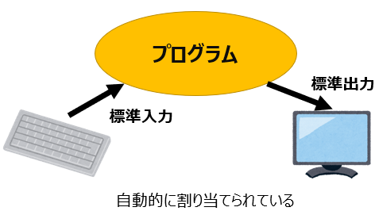

# シェルとなかよくなる

### ちょっと便利機能
カーソルキー (↑、↓)　で過去に実行したコマンドをもう一度呼び出せることは説明した。
これは実は `<CTRL>-P` と `<CTRL>-N` でもおなじだ。
P は previous (前の) と N は next (次の) の頭文字だ。

もう少しシェルの便利機能について紹介する。

#### タブキー（ファイル補完）
おそらくこれがもっともよく使う便利機能だ。（少なくともクボタはそうだ）

```sh
$ cd t<TAB>     # t だけ打ってタブキー、エンター
$ cat K<TAB>    # K だけ打ってタブキー、エンター
```

どうだろうか。ファイル名のうしろは自動的に補われた (補完された) はずである。

パスを構成する要素であればどこでも利用できる。

特に２行目に注意してほしい。いま /home の下には `pi` という一つしかフォルダがないので、何も入力しなくても、タブキーのみで補完される。

候補が複数ある場合には補完は、音がしてそこで一度止まる。`<TAB><TAB>` とタブを２回入力すると候補が出力される。
一つに絞り込めるところまで入力してあげよう。

```sh
$ cd /h<TAB>      # /home になる
$ cd /home/<TAB>  # /home/pi になる
$ cd ../../<TAB>  # どこだ？
```
これをファイル補完という。

---

#### 命令の結果を接続する

##### リダイレクト

命令 (コマンド) には
- 標準入力 (Standard input)
- 標準出力 (Stadard output)
 
という２つの出入り口が自動的に割り当てられている (これも OS の役割だ)。
この２つをまとめて、**標準入出力 (Standard Input/Output, Standard I/O)** という。



通常、入力はキーボード、出力は画面である。しかしシェルを使うとこの入出力先を変えることができる。

もっとも簡単な変更方法は `< file` と `file >` である。これらを使用すると、プログラムの入力と出力をそれぞれのファイルに変更することができる (これを **リダイレクト** という)。

それぞれ、キーボードからの入力をファイルに、画面への出力をファイルに変更することができる。

```sh
$ date > today.txt
$ cat today.txt
Wed Jun 18 09:41:06 JST 2025
$ cat < today.txt > today2.txt
$ cat today2.txt
Wed Jun 18 09:41:06 JST 2025
```

一番最後の例では、cat コマンドへの入力をファイル `today.txt` を変更している。また出力を `today2.txt` に変更している。

`>>` をファイルへの追加にも使用できる。

##### パイプ

パイプというのは `|` を使う。この `|` を使うと、あるプログラムの出力が別のプログラムの入力となるように、プログラムを連結することできる。

```sh
$ ls -l / | tail -n1
drwxr-xr-x  12 root root  4096  5月 22 17:28 var
```

---

さて、前回、つぎのようなプログラム zipcode.sh を書いた。

```sh
#!/bin/sh
curl -L https://www.post.japanpost.jp/zipcode/dl/roman/KEN_ALL_ROME.zip -o KEN_ALL_ROME.zip
```

これは curl というコマンドを使って、郵便局のサイト (https::www.post.japanpost.jp) で公開されている郵便番号の一覧のファイルをダウンロードするプログラムである。

**-o <ファイル名>** でダウンロードしてきたファイルの名前を `KEN_ALL_ROME.zip` としている。

これに `chmod` コマンドで実行権をつけた。こうすることで、`./zipcode.sh` だけでプログラムが動くようになる。(ここまでを確認した)

```sh
$ chmod +x zipcode.sh   # 実行権を付与
$ ./zipcode.sh          # ./zipcode.sh を実行
  % Total    % Received % Xferd  Average Speed   Time    Time     Time  Current
                                 Dload  Upload   Total   Spent    Left  Speed
100 1716k  100 1716k    0     0  3724k      0 --:--:-- --:--:-- --:--:-- 3732k
```

実行結果で出力される３行は、データの送受信量や進捗を表示している (これを出力しているのは `curl` コマンドである)。

# zip ファイルを解凍する

ZIP ファイルは、**「複数のファイルをまとめて、かつ、サイズが小さくなるよう圧縮した」ファイル**である。**解凍** しないと中身を見ることができない。
ZIP ファイルを解凍するには unzip コマンドを使う。unzip コマンドをインストールしよう。

```sh
$ sudo apt install unzip # unzip コマンドをインストール
```

unzip コマンドで KEN_ALL_ROME.zip を解凍する。

```sh
$ unzip KEN_ALL_ROME.zip
Archive:  KEN_ALL_ROME.zip
  inflating: KEN_ALL_ROME.CSV
```

解凍できたら、まず大きさを比べてみよう。おっと、ここでもシェルの便利機能を使っている。
`*` は「ファイル名のその部分はなんでもいいよ」という意味だ。

```sh
$ ls -l KEN_ALL_ROME.*
-rw-r--r-- 1 pi pi 11172638  6月  5  2024 KEN_ALL_ROME.CSV
-rw-r--r-- 1 pi pi  1758027  6月 17 15:30 KEN_ALL_ROME.zip
```

ZIP ファイルは、元のファイル (KEN_ALL_ROME.CSV) の何分のイチになっているだろうか。

なかを見てみよう。おっと文字コードが期待してるものと違うようだ。

```sh
$ cat KEN_ALL_ROME.CSV  # ローマ字部分は読み取れるけど…
```

Raspberry Pi は UTF-8 という文字コードを採用している。
一方、`KEN_ALL_ROME.CSV` は Shift-JIS という文字コードで書かれている。
そのため、表示したときに、いわゆる **文字化け (mojibake, 英語圏でも通じる)** が生じるのだ。

ファイルの文字コードを変更するには、iconv コマンドを使う。
早速、ファイルのリダイレクトを使用する。

```sh
$ iconv -f SHIFT-JIS -t UTF-8 KEN_ALL_ROME.CSV　> KEN_ALL_ROME.TXT
```

これで表示されるはずだ。これは、Shift-JIS で書かれた KEN_ALL_ROME.CSV を UTF-8 になおして `KEN_ALL_ROME.TXT`　で保存してね、という意味である。

**■ 質問：`>` がなかったらどうなる？**


# いろいろなテキストコマンド
## head, tail

`head`, `tail` コマンドはファイルの先頭、末尾を表示する。デフォルトでは 10 行。

```sh
$ head KEN_ALL_ROME.TXT   # 先頭 10 行を表示
$ tail KEN_ALL_ROME.TXT   # 末尾 10 行を表示
```

## wc 

`wc` コマンドはファイルの、行数、(空白を区切りにした)単語数、文字数 (バイト数) を教えてくれる。
これが現在の郵便番号の数だ (ただし事業所番号を除く)。
```sh
 $ wc KEN_ALL_ROME.TXT
  124689   552696 12649872 KEN_ALL_ROME.TXT
``` 

## grep

`grep` コマンドはファイルのなかで指定したキーワードに一致した行を出力する。
以下は HOKKAIDO というキーワードを含む列を表示する。

```sh
$ grep HOKKAIDO KEN_ALL_ROME.TXT
```

## cut

`cut` コマンドは、「列」を表示する。
以下は、区切り文字を `,` にして、第一フィールドと第五フィールドだけを出力する。

```
$ cut -d, -f1,5 KEN_ALL_ROME.TXT
```

## sort

`sort` コマンドは行の並び替えをする。
以下は、広島市の郵便番号を、市のアルファベット順に並べかえる。(おっと東広島市も入ってしまった)

```sh
grep "HIROSHIMA SHI" KEN_ALL_ROME.TXT  | sort -t, -k6 
```

## uniq

`uniq` コマンドは **連続する** 複数行を１行にする。
以下は、ローマ字表記の全国都道府県名を取りだしている。

```sh
 $ cut -d, -f5 KEN_ALL_ROME.TXT | uniq
```

これらのコマンドはパイプを組み合わせて使える。

```sh
$ grep HOKKAIDO KEN_ALL_ROME.TXT | wc -l
$ grep HOKKAIDO KEN_ALL_ROME.TXT | head
$ grep HOKKAIDO KEN_ALL_ROME.TXT | tail
$ grep HOKKAIDO KEN_ALL_ROME.TXT | tail > hokkaido_last.txt
$ grep HOKKAIDO KEN_ALL_ROME.TXT | cut -d, -f3,5 | tail
```

---
# UNIXテキストコマンド演習ワークシート  
📁 題材：日本郵便 ローマ字住所CSV（ROME.csv）

## 🎯 目的  
- CSVファイルを使って基本的なテキストコマンドの使い方を学ぶ  
- `cat`, `head`, `tail`, `sort`, `grep`, `wc`, `cut`, `uniq` を活用  
- データ処理と地域情報（広島）に親しむ

---

## 🔰 1. 行数を調べてみよう
```sh
wc -l KEN_ALL_ROME.csv
````

* ファイルには何行ありますか？
* ヘッダー（見出し行）は含まれていますか？

---

## 👀 2. ファイルの中身を少し見てみよう

```sh
head -n 5 KEN_ALL_ROME.csv
tail -n 5 KEN_ALL_ROME.csv
```

* 最初と最後の行を見て、データの構造や意味を読み取ってみよう。

---

## 🔎 3. 東京都に関するデータを抽出しよう

```sh
grep '"TOKYO TO"' KEN_ALL_ROME.csv | wc -l
```

* 東京都に関する行は何件ありますか？

---

## 🏯 4. 広島県のデータだけを取り出そう

```sh
grep '"HIROSHIMA KEN"' KEN_ALL_ROME.csv | head -n 5
```

* 広島県のデータはどんなものが含まれていますか？

---

## 🏙️ 5. 広島市の町域だけを表示しよう

```sh
grep '"HIROSHIMA KEN","HIROSHIMA SHI"' KEN_ALL_ROME.csv | head -n 5
```

* 広島市にはどのような町域がありますか？

---

## 🚢 6. 呉市（KURE）の行を抽出してみよう

```sh
grep '"HIROSHIMA KEN","KURE SHI"' KEN_ALL_ROME.csv | wc -l
```

* 呉市に該当する行数は何件ありますか？

---

## 🛤️ 7. 尾道（ONOMICHI）の町域数を調べよう

```sh
grep '"ONOMICHI SHI"' KEN_ALL_ROME.csv | wc -l
```

* ONOMICHI を含むデータはいくつありますか？

---

## 🏝️ 8. 宮島を探してみよう（MIYAJIMA or ITSUKUSHIMA）

```sh
grep 'MIYAJIMA' KEN_ALL_ROME.csv
grep 'ITSUKUSHIMA' KEN_ALL_ROME.csv
```

* 厳島に関するデータは見つかりましたか？どのような表記でしたか？

---

## 📦 9. 郵便番号順に並べて、最も小さい番号を調べよう

```sh
sort -t, -k1,1 KEN_ALL_ROME.csv | head -n 1
```

* 最小の郵便番号は何番で、どの地域ですか？

---

## 🧮 10. 都道府県の種類を数えてみよう

```sh
cut -d, -f2 KEN_ALL_ROME.csv | sort | uniq | wc -l
```

* ローマ字表記の都道府県名は何種類ありますか？

---

## 🏆 11. データ件数の多い都道府県ランキング

```sh
cut -d, -f2 KEN_ALL_ROME.csv | sort | uniq -c | sort -nr | head -n 5
```

* 件数が多い都道府県トップ5はどこですか？

---

## 🔁 12. 「-CHO」がつく町域を数えよう（全国）

```sh
grep '-CHO"' KEN_ALL_ROME.csv | wc -l
```

* 「-CHO」が含まれる町域は何件ありますか？

---

## 🍁 13. 広島県の「-CHO」町域を数えてみよう

```sh
grep '"HIROSHIMA KEN"' KEN_ALL_ROME.csv | grep '-CHO"' | wc -l
```

* 広島県内の「-CHO」地名はいくつありますか？

---

## 📮 14. 重複する郵便番号を探してみよう

```sh
cut -d, -f1 KEN_ALL_ROME.csv | sort | uniq -d | head -n 5
```

* 同じ郵便番号が複数行に出てくる理由は何でしょうか？

---

## ✍️ チャレンジ：広島県の町域はいくつある？

### ヒント：

```sh
grep '"HIROSHIMA KEN"' KEN_ALL_ROME.csv | cut -d, -f4 | sort | uniq | wc -l
```

* 広島県内で何種類の町域（ローマ字表記）があるか数えてみよう！

---

## ✅ 使用コマンド一覧

| コマンド            | 説明                  |
| --------------- | ------------------- |
| `cat`           | ファイル内容表示（大きい場合は非推奨） |
| `head` / `tail` | 最初・最後の数行表示          |
| `grep`          | 特定の文字列を検索           |
| `sort`          | 並べ替え                |
| `cut`           | 特定の列を抽出             |
| `uniq`          | 重複行の除去／件数カウント       |
| `wc`            | 行数や文字数のカウント         |

---

> 📎 **備考**
> CSVファイルは **各フィールドがダブルクォーテーション `"..."` で囲まれたカンマ区切り形式**です。
> 例：
> `"7300001","HIROSHIMA KEN","HIROSHIMA SHI","NAKA KU KAMIYACHO",...`
