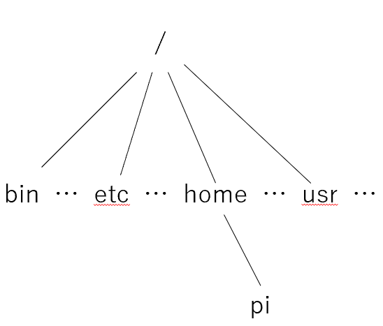

# シェル

**注意**　: このドキュメントでは、「コマンド」と「命令」を同じ意味で使っている。
また「フォルダ」と「ディレクトリ」も同じ意味で使っている。違う意味で利用するときは断りをいれる。

OS や Linux, UNIX, そして、Ubuntu、ディストリビューションといった単語について前回説明した。
その歴史的経緯から UNIX はコマンド (黒い画面)　大好きだってことも。

## シェルとはなんぞや？

コンピューターにはコマンドを入力するための様々なインターフェースが備わっている。

凝ったグラフィカルユーザーインターフェース、音声インターフェース、さらには AR/VR まで、あらゆるものが存在する。
これらは 80% のユースケースには適しているが、多くの場合、根本的に機能に制限がある。
存在しないボタンを押したり、プログラムされていない音声コマンドを入力したりすることはできない。
コンピューターが提供するツールを最大限に活用するには、昔ながらのテキストインターフェース、つまりシェルに頼らなければならない。


**シェルというのは、コンピューター (OS) に指示を送るためのテキスト・インターフェースである。**

ほぼすべてのプラットフォーム (Windows, Mac, Linux) には、なんらかの形でシェルが搭載されており、しかも複数のシェルから好みのものを選択できる。シェルは細部では異なる場合もあるが、その本質はどれもほぼ同じである。つまり、プログラムを実行して、入力を与え、その出力を得る、ということである。

授業では Bourne Again SHell (bash) を取り上げる。

これは最も広く使用されているシェルの一つで、その構文は他の多くのシェルと似ている。
シェルプロンプト（コマンドを入力できる場所）を開くには、まずターミナルが必要である。

## シェルの使用

ターミナルを起動すると、次のようなプロンプトが表示されることがある。

```sh
$
```

これはシェルへのメインのテキストインタフェースである。$ マークが入力受付であることを示している。
ここに命令を入力する。

前回説明した通り、命令を最初に書いて、その後ろに (必要であれば) <スペース> で区切って引数を入力する。
echo は渡された引数を出力するだけなので、スペースを余り意識する必要がないが、下の例のように、スペースを多く打っても、「区切り」として扱われるだけなので、出力結果は "hello world" となる。

```sh
$ echo Hello world  ## ２つの引数
hello world  
$ echo Helo                          world  ## これも２つの引数
hello world  
```

スペースを含む文字列を渡したいときは "" で括る。

```sh
$ echo "Helo                          world"  ## １つの引数
Helo                          world
```

### 質問

(1) と (2) の違いを述べよ。

```sh
$ mkdir My Photo              (1)
$ mkdir "My Photo"            (2)
```

## シェルでのディレクトリ移動

さて、シェルのなかで使われるパス (ファイルのたどり方)　は Linux と macOS ではフォルダ名が  `/` (スラッシュ) で区切られている。
Windows は 区切りに (日本のPCでは円マークだったりするが) `\` (バックスラッシュ) を使用する。

また Linux と macOS はファイルパスの一番てっぺん (トップ) は `/` (ルート, root) でありその下にすべてのディレクトリとファイルが存在する。

一方 Windows ではディスク装置ごとそれぞれにルート (てっぺん) がある。(`C:\` だったり `I:\` する)。

この授業では RasPi を使っているので Linux を使用していると想定する。

`/` で始まるパスは **絶対パス** と呼ばれる。その以外のパスは **相対パス** と呼ばれる。**相対パス** については後で触れる。

### 現在の作業ディレクトリ

シェルは黒い画面単位に起動することができるが (たくさんターミナルを立ち上げれば、その数だけシェルが立ち上がる)、それぞれのシェルは、自分のホーム・ディレクトリの **"なか"** にいることになっている。
ユーザーが今いるディレクトリのことを **作業ディレクトリ** といい、これはいつでも変えることができる。

**`pwd` (print working directory)** コマンドを使うと今いるディレクトリを表示させることができる。

```sh
 $ pwd
/home/pi
```

これは、今ユーザーのいる場所はルートディレクトリ (`/`) のなかに、home というディレクトリがあって、
home のなかには pi とディレクトリがあって、あなたはそこに **いますよ** という意味である。

一番てっぺん (ルートディレクトリ) は `/` で表す約束になっている。

以下を実行してみよう。

```sh
$ ls /home/pi
$ ls
```

この２つは全く同じものが表示されるはずである。なにも引数を指定しないとき、ls は作業ディレクトリの内容を表示する。

```sh
$ ls /home
pi
```

これは /home のなかにあるファイル (やフォルダ) の一覧となる。いまは pi しかない。

`ls /` はルートディレクトリの内容を表示する。

**注意**: **`/` は２つの意味を持っていることに注意。ひとつは `/` ルートディレクトリを示す。もう一つは、ファイルやフォルダの区切りを示す。**

```sh
ls /
bin  boot  dev  etc  home  lib  lost+found  media  mnt  opt  proc  root  run  sbin  srv  sys  tmp  usr  var
```

ここに表示された名前はルートディレクトリにある Linux のシステム用フォルダの一覧である。

もしまだ gomi ファイルが残っていたら、このように実行してみよう。

```sh
cat /home/pi/gomi
```

この `/home/pi/gomi` がパス名である。「パス名」のもつ意味は、ルートからディレクトリをたどってたどり着くまでの道筋 (パス, path) を表したものだからである。これは Linux (UNIX) の共通ルールである。

絶対パスについて、最後に次のようにやってみよう。

```sh
ls /bin /usr/bin
```
/bin のなかに date コマンド /usr/bin のなかに apt コマンドがあることが見つけられるはずだ。

また次のようにすると、前回インストールした gomoku や hangman のファイルがあることがわかる。

```sh
ls /usr/games
```


## ディレクトリの変更 cd

あるテーマに関連したファイルはすべて、他のプロジェクトと関係のないディレクトリの中に入れておきたいと思うかもしれない。
たとえば、プログラミングに関するファイルはまとめておきたい、と思ったときなどである。programming というディレクトリに保存したいと思ったとする。
新しいディレクトリを作るときには、既出の `mkdir` コマンドを使う。

```sh
$ mkdir programming     # ディレクトリの作成
$ cd programming        # そのディレクトリへ行く。
$ pwd                   # 正しい位置にいることを確認。
/home/pi/programming
```

なにかプログラミングをして、

```sh
$ cd ..                 # フォルダを一段あがる
$ pwd
/home/pi
```

.. (ドットドット) はどのディレクトリにいても、一段上にあがったディレクトリ (これを **親ディレクトリ** という) ことを意味する。

. (ドット) ひとつは、今いるディレクトリ、**ココ** を表す。

```sh
$ cd                    # ホームディレクトリに戻る
```
これだけで最初の位置 (ホームディレクトリ) に戻る。

