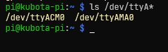
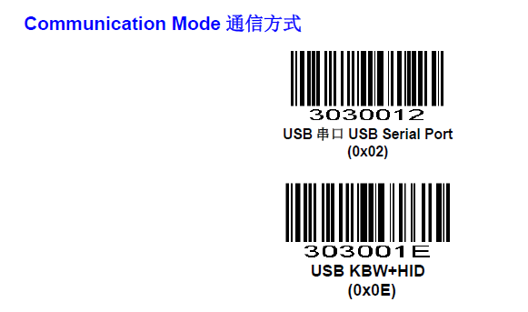
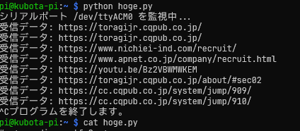

# バーコードリーダー入門

USB をインタフェースとするバーコードーリーダーは Raspberry Pi に差し込むとシリアルデバイスとして認識される。シリアルデバイスというのは、キーボードやマウスなどと同じ入力装置として認識されていると思っていい。
Raspberry Pi ではシリアルデバイスは `/dev/tty<なんとか>` というファイルでアクセスすることができる。
実際に Raspberry Pi に SUNMI Blink QR コードリーダを指して確認してみよう。


SUNMI Blink QR コードリーダ

<center>


ラズパイからはキーボードやマウスと同じカテゴリの周辺機器に見える
</center>

接続した状態で `ls /dev/ttyA*` を実行する。ふたつのファイルがあると思う。そのうち、/dev/ttyACM0 がバーコードーリーダーである。ためしにバーコードーリーダーを USB から抜いてみよう。/dev/ttyACM0 は消えるはずである。



# バーコードーリーダーを設定する

バーコードリーダーには、さまざまな設定項目があるが、その設定は設定用のバーコードを読ませて行う。
メーカーのサイトには SUNMI Blink QR コードリーダのマニュアルが提供されている。
設定用バーコードが印刷されており、これを読み取らせて設定を行う。

- https://developer.sunmi.com/zh-CN/ 

マニュアルにはビープ音の大きさや LED の明るさなどを調節するバーコードもある。
一通りどんなことができるか目を通しておくと勉強になるし、近所のスーパーのバーコードリーダの動作もちょっとわかるようになる。

## 最低限必要な設定

Raspberry Pi でこのバーコードリーダを扱うには最低限、通信方式を USB Serial Port にする。
以下の２つのバーコードのうち、上のものを読み取らせる。
（おそらく USB を抜いて電源が切れると、忘れてしまうだろう…、今の設定を覚えさせるバーコードもある）



# Python でバーコードを読み取ってみる

Python でシリアルポートからデータを受け取るには `PySerial` モジュールを使う。`PySerial` をインストールしよう。

```sh
$ sudo pip3 install pyserial
```

つぎに指定したシリアルポートを監視し、データが送信されてきたら読み取るプログラムを作成する。バーコードをスキャンすると、リーダーからデータが一行の文字列として送信されてくる。これを受信し、プログラムで扱えるように変換（デコード）する。

```python
# -*- coding: utf-8 -*-
import serial
import time

# --- 設定値 ---
# ポート名は環境に合わせて変更すること (例: '/dev/ttyUSB0')
PORT = '/dev/ttyACM0'
# ボーレート(通信速度)は機器のマニュアルで確認する。9600が一般的。
BAUDRATE = 9600
TIMEOUT = 1 # タイムアウト時間 (秒)

# シリアルポートの初期化
# 'with'構文を使うと、プログラム終了時に自動でポートを閉じてくれる
try:
    with serial.Serial(PORT, BAUDRATE, timeout=TIMEOUT) as ser:
        print(f"シリアルポート {PORT} を監視中...")

        # 無限ループで常にデータを待ち受ける
        while True:
            # シリアルポートから1行読み取る
            # データはバイト列で来るため、'utf-8'で文字列にデコードする
            # .strip()で前後の余白や改行コードを削除する
            line = ser.readline().decode('utf-8').strip()

            # データがあれば表示する
            if line:
                print(f"受信データ: {line}")

            # CPU使用率が高くなりすぎないように少し待機
            time.sleep(0.1)

except serial.SerialException as e:
    print(f"エラー: シリアルポート {PORT} を開けません。")
    print(e)
except KeyboardInterrupt:
    print("プログラムを終了します。")
```


実行結果

## with 構文のご利益

コンピュータのプログラムの中には、開けたら、忘れずに閉める、という動作を求めるものがある。
最も代表的なものはファイルである。

```python
f = open("greeting.txt", "w") # 書き込みファイルを開く
f.write("こんにちは！\n")      # ファイルに「こんにちは！」と書く
f.close()                     # ファイルを閉じる
                              # ここで初めてコンピュータはファイルを書く処理を安心して終了できる
```
たかだか３行のプログラムならまだ、close 処理があることがわかる。
しかし open してから close まで、数百行、数千行あるいは数万行となったら、ちゃんと閉じてるかどうか確認することは難しくなる。

また、人間はとかくこの手の後処理を忘れがちである。open しなければ使えないので open は忘れない。だが、close はやってもやらなくても動作が変わらない。プログラミングに没頭すると close 処理を忘れてしまう。これまで、close 処理を忘れたことによる悲劇と惨劇が、世界中のありとあらゆるシステムで繰り返されてきた。

ここで使うシリアルポートも、ファイル同様、使う前に open し、使い終わったら「もう使いませんよ」と close する必要があるのだ。open したままだと、使用中のままになり、後の人が使えない。永遠と順番を待つトイレのようなものである。

そこで、愚かな我々のために、用を足したら自動的に close する仕掛けが用意された。それが with 構文だ。

with 構文で宣言された変数は with のブロックでしか見えず、そのブロックを抜けるときに自動的に close が呼ばれる。これにより、次の人が無事トイレを使うことができるようになるのである。
なお、処理中にエラーが発生したときにも、かならず close 処理は呼ばれる。より安心だ。

```python
with serial.Serial(PORT, BAUDRATE, timeout=TIMEOUT) as ser:
  　# 自動的に ser を open する
    <ser を使ったプログラム>
    <ser を使ったプログラム>
    <ser を使ったプログラム>
    <ser を使ったプログラム>
    <ser を使ったプログラム>

print("終了") # この行に移った瞬間 (with のブロックを抜けた瞬間)、
　　　　　　　 # 自動的に ser を close する
```

# QR コードを読み取ってみる

インターネット上には、フリーで QR コードを生成できるサイトがいくつかある。
そのようなサイトを使って、自分の学籍番号の QR コードを生成・印刷して、Raspberry Pi で読み取らせてみよう。

## プログラムの変更

学籍番号 QR コードを読み取った時刻も合わせて表示するようにプログラムを変更してみよう。

# まとめ

バーコードリーダーを使うことは特に難しくないことがわかったと思う。
買ってきたときにはキーボードとして認識されてしまうことがあり、そうすると Linux ではうまく扱えないことがあるので、今回設定したように **シリアルポート** に設定変更するのが **肝** である。

シリアルポートとして設定した場合には
- 通信スピード
- 通信方式
を設定する必要があるが、現代の大半の機器が「スピード、クンロク」「８ビットノンパリ」なので、まずはこれで試してみることをおすすめする。