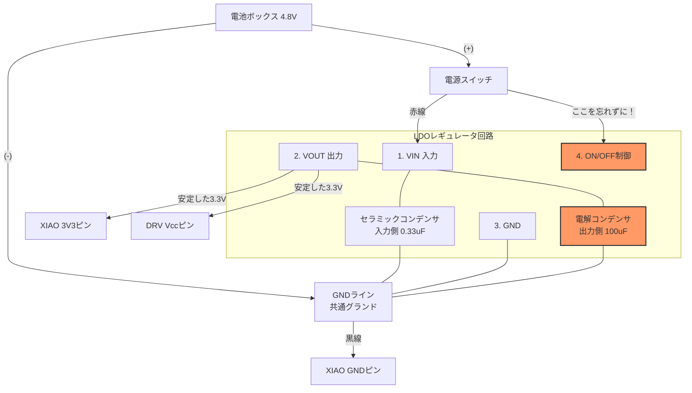

# ライントレーサー制作：リベンジマッチに向けて

前回の授業では、USB給電では動くものの、電池駆動にするとマイコンがリセットされる・挙動が不安定になる現象に悩まされました。

次回の授業で確実に完走させるため、**ハードウェア（電源）** と **ソフトウェア（開発手順）** の両面から以下の対策を実施します。

## 1\. 電源回路の変更：DC-DCからLDOレギュレータへ

前回の DC-DC コンバータから、よりノイズが少なく応答性の高い **LDOレギュレータ (NJM2396F33)** へ変更します。

### なぜ DC-DC ではダメだったのか？

  * **応答速度:** モーターの急停止・急発進による電圧変動に対し、DC-DC の補正が間に合わず、一瞬電圧が下がりマイコンがリセットしてしまった。
  * **ノイズ:** DC-DC 自身のスイッチングノイズとモーターノイズが重なり、誤動作の原因となった。

### 新しい回路図 (NJM2396F33 + XIAO ESP32-C3)

今回は **NJM2396F33** (3.3V出力・4端子) を使用します。足が4本あるので注意してください。

### 実装の重要ポイント

1.  **4番ピン (ON/OFF) を繋ぐ** (図のオレンジ色部分)
      * ここが電圧入力 (VIN) と繋がっていないと、電源がONになりません。1番ピンと一緒にスイッチの先へ繋いでください。
2.  **電解コンデンサを入れる** (図のオレンジ色部分)
      * LDO は発振（電圧が暴れる現象）しやすいです。出力側に必ず **電解コンデンサ (47μF〜100μF程度)** を入れてください。
      * **注意:** 電解コンデンサには極性があります（白い帯がある方がマイナス）。逆に繋ぐと破裂します。
      * 入力側には 0.33μF のセラミックコンデンサを入れます。セラミックコンデンサに極性はありません。

-----

## 2\. 制御パラメータ：PWM周波数の設定

モーター制御の PWM 周波数は以下に設定してください。

> **推奨周波数： 1000 Hz ～ 5000 Hz (1kHz - 5kHz)**

  * これより低いとガタガタ振動し、高いとトルク不足になります。

-----

## 3\. 開発フローの重要ルール（暴走事故防止）

プログラムの書き込み手順を間違えると、**「電源を入れた瞬間に暴走して止められない」** 状態になります。

### 鉄の掟

1.  **開発中は「実行 (Run)」ボタンを使う**
      * リセットボタンを押せばプログラムが消えるので、暴走してもすぐに止められます。
2.  **`main.py` への保存は「最後」だけ**
      * `main.py` に保存すると、電源ONと同時に走り出します。未完成の状態でこれを行うと、USBを繋いだ瞬間に走り出し、プログラムの修正ができなくなります。

-----

## 4\. センサー設置のコツ

センサーは **「可能な限り、車体の前方」** に設置してください。

  * **理由:** 車軸から遠いほど、ラインのカーブを早く検知できます（先読みができる）。
  * 手前すぎると、ラインから外れたことに気づいた時には既に手遅れになっています。

-----

リベンジしよう！

