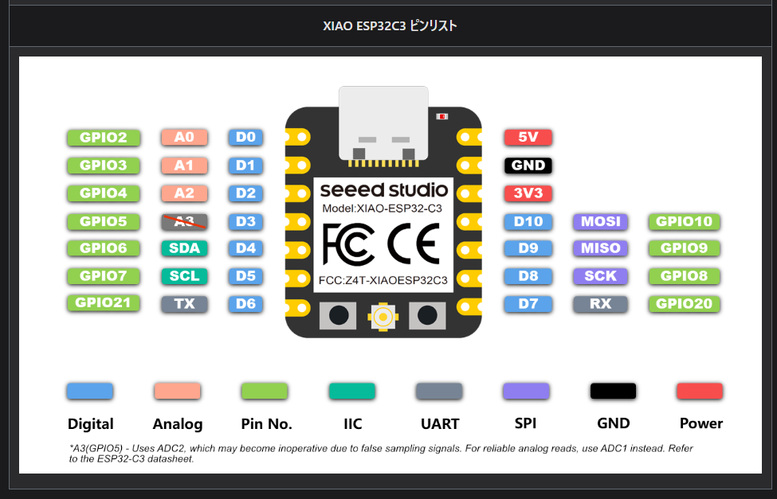
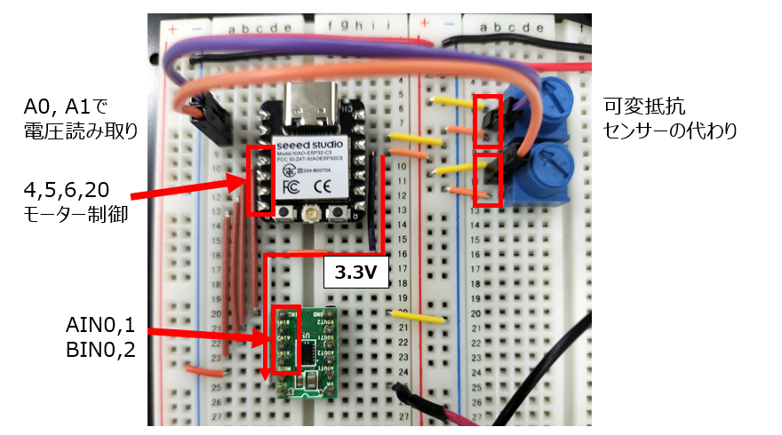

# MicroPython チャレンジ：センサーで 2 つのモーターを PWM 制御しよう！

## 1\. 🎯 今回のゴール

- **2 つのアナログセンサー**（今回は可変抵抗）の値を読み取る。
- 読み取った値に応じて、**2 つの DC モーター**の回転スピードを個別にコントロールする。
  **白線認識プログラムではないので注意！**

## 2\. 🔌 使うものと配線

公式のピン配置図を横に置いて、一本ずつ確認しよう。



### 使う部品

- XIAO ESP32 C3
- モータードライバー（DRV8855)
- DC モーター x 2
- 可変抵抗 x 2 (またはフォトリフレクタ基板 (信号 2 本))
- モーター用の外部電源 (電池ボックス、AC アダプタなど 5V\~9V 程度)
- ブレッドボードとジャンパワイヤ

---

### ⚡️ \!\!最重要\!\! 電源の配線

モーターは**絶対に XIAO の「3V3」ピンから電源を取ってはいけない！** 大きな電流が流れてボードが壊れる。

1.  **XIAO の電源 (DC-DCコンバーターから 3.3V 供給)**
    - センサーの電源 (VCC) と、**モータードライバーのロジック電源 (VCC)** にも使う。
2.  **モーター用の外部電源 (電池など)**
    - `+ (プラス)`: **モータードライバーのモーター電源 (VM)** に接続する。
3.  **GND (グラウンド)**
    - **XIAO の `GND`**
    - **センサーの `GND`**
    - **モータードライバーの `GND`**
    - **モーター用外部電源の `- (マイナス)`**
    - これら**すべて**をブレッドボードの GND ラインなどで**共通に接続する**。これを「GND を共通にする」と言い、忘れると絶対に動かない。

---

### 信号線の配線

「どのピンが何をするのか」を、**正しいピン配置**で整理する。

| XIAO ピン (シルク印刷) | GPIO 番号 (コードで使う `Pin(番号)`) | 接続先                   | 役割                          |
| :--------------------- | :----------------------------------- | :----------------------- | :---------------------------- |
| **A0**                 | `Pin(2)`                             | 可変抵抗出力 / センサー 1 (Signal)      | センサー 1 の値を読む (ADC)   |
| **A1 / D1**            | `Pin(3)`                             | 可変抵抗出力 / センサー 2 (Signal)      | センサー 2 の値を読む (ADC)   |
| **D3**                 | `Pin(5)`                             | モータードライバー (IN1) | モーター 1 の制御ピン 1 (PWM) |
| **D4**                 | `Pin(6)`                             | モータードライバー (IN2) | モーター 1 の制御ピン 2 (0V)  |
| **D5**                 | `Pin(7)`                             | モータードライバー (IN3) | モーター 2 の制御ピン 1 (PWM) |
| **D6**                 | `Pin(21)`                            | モータードライバー (IN4) | モーター 2 の制御ピン 2 (0V)  |

<!--
**Q. GPIO21 (D6) を使って大丈夫？**  
A. はい。私たちが PC との接続（REPL）に使っているのは「ネイティブ USB」という別の経路である。GPIO21 (D6 / TX) や GPIO20 (D7 / RX) は、外部に別のシリアル機器を接続しない限り、自由に GPIO として使える。
-->



## 3\. 🤔 プログラムの考え方

コードが何をしているのか、ステップバイステップで理解しよう。

### Step 1: センサーの値を読む (ADC)

- `ADC(Pin(2))` で、**GPIO2** (A0 ピン) を「アナログ値が読めるピン」として準備する。
- `adc0.atten(ADC.ATTN_11DB)`: センサーが最大 3.3V まで出力する場合、この設定が必須。
- `adc0.width(ADC.WIDTH_12BIT)`: 値は **0 〜 4095** の範囲で得られる。

### Step 2: モーターを動かす (PWM)

- `PWM(Pin(5))` で、**GPIO5** (D3 ピン) を「PWM ができるピン」として準備する。
- `pwm1.freq(20000)`: モーターの「キーン」というノイズを消す周波数（20kHz）に設定する。
- `pwm1.duty(値)`: モーターのスピードを **0 〜 1023** の範囲で決定する。

### Step 3: モーターを「正転」させる

今回のコードでは、`pwm1` (IN1) に PWM 値を、`pwm2` (IN2) に `duty(0)` (LOW) を入れている。
これにより、モーター 1 を **「正転」** で制御している。

| IN1 (例: D3 ピン) | IN2 (例: D4 ピン) | 動作                              |
| :---------------- | :---------------- | :--------------------------------- |
| **PWM**           | **LOW (0)**       | **正転** (スピードは PWM 値による) |
| LOW (0)           | PWM               | 逆転                             |
| LOW (0)           | LOW (0)           | ストップ (惰性で回転する)          |

### Step 4: 値を「翻訳」する (スケーリング)

- センサー (ADC) は **0 〜 4095** の値を出力する。
- モーター (PWM) は **0 〜 1023** の値を欲しがる。
- このスケールを合わせるために、`get_pwm_value` 関数を使う。

```python
def get_pwm_value(adc):
    raw = adc.read() # 0〜4095
    return int(raw / 4095 * 1023) # 0〜1023 に変換
```

## 4\. 💻 完成コード (コメント修正版)

もう一度、繰り返すが、これは白線認識 (ライントレーサー) プログラムではない。
あくまで、各ピンが利用できるか確認するためのものである。

```python
from machine import Pin, ADC, PWM
import time

# センサー(12bit: 0-4095)の値をPWM(10bit: 0-1023)の値に変換する関数
def get_pwm_value(adc):
    raw = adc.read() # 0〜4095 の値を取得
    # (raw / 4095) で 0.0〜1.0 の割合を計算し、1023を掛ける
    scaled_value = int(raw / 4095 * 1023)
    return scaled_value

# ---- アナログ入力設定 ----
# センサー1
adc0 = ADC(Pin(2))              # A0ピン (GPIO2)
adc0.atten(ADC.ATTN_11DB)       # 入力レンジを 0V 〜 3.3V に設定
adc0.width(ADC.WIDTH_12BIT)     # 精度を 12bit (0-4095) に設定

# センサー2
adc1 = ADC(Pin(3))              # A1 / D1ピン (GPIO3)
adc1.atten(ADC.ATTN_11DB)
adc1.width(ADC.WIDTH_12BIT)

adc = [ adc0, adc1 ] # 扱いやすいようにリストにまとめる

# ---- PWM出力設定 (モーター用) ----
# モーター1
pwm1 = PWM(Pin(5))  # D3ピン (GPIO5)
pwm2 = PWM(Pin(6))  # D4ピン (GPIO6)

# モーター2
pwm3 = PWM(Pin(7))  # D5ピン (GPIO7)
pwm4 = PWM(Pin(21)) # D6ピン (GPIO21)

# PWM 基本設定
freq = 20000  # 20kHz (モーターのノイズを消すため)
pwm1.freq(freq)
pwm2.freq(freq)
pwm3.freq(freq)
pwm4.freq(freq)

# 全モーターを停止状態で初期化
pwm1.duty(0)
pwm2.duty(0)
pwm3.duty(0)
pwm4.duty(0)

print("セットアップ完了。ループを開始します。")

# ---- メインループ ----
while True:
    # センサー0の値を取得
    val1 = get_pwm_value(adc[0])
    # センサー1の値を取得
    val2 = get_pwm_value(adc[1])

    # モーター1を正転 (IN1=PWM, IN2=LOW)
    # D3ピンに センサー1の値を、D4ピンに 0 を出力
    pwm1.duty(val1)
    pwm2.duty(0)

    # モーター2を正転 (IN3=PWM, IN4=LOW)
    # D5ピンに センサー2の値を、D6ピンに 0 を出力
    pwm3.duty(val2)
    pwm4.duty(0)

    # 0.02秒待つ (モーターの反応を良くするため少し短めに)
    time.sleep(0.02)
```

## 5\. 🚀 次のステップ（応用）

- **モーターを逆回転させてみよう:**
  `pwm1.duty(0)` と `pwm2.duty(val1)` のように、PWM を入れるピンと 0 を入れるピンを逆にするとどうなるか試してみよう。
- **センサーの値で動きを変えてみよう:**
  センサーの値が半分（約 2048）より小さいときは逆回転、大きいときは正回転させる、といったプログラムにも挑戦してみよう。
