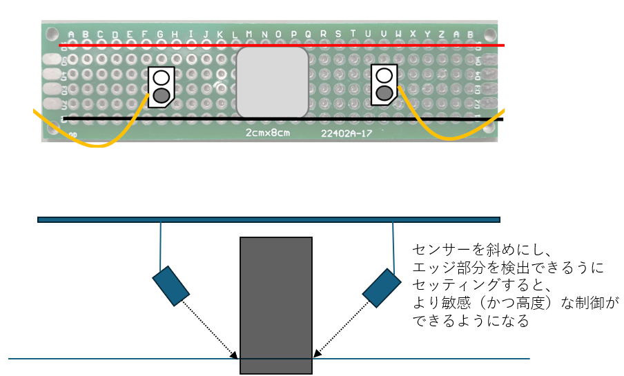

# フォトトランジスタの配置

フォトトランジスタの配置には大きく２つの方法がある。
センサー (フォトトランジスタ) の配置は、ライントレーサーの走行性能を決定づける極めて重要な要素となる。
結論から言うと、黒線を完全にまたぐ配置は**シンプルな制御（オンオフ制御）には有効**だが、タイムトライアルで高速走行を目指すなら、**線の「エッジ（輪郭）」を狙う配置**が圧倒的に有利となる。

それぞれの配置について、メリットとデメリットを解説する。

# 1. 黒線を「またぐ」配置 (Straddling)

これは、左右のセンサーの間に黒線が完全に入るように、広めの間隔で設置する方法。

* **メリット:**
    * ロジックが非常に直感的である。「右のセンサーが黒を検知したら左へ、左が検知したら右へ」というオンオフ制御が実装しやすい。

* **デメリット:**
    * **不感帯（Dead Zone）が生じる。**  
    線の中央を走行しているとき、両方のセンサーは「白」を検知する。この状態では、マシンは自分がどれだけ左右にズレているか全く分からない。ズレを検知できるのは、どちらかのセンサーが線の上に来たときだけである。
    * この不感帯のため、動きが「カクカク」とした蛇行になりがちで、**P制御やPD制御の滑らかな制御には向かない。**

# 2. 線の「エッジ」を狙う配置 (Edge Detection)

マシンの中心が線の中心に来たときに、**両方のセンサーがそれぞれ線の右エッジと左エッジの真上に来る**ように、狭めの間隔で設置する方法。理想的な状態では、各センサーは半分だけ黒線にかかっているような状態になる。

* **メリット:**
    * **アナログ的な位置情報が得られる。**  
    マシンが少しでも左右にズレると、片方のセンサーが黒を検知する割合が増え、もう片方は減る。この差分（偏差）を計算することで、「どれくらいズレたか」を連続的に知ることができる。
    * `偏差 = 右センサー値 - 左センサー値` の値が、`0`（中心）、微小な正の値（少し左ズレ）、大きな正の値（大きく左ズレ）…というように、**ズレの大きさに比例した値**になる。
    * この特性により、P制御やPD制御が非常に効果的に機能し、**吸い付くような滑らかな高速走行**が可能になる。

* **デメリット:**
    * センサー間の最適な距離が、コースの線の太さに依存する。

# 🚀選択のヒント

タイムトライアルでの勝利を目指すなら、**エッジを狙う配置を推奨する。**　ただし難易度はあがる。

# 進め方

1.  **最初は「またぐ配置」でオンオフ制御してみよう。**
2.  **発展課題として「エッジ配置」を検討し、なぜこの方が滑らかに走るのか考えてみよう。**
3.  **センサーを取り付ける基板を工夫し、センサー間の距離を調整できるようにしておこう。(といってもすこし足を長くしておくくらい？)**

