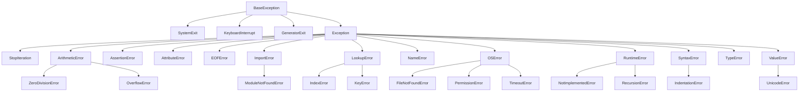

# エラー対策

エラー対策、というタイトルにしたが、これはエラーを握りつぶす (見なかったこと) にする方法なので、正しい対処方法ではないので、そのつもりで読むように。

## 温度センサー DHT11 のライブラリ

前回実行した例：

```python
#!/usr/bin/python
import sys
import board
import time
import adafruit_dht

dht = adafruit_dht.DHT11(board.D4)

while True:
    print('Temp: {0:0.1f} C  Humidity: {1:0.1f} %'.format(dht.temperature, dht.humidity))
    time.sleep(1)
```

これを実行すると以下のようなエラーが発生することがある：
```sh
$ python dht11.py
Temp: 27.0 C  Humidity: 28.0 %
Temp: 27.0 C  Humidity: 28.0 %
Temp: 27.0 C  Humidity: 21.0 %
Temp: 27.0 C  Humidity: 21.0 %
Temp: 27.0 C  Humidity: 20.0 %
Temp: 27.0 C  Humidity: 20.0 %
Temp: 27.0 C  Humidity: 20.0 %
Temp: 27.0 C  Humidity: 20.0 %
Traceback (most recent call last):
  File "/home/pi/programming/dht11.py", line 10, in <module>
    print('Temp: {0:0.1f} C  Humidity: {1:0.1f} %'.format(dht.temperature, dht.humidity))
  File "/home/pi/.local/lib/python3.9/site-packages/adafruit_dht.py", line 269, in temperature
    self.measure()
  File "/home/pi/.local/lib/python3.9/site-packages/adafruit_dht.py", line 253, in measure
    raise RuntimeError("Checksum did not validate. Try again.")
RuntimeError: Checksum did not validate. Try again.
Lost access to message queue
```

`RuntimeError: Checksum did not validate. Try again.` 受信したデータが不正、というエラーメッセージである。どうやら RaspberryPi とセンサーが通信に失敗することがあるようだ。

本来ならこのエラーを修正すべきなのであるが、今回、RuntimeError が起きたときは目をつむるようにする。

それには try: ~ except 構文を使う。以下のようにプログラムを変更する。

```python
#!/usr/bin/python
import sys
import board
import time
import adafruit_dht

dht = adafruit_dht.DHT11(board.D4)

while True:
    try:
        print('Temp: {0:0.1f} C  Humidity: {1:0.1f} %'.format(dht.temperature, dht.humidity))
        time.sleep(1)
    except RuntimeError:
        print("ランタイムエラーが出たけどスルー！")
```

実行結果は以下のようになるはずだ：
```sh
$ python dht11.py
Temp: 25.0 C  Humidity: 19.0 %
       :
       :
Temp: 25.0 C  Humidity: 18.0 %
ランタイムエラーが出たけどスルー！
Temp: 25.0 C  Humidity: 18.0 %
       :
       :
Temp: 25.0 C  Humidity: 18.0 %
ランタイムエラーが出たけどスルー！
Temp: 25.0 C  Humidity: 18.0 %
```

## try: ~ except 構文

Python ではエラーのことを **例外 (Exception)** と呼び、エラーが起きることを、「**例外が発生する**」とか「**例外が上がる**」と言ったりする。

プログラム実行中に例外が上がったときにどう対処するか、を決定するのが try~except 構文である。

## 例外 (Exception) の種類

実は例外 (Exception) もその原因によっていろいろな種類がある。Python ではつぎのような階層構造になっている。



try ~ except では try: から except で挟んだブロックで例外おきたらどうするか。を記述する。

```python
try:
  実行文
except RunTimeError:
  print("RunTimeError 発生!")
```

このようにすると RunTimeError が起きたとき、プログラムは中断せず `RunTimeError 発生` と出力して実行を続けるようになる。

捕捉していない例外 (try~except を使っていない場合や except で指示していない例外) が発生した場合、プログラムは停止する。

## あらためて注意事項

やろうと思えば、try:~except でありとあらゆる例外 (エラー) を握りつぶすことができる。
当然ながらそんなことは仕事では許されないので、ちゃんとエラーの原因を特定して修正しなければならない。
