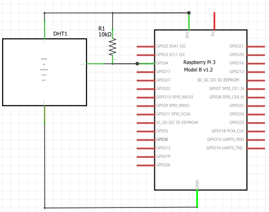

# 温度センサーDHT11を動かす

DHT11温湿度センサーは、デジタル温度・湿度測定が可能な小型センサーである。

セットアップも簡単で、データ信号用の配線は1本だけ。
このセンサーは、遠隔地の気象観測所、土壌モニター、ホームオートメーションシステムなどで広く使用されている。

DHT11 のプログラミングと Raspberry Pi への接続も非常に簡単である。
ここでは、DHT11 を Raspberry Pi に接続し、湿度と温度の測定値をターミナルまたは LCD に出力する方法を説明しする。

その後、Python でプログラミングするためのサンプルプログラムをいくつか紹介する。

このプロジェクトで使用されるパーツ:

- DHT11 温度湿度センサー
- ラズベリーパイ
- 16X2 有機 LED ディスプレイ

簡単にまとめると DHT11 には表面実装型 NTC サーミスタと抵抗式湿度センサーが搭載されている。

モジュール背面の IC が、サーミスタと湿度センサーからの抵抗値をデジタル温度（°C）と相対湿度に変換する。

# Raspberry Pi に DHT11 湿度センサーを設定する方法

## DHT11をRaspberry Piに接続する

DHT11には2つのバリエーションがある。

1つは3ピンの PCB 実装モジュール、もう 1 つは 4 ピンのスタンドアロンモジュールである。
それぞれピン配置が異なるため、DHT11 に合わせて接続すること。

### 3ピン DHT11 と 4 ピン DHT11 の比較

また、一部の PCB に取り付けられたモジュールは、上記とはピン配置が異なる場合があるので、どのピンが Vcc、グランド、または信号であるかを示すラベルがセンサーにないか必ず確認すること。


## 4 ピンDHT11

4 ピンの DHT11があり、湿度と温度を端末 (ターミナル) に出力したい場合は、次のように配線する。


Raspberry Piで DHT11 を設定する方法 - 4ピン DHT11 配線図

抵抗器は、Vcc と信号ラインの間に接続された 10K オームのプルアップ抵抗である。

### プルアップ抵抗とは？

## DHT11のプログラミング

** Adafruit DHT11 ライブラリをインストールするには**

**ライブラリ** というは、**ソフトウェアの部品**のこと。ピックアンドプレースを動かすには、ネジがいる、タッチパネルがいる、といったのと同じだと思えばいい。

pip3 コマンドを使ってインターネットからダウンロードできる。

```sh
pip3 install adafruit-circuitpython-dht
```

## ターミナルへの出力

このプログラムは、温度と湿度の測定値をターミナルⅡ出力する。

```python
#!/usr/bin/python
import sys
import board
import time
import adafruit_dht

dht = adafruit_dht.DHT11(board.D4)

while True:
    print('Temp: {0:0.1f} C  Humidity: {1:0.1f} %'.format(dht.temperature, dht.humidity))
    time.sleep(1)
```

ときどき、以下のようなエラーが起きて停止するが致し方なし、再度実行しよう：
```sh
$ python temperature.py
Traceback (most recent call last):
  File "/home/pi/programming/temp.py", line 10, in <module>
    print('Temp: {0:0.1f} C  Humidity: {1:0.1f} %'.format(dht.temperature, dht.humidity))
  File "/home/pi/.local/lib/python3.9/site-packages/adafruit_dht.py", line 269, in temperature
    self.measure()
  File "/home/pi/.local/lib/python3.9/site-packages/adafruit_dht.py", line 253, in measure
    raise RuntimeError("Checksum did not validate. Try again.")
RuntimeError: Checksum did not validate. Try again.
Lost access to message queue
```
# LCD に出力してみる

まず Raspberry Pi と LCD ディスプレイを接続しよう。この LCD ディスプレイは I2C で制御する。
覚えているかな？
必要な線は、電源、GND, SCL, SDA の４本である。たくさんのピンがあるが、ほとんど使わない。

1, 3, 4 は GND に接続する。
7 は Raspberry Pi の物理ピン番号の 5 番ピンに接続する。
8, 9 は共通にして、Raspberry Pi の物理ピン番号の 3 番ピンに接続する。

| PIN | 接続先 |
| ---- | ---- |
| 1 | GND |
| 2 | 3.3V |
| 3 | GND |
| 4 | GND |
| 7 | RasPi (物理ピン番号) 3 番 (SCL) |
| 8,9 | RasPi (物理ピン番号) 5番 (SDA) |


## I2C の設定

接続できたら、ちゃんと接続できているか確認してみよう。まず Raspberry Pi で I2C を利用可能にする。

```sh
$ sudo raspi-config
```


3 Interface を選択


I5 I2C を選択


はいを選択

その後は了解、Finish を選択する。これで Raspberry Pi で I2C を利用できるようになる。

確認してみよう。`i2cdetect` コマンドを使う。

i2cdetect は接続されている I2C デバイスを表示するコマンドである。以下に示すように 3c のアドレスのところが '3c' と表示されていたら、LCD ディスプレイが認識されている。

```sh
$ i2cdetect -y 1
     0  1  2  3  4  5  6  7  8  9  a  b  c  d  e  f
00:                         -- -- -- -- -- -- -- --
10: -- -- -- -- -- -- -- -- -- -- -- -- -- -- -- --
20: -- -- -- -- -- -- -- -- -- -- -- -- -- -- -- --
30: -- -- -- -- -- -- -- -- -- -- -- -- 3c -- -- --
40: -- -- -- -- -- -- -- -- -- -- -- -- -- -- -- --
50: -- -- -- -- -- -- -- -- -- -- -- -- -- -- -- --
60: -- -- -- -- -- -- -- -- -- -- -- -- -- -- -- --
70: -- -- -- -- -- -- -- --
```

`Hi!` と表示させる。

```sh
$ i2cset -y 1 0x3c 0x00 0x01 # Reset
$ i2cset -y 1 0x3c 0x00 0x02 # Clear Display
$ i2cset -y 1 0x3c 0x00 0x0F # Display ON
$ i2cset -y 1 0x3c 0x00 0x01 # Clear Display
$ i2cset -y 1 0x3c 0x40 0x48 # "H"
$ i2cset -y 1 0x3c 0x40 0x69 # "i"
$ i2cset -y 1 0x3c 0x40 0x21 # "!"
```

## Python から I2C デバイスを操作する

このままでは、まだ、Python から操作できるようにはなっていない。
Python から操作できるようにしよう。

DHT11 の測定値を LCD に出力するには、smbus という I2C を利用するための Python ライブラリをインストールする。
smbus ライブラリをインストールするには、まず Python Package Index（PIP）をインストールする必要がある。PIP は既に Raspberry Pi にインストールされているかもしれないが、そうでない場合はコマンドプロンプトで次のコマンドを入力してインストールする。

```sh
$ sudo apt-get install python-pip ## これはやらなくていい
```

つづいて smbus ライブラリをインストール。

```sh
$ pip install smbus
```

次に以下の中身をコピー＆ペーストでいいので、`lcd.py` という名前で保存しよう。
いまはそのすべては理解できなくてもよい。（できれば理解してほしいけど）

```python
#
# from https://qiita.com/uhey22e/items/14d3e1d95d6ddc90fb2c
#
import smbus
import time

class SO1602A():
    def __init__(self, sa0 = 0, cursor = False, blink = False):
        self.bus = smbus.SMBus(1)
        if (sa0 == 0):
            self.addr = 0x3c
        else:
            self.addr = 0x3d
        self.clearDisplay()
        time.sleep(0.01)
        self.returnHome()
        time.sleep(0.01)
        self.displayOn(cursor, blink)
        time.sleep(0.01)
        self.clearDisplay()
        time.sleep(0.01)

    def clearDisplay(self):
        self.bus.write_byte_data(self.addr, 0x00, 0x01)

    def returnHome(self):
        self.bus.write_byte_data(self.addr, 0x00, 0x02)

    def displayOn(self, cursor = False, blink = False):
        cmd = 0x0c
        if (cursor):
            cmd |= 0x02
        if (blink):
            cmd |= 0x01
        self.bus.write_byte_data(self.addr, 0x00, cmd)

    def displayOff(self):
        self.bus.write_byte_data(self.addr, 0x00, 0x08)

    def writeLine(self, str = '', line = 0, align = 'left'):
        # 文字列が16文字に満たない場合空白で埋める
        while (len(str) < 16):
            if (align == 'right'):
                str = ' ' + str
            else:
                str = str + ' '
        # カーソル位置をあわせる
        if (line == 1):
            self.bus.write_byte_data(self.addr, 0x00, (0x80 + 0x20))
        else:
            self.bus.write_byte_data(self.addr, 0x00, 0x80)

        # 1文字ずつ送信
        for c in str:
            self.bus.write_byte_data(self.addr, 0x40, ord(c))
            time.sleep(0.001)
```

これで準備が整った。

```python
#!/usr/bin/python
import sys
import board
import time
import adafruit_dht
import lcd

dht = adafruit_dht.DHT11(board.D4)
display = lcd.SO1602A()
while True:
  temp = dht.temperature
  humid = dht.humidity
  print('Temp: {0:0.1f} C  Humidity: {1:0.1f} %'.format(temp, humid))
  display.writeLine('Temp: {0:0.1f} C'.format(temp), line=0)
  display.writeLine('Humidity: {0:0.1f} %'.format(humid), line=1)
  time.sleep(1)
dht.exit()
```

ときどきエラーで止まってしまうが、これはみんなのせいではないので安心していい。
DHT11 (温度センサー) を操作するライブラリの不具合だ。

このエラーを握りつぶす（エラーが起きても動作し続ける）方法もあるがそれはまた改めて。

# さいごに
この LCD はカタカナを表示させることもできる (漢字はムリ！)。試してみてほしい。
