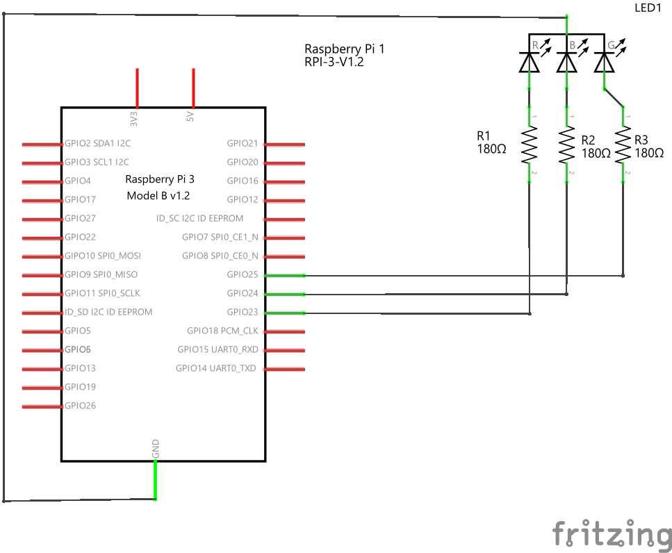

# RGB フルカラー LED を調光してみよう

(BCM モードで) GPIO 23, 24, 25 ピンにフルカラー LED を接続し、RGB それぞれの LED の明るさをだんだん明るくだんだん暗くなるようにプログラムしてみよう。

- RGB とはそれぞれ Red, Green, Blue の頭文字である。

フルカラー LED は、光の三原色に基づいて赤と緑と青それぞれ独立で点灯させてさまざまな色を出すようになっている。注意しなければいけないのは、各色ごとに順方向電圧 VF が異なるということである。

*Ref: OSTA5131A-R/PG/B データシート*

なので、(本来ならば) 各 LED に流れる電流を同じにするのであれば、各色ごとに制限抵抗の値を変更しなければならない。そういう背景があったうえで、ここでは同じ抵抗 180 Ω を３つ使って、Raspberry Pi から LED を調光してみようと思う。

## LED の足

ブレッドボードに差し込みやすいように、左右の足をラジオペンチで開いておこう。
一番足が長いのがカソードである。

左から順に
- 赤色
- カソード (GND)
- 青
- 緑

となっている。

     
    <b>すこし足を開いておこう</b>

## 回路を作る

以下のような回路を作る

     

